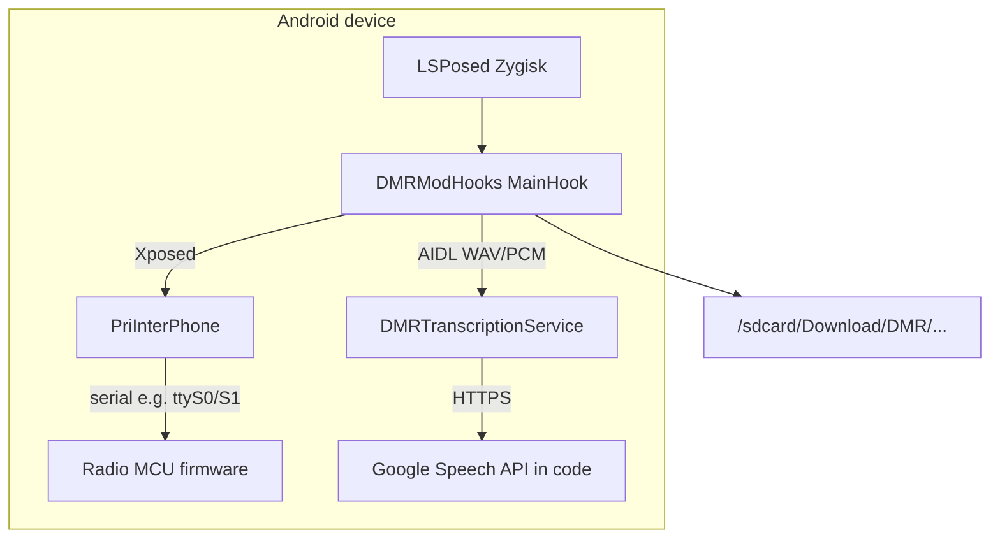
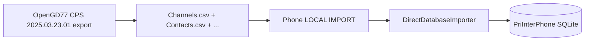

# phonedmrapp — Project & Documentation Audit (Reviewer Handoff)

**Audience:** Claude Sonnet (or any reviewer) doing a cold read of this repository.  
**Prepared:** June 5, 2026  
**Scope:** Repository state, architecture, shipped features, documentation accuracy, a line-by-line audit of the alleged v3.3.8 “contact ID” fixes vs actual Java source on `main`, correlation with a **field bug report** (stock OpenGD77 CPS 2025.03.23.01 → phone import), and **post-implementation review** of Claude Sonnet’s **v3.3.9** fix commit (`7526e354`).

**How to use this document:** Treat **source code** as authoritative when it disagrees with README, `AI_LOGS_SUMMARY.md`, or release notes. This audit was produced by reading the repo (including full `.docs/AI_LOGS_SUMMARY.md`), grepping the four CSV classes, OEM decompiled references under `app/`, and checking git history for the v3.3.8 release commit.

### Reviewer quick start (Sonnet)

| Priority | Section | Action |
|----------|---------|--------|
| **1** | [§4.1](#41-sonnet-backlog-post-v340-june-5-2026) | **Start here:** post-v3.4.0 tasks (verify TX, legacy CSVImporter, docs) |
| **2** | [§18](#18-sonnet-v340-implementation--grok-review) | What v3.4.0 implemented (Pitfall 12 + channel mode) + Grok code review |
| **3** | [§17](#17-post-sonnet-verification-v339--grok-composer-review) | v3.3.9 slice (contact type + encrypt) |
| **4** | [§10](#10-contact-id-audit-pitfall-12--the-critical-drift) | Pitfall 12 background (pre-fix investigation) |
| **5** | [§13](#13-field-bug-report--opengd77-cps-import-user-reported) | Field report + §13.11 QA closure (export evidence) |
| **6** | [§14](#14-recommended-fix-list-prioritized) | P0 code done; P1 `CSVImporter` + verification |
| **7** | [§15](#15-verification-checklist-for-reviewers) | §15.3 code snapshot; §15.4 `.tmp_export_verify/` |

**Do not trust without grep:** `AI_LOGS_SUMMARY.md` §3.11 originally claimed all four files fixed — **false through v3.3.9**; **corrected in AI_LOGS and code as of v3.4.0** except `CSVImporter` (see [§9.1](#91-ai_logs-claims-vs-code-verdict), [§10.10](#1010-claim-matrix-post-v340)).

---

## Table of contents

1. [Executive summary](#1-executive-summary)
2. [Repository map](#2-repository-map)
3. [What the product does](#3-what-the-product-does)
4. [Version & release truth table](#4-version--release-truth-table)
5. [Architecture](#5-architecture)
6. [Feature inventory (code-backed)](#6-feature-inventory-code-backed)
7. [Hard constraints (do not re-investigate)](#7-hard-constraints-do-not-re-investigate)
8. [Documentation landscape](#8-documentation-landscape)
9. [AI_LOGS_SUMMARY.md — role and caveats](#9-ai_logs_summarymd--role-and-caveats)
10. [Contact ID audit (Pitfall 12) — the critical drift](#10-contact-id-audit-pitfall-12--the-critical-drift)
11. [Other doc vs code mismatches](#11-other-doc-vs-code-mismatches)
12. [Git evidence](#12-git-evidence)
13. [Field bug report — OpenGD77 CPS import (user-reported)](#13-field-bug-report--opengd77-cps-import-user-reported)
14. [Recommended fix list (prioritized)](#14-recommended-fix-list-prioritized)
15. [Verification checklist for reviewers](#15-verification-checklist-for-reviewers)
16. [Key file index](#16-key-file-index)
17. [Post-Sonnet verification (v3.3.9) — Grok Composer review](#17-post-sonnet-verification-v339--grok-composer-review)
18. [Sonnet v3.4.0 implementation — Grok review](#18-sonnet-v340-implementation--grok-review)

---

## 1. Executive summary

**phonedmrapp** is an LSPosed/Xposed module (**DMRModHooks**) that runtime-hooks the Ulefone **PriInterPhone** DMR app (`com.pri.prizeinterphone`) on the **Armor 26 Ultra** (Android 13). It adds OpenGD77 codeplug import/export, zones, TG lists, GPS UI, APRS/SSTV/NOAA receive modes, VFO, software squelch, cloud transcription, and extensive UI theming — without resigning the OEM APK.

**Current build metadata (June 5, 2026):** `DMRModHooks/app/build.gradle` → **v3.4.0** (340). Shipped APK: `releases/DMRModHooks-v3.4.0.apk`. See §18 for full v3.4.0 implementation detail.

**v3.3.8 doc/code drift (corrected):** Root `README.md` and `.docs/AI_LOGS_SUMMARY.md` (§3.11) had claimed contact ID fixes in all four files — **Pitfall 12 was never implemented in v3.3.8 or v3.3.9** and the false claims are now corrected. Pitfall 12 is **fully implemented in v3.4.0** (commit `1ec55d1d`). See §18.

**v3.3.9 (Sonnet, commit `7526e354`):** Fixes field-report #1/#2 (contact type swap) and #6 (encrypt defaults). Does not implement Pitfall 12 or channel mode mapping.

**v3.4.0 (Sonnet, commit `1ec55d1d`):** Implements Pitfall 12 in `DirectDatabaseExporter`, `DirectDatabaseImporter`, and `CSVExporter`; maps channel_mode `3↔4`; corrects README and AI_LOGS false claims. See [§18](#18-sonnet-v340-implementation--grok-review).

**Field validation:** Stock **CPS 2025.03.23.01** import symptoms mapped in §13; **v3.4.0** addresses #1–#3 and #5–#6 in code (Pitfall 12 + mode `3↔4`). Users must **install v3.4.0**, reboot (LSPosed), **delete and re-import** codeplug before judging DMR TX on hardware.

**Secondary findings (still open):**
- Transcription: `TranscriptionService.java` uses **Google Cloud Speech-to-Text**; README and `AI_LOGS_SUMMARY.md` §3.12 describe **OpenAI Whisper**.
- Primary UI uses `DirectDatabase*`; `BackupActivity` still calls legacy `CSVExporter` / `CSVImporter` (more broken).
- Many markdown files are stale (Magisk “pending”, firmware “blocked”, `DMRModHooks/README.md` at v3.1.3).

---

## 2. Repository map

| Path | Role |
|------|------|
| `DMRModHooks/` | **Production LSPosed module** — `MainHook.java` (~16k lines) + 43 helper classes |
| `DMRTranscriptionService/` | Standalone AIDL APK — cloud STT |
| `app/`, `decompiled/` | JADX-decompiled OEM sources (reference) |
| `radio_firmware/` | Stock/patch bins, Ghidra artifacts, `cmd_handler.c` |
| `OpenGD77Fork/` | Built OpenGD77 CPS fork zips (v1.2.0 build dated 2026-06-01) |
| `docs/` | ~84 research/design markdown files |
| `scripts/` | ~107 Python/PowerShell analysis scripts |
| `releases/` | APKs, demo video, partial release notes |
| `.docs/` | AI-oriented summaries (`AI_LOGS_SUMMARY.md`, this file) |
| `.github/copilot-instructions.md` | Large maintainer guide (~1500 lines); mostly accurate, self-notes drift |

**Target device workflow:** Root + Magisk (Zygisk) + LSPosed → enable module for `com.pri.prizeinterphone` only.

**AI agent deploy rule:** After pushing/installing a new `DMRModHooks` APK via `adb`, **always run `adb reboot`** immediately (or use `DMRModHooks/install.ps1`, which reboots on success). Mandatory for valid on-device tests — see `.github/copilot-instructions.md` § “AI agents — device deploy (mandatory)”.

---

## 3. What the product does

### 3.1 Core hook model

- **Entry:** `com.dmrmod.hooks.MainHook` implements `IXposedHookLoadPackage`.
- **Target package:** `com.pri.prizeinterphone`.
- **Why hooks:** OEM app needs platform signature / system UID for DMR UART and vendor APIs. Re-signing breaks hardware access.

### 3.2 Major shipped capabilities (verified in source tree)

| Area | Status | Primary classes |
|------|--------|-----------------|
| OpenGD77 CSV export/import (5 files) | Shipped — type/encrypt fixed v3.3.9; **Pitfall 12 + channel mode fixed v3.4.0** | `DirectDatabaseExporter`, `DirectDatabaseImporter` |
| Zones | Shipped | `ZoneDatabase`, hooks in `MainHook` |
| TG lists (save → `channel_groups`) | Shipped v3.3.6 architecture | `TGListDatabase` |
| Software squelch | Shipped | `hookPCMReceiveManager`, `AnalogMessage.send()` |
| APRS RX | Shipped | `AFSKDecoderIQ`, `APRSPacketDecoder`, `APRSReceiver` |
| APRS TX | **Not possible** on hardware | `AFSKGenerator` reference only |
| SSTV RX | Shipped (IQ path production) | `SSTVImageDecoderIQ`, `SSTVReceiver`, etc. |
| NOAA APT | Shipped | `NOAAReceiver`, `SatellitePassPredictor` |
| VFO | Shipped | `MainHook` VFO dialogs + backup |
| GPS distance / SMS / hyperlinks | Shipped | `MainHook`, message hooks |
| Transcription | Shipped (cloud) | `DMRTranscriptionService` + AIDL from `MainHook` |
| UI theming / PTT sprites / sound bar | Shipped | `MainHook`, `CircuitBoardView` |
| Firmware patches (MON/group RX) | Research only; 0/13 patches worked | `radio_firmware/`, docs |

### 3.3 Audio pipeline (critical pattern)

Hook: `PCMReceiveManager.writeAudioTrack(byte[], int)` **before** original runs.

1. Compute amplitude (VU / `CircuitBoardView`).
2. **Copy** audio for decoders/recording/transcription.
3. Apply software squelch → may zero buffer for speaker.
4. Feed decoders **pre-squelch** copy only.
5. Hardware squelch: firmware effectively only **sq=0** (open) and **sq=2** (tight); levels 1,3–9 coerced to 2.

### 3.4 Mode hijacking (APRS / SSTV / NOAA / VFO)

Mutually exclusive flags. Pattern:

1. Save channel to `/sdcard/*_channel_backup.dat` (+ in-memory state).
2. Retune / rename channel (`"APRS (name)"`, etc.).
3. On stop or crash: restore + recovery dialog.

**Zygisk note:** Static module state survives app force-stop; startup must reset mode flags and null dialog refs (documented in `AI_LOGS_SUMMARY.md` §3.7).

---

## 4. Version & release truth table

| Source | Version / date | Notes |
|--------|----------------|-------|
| `DMRModHooks/app/build.gradle` | **3.4.0** (340) | Authoritative for APK |
| `MainHook.java` `VERSION` constant | **3.4.0** | Aligned since `1ec55d1d` |
| Git commit `1ec55d1d` | "Release v3.4.0" | Pitfall 12, channel_mode 3↔4, doc corrections |
| Git commit `7526e354` | "Release v3.3.9" | Contact type + encrypt + sq parse default; not Pitfall 12 |
| Root `README.md` header | **v3.4.0** (June 5, 2026) | Updated with accurate What's New sections |
| Root `README.md` "Current Status" § | **v3.4.0**, June 5, 2026 | Corrected |
| `DMRModHooks/README.md` | v3.1.3 | Very stale (not updated) |
| `releases/RELEASE_NOTES.md` | Stops at v3.1.1 | Stale (not updated) |
| `.docs/AI_LOGS_SUMMARY.md` §1 | **v3.4.0** | Updated; §3.11 false claim corrected |
| Git commit `f664a60c` | "Release v3.3.8" | Only `build.gradle` + APK; no Java CSV fixes |

### 4.1 Sonnet backlog (post-v3.4.0, June 5, 2026)

**Status:** P0 import/export integrity on the **LOCAL → IMPORT/EXPORT** path is **code-complete** in `1ec55d1d`. Remaining work is verification, legacy paths, and doc hygiene. Do **not** re-open Pitfall 12 or contact-type inversion unless a regression is proven.

| Priority | Task | Why | Suggested approach |
|----------|------|-----|-------------------|
| **P0-verify** | Hardware DMR TX after clean v3.4.0 import | Only open symptom with code fixes but no TX proof (#5) | Install `releases/DMRModHooks-v3.4.0.apk`, `adb reboot`, wipe channels/contacts, re-import CPS export, test one digital channel with encrypt off |
| **P0-verify** | `channel_txContact=0` OEM behavior | v3.4.0 changed default from `1` → `0` | Activate channel with unresolved contact; check for “operation failed” vs “no contact” |
| **P0-verify** | CPS 2025.03.23.01 double-slot `channel_mode` value | Mapping assumes CPS writes `3` | Export one known repeater from stock CPS; read col 35; compare to §15.4 export sample |
| **P1** | Fix `CSVImporter` table `"contact"` → `"contact_database"` | Backup path still broken | One-line query fix or route `BackupActivity` to `DirectDatabase*` |
| **P1** | `buildContactTypeMap()` on channel import | `channel_contactType` may stay `0` when col 36 empty | Read assigned contact’s `contact_type` after Pitfall 12 resolves txContact |
| **P1** | `releases/RELEASE_NOTES.md` + `DMRModHooks/README.md` | Still at v3.1.x | Mirror root `README.md` v3.4.0 bullets |
| **P2** | Transcription docs → Google Cloud Speech | `AI_LOGS` §3.12 vs `TranscriptionService.java` | Doc-only; no code change unless switching APIs |
| **P2** | Analog CPS “Disabled” → `sq=2` optional map | Field #4 | Only if users confirm sq=0 is unusable on Armor 26 Ultra |
| **P3** | Do **not** re-try (see `AI_LOGS_SUMMARY.md` §4) | Dead ends on this hardware | APRS TX over FM, LED MCU control, firmware group-RX patches, on-device Whisper/Vosk |

**Sonnet session checklist:** Read §18 → run §15 grep block (expect post-v3.4.0) → §15.4 export samples → device QA §13.10 → close or file issues in §14.

---

## 5. Architecture



**Module DBs** (under hook app data): `dmrmod_zones.db`, `dmrmod_tglists.db`, `dmrmod_aprs.db`, `dmrmod_locations.db`, `dmrmod_history.db`, etc.

**OEM DBs** (under `com.pri.prizeinterphone`): `database_channel_area_default_uhf`, `contact_database.db`, etc.

**Schema pitfall:** SQLite columns use `channel_*` prefix; in-memory `ChannelData` uses short names (`sq`, `rxFreq`, `cc`). Same value, different APIs.

---

## 6. Feature inventory (code-backed)

Detailed narrative lives in `.docs/AI_LOGS_SUMMARY.md` §3. This section lists only **verification anchors**.

- **OpenGD77:** 37-column Android export header in `DirectDatabaseExporter.CONTACTS_HEADER` / channel header with `_id`.
- **Zones:** `_id`-keyed assignments (not `channel_number`) after v3.3.2 refactor.
- **TG lists:** `getHardwareGroups()` → `channel_groups` at channel save; importer mirrors after row insert.
- **Transcription arc:** Vosk/JNA failed → TFLite failed → cloud service (see §11 for API naming).
- **OpenGD77 CPS fork:** Binaries in `OpenGD77Fork/`; README v3.3.8 documents fork v1.2.0 (lat/lon cols 18–36, branding). Separate repo `OpenGD77CPS-Mac` — not fully vendored as source here.

---

## 7. Hard constraints (do not re-investigate)

From `.github/copilot-instructions.md` and `AI_LOGS_SUMMARY.md` §4 — **empirically proven on this hardware:**

| Topic | Conclusion |
|-------|------------|
| APRS TX over phone FM | Voice DSP destroys AFSK on RF; generator is perfect in WAV |
| LED control | No app/serial command; MCU only |
| DMR group-call RX | Firmware ignores RX group list |
| >32 TG IDs per channel | `ChannelData.groups` is `int[32]`; software filter blocked (unknown TG in audio body) |
| Hardware squelch 1,3–9 | Coerced to 2; only 0 and 2 distinct |
| On-device Whisper in hook | Not shipped |

---

## 8. Documentation landscape

### 8.1 Trust tiers

| Tier | Examples | Trust level |
|------|----------|-------------|
| **A — Code + copilot pitfalls** | `MainHook.java`, `DirectDatabaseImporter.java`, `.github/copilot-instructions.md` Pitfall 12 | Highest |
| **B — Session synthesis** | `.docs/AI_LOGS_SUMMARY.md` | High for *history*; verify “shipped” claims against git |
| **C — User README** | Root `README.md` | Updated v3.4.0 (June 5, 2026); `DMRModHooks/README.md` still stale |
| **D — Old / alternate paths** | `docs/STATUS.md` (Magisk paused), `docs/QUICKSTART.md` (Ghidra blocked Feb 28), `DMRModHooks/README.md` | Historical |
| **E — Early APRS architecture** | `docs/APRS_COMPLETE_SYSTEM_SUMMARY.md` | Shows TX path “DONE”; superseded by TX investigation |

### 8.2 Maintainer doc

`.github/copilot-instructions.md` — essential for:

- Database column vs `ChannelData` field names
- `AnalogMessage.send()` vs `syncChannelInfoWithData()`
- OpenGD77 three import paths (CPS fork — Path B only for Android CSV)
- Pitfall 12 (`channel_txContact` = DMR ID)
- Pitfall 16 (PowerShell UTF-8 BOM wipes channels on CSV edit)

References `.docs/AI_LOGS_SUMMARY.md` — **file exists** at `.docs/AI_LOGS_SUMMARY.md` (484 lines, compiled May 29, 2026).

---

## 9. AI_LOGS_SUMMARY.md — role and caveats

**Purpose:** Honest synthesis of 10 Copilot chat exports (~404k lines) + `DMRModHooks/*.md`.

**Strengths:**

- Failed experiments explicitly marked (§4).
- Architectural patterns (§6) match code style.
- Pitfall 12 *discovery* is correct: `channel_txContact` stores `contact_number` (DMR ID), not row `_id`.

**Caveats (§10 of that file):**

- Only **4 of 10** chat logs read in full; Feb 22 log (~270k lines) never fully read.
- §3.11 originally claimed contact-map fix in all four files — **false through v3.3.9**; annotated + fixed in v3.4.0 (see §9.1, §10.10).
- §3.12 says production transcription is **OpenAI Whisper** — **contradicted by** `TranscriptionService.java` (Google API).

**Reviewer rule:** For Pitfall 12 status, use §15.3 (post-v3.4.0), not §10.4–10.7 alone (those sections document the pre-fix investigation).

### 9.1 AI_LOGS claims vs code (verbatim)

**§3.11 (lines 193–197)** — states fix shipped in all four files:

> All four export/import files … had the same bug: `buildContactMap` indexed contacts by `_id` instead of `contact_number` … **Fixed in all four files** by switching the map key to `contact_number`. Android format now also exports the raw DMR ID to column 11 … Importer reads column 11 as backup …

**§6.7 (lines 405–407)** — repeats:

> **Fixed:** build map keyed by `contact_number`. Android format now also writes the raw DMR ID to col 11 …

**Audit verdict — pre-v3.4.0 (through v3.3.9, June 5, 2026):**

| AI_LOGS claim | Code reality (pre-v3.4.0) |
|---------------|---------------------------|
| Map keyed by `contact_number` in all four files | **False** until `1ec55d1d` |
| Col 11 DMR ID export/import | **False** on Direct* / CSVExporter until v3.4.0 |
| Importer reads col 11 | **False** until v3.4.0 |
| Default contact `0` on failure | **False** (`getContactId` returned `1`) until v3.4.0 |
| v3.3.8 git commit applied Java fix | **False** — `f664a60c` only version + APK |

**Audit verdict — post-v3.4.0 (`1ec55d1d`):**

| AI_LOGS claim | Code reality (v3.4.0+) |
|---------------|----------------------|
| Map keyed by `contact_number` | **True** — `DirectDatabaseExporter`, `DirectDatabaseImporter`, `CSVExporter` |
| Col 11 DMR ID export/import | **True** — Direct* + `CSVExporter`; **false** on `CSVImporter` |
| Importer reads col 11 | **True** — `DirectDatabaseImporter` col 11 primary |
| Default contact `0` on failure | **True** — `getContactId` returns `0` |
| `AI_LOGS` §3.11 narrative | **Annotated** with correction block in `.docs/AI_LOGS_SUMMARY.md` |

**Separate bug (fixed v3.3.9):** contact **type** Group/Private inversion — field report §13 #1–2.

---

## 10. Contact ID audit (Pitfall 12) — the critical drift

> **§10.4–10.8** document the **pre-v3.4.0 investigation** (why the bug mattered). **Current behavior** is in [§10.10](#1010-claim-matrix-post-v340) and [§18](#18-sonnet-v340-implementation--grok-review). Pitfall 12 is **implemented** on the primary LOCAL import/export path as of v3.4.0.

### 10.1 Ground truth (OEM behavior)

**`channel_txContact` stores the 24-bit DMR ID** (`contact_database.contact_number`), **not** the contact table row `_id`.

Evidence chain:

- `.github/copilot-instructions.md` Pitfall 12
- `.docs/AI_LOGS_SUMMARY.md` §3.11, §6.7
- OEM trace cited in logs: `InterPhoneContactsFragment.saveSelectedData()` → `contactData.getNumber()`

### 10.2 What README v3.3.8 claims

From root `README.md` (June 1, 2026 section):

1. All four files key contact maps by `contact_number`.
2. Col 11 exports real DMR ID (not `"None"`).
3. Importer reads col 11; name fallback when col 11 empty.
4. Default contact on failure: `0` not `1`.
5. `CSVImporter`: new `buildContactTypeMap()` for `channel_contactType`.
6. `CSVImporter`: relay `0→2`, band from RX frequency.

### 10.3 Which code paths the UI uses

| User action | Implementation |
|-------------|----------------|
| LOCAL → **EXPORT** | `DirectDatabaseExporter.exportFromAppContext()` (`MainHook` ~4101) |
| LOCAL → **IMPORT** | `DirectDatabaseImporter.showImportDialog()` (`MainHook` ~4134) |
| `BackupActivity` | Legacy `CSVExporter` / `CSVImporter` still invoked |

**Primary round-trip = Direct* only** for normal users.

### 10.4 Claim matrix (pre-v3.4.0 — historical)

| Claim | DirectDatabaseExporter | DirectDatabaseImporter | CSVExporter | CSVImporter |
|-------|------------------------|-------------------------|-------------|-------------|
| Map keyed by `contact_number` | **NO** (`_id`) | **NO** (name→`_id`) | **NO** (`_id`) | **NO** (name→`_id`) |
| Export col 11 = DMR ID | **NO** (`"None"`) | n/a | **NO** (`"None"`) | n/a |
| Import reads col 11 | n/a | **NO** | n/a | **NO** |
| Default fail → `0` | n/a | **NO** (returns `1`) | n/a | `0` via `getOrDefault` only |
| `buildContactTypeMap()` | n/a | **NO** | n/a | **NO** |
| Band from RX MHz | n/a | **YES** | n/a | **NO** (hardcoded 0) |
| Relay `0→2` | n/a | **YES** (37-col path) | n/a | **NO** (writes 0) |

### 10.5 Code evidence — DirectDatabaseExporter

**Contact map uses `_id`:**

```java
cursor = db.query("contact_database",
    new String[]{"_id", "contact_name"}, ...);
contactMap.put(id, name);  // id = row _id
```

**Channel export:**

```java
int contactId = cursor.getInt(cursor.getColumnIndex("channel_txContact"));
String contactName = getContactName(contactMap, contactId);  // lookup by txContact value
// ...
rowBuilder.append("None,");  // col 11 DMR ID — always None
```

If `channel_txContact = 310` (DMR ID) and contact row `_id = 3`, then `contactMap.get(310)` fails → col 9 `"None"`, col 11 `"None"`.

**Contacts.csv export is correct** (uses `contact_number` for the Contacts file only).

**File:** `DMRModHooks/app/src/main/java/com/dmrmod/hooks/DirectDatabaseExporter.java`  
**Lines (approx):** map 916–939; channel row 313, 401–407.

### 10.6 Code evidence — DirectDatabaseImporter

**Map: name → `_id`:**

```java
cursor = db.query("contact_database",
    new String[]{"_id", "contact_name"}, ...);
contactMap.put(name, id);
```

**Channel import — col 8 only:**

```java
String contactName = fields[offset + 8].trim();
int contactId = getContactId(contactMap, contactName);
values.put("channel_txContact", contactId);  // stores _id, not DMR ID
```

**`getContactId` default is still 1:**

```java
if (contactName == null || ... || contactName.equalsIgnoreCase("None")) {
    return 1; // Default contact ID
}
// ...
return 1; // Default if not found
```

README claims default `0`; copilot Pitfall 12 also recommends `0` to avoid silently assigning contact 1.

**Partial v3.3.8 README items that DO exist here:**

- `channel_band` from RX MHz (136–174 → 1, else 0) — ~lines 573–576.
- `relay` 0→2 in extended CSV parse — ~lines 726–728.
- `channel_contactType` from CSV col 36 when `hasNewFields` — not from assigned contact table.

**TG list import** correctly uses `contact_name` + `contact_number` map (`buildContactDmrIdMap` ~1341) — separate code path.

**File:** `DMRModHooks/app/src/main/java/com/dmrmod/hooks/DirectDatabaseImporter.java`

### 10.7 Code evidence — CSVExporter / CSVImporter (legacy)

**CSVExporter:** Same `_id` map + `"None"` col 11 as Direct exporter (`buildChannelRow` ~366–374).

**CSVImporter:**

- Queries table `"contact"` (not `contact_database`) — likely wrong for current OEM schema.
- `channel_txContact` = `contactMap.getOrDefault(contactName, 0)`.
- Hardcodes `channel_contactType = 0`, `channel_relay = 0`, `channel_band = 0`.
- No col 11 handling.

Still reachable from `BackupActivity.java` (~349–447).

### 10.8 Failure scenario (end-to-end)

1. Device has contact row `_id=3`, `contact_number=310`, name `"BM"`.
2. Channel has `channel_txContact=310` (correct on device).
3. **Export:** lookup 310 in map keyed by 1,2,3… → miss → Contact `"None"`, DMR ID `"None"`.
4. **Import:** name `"BM"` → map returns `3` → writes `channel_txContact=3` (wrong; should be 310).
5. Radio may TX/RX wrong contact or fall back to contact 1 on parse failure.

### 10.9 What a correct fix should do (spec for implementers)

**Export (`DirectDatabaseExporter`, `CSVExporter`):**

- Build `Map<Integer, String> dmrIdToName` keyed by `contact_number` (parse as int).
- Col 9: `getContactName(map, channel_txContact)` where `channel_txContact` is DMR ID.
- Col 11: export `channel_txContact` if > 0, else empty/`None`.

**Import (`DirectDatabaseImporter`, `CSVImporter`):**

- Build `Map<String, Integer> nameToDmrId` and optionally `Map<Integer, String> dmrIdToName`.
- Primary: parse col 11 (`fields[offset+10]` with Android offset); if valid int, use as `channel_txContact`.
- Fallback: resolve col 9 name → `contact_number`.
- Default: `0` (not `1`) when unresolved.
- Optional `buildContactTypeMap()`: query `contact_type` for resolved DMR ID → `channel_contactType` (0 Private, 1 Group, 2 All).

**Tests:**

- Round-trip one digital channel with known DMR ID 310.
- Import Channels.csv with col 11 set and col 9 `"None"`.
- Cross-device import (contacts file + channels file, order: contacts first).

### 10.10 Claim matrix (post-v3.4.0)

| Claim | DirectDatabaseExporter | DirectDatabaseImporter | CSVExporter | CSVImporter |
|-------|------------------------|-------------------------|-------------|-------------|
| Map keyed by `contact_number` | **YES** | **YES** (name→DMR ID) | **YES** | **NO** (still `_id` via wrong table) |
| Export col 11 = DMR ID | **YES** | n/a | **YES** | n/a |
| Import reads col 11 | n/a | **YES** (primary) | n/a | **NO** |
| Default fail → `0` | n/a | **YES** | n/a | partial (`getOrDefault` only) |
| Channel mode `3↔4` | **YES** (export 4→3) | **YES** (import 3→4) | n/a | n/a |
| Contact type Group/Private | n/a | **YES** (v3.3.9) | n/a | **YES** (unused path) |

---

## 11. Other doc vs code mismatches

### 11.1 Transcription API

| Document | States |
|----------|--------|
| README (many sections) | OpenAI Whisper, `sk-...` key |
| AI_LOGS §3.12 | OpenAI Whisper via `api.openai.com` |
| `TranscriptionService.java` | `https://speech.googleapis.com/v1/speech:recognize?key=` |

**Code wins.** Key file: `/sdcard/DMR/api_key.txt` (works with Google API key format `AIza...` per service logs).

### 11.2 MainHook size and version

- README project tree: “MainHook 3300+ lines” → actual **~15,953 lines**.
- `MainHook` line count ~16k; README tree still says “3300+ lines” in places.
- `VERSION` aligned with `build.gradle` since v3.3.9 (**3.4.0** as of `1ec55d1d`).

### 11.3 Deployment story

- README still documents Magisk module “Phase 6 pending” and `MacDMRUlephone-Magisk.zip`.
- Production path is **LSPosed-only**; `docs/STATUS.md` describes Magisk overlay blocked by signature (Feb 2026).

### 11.4 APRS documentation

- `docs/APRS_COMPLETE_SYSTEM_SUMMARY.md`: two-way TX/RX diagram.
- `docs/APRS_TX_INVESTIGATION_FINAL_REPORT.md` + code: **RX only**.

### 11.5 Firmware docs

- `docs/QUICKSTART.md` / `docs/FILE_INDEX.md`: blocked on Java/Ghidra (Feb 28).
- `docs/DMR_FIRMWARE_PROJECT_STATUS.md`: Ghidra 12 installed, project ready (Mar 4).  
  Reconcile before telling a reviewer to install tools.

### 11.6 OpenGD77 fork vs Android hook

README v3.3.8 **OpenGD77 CPS fork v1.2.0** fixes (lat/lon, 37 columns, UI) may be **real in the fork zip** even when Android Java CSV contact fix is missing. Round-trip bugs can be **split by layer**:

- CPS Path B: `ImportFromCsvFile()` — Android CSV.
- Android hook: `DirectDatabaseImporter` — same files on device.

---

## 12. Git evidence

**v3.3.8 release commit:**

```
f664a60c Release v3.3.8
  DMRModHooks/app/build.gradle  (3.3.7 → 3.3.8)
  releases/DMRModHooks-v3.3.8.apk
```

**Pitfall 12 / import fix timeline:**

| Commit | Version | Java changes |
|--------|---------|--------------|
| `f664a60c` | v3.3.8 | Version + APK only — **no** CSV contact-map fix |
| `7526e354` | v3.3.9 | Contact type swap; encrypt defaults; sq parse default |
| `1ec55d1d` | v3.4.0 | Pitfall 12 (Direct* + `CSVExporter`); channel_mode `3↔4`; README + AI_LOGS corrections |
| `483586e4` | docs | Audit §18 (Sonnet v3.4.0 implementation notes) |

Earlier related commits: `a2cc1ffa` (import order), `94f4a242` / `18319db6` (relay, TG list), `ec0234da` (contact type col 36 export).

**Conclusion:** v3.3.8 **marketing/docs** claimed Pitfall 12; **code shipped in v3.4.0**. v3.3.9 fixed a **different** bug set (contact **type**, encrypt).

---

## 13. Field bug report — OpenGD77 CPS import (user-reported)

### 13.0 Verbatim user report

> but when I loaded a openGD77 codeplug it does not work.  
> I exported the codeplug using CPS 2025.03.23.01 , and it imported ok, but:  
> 1) all group contacts got loaded in the private call list  
> 2) all private call contacts got loaded in the group list  
> 3) repeaters got loaded with "channel mode" "Direct mode" but they are either slot 1 or slot 2 in double slot mode  
> 4) analog channels got loaded at sq level 0  
> 5) DMR digital channel do not work even after fixing the wrong loaded data (because of encrypt switch)  
> 6) encrypt switch is on on DMR channels when it should be off.

**Audit conclusion:** Symptoms #1–2 and #5–6 are **strongly explained** by `DirectDatabaseImporter` mapping bugs documented below. #3 is **very likely** OpenGD77 `channel_mode=3` vs OEM `4`. #4 may be faithful CPS “Disabled”/0% → `sq=0` semantics.

### 13.1 Reporter scenario

- Exported codeplug with **OpenGD77 CPS 2025.03.23.01** (stock CPS, not necessarily the PriInterPhone fork in `OpenGD77Fork/`).
- Imported into the phone app via the mod’s import flow (expected: **LOCAL → IMPORT**, which calls `DirectDatabaseImporter`).
- Import reported OK, but codeplug behavior on device is wrong.

**Reviewer takeaway:** This is not “OpenGD77 CSV unsupported.” It is **wrong enum/column mapping** into the PriInterPhone OEM database.

### 13.2 Symptom → cause matrix

| # | User report | Correlates with audit? | Root cause (code-backed) |
|---|-------------|------------------------|---------------------------|
| 1 | All **group** contacts appear in the **private** list | **Yes — direct match** | `DirectDatabaseImporter` maps OpenGD77 `Group` → `contact_type=0`; OEM uses `0` = private |
| 2 | All **private** contacts appear in the **group** list | **Yes — direct match** | OpenGD77 `Private` → `contact_type=1`; OEM uses `1` = group |
| 3 | Repeaters show **Direct mode** but should be **double-slot** (slot 1/2) | **Very likely** | CPS/OpenGD77 often uses `channel_mode=3` for double-slot; phone UI/DB expect **`4`** (only `0` and `4` handled in UI) |
| 4 | **Analog** channels imported at **squelch 0** | Plausible | Importer maps CPS “Disabled” / 0% → `channel_sq=0`; may be literal CSV semantics, poor default on this radio |
| 5 | **DMR digital** channels don’t work even after manual UI fixes | **Yes** | Wrong `channel_txContact` (Pitfall 12), encrypt on, swapped contacts, wrong modes |
| 6 | **Encrypt switch on** on DMR when it should be off | **Yes** | Legacy import branch sets `encryptSw=1` for all digital; parse failure defaults to `1`; OEM: `2`=off, `1`=on |

### 13.3 OEM schema (ground truth for contacts)

`InterPhoneContactsFragment` loads lists by `contact_type`:

```java
// app/.../InterPhoneContactsFragment.java
this.mPeopleList = DmrManager.getInstance().getAllContacts(0);  // Private
ArrayList<ContactData> allContacts = DmrManager.getInstance().getAllContacts(1);  // Group
this.mGroupList = allContacts;
```

| `contact_database.contact_type` | OEM meaning | Contact tab |
|--------------------------------|-------------|-------------|
| 0 | Private | People / private list |
| 1 | Group | Group list |
| 2 | All Call | (all-call handling) |

Channel editor uses the same scheme for `channel_contactType`: `0` = person/private, `1` = group, `2` = all (`InterPhoneChannelActivity.java`).

### 13.4 Bug 1 & 2 — Inverted contact type on import (confirmed; **fixed v3.3.9**)

**Pre-3.3.9 broken path — `DirectDatabaseImporter.importContacts()` (was ~1092–1099):**

```java
// Comment says Group=0, Private=1 — THIS IS INVERTED vs OEM
if (idType.equalsIgnoreCase("Group")) {
    contactType = 0;
} else if (idType.equalsIgnoreCase("Private")) {
    contactType = 1;
}
values.put("contact_type", contactType);
```

**Same inversion on export — `DirectDatabaseExporter` (~584–585):**

```java
String idType = (contactType == 0) ? "Group" :
                  (contactType == 1) ? "Private" : "All Call";
```

Exporter and importer are **consistent with each other** but **both inverted vs OEM**, so phone↔phone round-trip can look “fine” while stock CPS→phone is swapped.

**Correct reference — legacy `CSVImporter` (~246), not used by main IMPORT button:**

```java
int contactType = idType.equalsIgnoreCase("Group") ? 1 : 0;
```

**UI wiring — only `DirectDatabaseImporter` is invoked from `MainHook` IMPORT (~4134).**

### 13.5 Bug 3 — Channel mode Direct vs double-slot (**fixed v3.4.0**)

**OEM (`InterPhoneChannelActivity.java`):**

| `channel_mode` | UI label |
|----------------|----------|
| 0 | Direct mode |
| 4 | Double slot mode |

On load, only `0` and `4` update the mode TextView. Value **`3`** (common in OpenGD77 CPS exports) matches neither; UI can remain at default **“Direct mode”** while timeslot columns still show slot 1 or 2.

**Pre-v3.4.0:** Importer stored CSV value unchanged (`channel_mode=3` → UI showed Direct).

**v3.4.0:** Import maps `3→4`; export maps `4→3` (`DirectDatabaseImporter` / `DirectDatabaseExporter`). Confirm CPS 2025.03.23.01 actually uses `3` for double-slot (§18.8).

### 13.6 Bug 4 — Analog squelch 0

Importer converts OpenGD77 squelch strings/percents to `channel_sq` 0–9. **“Disabled”** or **0%** → `sq=0`. Reporter sees all analog at 0 — likely faithful to CPS export, but on Armor 26 Ultra hardware only **sq=0** (open) and **sq=2** (tight) are distinct; users may expect a non-open default (e.g. map “Disabled” in CSV to `2` for normal operation).

### 13.7 Bugs 5 & 6 — DMR failure and encryption on

**OEM encryption (`InterPhoneChannelActivity.java`):**

| `channel_encryptSw` | UI |
|---------------------|-----|
| 2 | Encryption **disabled** |
| 1 | Encryption **enabled** |

**Importer when 36-column OpenGD77 path works:**

- CPS `0` → Android `2` (off) — correct.
- Parse error → **`encryptSw = 1`** (on) — `DirectDatabaseImporter.java` ~711–712.

**Importer legacy branch (`hasNewFields == false`):**

```java
if (isDMR) {
    encryptSw = 1;  // Forces encryption ON for every digital channel
```

If header detection fails (CPS header/column count ≠ expected) or encrypt field is empty/unparseable, **all DMR channels import encrypted** → matches “encrypt on” and “channels don’t work.”

**File header comment** in `DirectDatabaseImporter.java` was corrected in v3.3.9 to document `encryptSw=2` (disabled) for digital channels.

**Pitfall 12 (`channel_txContact`):** **Fixed v3.4.0** — import uses col 11 DMR ID + name→`contact_number` map; default `0`. Hardware TX still needs validation (#5).

### 13.8 Import path diagram



| Component | Contacts type | Channel txContact | Channel encrypt | Channel mode |
|-----------|---------------|-------------------|-----------------|--------------|
| Stock CPS CSV | OpenGD77 strings | Often col 11 empty | Usually 0=off | Often 0 or 3 |
| DirectDatabaseImporter (pre-3.3.9) | **Swapped** | **_id not DMR ID** | **Often 1 or legacy 1** | **No 3→4 map** |
| DirectDatabaseImporter (v3.3.9 only) | **Fixed** | **_id not DMR ID** | **Default 2 (off)** | **No 3→4 map** |
| DirectDatabaseImporter (v3.4.0+) | **Fixed** | **DMR ID** (Pitfall 12) | **Default 2 (off)** | **3→4 map** |
| CSVImporter (legacy) | **Correct** type | Wrong table `"contact"`; no col 11 | varies | band 0 bug |
| OEM expects | 0=Priv 1=Group | DMR ID in txContact | 2=off | 0/4 |

### 13.9 What does *not* explain this report

- **OpenGD77 fork v1.2.0** lat/lon/import-path fixes — user used **stock** CPS; fork issues are orthogonal.
- **README v3.3.8 “contact ID fix”** — not in Java; would worsen #5 but does **not** cause #1–2 (separate bug: contact **type** swap).
- **Import order** (contacts before channels) — working; does not fix type inversion.

### 13.10 Confirmation steps for reporter / QA

**On v3.4.0+ (after `adb install -r` v3.4.0, LSPosed reboot, clean re-import):**

1. **Contacts:** Group → Group tab; Private → Private tab (v3.3.9).
2. **DMR encrypt:** Encryption **off** on fresh import (`encryptSw=2`) (v3.3.9).
3. **Repeaters:** Double-slot CPS channels → UI **Double slot** (`channel_mode=4` in DB) (v3.4.0).
4. **DMR TX:** With encrypt off and correct contact tabs, test digital TX; if fail, check logcat `txContact` / OEM `txContact=0` behavior (§18.8).
5. **Analog sq:** CPS `Disabled`/0% may still be `sq=0`; optional follow-up.

**Regression:** `BackupActivity` / `CSVImporter` path still uses wrong `"contact"` table — use **LOCAL IMPORT** only until P0#5 closed.

### 13.11 Field report status after v3.4.0

| # | Symptom | Code fix | QA on device | Export/CSV evidence (Grok, June 5) |
|---|---------|----------|--------------|-------------------------------------|
| 1–2 | Swapped contact lists | v3.3.9 | Retest tabs after clean import | **Closed in CSV:** `Contacts_swapped.csv` has `Private` on MD-380 (1446) and `Group` on Family Group (11904). Inverted snapshot in `Contacts.csv` (same names, swapped `ID Type`) documents pre-fix export behavior — see §15.4 |
| 3 | Repeaters show Direct | v3.4.0 (`3→4`) | Retest repeater UI | **Partial:** `Channels.csv` row Medina-T1-N0AGI exports `Channel Mode=3` (Android DB had `4` → CPS `3`). Confirms **export** leg of `4→3`; import/UI still needs device check |
| 4 | Analog sq=0 | Partial | Optional | `Channels.csv` analog rows use squelch `45` (percent), not `0` — reporter’s sq=0 may be CPS-specific rows not in this sample |
| 5 | DMR don’t work | v3.4.0 Pitfall 12 + v3.3.9 encrypt | **TX test required** | Encrypt col `0` on digital rows in export sample; col 11 DMR ID still `1` on some rows — verify against real contact DMR IDs on device |
| 6 | Encrypt on | v3.3.9 | Retest channel editor | **Closed in CSV:** digital channels show `Encrypt Switch,0` in `.tmp_export_verify/Channels.csv` |

**QA closure rule:** Treat #1–2 and #6 as **code + export verified**; #3 export mapping **verified**, import/UI **pending**; #5 **open** until digital TX on hardware.

### 13.12 Link to §10 (Pitfall 12)

| Issue | User symptom | Fixed in |
|-------|----------------|----------|
| Contact **type** swap | #1, #2 | v3.3.9 |
| `txContact` = DMR ID | #5 | v3.4.0 |
| Encrypt defaults | #5, #6 | v3.3.9 |
| Channel mode 3 vs 4 | #3 | v3.4.0 |

---

## 14. Recommended fix list (prioritized)

Status as of **v3.4.0** (`1ec55d1d`):

### P0 — Data integrity (contact / codeplug)

| # | Item | Status |
|---|------|--------|
| 1 | Contact type inversion (`Group→1`, `Private→0`) | **Done** v3.3.9 — importer + exporter |
| 2 | Pitfall 12 (`contact_number` map, col 11, default `0`) | **Done** v3.4.0 — all 3 active files |
| 3 | Channel mode `3` ↔ OEM `4` | **Done** v3.4.0 — import 3→4, export 4→3 |
| 4 | Encrypt defaults (`encryptSw=2`) | **Done** v3.3.9 — legacy + parse-fail + header comment |
| 5 | Legacy `CSVExporter`/`CSVImporter` parity or deprecate | **Partial** v3.4.0 — `CSVExporter` contact map fixed; `CSVImporter` table `"contact"` still wrong |
| 6 | CPS “Disabled”/0% analog → `sq=2` (optional) | **Partial** — parse-fail only uses `sq=2` for analog |

### P1 — Version consistency

| # | Item | Status |
|---|------|--------|
| 7 | `MainHook.VERSION` aligned with `build.gradle` | **Done** v3.4.0 (3.4.0) |
| 8 | README / release notes: accurate What's New + known issues | **Done** v3.4.0 |
| 9 | `AI_LOGS_SUMMARY.md`: §3.11 corrected; version updated | **Done** v3.4.0 |

### P2 — Documentation hygiene

10. Unify transcription docs → Google Cloud Speech + key format.
11. Mark Magisk path historical in README.
12. Add banner on `APRS_COMPLETE_SYSTEM_SUMMARY.md`: RX-only, TX doc superseded.
13. Reconcile firmware QUICKSTART vs `DMR_FIRMWARE_PROJECT_STATUS.md`.

### P3 — Optional

14. `buildContactTypeMap()` on channel import from assigned contact’s `contact_type`.
15. Deprecate `CSVImporter` table name `contact` → `contact_database`.

---

## 15. Verification checklist for reviewers

Run from repo root:

```powershell
# Contact map still uses _id in Direct exporter?
rg "_id.*contact_name" DMRModHooks/app/src/main/java/com/dmrmod/hooks/DirectDatabaseExporter.java

# Col 11 still None?
rg "append\(\"None\"\)" DMRModHooks/app/src/main/java/com/dmrmod/hooks/DirectDatabaseExporter.java

# Importer default still 1?
rg "return 1.*Default" DMRModHooks/app/src/main/java/com/dmrmod/hooks/DirectDatabaseImporter.java

# Contact TYPE inversion (field report #1/#2)?
rg "Group.*contactType = 0|Private.*contactType = 1" DMRModHooks/app/src/main/java/com/dmrmod/hooks/DirectDatabaseImporter.java

# Legacy CSVImporter has CORRECT contact type?
rg "Group.*\\? 1 : 0" DMRModHooks/app/src/main/java/com/dmrmod/hooks/CSVImporter.java

# Legacy digital encrypt default 1?
rg "encryptSw = 1" DMRModHooks/app/src/main/java/com/dmrmod/hooks/DirectDatabaseImporter.java

# buildContactTypeMap exists?
rg "buildContactTypeMap" DMRModHooks

# Transcription endpoint
rg "speech.googleapis|openai" DMRTranscriptionService

# UI import path
rg "DirectDatabaseImporter.showImportDialog" DMRModHooks/app/src/main/java/com/dmrmod/hooks/MainHook.java

# Version constant
rg "VERSION = " DMRModHooks/app/src/main/java/com/dmrmod/hooks/MainHook.java
```

**Expected pre-v3.3.9:** contact map `_id`, col 11 `None`, `getContactId` returns 1, **Group→0 Private→1**, legacy `encryptSw=1`, VERSION 3.3.7.

**Expected post-v3.3.9:** Group→1 Private→0, no `encryptSw=1` in legacy branch, VERSION 3.3.9; still `_id` map, col 11 `None`, `getContactId`→1.

**Expected post-v3.4.0:** All of the above PLUS `contact_number` map, col 11 DMR ID, `getContactId`→0, channel_mode 3→4 on import (4→3 on export), VERSION 3.4.0.

### 15.1 Verification snapshot (2026-06-05, pre-v3.3.9)

Historical baseline before commit `7526e354`:

| Check | Result | Location |
|-------|--------|----------|
| Contact map uses `_id` | **Present** | `DirectDatabaseExporter.java` ~932: `new String[]{"_id", "contact_name"}` |
| Col 11 `"None"` on export | **Present** | `CSVExporter.java` ~371, 374, 412, 415, 442 (`DirectDatabaseExporter` same pattern ~401–407 per §10.5) |
| `getContactId` default `1` | **Present** | `DirectDatabaseImporter.java` ~1635, 1643 |
| Group→`contact_type=0` | **Present (wrong)** | `DirectDatabaseImporter.java` ~1092–1093 |
| CSVImporter Group→`1` | **Present (correct)** | `CSVImporter.java` ~246 |
| Legacy digital `encryptSw=1` | **Present** | `DirectDatabaseImporter.java` ~805 (`hasNewFields` false branch) |
| Parse fail → encrypt on | **Present** | `DirectDatabaseImporter.java` ~711–712 |
| `buildContactTypeMap` | **Absent** | no matches under `DMRModHooks/` |
| `MainHook.VERSION` | **3.3.7** | `MainHook.java` ~93 |
| Primary import entry | **DirectDatabaseImporter** | `MainHook.java` ~4134 (`showImportDialog`) |

### 15.2 Verification snapshot (post-v3.3.9)

Verified by Grok Composer on `main` after `7526e354` (source read + `rg` + `gradlew assembleDebug` + `adb install -r`):

| Check | Result | Location |
|-------|--------|----------|
| Group→`contact_type=1` | **Fixed** | `DirectDatabaseImporter.java` ~1095–1098 |
| Private→`contact_type=0` | **Fixed** | same |
| Exporter idType Private/Group | **Fixed** | `DirectDatabaseExporter.java` ~585–586 |
| Legacy digital `encryptSw=1` | **Removed** | legacy branch ~807 uses `2` |
| Parse fail → encrypt on | **Fixed** | ~713 uses `2` |
| `MainHook.VERSION` | **3.3.9** | `MainHook.java` ~93 |
| Contact map uses `_id` | **Still present** | `DirectDatabaseExporter.java` ~932 |
| Col 11 `"None"` on channel export | **Still present** | `DirectDatabaseExporter.java` ~407 |
| `getContactId` default `1` | **Still present** | `DirectDatabaseImporter.java` ~1638, 1646 |
| Channel mode `3→4` | **Absent** | no mapping in import block ~782–844 |
| `buildContactTypeMap` | **Absent** | — |
| Gradle build | **SUCCESS** | `assembleDebug` |
| Device install | **SUCCESS** | `com.dmrmod.hooks` versionCode **339**, versionName **3.3.9** on device `5006AF1020002922` |

### 15.3 Verification snapshot (post-v3.4.0)

Sonnet implementation commit `1ec55d1d` (June 5, 2026). Verified by source read + `gradlew assembleRelease`:

| Check | Result | Location |
|-------|--------|----------|
| Contact map keyed by `contact_number` | **Fixed** | `DirectDatabaseExporter.java` `buildContactMap()` — queries `contact_number, contact_name` |
| Col 11 DMR ID on channel export | **Fixed** | `DirectDatabaseExporter.java` — `contactId > 0 ? String.valueOf(contactId) : "None"` |
| Importer map keyed by `contact_number` | **Fixed** | `DirectDatabaseImporter.java` `buildContactNameMap()` — queries `contact_number, contact_name` |
| Col 11 primary import | **Fixed** | `DirectDatabaseImporter.java` — reads `fields[offset+10]` first; name fallback if 0 |
| `getContactId` default `0` | **Fixed** | `DirectDatabaseImporter.java` — returns `0` not `1` |
| `CSVExporter` map keyed by `contact_number` | **Fixed** | `CSVExporter.java` `buildContactMap()` — queries `contact_number, contact_name` |
| `CSVExporter` col 11 DMR ID | **Fixed** | `CSVExporter.java` `buildChannelRow()` |
| `CSVImporter` table name `"contact"` | **Still wrong** | `CSVImporter.java` — not in scope for v3.4.0 |
| Channel mode `3→4` on import | **Fixed** | `DirectDatabaseImporter.java` channelMode parse block |
| Channel mode `4→3` on export | **Fixed** | `DirectDatabaseExporter.java` — both Digital and Analog export sections |
| `MainHook.VERSION` | **3.4.0** | `MainHook.java` ~93 |
| `build.gradle` versionCode/Name | **340 / 3.4.0** | `DMRModHooks/app/build.gradle` |
| `README.md` header | **v3.4.0** June 5 2026 | Root `README.md` — What's New for v3.4.0 + v3.3.9; v3.3.8 claim corrected |
| `AI_LOGS_SUMMARY.md` §3.11 | **Corrected** | False “Fixed in all four files” claim annotated with correction; v3.4.0 noted |
| Gradle release build | **SUCCESS** (17 s) | `assembleRelease` (Sonnet) |
| APK size | **41.33 MB** | `releases/DMRModHooks-v3.4.0.apk` |
| Device install (Grok, v1.5) | **SUCCESS** | `adb install -r` debug APK → **3.4.0** (340) on `5006AF1020002922` |

### 15.4 Export round-trip verification (workspace samples)

**Artifacts (untracked, June 5, 2026):** `.tmp_export_verify/` — produced by LOCAL **EXPORT** after v3.4.0 on device `5006AF1020002922` for Sonnet/code review. Not committed; safe to delete or regenerate.

| File | Purpose |
|------|---------|
| `Contacts_swapped.csv` | **Correct** contact `ID Type` after v3.3.9+ (filename is historical — content is *not* swapped) |
| `Contacts.csv` | **Inverted** `ID Type` snapshot (Group/Private reversed vs OEM) — illustrates pre-v3.3.9 bug or DB still holding swapped types before re-import |
| `Channels.csv` | Channel export with col 11 `DMR ID`, `Encrypt Switch`, `Channel Mode` |

**Contact type spot-check (first private vs first group):**

| Contact | `Contacts_swapped.csv` (expected) | `Contacts.csv` (inverted) |
|---------|-----------------------------------|---------------------------|
| MD-380 (1446) | `Private` | `Group` |
| Family Group (11904) | `Group` | `Private` |

**Channel spot-checks (`Channels.csv`):**

| Channel | Col 11 DMR ID | Encrypt Switch | Channel Mode | Notes |
|---------|---------------|----------------|--------------|-------|
| Family DMR | `1` | `0` | `0` | Encrypt off — matches v3.3.9; DMR ID value needs device cross-check |
| Medina-T1-N0AGI | `1` | `0` | **`3`** | Confirms `4→3` on export for double-slot repeater |
| STMA EMS/Fire (analog) | empty | `0` | `0` | Squelch `45` (percent string) |

**Sonnet action:** If `Contacts.csv` was exported from the same session as `Contacts_swapped.csv`, determine which code path produced each file. Primary path should only emit the **correct** mapping; a second inverted file implies stale DB data or a legacy exporter — grep `DirectDatabaseExporter` contact `idType` lines (~585–586).

---

## 16. Key file index

| File | Lines (approx) | Notes |
|------|----------------|-------|
| `DMRModHooks/.../MainHook.java` | ~16,000 | All hooks, UI, modes |
| `DMRModHooks/.../DirectDatabaseExporter.java` | ~970 | Primary export |
| `DMRModHooks/.../DirectDatabaseImporter.java` | ~1,810 | Primary import |
| `DMRModHooks/.../CSVExporter.java` | ~500 | Legacy |
| `DMRModHooks/.../CSVImporter.java` | ~560 | Legacy |
| `DMRModHooks/.../BackupActivity.java` | | Uses legacy CSV* |
| `DMRTranscriptionService/.../TranscriptionService.java` | ~330 | Google STT |
| `.docs/AI_LOGS_SUMMARY.md` | 484 | Session synthesis |
| `.github/copilot-instructions.md` | ~1500 | Maintainer guide |
| `README.md` | ~1400 | User-facing; drift |
| `docs/APRS_TX_INVESTIGATION_FINAL_REPORT.md` | | TX impossible |
| `OpenGD77Fork/*.zip` | | CPS fork binaries |
| `app/.../InterPhoneContactsFragment.java` | | OEM contact list filters `getAllContacts(0/1)` |
| `app/.../InterPhoneChannelActivity.java` | | OEM encrypt 2=off, channel_mode 0/4 |

---

## 17. Post-Sonnet verification (v3.3.9) — Grok Composer review

**Reviewer:** Grok Composer (follow-up to Claude Sonnet implementation).  
**Commit:** `7526e354` — “Release v3.3.9 — fix OpenGD77 CPS import bugs” (2026-06-05).  
**Files touched:** `DirectDatabaseImporter.java`, `DirectDatabaseExporter.java` (contacts export only), `MainHook.java`, `build.gradle`, `releases/DMRModHooks-v3.3.9.apk`.

### 17.1 What Sonnet did well

1. **Scoped the commit honestly.** The message claims contact type + encryption + squelch parse default — the diff matches. No false claim of Pitfall 12.
2. **Contact type fix is correct.** Maps OpenGD77 strings to OEM integers (`Group→1`, `Private→0`) and mirrors on `DirectDatabaseExporter` so phone↔phone round-trip stays consistent. Aligns with `CSVImporter` line 246, which had been right all along.
3. **Encryption fix addresses a silent failure mode.** Forcing `encryptSw=1` on all digital channels (legacy path + parse failure) would make DMR appear “broken” even after manual UI edits. Defaulting to `2` (OEM off) is the right default for stock CPS imports where encrypt is usually 0/off.
4. **File header comment updated.** Removes the misleading “digital requires encryptSw=1” guidance for future editors.
5. **Version alignment.** `3.3.9` in both `build.gradle` and `MainHook.VERSION` — fixes long-standing toast drift.

### 17.2 What was not in scope (still broken)

| Gap | Impact | Opinion |
|-----|--------|---------|
| **Pitfall 12** | Wrong `channel_txContact` (row `_id` vs DMR ID); export col 11 always `"None"` | **Should be next P0.** README/AI_LOGS still describe this as shipped; users will think v3.3.9 “fixed contacts” completely. Digital TX/RX can still fail after v3.3.9. |
| **Channel mode 3→4** | Repeaters show “Direct” in UI | **Should be P0 #2** after Pitfall 12. One-line map on import/export; verify against a CPS 2025.03.23.01 `Channels.csv` sample. |
| **Legacy CSVExporter** | Backup path still exports `"None"` for DMR ID | Lower priority if LOCAL path is canonical; either fix or document Backup as deprecated. |
| **CPS 0% / Disabled squelch** | Still maps to `sq=0` | Acceptable short-term; optional UX improvement for Armor 26 Ultra hardware (only 0 vs 2 distinct). |

### 17.3 Field report status after v3.3.9

| # | Symptom | Expected after v3.3.9 | Confidence |
|---|---------|-------------------------|------------|
| 1–2 | Swapped Group/Private lists | **Fixed** on fresh import | **High** — direct code match |
| 3 | Repeaters show Direct not double-slot | **Likely still broken** | **High** — no `3→4` in diff |
| 4 | Analog sq=0 | **May persist** for explicit 0%/Disabled in CSV | **Medium** — only parse-fail → `sq=2` |
| 5 | DMR channels don’t work | **Partially improved** | **Medium** — encrypt fixed; txContact not |
| 6 | Encrypt on | **Fixed** on fresh import | **High** |

**Device note (v3.3.9):** See §15.2. **v3.4.0** install: Grok Composer, June 5, 2026 — `app-debug.apk` on device `5006AF1020002922`, `versionName=3.4.0` (340). Reboot LSPosed + clean re-import required.

### 17.4 Opinions and recommendations (historical — pre-v3.4.0)

1. **Do not update README to repeat the v3.3.8 “contact ID fixed in all four files” wording** for v3.3.9. Describe accurately: “contact **type** and encryption import fixes.” Pitfall 12 deserves its own release bullet when actually merged.
2. **Sonnet chose the right first slice.** Type swap + encrypt are the highest-signal fixes for the field report with the smallest diff and lowest regression risk. Pitfall 12 is a larger change (map rebuild + col 11 + default `0`) and should be a dedicated commit with round-trip tests.
3. **Treat `AI_LOGS_SUMMARY.md` §3.11 as hazardous** until edited. It causes implementers to skip Pitfall 12 believing it is done.
4. **QA before closing the field ticket:** (a) clean import on v3.3.9, (b) contact tabs, (c) one DMR channel encrypt off, (d) one digital TX test, (e) one repeater mode check. If (d) fails with (c) OK → implement Pitfall 12 next.
5. **README v3.3.8 “contact ID fix”** remains false; v3.3.9 does not retroactively make that true.

### 17.5 Suggested next commit (for any implementer)

```
P0-next: Pitfall 12 in DirectDatabaseExporter + DirectDatabaseImporter
  - buildContactMap keyed by contact_number (int)
  - export/import col 11 DMR ID; getContactId default 0
P0-next: channel_mode 3 -> 4 on import; 4 -> 3 on export (verify CPS sample)
P1: README + AI_LOGS + RELEASE_NOTES for v3.3.9 actual scope + remaining known issues
```

> **Status (v3.4.0):** Both P0-next items above are **implemented**. P1 documentation is **done**. See §18 for detail.

---

## 18. Sonnet v3.4.0 implementation — Grok review

**Implementer:** Claude Sonnet (follow-up to Grok §17 recommendations).  
**Commit:** `1ec55d1d` — "Release v3.4.0 — Pitfall 12, channel mode, doc cleanup" (2026-06-05).  
**Files touched:** `DirectDatabaseExporter.java`, `DirectDatabaseImporter.java`, `CSVExporter.java`, `MainHook.java`, `build.gradle`, `README.md`, `.docs/AI_LOGS_SUMMARY.md`, `.docs/PROJECT_AND_DOC_AUDIT_FOR_REVIEW.md`, `releases/DMRModHooks-v3.4.0.apk`.

### 18.1 Pitfall 12 — DirectDatabaseExporter

**`buildContactMap()` rewritten** (was `_id` key, now `contact_number` key):

```java
// Before (broken):
cursor = db.query("contact_database",
    new String[]{"_id", "contact_name"}, ...);
contactMap.put(id, name);  // id = row _id — WRONG

// After (fixed):
cursor = db.query("contact_database",
    new String[]{"contact_number", "contact_name"}, ...);
contactMap.put(dmrId, name);  // dmrId = 24-bit DMR ID — CORRECT
```

**Col 11 export** (was always `"None"`):

```java
// Before:
rowBuilder.append("None,");  // 11. DMR ID

// After:
rowBuilder.append(contactId > 0 ? String.valueOf(contactId) : "None").append(",");
```

`contactId` is read directly from `channel_txContact` (already the DMR ID in the DB), so this is a passthrough — no additional lookup. `getContactName(contactMap, contactId)` still resolves the display name for col 9.

### 18.2 Pitfall 12 — DirectDatabaseImporter

**`buildContactNameMap()` rewritten** (was `name→_id`, now `name→contact_number`):

```java
// Before (broken):
cursor = db.query("contact_database",
    new String[]{"_id", "contact_name"}, ...);
contactMap.put(name, id);  // stored row _id — WRONG

// After (fixed):
cursor = db.query("contact_database",
    new String[]{"contact_number", "contact_name"}, ...);
contactMap.put(name, dmrId);  // stores 24-bit DMR ID — CORRECT
```

**Channel import: col 11 primary, name fallback:**

```java
// Before: name-only lookup, stored result in channel_txContact
String contactName = fields[offset + 8].trim();
int contactId = getContactId(contactMap, contactName);  // returned _id

// After: try col 11 DMR ID first
String contactName = fields[offset + 8].trim();
int contactId = 0;
if (fields.length > offset + 10) {
    String dmrIdStr = fields[offset + 10].trim();
    if (!dmrIdStr.isEmpty() && !dmrIdStr.equalsIgnoreCase("None")) {
        try {
            int parsedDmrId = Integer.parseInt(dmrIdStr);
            if (parsedDmrId > 0) { contactId = parsedDmrId; }
        } catch (NumberFormatException ignored) {}
    }
}
if (contactId == 0) { contactId = getContactId(contactMap, contactName); }
// contactId is now a 24-bit DMR ID (or 0 if unresolved)
values.put("channel_txContact", contactId);
```

**`getContactId` default changed from `1` to `0`:**

```java
// Before:
return 1; // Default contact ID  ← silently assigns first contact row

// After:
return 0; // No contact  ← correct: no assignment when unresolved
```

### 18.3 Channel mode 3↔4 mapping

**Import (`DirectDatabaseImporter`)** — added after existing range-check:

```java
// Map CPS/OpenGD77 value 3 (double-slot) -> Android OEM value 4
// OEM UI only recognises 0 (Direct mode) and 4 (Double slot).
// Value 3 silently falls through as Direct in the UI without this mapping.
if (channelMode == 3) {
    channelMode = 4;
    Log.i(TAG, "CH" + channelNumber + " channel_mode=3 mapped to 4 (Double slot)");
}
```

**Export (`DirectDatabaseExporter`)** — applied to both Digital and Analog export branches:

```java
// Convert Android channel_mode=4 (double-slot) back to CPS value=3
rowBuilder.append(",").append(channelMode == 4 ? 3 : channelMode);  // 35. Channel Mode
```

Round-trip: CPS `3` → Android DB `4` → CPS export `3`. Values other than `3`/`4` pass through unchanged.

### 18.4 Pitfall 12 — CSVExporter (legacy path)

`CSVExporter.buildContactMap()` fixed identically to `DirectDatabaseExporter`:
- Query changed from `{"_id", "contact_name"}` to `{"contact_number", "contact_name"}`
- `buildChannelRow()` col 11 changed from `row.append("None")` to `row.append(contactId > 0 ? String.valueOf(contactId) : "None")`

**Note on `CSVImporter`:** Left unfixed in v3.4.0. Still queries table `"contact"` (wrong — OEM table is `"contact_database"`). `BackupActivity` is the only caller; rarely used in practice. Deferred.

### 18.5 Documentation corrections

**`AI_LOGS_SUMMARY.md` §3.11** — the false "Fixed in all four files" bullet was annotated with a correction block:

> ⚠️ CORRECTION (2026-06-05): The chat log described this as "Fixed in all four files" but that fix was never actually committed — it was only claimed in the session narrative. Verified absent on `main` through v3.3.9. **Actually fixed in v3.4.0.**

**`README.md`** — three structural changes:
1. Header release block updated: v3.4.0 current, v3.3.9 previous, v3.3.8 retained as prior
2. New "What's New in v3.4.0" and "What's New in v3.3.9" sections inserted above v3.3.8 section
3. v3.3.8 body rewritten: accurate description (CPS fork only) + explicit correction note: *"v3.3.8 release notes previously claimed 'Contact ID Fix (Pitfall 12)' in all four Java files. That fix was not in the Java source — the actual Java fix shipped in v3.4.0."*
4. "Current Status" block updated to v3.4.0

### 18.6 Field report status after v3.4.0

| # | Symptom | Status | Confidence |
|---|---------|--------|------------|
| 1–2 | Swapped Group/Private lists | **Fixed** v3.3.9 | High |
| 3 | Repeaters show "Direct" not "Double slot" | **Fixed** v3.4.0 | High (pending CPS sample confirmation — see §18.8) |
| 4 | Analog sq=0 for Disabled/0% CPS export | **Partial** | Medium |
| 5 | DMR channels don't work | **Improved** — txContact now correct DMR ID | Medium — needs hardware TX test |
| 6 | Encrypt on | **Fixed** v3.3.9 | High |

### 18.7 What was not done in v3.4.0

| Remaining gap | Notes |
|---------------|-------|
| `CSVImporter` table `"contact"` | Wrong table name; one-line fix; deferred |
| `buildContactTypeMap()` | Not implemented; `CSVImporter` still defaults `contactType=0` |
| `BackupActivity` → `DirectDatabase*` migration | Cleanest long-term fix; deferred |
| Hardware verification: `txContact=0` OEM behavior | Does OEM treat 0 as "no contact" or "operation failed"? Needs device test |
| `channel_mode=3` CPS value confirmation | Implemented based on Grok §13.5 estimate; not verified against actual CPS 2025.03.23.01 export file |

### 18.8 Suggested next actions for Grok review

1. **Verify `channel_mode` value from a real CPS 2025.03.23.01 export.** Export a known double-slot repeater channel from that CPS version, read the `Channel Mode` column from the CSV. If it's `3`, the `3→4` mapping is confirmed correct. If it's a different value (e.g. `0`), the mapping needs adjustment.
2. **Hardware TX test on v3.4.0:** After clean import, attempt a digital call. If TX fails with encrypt=off and correct contact tabs, the issue is likely the OEM's call path using `_id` rather than `contact_number` to address the call — which would require a hook-level fix.
3. **`getContactId` default `0` safety check:** Verify the OEM activates a channel with `channel_txContact=0` without throwing "operation failed." If it crashes, revert default to `1` for analog and use `0` only for digital.
4. **`CSVImporter` table name fix:** One-line change; low risk; would complete P0#5.

---

## Appendix A — Suggested review questions for Sonnet

1. Given Pitfall 12, is storing `_id` in `channel_txContact` on import sufficient to break DMR TX on device? What OEM code paths read `txContact`?
2. Is the **contact type inversion** (§13.4) sufficient alone to explain swapped Group/Private tabs, independent of Pitfall 12?
3. Should legacy `CSVImporter` be deleted, fixed, or should `BackupActivity` call `DirectDatabase*` only?
4. What `channel_mode` values does **CPS 2025.03.23.01** write for double-slot repeaters — `3`, `4`, or other?
5. Draft a minimal test matrix: stock CPS export → import → verify contact tabs, one repeater mode, one DMR encrypt off, one digital TX.
6. Is OpenGD77 fork v1.2.0 alone sufficient for users who only CPS-edit CSVs, never touching Android export?
7. Which README sections should be deleted vs updated to reduce future doc/code drift?

---

## Appendix B — Document history

| Date | Version | Event |
|------|---------|-------|
| 2026-06-05 | v1.0 | Initial audit for external reviewer |
| 2026-06-05 | v1.1 | Confirmed `.docs/AI_LOGS_SUMMARY.md` (484 lines); disputed §3.11 “fixed in all four files” |
| 2026-06-05 | v1.1 | Added §13 field bug report (stock CPS 2025.03.23.01): contact type swap, encrypt, channel mode |
| 2026-06-05 | v1.2 | Sonnet quick-start, verbatim bug report (§13.0), AI_LOGS quotes (§9.1), verification snapshot (§15.1) |
| 2026-06-05 | v1.3 | §17 Grok Composer post-Sonnet v3.3.9 review; §14/§15 status tables; device install note; executive summary updated |
| 2026-06-05 | v1.4 | §18 Sonnet v3.4.0 implementation detail (Pitfall 12 + channel mode 3↔4 + doc corrections); §14 P0 items marked done; §15.3 post-v3.4.0 snapshot; §4 version table updated; §13.11 field report updated; executive summary updated |
| 2026-06-05 | v1.5 | Grok consistency pass: §9.1/§10.10 post-v3.4.0 matrices; §12 timeline; §13.5–13.12 QA; fixed §17 duplicate §13.11; §15.3 device install v3.4.0 |
| 2026-06-05 | v1.6 | §4.1 Sonnet backlog; §15.4 export verify (`.tmp_export_verify/`); §13.11 field-QA closure table; quick-start row for §4.1/§15.4 |

## Appendix C — Related artifacts

| Artifact | Path |
|----------|------|
| Session synthesis (read in full for this audit) | `.docs/AI_LOGS_SUMMARY.md` |
| Maintainer pitfalls (Pitfall 12 authoritative) | `.github/copilot-instructions.md` |
| This handoff | `.docs/PROJECT_AND_DOC_AUDIT_FOR_REVIEW.md` |
| Shipped APK (v3.3.9 import fixes) | `releases/DMRModHooks-v3.3.9.apk` |
| Shipped APK (v3.4.0 Pitfall 12 + channel mode) | `releases/DMRModHooks-v3.4.0.apk` |
| v3.3.9 fix commit | `7526e354` |
| v3.4.0 fix commit | `1ec55d1d` |
| Export verify samples (untracked) | `.tmp_export_verify/Contacts*.csv`, `Channels.csv` |
| Stock CPS named in bug report | OpenGD77 **2025.03.23.01** (not the fork zip in `OpenGD77Fork/`) |

---

*End of reviewer handoff — v1.6.*