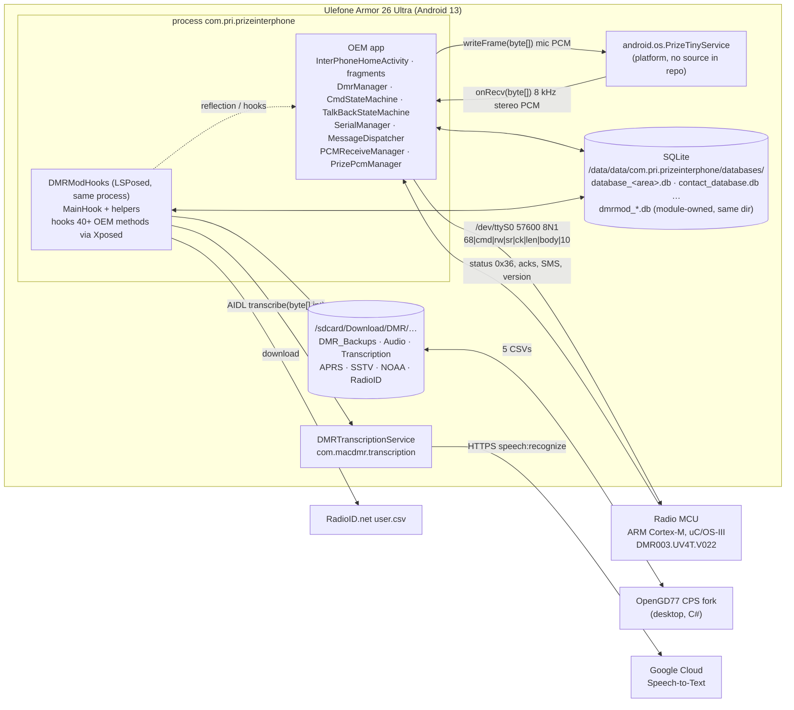

# Deep Dive — PriInterPhone (OEM app) and DMRModHooks (LSPosed mod)

**What this is.** A verified, code-cited reference for how the two halves of this project actually work:

1. the **original OEM app** `com.pri.prizeinterphone` (PriInterPhone, the DMR radio controller shipped on the Ulefone Armor 26 Ultra), read from the decompiled sources in `app/src/main/java/com/pri/prizeinterphone/`, and
2. the **DMRModHooks** LSPosed module (`DMRModHooks/`, v3.4.6) that hooks it at runtime, plus the companion `DMRTranscriptionService` app, the MCU firmware research, and the OpenGD77 CPS fork round-trip.

**Why it exists.** The project's working notes (`.grok/rules/*.md`, the READMEs, `docs/*.md`) were written incrementally over months and have drifted from the code in dozens of places — some of them load-bearing (audio format, DB locations, class paths, field semantics). Every chapter here was produced by reading the relevant sources in full and citing `path:line` for every non-trivial claim; where the existing notes disagree with the code, the chapter says so in a **⚠️ Doc drift** callout. Section [4](#4-consolidated-corrections-to-the-working-notes) collects those corrections in one table.

**As of:** chapters 01–14 describe commit `14e484a2` (main), DMRModHooks `versionName 3.4.6`, OEM decompile of `com.pri.prizeinterphone` `V1.0` (versionCode 33) rebranded in-tree as `com.macgyver.dmr` `2.0-MacDMR`; written 2026-08-26. Later commits: `53dbcfe1` (these docs), `ba6431cb` (audit bug batch, unbuilt — `CHANGELOG_DRAFT.md`). Chapters 15–17 and `docs/BACKLOG.md` were written 2026-08-26/27 against `ba6431cb`. An independent product audit by Grok lives in `docs/grok-deep-dive/` and is reconciled in [17](17-grok-review-response.md).

**Conventions.** `path:line` cites are relative to the repo root unless a chapter defines a shorthand (`OEM/`, `MH:`, `EXP:`…). Claims not directly supported by code are marked **inferred**. Line numbers decay — grep for the symbol name if a cite is off.

---

## 1. Chapter map

Read 01→07 to understand the OEM app bottom-up (transport → commands → control flow → audio → data → UI → firmware), then 08→12 for the mod, then 13–14 for history and the hook cross-reference.

| # | Chapter | What you will learn | Size |
|---|---|---|---|
| **OEM app** | | | |
| [01](01-oem-serial-protocol.md) | Serial transport & packet protocol | `/dev/ttyS0` @ 57600 via JNI `libinterphone_serial_port.so`; frame `68 cmd rw sr ck(2,BE) len(2,BE) body tail=10`; one's-complement checksum (worked examples); reader/writer/dispatch threads; **complete `Const` command table**; `MessageDispatcher` routing; why the reader thread can die on a fragmented frame | 324 lines |
| [02](02-oem-messages-and-handlers.md) | Every message builder & response handler | Byte layout of all 25 outbound messages incl. the **163-byte `DigitalMessage`** (`localId` @8, `txContact` @140, `groups[32]`) and 19-byte `AnalogMessage`; all 30 handlers; cmd↔response map; sequence diagrams (analog/digital programming, RX call, SMS, PTT); tone tables; dead commands; best hook per message | 747 lines |
| [03](03-oem-state-machines-and-dmrmanager.md) | State machines, `DmrManager`, control flow | AOSP `StateMachine` copy; `CmdStateMachine` boot chain (`0xAA→0x34→0x22/23→0x35/0x2A→0x3B`) and the `SetChannelState` retry/timeout transaction; `TalkBackStateMachine` 8-state PTT/RX hierarchy; `DmrManager` API & channel cache; the UI-thread `transitionTo` race; end-to-end flows; hooking guidance | 619 lines |
| [04](04-oem-audio-pipeline.md) | Audio pipeline | Voice PCM does **not** cross the UART — it arrives via platform `android.os.PrizeTinyService` Binder callback; `AudioTrack` **8 kHz stereo 16-bit** (32 kB/s, ~2048 B / 64 ms chunks); TX via `AudioRecord`→`PrizeTinyService.writeFrame`; SoundPool beeps; OEM `.pcm` recording; RX/TX gating by status cmd 0x36 | 404 lines |
| [05](05-oem-data-layer.md) | Data layer | One SQLite file per channel *area* (`database_<areaKey>.db`, 25 columns, 14 default areas); contacts/conversations/messages/records DBs with exact DDL; `ChannelData` field-by-field with wire mapping; default codeplug init; the `/sdcard/intercom/intercom_config.xml` factory-reset import; all SharedPreferences keys; `arrays.xml` enumerations | 623 lines |
| [06](06-oem-ui-and-lifecycle.md) | UI, screens, lifecycle | `PrizeInterPhoneApp`→`InterPhoneService` (foreground, wakelock)→`InterPhoneHomeActivity` (5-tab custom bar, `tapOnClick`); every fragment/activity with view IDs, actions and the OEM calls they make; channel editor; contacts (`saveSelectedData` = origin of Pitfall 12); SMS; settings; device areas; remote-kill; broadcasts/intents table; navigation map | 700 lines |
| [07](07-firmware-update-and-mcu.md) | Firmware update & MCU | `prize.intent.action.update.dmr.firmware`; `DMRDEBUG.bin` override; sender-driven 1K YModem (CRC-16-CCITT, retries, timeouts); evidence the image is RAM-resident; what is (not) known about the Cortex-M/uC-OS-III firmware; the 14-patch campaign and the hard constraints it established | 530 lines |
| **Mod** | | | |
| [08](08-mod-mainhook-core.md) | `MainHook.java` core | Full **line-range source map** of the 16k-line file; `handleLoadPackage` order; every static state field; every core hook with the OEM method it targets; software squelch algorithm (flowchart); audio-hook consumer order; caller ID (24-bit LE) + RadioID two-tier lookup + `dmrmod_history.db`; DmrManager/`BaseMessage.send()` hooks; zones; channel-editor injection; UART logging & debug packet injection; how to add a hook safely | 717 lines |
| [09](09-mod-monitoring-modes.md) | APRS / SSTV / NOAA / VFO modes | The shared channel-hijack framework (backup `.dat` files, name prefixes, startup crash recovery, Zygisk static reset, squelch interplay); each mode's dialogs, audio path, outputs, backup/restore; cross-mode comparison table; checklist for a fifth mode; open issues | 564 lines |
| [10](10-mod-recording-transcription-radioid.md) | Recording, transcription, RadioID | REC → `Download/DMR/Audio/<Channel>/*.wav`; transcription is **Google Cloud Speech-to-Text** via AIDL to `DMRTranscriptionService` (not Whisper); 30 s buffer flushed at RX stop; API key file; dead SpeechRecognizer hooks and the 41.6 MB unused `speech_model.tflite`; `dmrmod_radioid.db` schema/import/lookup | 484 lines |
| [11](11-mod-codeplug-and-databases.md) | Codeplug backup/restore & module DBs | The six `dmrmod_*.db` schemas (they live in the **OEM** package's data dir); zones/TG lists → 32-slot `channel_groups`; `DirectDatabaseExporter` 37-column CSV spec; `DirectDatabaseImporter` is **wipe-and-insert** with all coercions listed; OpenGD77 CPS fork round-trip field map; PDF export; failure modes & adb verification | 516 lines |
| [12](12-mod-signal-decoders.md) | Signal decoders (DSP) | Input rate handling and `resample16to48`; APRS chain (IQ AFSK → Dire-Wolf-style PLL → NRZI → HDLC → CRC → AX.25); SSTV chain (Goertzel VIS → robot36-derived IQ FM demod); NOAA APT chain; which of the ~40 DSP classes are live vs dead; offline test recipe; tuning knobs | 560 lines |
| **Project** | | | |
| [13](13-project-history-and-knowledge-map.md) | History & knowledge map | 11 project phases across ~356 commits (rebrand era → platform-signature wall → Magisk detour → LSPosed pivot → feature accretion); full version→date→headline→APK table; which decompiled tree is authoritative and why `app/` is reference-only; index of all ~85 `docs/*.md` by theme/status; 9 consolidated dead ends with evidence; OpenGD77 fork's 138 builds condensed; all 107 scripts classified; working agreements; hygiene notes | see file |
| [15](15-packet-radio-review.md) | Packet radio (APRS) review | Assessment of the shipped batch-mode AFSK RX chain and the abandoned TX path; ranked alternatives (streaming modem at native rate, HDLC receiver, javAPRSlib parsing, passive decode without channel hijack, APRS-IS iGate/beacon); the untested stereo-frame TX experiment; test-harness plan | see file |
| [16](16-repeater-directory-import.md) | Nearby Repeaters (design + to-do) | Feature design for downloading nearby FM/DMR repeaters and talkgroups and programming them additively; UX layout, source strategy (BrandMeister · RadioID · hearham · RepeaterBook opt-in), merge/dedupe rules, `dmrmod_repeaters.db`, field recipe, legal checklist, tests, 5-phase to-do list. Backed by `_research-repeater-sources.md` and `_research-integration-surface.md` | see file |
| [18](18-firmware-modding-plan.md) | Modding the MCU firmware | Can we decompile / edit / flash the radio firmware to change squelch coercion, band limits, TOT, group-call RX? Binary re-analysis (uC/OS-III, not encrypted, base address never actually verified), why the prior 14 patches failed (naive disassembler + unproven base + no dynamic anchor), a protocol-anchored RE plan, the safe RAM-load test loop, legal notes, and an FW to-do series | see file |
| [17](17-grok-review-response.md) | Response to the Grok deep dive | Claim-by-claim re-verification of `docs/grok-deep-dive/` (an independent product audit): what was confirmed (e.g. `determineBand()` programs UHF/VHF into the bandwidth byte; the `saveChannelData` hook is inverted on both enums; the area-aware fix left module side-tables global), what was rejected with evidence, what changed in these documents, and the new backlog items it produced | see file |
| [14](14-hook-integration-crossref.md) | Hook ↔ OEM cross-reference | 41 hook sites → 51 (class, method) targets (46 OEM + 5 framework), 40 `findClass` lookups, 113 reflective (class, member) pairs, 53 resource IDs, 30 DB column names — each verified against the OEM source with `file:line`; NOT FOUND / PARTIAL items; reverse index per OEM class; fragility ranking | see file |

---

## 2. The system in one picture

Key relationships:

- **Control** goes phone→MCU as command packets; the MCU replies with the same command byte (no sequence numbers, no transport acks) and pushes unsolicited status (`0x36`) for RX/TX start/stop, SMS, timeouts. Chapters 01–03.
- **Voice audio** never touches the UART from the app's point of view: the vendor `PrizeTinyService` delivers RX PCM and accepts TX PCM. The mod's entire audio feature set hangs off one hook, `PCMReceiveManager.writeAudioTrack(byte[],int)`. Chapters 04, 08, 12.
- **Codeplug data** is plain SQLite; the mod reads/writes the OEM tables directly and keeps its own `dmrmod_*.db` files *in the same directory* (because it runs inside the OEM process). Chapters 05, 11.
- **The mod never modifies the APK**; it runs inside the OEM process via LSPosed/Zygisk, so static state survives app restarts (Pitfall 14) and every hook is wrapped in try/catch (silent degradation, not crashes). Chapters 08, 14.

---

## 3. Twenty facts everyone working on this should know

Consolidated from the chapters; each has a cite there.

**Transport & commands (01, 02, 03)**
1. Frame = `0x68, cmd, rw=1, sr=1, cksum(BE), len(BE), body, 0x10`; checksum is a 16-bit one's-complement sum over the frame with the checksum field zeroed *including* the tail. Header fields are big-endian, **all bodies are little-endian** (`ByteBuf`).
2. Inbound checksums are never validated; there is no resync scan; a partial frame throws `BufferUnderflowException` and **kills the reader thread**, which `SerialManager.init()` will not restart.
3. `0x33` is `SET_OFFLINE_MODE_CMD` (relay), values `1`=disconnect-ON, `2`=normal — never 0. `0x39`, `0x3C` have no message/handler. Volume (`0x2E`), squelch-only (`0x30`), listen (`0x2F`), RSSI (`0x32`), encrypt-function (`0x29`) builders exist but **the OEM app never sends them**; their handlers are empty. The mod is the only user of `0x32`.
4. The 163-byte `DigitalMessage` body carries `localId` at offset 8 and `txContact` at offset 140 (4-byte ints); there is no "24-bit target at bytes 5–7". `localId` lives on `DmrManager` (pref-backed), not on `ChannelData`.
5. `CmdStateMachine` has three states; channel programming is a 1 s-timeout, one-retry transaction in `SetChannelState`. Replies are **dropped** in `NoDealState`, so a direct `AnalogMessage.send()` from the mod never produces a listener callback, and acks are correlated only by command byte — a mod-issued 0x23 can be mistaken for the OEM's in-flight transaction ack (plausible root cause of Pitfall 13).
6. `syncChannelInfoWithData(ChannelData)` **is** the OEM hardware-write path (with retry semantics); the notes calling it "not for hardware writes" are wrong.

**Audio (04, 12)**
7. RX PCM arrives via `PrizeTinyService` → `HandlerThread("readpcm")` → `PCMReceiveManager.writeAudioTrack(byte[] bArr, int len)`; `AudioTrack` is `STREAM_MUSIC`, **8000 Hz, `CHANNEL_OUT_STEREO`, PCM 16-bit** = 32 000 B/s, delivered in ~2048-byte (~64 ms) chunks. The mod treats the same bytes as **16 kHz mono**. The byte rate is identical so playback and recording "work", but the true sample layout is **unverified** — see §5 for the test.
8. The RX track is created per call and destroyed at `RECEIVE_STOP`; the `readpcm` thread is where every mod consumer (squelch, VU, recording, transcription buffer, APRS/SSTV/NOAA buffers) runs. Budget: well under 64 ms per callback; keep it to a few ms.

**Data (05, 11)**
9. Channel storage is **one SQLite file per area**: `database_<areaKey>.db`, table of the same name; default module has 14 areas (`default_uhf`, `default_vhf`, 12 regional). The area registry is JSON in pref `pref_person_device_area_list`. The mod only handles `database_channel_area_default_uhf`.
10. Field semantics that the notes had wrong: `channel_band` = **bandwidth** (0 narrow / 1 wide), not UHF/VHF; `channel_encryptSw` = **1 on / 2 off**; `channel_interrupt` defaults to 2 for every type and is only transmitted for digital channels; `channel_type` is an integer column; `channel_number` is never used for ordering.
11. `channel_txContact` stores the 24-bit DMR ID (`contact_number`), not the contact row `_id` (Pitfall 12 — confirmed at `InterPhoneContactsFragment.saveSelectedData`).
12. All `dmrmod_*.db` files live in `/data/data/com.pri.prizeinterphone/databases/`, not in the module's own data dir.
13. `DirectDatabaseImporter` is **wipe-and-insert** (deletes the OEM contact and channel tables in a transaction, re-inserts, preserves `_id` only for 37-column Android CSVs). A BOM on the header row therefore empties the channel list (Pitfall 16). Backups go to `Download/DMR/DMR_Backups/` (one more level than the notes say). `DTMF.csv` is header-only; nothing imports it.

**UI & lifecycle (06)**
14. The five-tab bar is a custom `LinearLayout` with `android:onClick="tapOnClick"`, hosted by `InterPhoneHomeActivity` (root package — there is no `MainActivity`). The UI is built only after the module reports initialised. `com.action.broadcast.TALK_RECEIVING_UPDATE` is declared but never sent or received; the hardware PTT key arrives as `com.interphone.ptt.down/up` broadcasts.
15. `DeviceKilledActivity` is the DMR remote-kill (`0x28`, `fun=4`) lock screen; the flag lives in prefs and a factory reset does not clear it.

**Mod internals (08, 09, 10)**
16. The `sq=0` forcing + 300 ms re-enable lives in `hookChannelNavigation`'s `sendAnalogMessage` before-hook (not `hookDmrManager`); the VFO `localId` override lives in the `BaseMessage.send()` hook (not `sendDigitalMessage`). `softwareSquelchThreshold` is one global shared by the intercom, APRS, SSTV and NOAA sliders — the mechanism behind Pitfall 10. `savedIntercomSquelchThreshold` defaults to 5.
17. Mode exclusivity is **not** enforced by code; backups are Java-serialised `HashMap`s on `/sdcard/*_channel_backup.dat`; startup recovery triggers on the channel-name prefix (`APRS (`, `SSTV (`, `NOAA (`, `VFO`), and no nesting guard is implemented.
18. Transcription is Google Cloud Speech-to-Text (LINEAR16, en-US) inside `DMRTranscriptionService`; the API key is `/sdcard/Download/DMR/api_key.txt`; the service reads it once at `onCreate`. `speech_model.tflite` (41.6 MB, ~96 % of the APK) and the `SpeechRecognizer` hooks are dead.
19. About half of the DSP classes are dead experiments; the live SSTV demod is the `com.example.dmrmodhooks.sstv` package (a port of xdsopl's GPLv3 *robot36*, unacknowledged). `AFSKDecoder` is live (framing/CRC), `AFSKDecoderPLL` is dead, `AFSKDecoder.saveAudioToWAV` writes ~192 KB to `/sdcard/aprs_debug/` every 2 s while APRS is on.

**Firmware (07)**
20. Firmware updates are a sender-driven 1K YModem over the raw port after the packet reader/writer are released; the loaded image reverts on radio power-cycle (well evidenced; "RAM not flash" is inferred). `radio_firmware/cmd_handler.c` is failed Ghidra output — the app's `Const.java` is the only authoritative command list. The group-call RX bug (`contactType=2` → `0xFFFFFF`) survived 14 patches; direct flash access is blocked (`/dev/ttyS1` → `EACCES`).

### Latent failures surfaced by the cross-reference (ch. 14)

Everything the module touches on the OEM side was checked; these are the only mismatches, and all of them fail *silently* because of the try/catch discipline. **Status 2026-08-26:** the hard-coded-area and help-icon items below are fixed in the working tree (see `CHANGELOG_DRAFT.md`, unreleased); the rest are dead code.

| Item | Effect | Where |
|---|---|---|
| `com.pri.prizeinterphone.manager.SerialManager` does not exist (real class: `serial.SerialManager`, and it has no `mInputStream` field) | The UART-flush step in `hookUpdateFirmwareActivity` would always be skipped — currently moot because that hook is not wired (`handleLoadPackage` line ~367 commented out) | `MainHook.java:3849-3862` |
| Resource id `interphone_channel_contact` does not exist (only `…_contact_type`, `…_contact_type_set`) | The "Call Number" help icon in the channel editor is never added | `MainHook.java:13841` |
| Channel DB file name hard-coded as `database_channel_area_default_uhf.db` in all six export/import/PDF/dump classes | Backup, restore, PDF and dump ignore whichever **area** the user has selected; only the reflection paths via `DmrManager.getCurrentDbHelper()` are area-correct | `DirectDatabase*`, `CSV*`, `PDFExporter`, `DiagnosticDatabaseDump` |
| `UARTBootloaderProbe` targets `/dev/ttyS1`; the radio UART is `/dev/ttyS0` | Probe is disabled; if re-enabled it probes the wrong port | `UARTBootloaderProbe.java:37` |
| `RelayMessage` is looked up but never used; four `android.speech.*` hooks are installed against framework classes but never wired | Dead weight only | ch. 14 §1, §2 |

---

## 4. Consolidated corrections to the working notes

The rules docs (`.grok/rules/00-session-start.md`, `copilot-instructions.md`, `key-files.md`, `packet-layouts.md`) and the READMEs are the day-to-day guidance for agents and humans. These are the claims that the code contradicts, ranked by how much damage acting on them would do. Each chapter's ⚠️ section has the cites.

| Sev. | Notes say | Code says | Ch. |
|---|---|---|---|
| 🔴 | Audio hook runs at 8 kHz (mono implied); mod code comments say 16 kHz mono | OEM `AudioTrack` is 8 kHz **stereo** 16-bit; same byte rate as 16 kHz mono; layout unverified — new DSP written against "8 kHz mono" will be off by 2× | 04, 12 |
| 🔴 | Module DBs live in `com.dmrmod.hooks` data dir | All `dmrmod_*.db` are in `/data/data/com.pri.prizeinterphone/databases/` | 11 |
| 🔴 | `channel_band` 0=UHF/1=VHF; `channel_encryptSw` 0/1; `channel_interrupt` must be 2 digital/0 analog; `channel_type` TEXT | `band` = narrow/wide bandwidth; `encryptSw` 1=on/2=off; `interrupt` default 2 for all types (mod's analog=0 is a mod convention); `type` is INTEGER | 05, 11 |
| 🔴 | Importer "upserts channels by name+freq" | Wipe-and-insert; `_id` preserved only for 37-col CSVs; APRS flags/TG lists never cleared, locations cleared outside the transaction | 11 |
| 🔴 | Transcription = "cloud Whisper / OpenAI API"; key at `/sdcard/DMR/api_key.txt`; recordings in `DMR/Recordings/` | Google Cloud Speech-to-Text; key at `/sdcard/Download/DMR/api_key.txt`; recordings in `Download/DMR/Audio/<Channel>/` | 10 |
| 🟠 | Frequently-hooked class paths: `ui.activity.MainActivity`, `ui.fragment.TalkBackFragment`, `handler.ModuleStatusHandler`, `serial.communication.Packet`, `protocol.MessageDispatcher` | `InterPhoneHomeActivity` (root pkg), `fragment.InterPhoneTalkBackFragment`, `handler.ModuleStatusMessageHandler`, `protocol.Packet`, `serial.port.SerialPort`, `serial.MessageDispatcher` (the code already uses the right ones; the table is wrong) | 03, 08 |
| 🟠 | `packet-layouts.md`: DigitalMessage "bytes 5–7 = target ID, 24-bit LE" | `localId` int @ body 8, `txContact` int @ body 140; no 24-bit target field | 02, 05 |
| 🟠 | Pitfall 15: `localId` override is in `hookDmrManager.sendDigitalMessage` before-hook (~line 10458) | It is in the `BaseMessage.send()` before-hook (`MainHook.java:~10798`) | 03, 09 |
| 🟠 | `sendAnalogMessage` sq-forcing hook is in `hookDmrManager` | It is in `hookChannelNavigation` (~12329); `hookDmrManager`'s copy only logs | 08 |
| 🟠 | `syncChannelInfoWithData` is "for UI refresh, NOT hardware writes" | It is the OEM hardware-write path (`CmdStateMachine` transaction); it does not refresh UI | 03, 09 |
| 🟠 | Mode flags are mutually exclusive; backups in SharedPreferences and "MUST include localId"; nesting guard implemented | No exclusivity enforcement; backups are `/sdcard/*.dat` HashMaps; `localId` must not be in them; no nesting guard exists | 09 |
| 🟠 | Pitfall 14 says all flags reset at startup | `isMonitoringMode`, soft-squelch flags, recording/transcription flags, zone state are not reset | 08 |
| 🟠 | `channel_relay` 0 "rejected by firmware" | Unverifiable from app code (firmware side unknown); the app itself never writes 0 | 05 |
| 🟡 | Cmd `0x33` = `SET_RELAY_CMD`, "0=off 1=on"; RSSI byte "in dBm" | `SET_OFFLINE_MODE_CMD`, values 1/2; OEM never converts RSSI — the `-(120 - raw/2)` formula is the mod's | 01, 02 |
| 🟡 | `AFSKDecoderPLL` is the PLL (`TICKS_PER_PLL_CYCLE = 2^32`); `AFSKDecoder` abandoned; `APRSPacketDecoder` does HDLC/CRC; `SSTVReceiver` has a 3 MB circular buffer; no `sstv/` subpackage exists | PLL is in `AFSKDecoderIQ`; `AFSKDecoder` is live and owns HDLC/CRC; `SSTVReceiver` buffer is a 1 MB linear stream trimmed to 18 s; `com/example/dmrmodhooks/sstv/` is the production SSTV DSP | 12 |
| 🟡 | `savedIntercomSquelchThreshold = 2`; `aprsToggleButton`; VFO params `volatile` | Default 5; field is `aprsMonitoringToggleButton`; `vfo*` are not volatile | 08, 09 |
| 🟡 | `hookApplication` grabs the ClassLoader | `handleLoadPackage` does; `hookApplication` fixes directories/migrates zones | 08 |
| 🟡 | Backup folder `Download/DMR_Backups/`; Contacts `ID Type` 0/1/2; zone compound key `name⟨_id⟩`; fork v1.2.7 | `Download/DMR/DMR_Backups/`; `Private/Group/All Call` strings; `channelNum|rxMHz|name` (and off in the exporter); fork v2.0.45 | 11 |
| 🟡 | `SSTV` live screen ticks every 2 s; startup restore uses `restoreChannelBackup()` | 1 s; startup restore is inlined in `checkAndRestore*OnStartup` | 09 |
| 🟡 | `radio_firmware/README.md`: app checks both `/sdcard/DMRDEBUG.bin` and `/sdcard/DMR/DMRDEBUG.bin`, "size/checksum validated"; `cmd_handler.c` is the decompiled command handler | Only `/sdcard/DMR/DMRDEBUG.bin` is checked and it wins unconditionally (transfer auto-starts on entering `UpdateFirmwareActivity`); only per-block CRC-16 + a size hint, no whole-image checksum; `cmd_handler.c` is unusable Ghidra output | 07 |
| 🟡 | `.docs/AI_LOGS_SUMMARY.md` is the dead-end register | File is gitignored and absent on this checkout; ch. 13 §5 and ch. 07 §5 now carry that content | 01, 13 |
| 🟢 | `channel_groups` = 32 comma-separated TG IDs written at save time; Pitfall 12; 24-bit LE caller ID; hooking `sendAnalogMessage` before send; `-r -t` install + reboot | All **confirmed** by the code | 02, 08, 11 |

Recommended follow-up (not done here, to keep this change documentation-only): patch `.grok/rules/*.md` from this table, and replace the "Frequently-Hooked OEM Class Paths" and §5a schema tables with links to chapters 03/05/08/14.

---

## 5. Open questions the code cannot settle

| Question | Why it matters | How to settle it |
|---|---|---|
| **Is the RX stream 8 kHz stereo (L=R) or 16 kHz mono?** | Every decoder's frequency math (AFSK 1200/2200 Hz, SSTV 1500–2300 Hz, APT 2400 Hz) depends on it; both interpretations give the same byte rate so nothing crashes either way. | Record a raw chunk in `hookPCMReceiveManager` (or use a `Download/DMR/Audio/*.wav` made by REC — those are the raw bytes with a 16 kHz-mono header). If `s[2k] == s[2k+1]` for essentially all k, it is duplicated stereo and the true rate is 8 kHz. The repo's `DMRModHooks/*.wav` files are *post*-`resample16to48` dumps and cannot answer this (checked 2026-08-26; interpolation masks the pairing). No device was attached to run the test. |
| Is the YModem image written to MCU RAM or flash? | Determines whether a permanent fix for group-call RX is even possible. | Reverts on power-cycle (well evidenced). Reading back needs bootloader access on `/dev/ttyS1`, which returns `EACCES` (ch. 07 §3). |
| Does the firmware reject `channel_relay = 0`? | Drives the importer's `0→2` coercion. | Only "operation failed" toasts are on record; the app never sends 0 itself. Would need a direct `AnalogMessage` with `relay=0` and the ack `sr` value logged (ch. 01 §9 shows how). |
| Unit of the `0x32` RSSI byte | Software squelch thresholds are calibrated to `-(120 - raw/2)` dBm, which is a mod guess. | Compare against a known signal generator level. |

---

## 6. Where to look when you need to…

| Task | Go to |
|---|---|
| Add or intercept a serial command | 01 §9 (hook targets), 02 §7 (per-message best hook), 03 §9 (state-machine-safe timing) |
| Change what gets programmed into a channel | 02 §3.1/3.2 (byte layout), 03 §7b (flow), 08 §7 (`hookDmrManager`), 05 §2 (`ChannelData`) |
| Touch the audio path / add a decoder | 04 §7 (hook + budget), 08 §5 (consumer order), 12 §9 (adding a decoder), open question §5 above |
| Read/write OEM databases from the mod | 05 §1, §9; 11 §1.9, §9.2 (adb recipes) |
| Change CSV export/import or the CPS round-trip | 11 §3, §4, §7, §9.3 (every touch point) |
| Add UI to the intercom page or another screen | 06 §8 (per-screen lifecycle hooks and field names), 08 §3.4, §11.2 |
| Add a monitoring mode | 09 §7.1 checklist |
| Understand why a hook silently does nothing | 14 (NOT FOUND list), 08 §11.4 |
| Understand why something "was already tried" | 13 §5 (dead ends), 07 §5 (patch campaign) |
| Change something the app can't reach (squelch levels, band, group-call RX) | 18 (firmware modding plan) + 07 (update mechanism, MCU facts) |
| Decide what to work on next | `docs/BACKLOG.md` (ranked, with evidence pointers) |
| Improve or rework APRS / packet radio | 15 (review + recommended sequence), 12 §2 (current decoder), 09 §2 (mode UI) |
| Build the Nearby Repeaters feature | 16 (design, to-do), `_research-integration-surface.md` (exact APIs to call), `_research-repeater-sources.md` (endpoints/terms) |
| Ship a release / deploy to device | `.grok/rules/00-session-start.md` §4–5, 13 §8 |

---

## 7. How these chapters were verified

The chapters were first drafted by one agent per chapter (each reading its sources in full), during a session that was interrupted twice by usage-limit outages; every drafting agent was cut off at least once and resumed. Because an interruption can lose in-flight tool results and tempt an agent to write from memory, **every chapter was then independently audited by a second agent with no memory of the first**, which (1) checked section coverage against the original brief, (2) opened the source at a large sample of cited `file:line` claims, re-deriving the load-bearing tables (command lists, DDLs, byte offsets, state-machine constants, coercion lists, hook inventories) from scratch, (3) flagged anything unsupported, and (4) corrected confirmed errors in place. The tallies:

| Ch. | Claims checked | Confirmed | Wrong → fixed | Nature of the errors | Verdict |
|---|---|---|---|---|---|
| 01 | ~95 | 84 | 11 | cite drift of 1–5 lines; one wording (`0xAA` is not `sr`-gated); `cmd_handler.c` description | trustworthy; all 29 commands + 4 checksum examples reproduced |
| 02 | 58 | 47 | 10 | tone-table counts off by one; bogus "10 Hz" analog-frequency unit; hex/decimal slips; cite drift | reliable; 163-byte `DigitalMessage` offsets re-derived exactly |
| 03 | ~130 | ~108 | 20 | all line cites for six small files offset by a constant (author cited a concatenated listing); 3 `DmrManager` methods missing | technical content re-derived and exact; cites corrected |
| 04 | 52 | 48 | 3 | one Android constant mislabelled (`MAY_DUCK` not `EXCLUSIVE`); one cite; one try/catch scope | accurate to the line; vendor API confirmed from smali |
| 05 | ~150 | ~141 | 9 | one area dropped from a list (Japan); one XML-validation reasoning slip; cite drift | all six DDLs verbatim; sample DB schema byte-identical |
| 06 | ~135 | ~122 | 12 | layout-XML line numbers copied from Java `initView` lines; two id-name slips; one audio-focus constant | Java cites/ids/strings/prefs/intents accurate |
| 07 | 52 | 49 | 3 | one file line-count never counted; version-parse index (`split[2]`); one inverted package-name note (`com.macgyver.dmr` **is** the applicationId of the rebuilt tree) | accurate; all YModem constants, four MD5s, all 14 patches confirmed |
| 08 | 96 | 82 | 13 | one ~540-line band of `hookTalkBackFragment` cited against a stale line map (−30 offset); `handleLoadPackage` table uniformly +1; one unfounded Xposed callback-ordering assertion; amplitude stride copied from a wrong code comment (every 2nd sample, not 4th) | reliable; all 133 static fields, all 27 injected views, all 20 hooks and their OEM signatures confirmed |
| 09 | 118 | 92 | 26 | **all** line-cite drift of 3–33 lines (constant offsets per region — cited from memory after the interruptions); zero factual errors | reliable; backup-key lists, VFO widget list, exclusivity checks, localId override, All-Call workaround all re-derived exactly |
| 10 | 62 | 54 | 7 | attribution/range slips (one marks where the interrupted read stopped); CSV-format precedence nuance | every load-bearing claim confirmed against source and git |
| 11 | 112 | 104 | 8 | one method misattributed; 36-column offset labels; cite drift | DDLs and 37-col header verbatim; all `importChannels` coercions present, none missed |
| 12 | 74 | 67 | 5 | WAV sample rates inferred from filenames; cite drift; one doc summary oversimplified | all 44 DSP files' live/dead status confirmed by grep; constants exact |
| 13 | 78 | 61 | 16 | one doc missing from the index (`QUICKSTART.md`); small counts/dates (fork per-minor table, file counts, one release date); two facts attributed to the wrong README | trustworthy; all 60 commit hashes, 15 version→date pairs, 83/83 docs, 107/107 scripts, 18/18 releases confirmed |
| 14 | ~150 OEM cites + 531 module cites | all but 1 | 7 | one hook target misattributed (`android.app.Application`, not `PrizeInterPhoneApp`); one phantom reflective row; ten wiring cites off by one; reflective-pair count restated as 113 | sound mechanical cross-reference |

Pattern across the audit: **no fabricated classes, methods, fields, constants, files or commits were found in any chapter.** Errors were overwhelmingly line-cite drift and a handful of from-memory slips (a constant name, a count, a unit), concentrated exactly where the interruptions fell. The conclusions summarised in §3 and §4 of this index all survived verification.

---

## 8. Maintenance

- These chapters describe **commit `14e484a2`**. When code moves, line cites rot first; symbol names rot last. Prefer updating the affected section over adding a new doc.
- Each chapter ends with a **Gotchas / ⚠️ Doc drift** section; when you fix a drift item in `.grok/rules`, also delete it from the chapter and from §4 above.
- Chapter 14 is the mechanical part: re-run its method (grep every `findAndHookMethod`/`findClass`/`getIntField`… and verify against `app/src/main/java`) after any OEM-facing change.
- Keep `00-session-start.md` pointing here; it is the only file every session reads.
