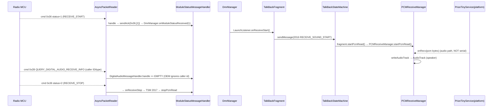

# OEM Messages & Handlers — PriInterPhone ↔ Radio MCU Command Layer

This chapter documents **every outbound message builder** (`message/*.java`) and **every inbound response handler** (`handler/*.java`) in the decompiled OEM app `com.pri.prizeinterphone`. It covers the exact byte layout each message produces, which `ChannelData`/settings fields feed it, who sends it and when, how each handler parses the response, and what UI/state-machine consumes it. Everything here is derived from the decompiled Java; inferences are marked **(inferred)**. Doc-drift callouts against `.grok/rules/*` appear inline as **⚠️ Doc drift**.

All paths are relative to `app/src/main/java/com/pri/prizeinterphone/` unless absolute.

---

## 0. Summary of the mechanism

- A **`Message`** (interface `message/Message.java`) has `encode()` / `decode()` / `send()`. `BaseMessage` (`message/BaseMessage.java`) wraps a `Packet` and implements the transport-facing plumbing.
- `BaseMessage.send()` (`message/BaseMessage.java:35`) calls `encode()` then `SerialManager.getInstance().send(this.packet)`. `encode()` (line 18) sets `packet.rw=1`, `packet.sr=1`, and `packet.body = encodeBody()`. **Every outbound packet is RW=1 (write), SR=1 (set).**
- Each concrete message overrides `encodeBody()` (builds the outbound body) and `decodeBody(byte[])` (parses an inbound body, if it is also used as an inbound holder). Most builders leave `decodeBody` empty because a dedicated handler re-instantiates the same class for the response.
- All bodies are built with `Util/ByteBuf.java`, which is **little-endian** (`ByteBuf.allocate` → `ByteBuffer…order(LITTLE_ENDIAN)`, `Util/ByteBuf.java:19`). `putInt` writes 4 bytes LE; `put(byte)`/`put(byte[])` write raw.
- Inbound: `codec/AsyncPacketReader.decode()` frames a `Packet` (head `0x68`, cmd, rw, sr, ckSum(2), len(2), body, tail `0x10`), then `MessageDispatcher.onReceive()` (`serial/MessageDispatcher.java:78`) looks up a handler **by `packet.cmd`** and runs `handler.handle(packet)` on the `serial-port-dispatch-t` executor thread.
- `BaseMessageHandler.handle(Packet)` (`handler/BaseMessageHandler.java:12`) does `decode(packet)` → `msg.decode()` → `handle(msg)`. So a handler re-parses the body via the message class's `decodeBody`.
- Result routing splits three ways:
  - **Channel-programming results** (`SET_DIGITAL_INFO_CMD 0x22`, `SET_ANALOG_INFO_CMD 0x23`) and init/version/interrupt/mic/tot flow into **`CmdStateMachine`** (`state/CmdStateMachine.java`) via `getCmdResultFromModule(msg)`.
  - **Async module events** flow into **`DmrManager`** via `onModuleStatusReceived`, `onSmsReceived`, `onVersionReceived`, or `dealEvent(cmd, msg)` → registered `MessageListener`s.
  - Many handlers are **no-ops** (empty `handle`), consuming the ack silently.

---

## 1. Source files

### Message builders (`message/`)

| Class | Cmd (name) | Cmd hex | Body size | Sends when | Response handler |
|---|---|---|---|---|---|
| `BaseMessage.java` | — (abstract base) | — | — | — | — |
| `Message.java` | — (interface) | — | — | — | — |
| `InitMessage.java` | `MODULE_INIT_CMD` | `0xAA` (−86) | 1 | (builder present; see §6) | `InitMessageHandler` |
| `QueryInitMessage.java` | `QUERY_INIT_STATUS_CMD` | `0x27` (39) | 1 | `DmrManager.sendQueryInitializedCmdToMdl()` during init | `QueryInitMessageHandler` |
| `VersionMessage.java` | `QUERY_VERSION_CMD` | `0x34` (52) | 1 | `DmrManager.sendQueryVersionCmdToMdl()` during init | `VersionMessageHandler` |
| `DigitalMessage.java` | `SET_DIGITAL_INFO_CMD` | `0x22` (34) | **163** | `DmrManager.sendDigitalMessage()` on channel program | `DigitalMessageHandler` |
| `AnalogMessage.java` | `SET_ANALOG_INFO_CMD` | `0x23` (35) | **19** | `DmrManager.sendAnalogMessage()` on channel program | `AnalogMessageHandler` |
| `LaunchMessage.java` | `SET_LAUNCH_INFO_CMD` | `0x26` (38) | 1 | `DmrManager.launchCommand()`/`launchEnd()` (PTT) | `LaunchMessageHandler` (no-op) |
| `EnhanceMessage.java` | `SET_ENHANCE_FUNCTION_CMD` | `0x28` (40) | 5 | `DmrManager.enhanceFunction(fun,callNum)` | `EnhanceMessageHandler` |
| `EncryptMessage.java` | `SET_ENCRYPT_FUNCTION_CMD` | `0x29` (41) | 1/9/18/34 | (builders present; see §6) | `EncryptMessageHandler` (no-op) |
| `MicMessage.java` | `SET_GAIN_MIC_CMD` | `0x2A` (42) | 1 | `DmrManager.sendSetMicGainCmdToMdl()` | `MicMessageHandler` |
| `DigitalAudioMessage.java` | `QUERY_DIGITAL_AUDIO_RECEIVE_INFO` | `0x2B` (43) | 1 | (builder present; radio pushes RX info) | `DigitalAudioMessageHandler` (no-op) |
| `SendSmsMessage.java` | `SEND_SMS_CMD` | `0x2C` (44) | var | `DmrManager.sendSms()` | `SendSmsMessageHandler` (no-op) |
| `FetchSmsMessage.java` | `RECEIVE_SMS_CMD` | `0x2D` (45) | 1 (out) | `DmrManager.onNewSmsNotify()` after status 5 | `FetchSmsMessageHandler` |
| `VolumeMessage.java` | `SET_VOL_CMD` | `0x2E` (46) | 1 | (builder present) | `VolumeMessageHandler` (no-op) |
| `MonitorMessage.java` | `SET_LISTEN_CMD` | `0x2F` (47) | 1 | (builder present) | `MonitorMessageHandler` (no-op) |
| `SquelchMessage.java` | `SET_SQUELCH_CMD` | `0x30` (48) | 1 | (builder present) | `SquelchMessageHandler` (no-op) |
| `PowerSaveMessage.java` | `SET_POWER_SAVE_MODE_CMD` | `0x31` (49) | 1 | (builder present) | `PowerSaveMessageHandler` (no-op) |
| `SignalMessage.java` | `QUERY_SIGNAL_STRENGTH_CMD` | `0x32` (50) | 1 (out) | (builder present; radio replies rssi) | `SignalMessageHandler` (no-op) |
| `RelayMessage.java` | `SET_OFFLINE_MODE_CMD` | `0x33` (51) | 1 | `DmrManager.relayCommand()` | `RelayMessageHandler` (no-op) |
| `InterruptMessage.java` | `INTERRUPT_TRANSMIT_CMD` | `0x35` (53) | 1 | `DmrManager.sendTransmissionInterruptCmdToMdl()` | `InterruptMessageHandler` |
| `ModuleStatusMessage.java` | `MODULE_PRINT_STATUS_INFO_CMD` | `0x36` (54) | 0 (out) / 1 (in) | Radio pushes async status; app acks | `ModuleStatusMessageHandler` |
| `PolicyMessage.java` | `SET_POLITE_POLICY_CMD` | `0x37` (55) | 1 | (builder present) | `PolicyMessageHandler` (no-op) |
| `MixCheckMessage.java` | `SET_MIX_CHECK_INFO_CMD` | `0x38` (56) | ≥163 | (builder present; see §6) | `MixCheckMessageHandler` (no-op) |
| `SmsProtocolMessage.java` | `SET_SMS_PROTOCOL_TYPE_CMD` | `0x3A` (58) | 1 | `DmrManager.setSmsProtocol()` | `SmsProtocolMessageHandler` (no-op) |
| `TotMessage.java` | `SET_TOTO_CMD` | `0x3B` (59) | 1 | `DmrManager.sendSetTotCmdToMdl()` | `TotMessageHandler` |
| `TestBiteErrorRateMessage.java` | `TEST_BIT_ERROR_RATE` | `0x3F` (63) | 1 | `FragmentLocalTestBiteErrorRateActivity` | `TestBiteErrorRateMessageHandler` |

Note: `SET_SPK_EN_CMD 0x3C` (60) is defined in `Const` but has **no message class and no handler** (see §6). The `talkbak/` package (`SendTalkbak`, cmd `0x26`) is a parallel, unused copy of `LaunchMessage` (see §6).

### Response handlers (`handler/`)

| Handler | Registered for cmd(s) | Action |
|---|---|---|
| `BaseMessageHandler.java` | — (abstract) | `decode → msg.decode() → handle(msg)` |
| `MessageHandler.java` | — (interface) | `handle(Packet)` |
| `InitMessageHandler.java` | `0xAA` | → `CmdStateMachine.getCmdResultFromModule` |
| `DigitalMessageHandler.java` | `0x22` **and** `0x24` | → `CmdStateMachine.getCmdResultFromModule` |
| `AnalogMessageHandler.java` | `0x23` **and** `0x25` | → `CmdStateMachine.getCmdResultFromModule` |
| `LaunchMessageHandler.java` | `0x26` | no-op |
| `QueryInitMessageHandler.java` | `0x27` | → `CmdStateMachine.getCmdResultFromModule` |
| `EnhanceMessageHandler.java` | `0x28` | kill/revive pref + `DmrManager.dealEvent` |
| `EncryptMessageHandler.java` | `0x29` | no-op |
| `MicMessageHandler.java` | `0x2A` | → `CmdStateMachine.getCmdResultFromModule` |
| `DigitalAudioMessageHandler.java` | `0x2B` | no-op (empty `handle`) |
| `SendSmsMessageHandler.java` | `0x2C` | no-op |
| `FetchSmsMessageHandler.java` | `0x2D` | → `DmrManager.onSmsReceived` |
| `VolumeMessageHandler.java` | `0x2E` | no-op |
| `MonitorMessageHandler.java` | `0x2F` | no-op |
| `SquelchMessageHandler.java` | `0x30` | no-op |
| `PowerSaveMessageHandler.java` | `0x31` | no-op |
| `SignalMessageHandler.java` | `0x32` | no-op (decodes rssi, then discards) |
| `RelayMessageHandler.java` | `0x33` | no-op |
| `InterruptMessageHandler.java` | `0x35` | → `CmdStateMachine.getCmdResultFromModule` |
| `ModuleStatusMessageHandler.java` | `0x36` | ack + `DmrManager.onModuleStatusReceived` |
| `PolicyMessageHandler.java` | `0x37` | no-op |
| `MixCheckMessageHandler.java` | `0x38` | no-op |
| `SmsProtocolMessageHandler.java` | `0x3A` | no-op |
| `TotMessageHandler.java` | `0x3B` | → `CmdStateMachine.getCmdResultFromModule` |
| `TestBiteErrorRateMessageHandler.java` | `0x3F` | → `DmrManager.dealEvent(0x3F,…)` |
| `VersionMessageHandler.java` | `0x34` | `DmrManager.onVersionReceived` + `CmdStateMachine` |
| `BaseTalkbakHandler.java` / `TalkbakHandler.java` / `SendTalkbakHandler.java` | — (never registered) | dead code (see §6) |

### Supporting files read for call-site tracing

`serial/MessageDispatcher.java`, `serial/SerialManager.java`, `serial/DmrListener.java`, `serial/PacketReceiver.java`, `protocol/Packet.java`, `protocol/Const.java`, `codec/AsyncPacketReader.java`, `codec/AsyncPacketWriter.java`, `codec/PacketEncoder.java`, `Util/ByteBuf.java`, `manager/DmrManager.java`, `manager/PCMReceiveManager.java`, `manager/PrizePcmManager.java`, `manager/LaunchListener.java`, `manager/InterruptResultListener.java`, `state/CmdStateMachine.java`, `state/TalkBackStateMachine.java`, `serial/data/ChannelData.java`, `InterPhoneHomeActivity.java`, `AppObserver.java`, `activity/DeviceKilledActivity.java`, `activity/FragmentLocalSettingsActivity.java`, `activity/InterPhoneChannelActivity.java`, `activity/FragmentLocalTestBiteErrorRateActivity.java`, `fragment/InterPhoneTalkBackFragment.java`, `fragment/InterPhoneChannelFragment.java`, `res/values/arrays.xml`, `res/values/strings.xml`.

---

## 2. Framing (context for byte offsets)

Every body table below is the **`packet.body`** only. The wire frame added by `codec/PacketEncoder.encode()` (`codec/PacketEncoder.java:9`) around it is:

| Off | Size | Field | Value |
|---|---|---|---|
| 0 | 1 | head | `0x68` (104) |
| 1 | 1 | cmd | command id |
| 2 | 1 | rw | `1`=write/`0`=read |
| 3 | 1 | sr | set/result flag |
| 4–5 | 2 | ckSum | 16-bit ones-complement sum, **big-endian on the wire** (`checkSum >> 8` then low byte) |
| 6–7 | 2 | bodyLen | **big-endian** (`len>>8`, low) |
| 8… | n | body | (LE contents, per message) |
| 8+n | 1 | tail | `0x10` (16) |

**⚠️ Doc drift (endianness subtlety):** the header length/checksum are written **big-endian** by `PacketEncoder`, but every *body* field is **little-endian** (via `ByteBuf`). `AsyncPacketReader.decode()` reads the header with `order(BIG_ENDIAN)` (`codec/AsyncPacketReader.java:116`, then `getShort()` for ckSum/len). The `.grok` notes don't state the header/body endianness split; documented here for accuracy.

`SR` flag values (`Const.SRFlag`): `0`=RESULT_SUCCESS, `1`=SET or RESULT_FAIL, `2`=RESULT_CK_SUM_ERROR (`protocol/Const.java:94`). Handlers test `packet.sr == 0` for success.

---

## 3. Message catalogue

### 3.0 `BaseMessage` (abstract)
`message/BaseMessage.java`. Holds `final Packet packet`. `encode()` forces `rw=1, sr=1, body=encodeBody()` (line 18). `send()` = encode + `SerialManager.send` (line 35). `decode()` calls `decodeBody(body)` only if body non-empty (line 26). Hook target for observing/overriding **all** outbound messages (see §7).

---

### 3.1 `AnalogMessage` — `SET_ANALOG_INFO_CMD` `0x23`
`message/AnalogMessage.java`. Programs an FM/analog channel. Body = **19 bytes** (`ByteBuf.allocate(19)`, line 57).

Fields (all `byte` unless noted), with defaults set in ctor (`AnalogMessage.java:31`):

| Field | Type | Default | Meaning / encoding |
|---|---|---|---|
| `rxFreq` | int | `4010250` | RX freq in **Hz** — same unit as digital. Fed unchanged from `ChannelData.rxFreq` (`sendAnalogMessage` does `setRxFreq(channelData.getRxFreq())`, `DmrManager.java:374`), and `ChannelData` frequencies are Hz (e.g. `476425000` in `arrays.xml` `channel_tx_Analog_aus`, and the 400 000 000–480 000 000 range check at `InterPhoneChannelActivity.java:363`). The ctor default `4010250` is a stale placeholder that is always overwritten before send; there is **no** 10 Hz scaling anywhere in the app. |
| `txFreq` | int | `4010250` | TX freq, Hz (same note). |
| `band` | byte | `1` | 0=Narrow(12.5k), 1=Wide(25k). Fed from `ChannelData.band` (0=narrow,1=wide; UI `interphone_channel_band_values`). |
| `power` | byte | `0` (unset) | 0=Low(P1), 1=High. Fed from `ChannelData.power`. |
| `sq` | byte | `2` | Squelch level. Only 0(open)/2(tight) honored by firmware (per `.grok/rules` hardware notes — firmware behaviour, not visible in app code). Fed from `ChannelData.sq`. |
| `rxType` | byte | `0` | RX tone type: 0=None(Wave),1=CTCSS,2=Forward DCS,3=Backward DCS. |
| `rxSubCode` | byte | `0` | Index into the tone table for `rxType` (see §5). |
| `txType` | byte | `0` | TX tone type, same enum as `rxType`. |
| `txSubCode` | byte | `0` | Index into TX tone table. |
| `pwrSave` | byte | `2` | Power-save flag (**not** copied by `sendAnalogMessage`; stays default 2). |
| `volume` | byte | `8` | Volume (**not** copied by `sendAnalogMessage`; stays default 8). |
| `monitor` | byte | `2` | Monitor flag (**not** copied; stays 2). |
| `relay` | byte | `2` | Relay: 1=disconnect ON, 2=normal. Fed from `ChannelData.relay`. |

**Body byte layout** (`encodeBody`, `AnalogMessage.java:56`, LE):

| Off | Size | Field |
|---|---|---|
| 0 | 4 | rxFreq (int LE) |
| 4 | 4 | txFreq (int LE) |
| 8 | 1 | band |
| 9 | 1 | power |
| 10 | 1 | sq |
| 11 | 1 | rxType |
| 12 | 1 | rxSubCode |
| 13 | 1 | txType |
| 14 | 1 | txSubCode |
| 15 | 1 | pwrSave |
| 16 | 1 | volume |
| 17 | 1 | monitor |
| 18 | 1 | relay |

**Sent by** `DmrManager.sendAnalogMessage(ChannelData)` (`manager/DmrManager.java:369`): copies `band, power, txFreq, rxFreq, sq, rxType, rxSubCode, txType, txSubCode, relay` from the channel, then `.send()`. Note it does **not** set `pwrSave/volume/monitor` (defaults used). Reached via `sendSetChannelCmdToMdl` when `channel.type != 0`.
**Response:** `AnalogMessageHandler` re-wraps the reply as `AnalogMessage` (empty decodeBody) → `CmdStateMachine.getCmdResultFromModule` → on `sr==0` fires `dealEvent(0x23)` to UI listeners; on failure retries then errors (see §4a).

---

### 3.2 `DigitalMessage` — `SET_DIGITAL_INFO_CMD` `0x22` (163-byte channel packet)
`message/DigitalMessage.java`. The full DMR channel-programming packet. Body = **163 bytes** (`ByteBuf.allocate(163)`, line 130). Defaults set in ctor (`DigitalMessage.java:35`).

**Every field & offset** (`encodeBody`, `DigitalMessage.java:129`, LE):

| Off | Size | Field | Type | Default | Meaning / encoding |
|---|---|---|---|---|---|
| 0 | 4 | `rxFreq` | int LE | `401025000` | RX freq in **Hz** (401.025 MHz). Fed from `ChannelData.rxFreq`. (Analog uses the same Hz unit — see §3.1.) |
| 4 | 4 | `txFreq` | int LE | `401025000` | TX freq, 1 Hz. |
| 8 | 4 | `localId` | int LE | `1` | This radio's own DMR ID. Fed from `DmrManager.getLocalId()` (NOT from ChannelData). |
| 12 | 128 | `groupList[32]` | 32× int LE | zeros, `[0]=1` | RX group list, 32 talkgroups, 4 bytes each. Fed from `ChannelData.groups` **only when `contactType==1` (GROUP)** (`DmrManager.java:351`); otherwise default array is sent. |
| 140 | 4 | `txContact` | int LE | `1` | TX target DMR ID or TG ID. Fed from `ChannelData.txContact`. |
| 144 | 1 | `contactType` | byte | `1` | 0=Private,1=Group,2=All-Call. Fed from `ChannelData.contactType`. |
| 145 | 1 | `power` | byte | `1` | 0=Low,1=High. Fed from `ChannelData.power` (`DmrManager.java:334`). |
| 146 | 1 | `cc` | byte | `1` | Color code 0–15. Fed from `ChannelData.cc`. |
| 147 | 1 | `inboundSlot` | byte | `0` | 0=TS1,1=TS2 (0-based). Fed from `ChannelData.inBoundSlot`. |
| 148 | 1 | `outboundSlot` | byte | `0` | 0=TS1,1=TS2. Fed from `ChannelData.outBoundSlot`. |
| 149 | 1 | `channelMode` | byte | `0` | 0=Direct, 4=Double-slot (`InterPhoneChannelActivity` sets 0 or 4). Fed from `ChannelData.channelMode`. |
| 150 | 1 | `encryptSw` | byte | `2` | 1=on, 2=off. Fed from `ChannelData.encryptSw`. |
| 151 | 8 | `encryptKey[8]` | byte[8] | zeros | Encryption key bytes. Fed from `ChannelData.encryptKey.getBytes()` if non-empty, else 8×0 (`DmrManager.getByteDefault()`, `DmrManager.java:384`). **Note:** `encodeBody` does `put(this.encryptKey)` with no length check — the 163-byte total (and every offset after 151) assumes the key string is exactly 8 bytes; a longer/shorter key grows/shrinks the body because `ByteBuf` auto-expands. |
| 159 | 1 | `pwrSave` | byte | `1` | Power-save. **Not** copied by `sendDigitalMessage`; stays default 1. |
| 160 | 1 | `volume` | byte | `8` | Volume. **Not** copied; stays 8. |
| 161 | 1 | `mic` | byte | `0` | Mic gain. Fed from pref `PREF_PERSON_MiC_GAN_VALUE`. |
| 162 | 1 | `relay` | byte | `2` | 1=disconnect,2=normal. Fed from `ChannelData.relay`. |

Total: 8 (freqs) + 4 (localId) + 128 (groups) + 4 (txContact) + 11 (bytes) + 8 (key) = **163**. ✅ matches `allocate(163)`.

**⚠️ Doc drift (packet-layouts.md):** `.grok/rules/packet-layouts.md` §"DigitalMessage" claims the TX target is at "Bytes 5–7, 24-bit LE". **The code puts `txContact` as a full 4-byte int at offset 140**, and `localId` at offset 8. There is no 24-bit-at-byte-5 field. The `.grok` "bytes 5–7" note is wrong for this outbound packet (it may be confusing this with the inbound `QUERY_DIGITAL_AUDIO_RECEIVE_INFO` body, which is a different packet — see §4/DigitalAudio).

**⚠️ Doc drift (group RX):** `.grok` "Hard Constraints" says firmware ignores the RX group list. The code *does* populate `groupList[32]` here, but **only when `contactType==1`**; for Private/All-Call channels the default `[1,0,…]` is sent. Consistent with the note that group-call RX is a firmware limitation, not an app one.

**Sent by** `DmrManager.sendDigitalMessage(ChannelData)` (`manager/DmrManager.java:329`), reached via `sendSetChannelCmdToMdl` when `channel.type == 0`. The method contains leftover `DMRModHooks_GroupDebug` log lines injected into the decompiled OEM source.
**Response:** `DigitalMessageHandler` → `CmdStateMachine.getCmdResultFromModule` (cmd 0x22 branch, `state/CmdStateMachine.java:136`).

---

### 3.3 `LaunchMessage` — `SET_LAUNCH_INFO_CMD` `0x26` (PTT key)
`message/LaunchMessage.java`. Body = 1 byte `launch` (`encodeBody` line 23).

| Off | Size | Field | Values |
|---|---|---|---|
| 0 | 1 | launch | `1`=start TX (key down), `2`=end TX (key up) |

**Sent by** `DmrManager.launchCommand()` (sets `launch=1`, `DmrManager.java:743`) and `launchEnd()` (`launch=2`, line 762). Both are invoked from `InterPhoneTalkBackFragment.launchCommand()/launchEnd()` (`fragment/InterPhoneTalkBackFragment.java:663/667`), which are driven by `TalkBackStateMachine` RecordSoundState (`state/TalkBackStateMachine.java:323,341,236`). See §4e PTT sequence.
**Response:** `LaunchMessageHandler` — no-op.

---

### 3.4 `EnhanceMessage` — `SET_ENHANCE_FUNCTION_CMD` `0x28` (remote radio functions)
`message/EnhanceMessage.java`. Body = 5 bytes: `fun` (1) + `callNum` (4 LE). `encodeBody` line 44.

| Off | Size | Field | Meaning |
|---|---|---|---|
| 0 | 1 | fun | Sub-function: `1`=CHECK (radio check), `2`=CALL_PROMPT (call alert), `3`=REMOTE_MONITORING, `4`=KILL, `5`=REVIVE (`EnhanceMessage.java:12`) |
| 1 | 4 | callNum | int LE — target DMR ID |

Also has `decodeBody` (line 33) that parses inbound: `fun = get()`, `callNum = getInt()` (LE), used by the handler.

**Sent by** `DmrManager.enhanceFunction(byte fun, int callNum)` (`DmrManager.java:755`). Only caller found: `FragmentLocalSettingsActivity` device-kill/revive dialog (`activity/FragmentLocalSettingsActivity.java:272`) → `enhanceFunction(isKill ? 4 : 5, deviceId)`. Check/Call-Alert/Remote-Monitor (fun 1/2/3) have **no UI caller** (see §6).
**Response:** `EnhanceMessageHandler.handle` (`handler/EnhanceMessageHandler.java:21`): if `fun==4` (KILL) sets pref `PREF_PERSON_IS_ALREADY_KILL=1`; if `fun==5` (REVIVE) sets it `0`; then `DmrManager.dealEvent(0x28, msg)`. Consumers: `AppObserver` (`AppObserver.java:67`) and `DeviceKilledActivity` (`activity/DeviceKilledActivity.java:21`) launch/close the "device killed" full-screen activity based on that pref; `FragmentLocalSettingsActivity.AnonymousClass1` (class at line 366; `packet.rw == 0` check at line 386) shows set-success/fail toast.

---

### 3.5 `EncryptMessage` — `SET_ENCRYPT_FUNCTION_CMD` `0x29`
`message/EncryptMessage.java`. Body built conditionally (`encodeBody` line 31, `ByteBuf.allocate(1024)` trimmed by `getArray`):

- `fun` field values: `0`=query, `1`=8-byte key, `3`=16-byte key, `4`=32-byte key.
- If `fun∈{3,4,0}` → put `fun` byte first. (Note: for `fun==1` the `fun` byte is **not** written — inferred quirk of the decompiled logic.)
- If `fun != 0` → put `sw` (1=enable/2=disable) then `aesKey[]`.

| Case | Body |
|---|---|
| Query (`buildQueryEncryptKey`, `fun=0`) | `[0x00]` (1 byte) |
| Enable 8-byte (`fun=1`) | `[sw][key×8]` = 9 bytes (no fun byte) |
| Enable 16-byte (`fun=3`) | `[3][sw][key×16]` = 18 bytes |
| Enable 32-byte (`fun=4`) | `[4][sw][key×32]` = 34 bytes |
| Disable (`disableEncrypt`) | sets `sw=2` |

Helpers: `enableEncrypt(byte[])` (line 44) picks `fun` from key length (8/16/32, else throws); `buildEnableEncryptKey(int)` (line 62) generates a random key via `SecureRandom`; `buildQueryEncryptKey()` (line 79).
**Sent by:** No call sites found in the OEM tree (builders defined but unused — see §6). Per-channel encryption instead travels inside `DigitalMessage.encryptSw/encryptKey`.
**Response:** `EncryptMessageHandler` — no-op.

---

### 3.6 `MicMessage` — `SET_GAIN_MIC_CMD` `0x2A`
`message/MicMessage.java`. Body = 1 byte `gain`.

| Off | Size | Field | Values |
|---|---|---|---|
| 0 | 1 | gain | Mic gain index 0–5 (0/4/8/12/16/20 dB per `local_settings_mic_gain`) |

**Sent by** `DmrManager.sendSetMicGainCmdToMdl()` (`DmrManager.java:816`): reads pref `PREF_PERSON_MiC_GAN_VALUE` (default 0). Callers: `CmdStateMachine` init flow (case 6, `state/CmdStateMachine.java:246` & SetChannel case 6 line 308) and `FragmentLocalSettingsActivity:534`.
**Response:** `MicMessageHandler` → `CmdStateMachine.getCmdResultFromModule` (cmd 0x2A branch, line 171 → `MSG_SET_MIC_GAIN_STATUS_FEEDBACK_FROM_MODEL`).

---

### 3.7 `DigitalAudioMessage` — `QUERY_DIGITAL_AUDIO_RECEIVE_INFO` `0x2B`
`message/DigitalAudioMessage.java`. Outbound body = 1 byte `fetch=1` (`encodeBody` line 25, `ByteBuf.allocate(1024)` → trimmed to 1). `decodeBody` is **empty** — the OEM app does not parse the RX-info body at all.

**Sent by:** No OEM call site constructs/sends this. It is registered as a handler for cmd `0x2B` (radio-pushed RX voice info).
**Response:** `DigitalAudioMessageHandler.handle` is **empty** (`handler/DigitalAudioMessageHandler.java:8`). The OEM app therefore ignores caller ID / call type entirely; the DMRModHooks module hooks `handle(DigitalAudioMessage)` and reads `packet.body` itself to recover caller ID.

**Inbound body layout (per DMRModHooks reverse-engineering, not parsed by OEM):** `body[0]`=callType (0=private,1=group,2=all), `body[1..3]`=caller DMR ID **24-bit little-endian** = `(body[3]&0xFF)<<16 | (body[2]&0xFF)<<8 | (body[1]&0xFF)`. This matches `.grok/rules/packet-layouts.md`. **The OEM code contains no decode for this, so the layout is inferred from the module, not the OEM source.**

---

### 3.8 `SendSmsMessage` — `SEND_SMS_CMD` `0x2C`
`message/SendSmsMessage.java`. Body (`encodeBody` line 76, LE):

| Off | Size | Field | Notes |
|---|---|---|---|
| 0 | 1 | msgType | `1`=SINGLE, `2`=ALL, `3`=GROUP (`SendSmsMessage.java:11`) |
| 1 | 4 | callNumber | int LE — target DMR ID |
| 5 | 4 | callGroupNumber | **only present if `msgType==3`** (GROUP) |
| 5 or 9 | var | msgContent | UTF-16LE bytes of the message string (`getBytes(UTF_16LE)`, line 84) |

**Sent by** `DmrManager.sendSms(MessageData)` (`DmrManager.java:482`): maps `ChannelData.contactType` → msgType (0→1 single, 1→3 group, 2→2 all), sets `callNumber = currentChannel.txContact`, `msgContent = message`. `sendSms` is called by `saveSms` (line 476), which is called from `MessageContentActivity.saveAndSendMsg` (`activity/MessageContentActivity.java:224`).
**Response:** `SendSmsMessageHandler` — no-op. Actual send success/fail arrives asynchronously via `ModuleStatusMessage` status `8`/`9` (see §3.20 / §4d).

---

### 3.9 `FetchSmsMessage` — `RECEIVE_SMS_CMD` `0x2D`
`message/FetchSmsMessage.java`. Outbound body = 1 byte `fetch=1` (`encodeBody` line 53). Inbound parsing in `decodeBody` (line 33, LE):

| Off | Size | Field | Notes |
|---|---|---|---|
| 0 | 1 | type | conv type (1=single is treated specially by DmrManager) |
| 1 | 4 | callID | int LE — sender DMR ID |
| 5 | rest | content | remaining bytes → `msgContent = new String(content, UTF_16LE)` |

Field `callGroupID` exists but is never assigned by `decodeBody` (inferred vestigial).

**Sent by** `DmrManager.onNewSmsNotify()` (`DmrManager.java:447`) → `new FetchSmsMessage().send()`. `onNewSmsNotify` is triggered by module status `5` (SMS_RECEIVED) via `onModuleStatusReceived` (line 404).
**Response:** `FetchSmsMessageHandler.handle` → `DmrManager.onSmsReceived(msg)` (`DmrManager.java:451`): builds a `MessageData`, stores via `dbMessageTool.addSms`, plays ringtone if backgrounded, updates conversation, `notifyMessageReceive()` → `MessageLisenter.onMessageReceived()` (UI list refresh in `InterPhoneMessageFragment`, `MessageContentActivity`).

---

### 3.10 `VolumeMessage` — `SET_VOL_CMD` `0x2E`
`message/VolumeMessage.java`. Body = 1 byte `vol` (default `8`).

| Off | Size | Field | Values |
|---|---|---|---|
| 0 | 1 | vol | speaker volume (default 8) |

**Sent by:** No OEM call site found (builder unused — §6). **Response:** `VolumeMessageHandler` — no-op.

---

### 3.11 `MonitorMessage` — `SET_LISTEN_CMD` `0x2F`
`message/MonitorMessage.java`. Body = 1 byte `monitor`.

| Off | Size | Field |
|---|---|---|
| 0 | 1 | monitor (listen/monitor open flag) |

**Sent by:** No OEM call site found (builder unused — §6; the analog MON is carried in `AnalogMessage.monitor` instead). **Response:** `MonitorMessageHandler` — no-op.

---

### 3.12 `SquelchMessage` — `SET_SQUELCH_CMD` `0x30`
`message/SquelchMessage.java`. Body = 1 byte `squelch`. Constructor uses literal `new Packet((byte)48)` (no Const import).

| Off | Size | Field | Values |
|---|---|---|---|
| 0 | 1 | squelch | squelch level (firmware coerces non-zero → 2) |

**Sent by:** No OEM call site found (per-channel `sq` in `AnalogMessage` is used). **Response:** `SquelchMessageHandler` — no-op. Registered in dispatcher with literal `(byte)48` (`MessageDispatcher.java:58`).

---

### 3.13 `PowerSaveMessage` — `SET_POWER_SAVE_MODE_CMD` `0x31`
`message/PowerSaveMessage.java`. Body = 1 byte `pwrSave`. **No OEM call site.** Handler no-op.

---

### 3.14 `SignalMessage` — `QUERY_SIGNAL_STRENGTH_CMD` `0x32`
`message/SignalMessage.java`. Outbound body = 1 byte `fetch=1`. Inbound `decodeBody` (line 24): `rssi = ByteBuffer.wrap(body).order(LITTLE_ENDIAN).get()` — a **single signed byte**.

| Off | Size | Field | Notes |
|---|---|---|---|
| 0 (out) | 1 | fetch=1 | request |
| 0 (in) | 1 | rssi | one byte RSSI |

**Sent by:** No OEM call site (the OEM never polls RSSI). **Response:** `SignalMessageHandler.handle` is **empty** — the OEM decodes `rssi` then discards it. DMRModHooks hooks `SignalMessageHandler.decode(Packet)` afterHookedMethod and reads `body[0]` itself.

**⚠️ Doc drift (RSSI→dBm formula):** `.grok` copilot-instructions call cmd `0x32` a byte "in dBm". The OEM does **not** convert to dBm (it discards the byte). The module's own conversion is `currentRssi = rssiUnsigned>0 ? -(120 - (rssiUnsigned/2)) : -999` (`DMRModHooks/.../MainHook.java:10494`), i.e. `dBm = -(120 - raw/2)` for `raw>0`, `-999` sentinel otherwise. There is **no dBm formula in the OEM app**; the formula lives only in the module.

---

### 3.15 `RelayMessage` — `SET_OFFLINE_MODE_CMD` `0x33`
`message/RelayMessage.java`. Body = 1 byte `relay`.

| Off | Size | Field | Values |
|---|---|---|---|
| 0 | 1 | relay | `1`=relay-disconnect ON, `2`=normal (`ChannelData.relay` convention) |

**Sent by** `DmrManager.relayCommand()` (`DmrManager.java:749`): `relay = currentChannel.getRelay()`. Called from `InterPhoneChannelActivity` when the "Relay disconnection" field is toggled (`activity/InterPhoneChannelActivity.java:665,668`).
**Response:** `RelayMessageHandler` — no-op.

**⚠️ Doc drift (relay values):** `.grok/rules/copilot-instructions.md` "Serial Protocol Reference" table says cmd `0x33` `SET_RELAY_CMD`: "`0`=disconnect off, `1`=disconnect on". The **code uses `1`=disconnect-on and `2`=normal** (never 0 for this field); the same `0x33` is named `SET_OFFLINE_MODE_CMD` in `Const`, not `SET_RELAY_CMD`. The `1`/`2` convention is confirmed in `ChannelData` defaults (relay=2) and `InterPhoneChannelActivity:664-668`. The 0/1 claim in that table is stale.

---

### 3.16 `InterruptMessage` — `INTERRUPT_TRANSMIT_CMD` `0x35`
`message/InterruptMessage.java`. Body = 1 byte `interrupt`. Also decodes inbound (`decodeBody` line 21).

| Off | Size | Field | Values |
|---|---|---|---|
| 0 | 1 | interrupt | `1`=OPEN, `2`=OFF, `3`=TRANSPORT (`ChannelData.ChannelInterrupt`) |

**Sent by** `DmrManager.sendTransmissionInterruptCmdToMdl(int)` (`DmrManager.java:786`; a no-arg overload at line 782 uses `getCurrentChannel().getInterrupt()`). Callers: `CmdStateMachine` init (case 5, line 243, no-arg) and SetChannel (case 5, line 300) pass `channel.interrupt`; `InterPhoneTalkBackFragment.sendInterrupt()` passes literal `3` (`fragment/InterPhoneTalkBackFragment.java:576`) as part of the interrupt-TX handshake.
**Response:** `InterruptMessageHandler` → `CmdStateMachine.getCmdResultFromModule` (cmd 0x35=53 branch, `state/CmdStateMachine.java:166` → `MSG_TRANSMISSION_INTERRUPT_STATUS_FEEDBACK_FROM_MODEL`).

---

### 3.17 `ModuleStatusMessage` — `MODULE_PRINT_STATUS_INFO_CMD` `0x36`
`message/ModuleStatusMessage.java`. Outbound `encodeBody` returns **empty `byte[0]`** (line 12) — but the app instead builds an **ack packet manually** in the handler (see below). Inbound `decodeBody` (line 25): `status = body[0]` (LE single byte).

| Off | Size | Field | Values (`Const.ModuleStatus`) |
|---|---|---|---|
| 0 (in) | 1 | status | `1`=RECEIVE_START, `2`=RECEIVE_STOP, `3`=SEND_START, `4`=SEND_STOP, `5`=SMS_RECEIVED, `6`=RELAY_ACTIVITY_TIME_OUT, `7`=CHANNEL_BUSY, `8`=SMS_SENT_SUCCESS, `9`=SMS_SENT_FAIL, `10`=MIX_CHECK_DIGITAL_RECEIVE_START, `11`=MIX_CHECK_DIGITAL_RECEIVE_STOP, `12`=MIX_CHECK_ANALOG_RECEIVE_START, `13`=MIX_CHECK_ANALOG_RECEIVE_STOP |

**Direction:** the radio **pushes** this async. It is not built by any `send()` caller.
**Response:** `ModuleStatusMessageHandler.handle` (`handler/ModuleStatusMessageHandler.java:19`):
1. `sendAck()` — builds `Packet(0x36)` with `rw=1, sr=1, body=[1]` and sends it back to the MCU (line 25). This is the real outbound for this cmd, not `encodeBody`.
2. `DmrManager.onModuleStatusReceived(status)` (`DmrManager.java:392`) dispatches: 1→onReceiveStart, 2→onReceiveStop, 3→onSendStart, 4→onSendStop, 5→onNewSmsNotify, 6→onSendTimeout, 7→onChannelBusy, 8→onSmsSendSuccess, 9→onSmsSendFail. RX/TX transitions notify `LaunchListener`s (the TalkBack fragment). See §4c/§4e.

---

### 3.18 `PolicyMessage` — `SET_POLITE_POLICY_CMD` `0x37`
`message/PolicyMessage.java`. Body = 1 byte `policy` (polite/channel-access policy). **No OEM call site.** Handler no-op.

---

### 3.19 `MixCheckMessage` — `SET_MIX_CHECK_INFO_CMD` `0x38`
`message/MixCheckMessage.java`. The "mixed analog+digital scan" channel packet. Body built by `encodeBody` (line 59) into `ByteBuf.allocate(1024)` (trimmed). Layout = a digital block (like `DigitalMessage`) followed by analog tone/squelch tail:

| Region | Fields |
|---|---|
| freqs/id | rxFreq(4), txFreq(4), localID(4) |
| groups | groupList[32] × 4 = 128 |
| digital tail | txContact(4), contactType(1), power(1), cc(1), inboundSlot(1), outboundSlot(1), channelMode(1), encryptSw(1), encryptKey[8], pwrSave(1), volume(1), mic(1), relay(1) |
| analog tail | sq(1), rxType(1), rxSubCode(1), txType(1), txSubCode(1), rxDly(1) |

Total = 12 + 128 + (4+7+8+4) + 6 = **169 bytes** (inferred from the put-sequence; the buffer is over-allocated to 1024 and trimmed).
**Sent by:** No OEM call site (builder unused — §6). Related query `QUERY_MIX_CHECK_INFO_CMD` `0x39` (57) has no message/handler at all. **Response:** `MixCheckMessageHandler` — no-op.

---

### 3.20 `SmsProtocolMessage` — `SET_SMS_PROTOCOL_TYPE_CMD` `0x3A`
`message/SmsProtocolMessage.java`. Body = 1 byte `type` (default `0`).

| Off | Size | Field |
|---|---|---|
| 0 | 1 | type (SMS protocol variant; default 0) |

**Sent by** `DmrManager.setSmsProtocol()` (`DmrManager.java:731`) → `new SmsProtocolMessage().send()` (type 0). No caller of `setSmsProtocol()` found in the traced set (inferred: called during init elsewhere, or unused). **Response:** `SmsProtocolMessageHandler` — no-op.

---

### 3.21 `TotMessage` — `SET_TOTO_CMD` `0x3B`
`message/TotMessage.java`. Body = 1 byte `tot` (time-out timer). Constructor uses literal `new Packet((byte)59)`.

| Off | Size | Field |
|---|---|---|
| 0 | 1 | tot (TOT value; `sendSetTotCmdToMdl` sends 0) |

**Sent by** `DmrManager.sendSetTotCmdToMdl()` (`DmrManager.java:776`): `tot=0`. Called from `CmdStateMachine` init flow (cases 7/8, `state/CmdStateMachine.java:250`).
**Response:** `TotMessageHandler` → `CmdStateMachine.getCmdResultFromModule` (cmd 0x3B=59 branch, line 176 → `MSG_SET_TOT_STATUS_FEEDBACK_FROM_MODEL`). Registered with literal `(byte)59` (`MessageDispatcher.java:69`).

---

### 3.22 `TestBiteErrorRateMessage` — `TEST_BIT_ERROR_RATE` `0x3F`
`message/TestBiteErrorRateMessage.java`. Body = 1 byte `protocol`. Literal `new Packet((byte)63)`.

| Off | Size | Field |
|---|---|---|
| 0 | 1 | protocol (BER test protocol selector) |

**Sent by** `FragmentLocalTestBiteErrorRateActivity.onCreate` (`activity/FragmentLocalTestBiteErrorRateActivity.java:33`): sets `protocol=2`, calls `setTestBitErrorRate(true)`, registers itself as listener for `(byte)63`, then `.send()`. While BER mode is on, `AsyncPacketReader.decode` bypasses normal framing and wraps **all** incoming bytes into a `new Packet((byte) 63)` — i.e. cmd `0x3F` (`codec/AsyncPacketReader.java:119-121`).
**Response:** `TestBiteErrorRateMessageHandler.handle` → `DmrManager.dealEvent(0x3F, msg)` (`handler/TestBiteErrorRateMessageHandler.java:20`). The activity's `dealEvent` decodes `packet.body` as **GBK** text and appends to a `TextView` (`activity/FragmentLocalTestBiteErrorRateActivity.java:45`). Registered with literal `(byte)63` (`MessageDispatcher.java:70`).

---

### 3.23 `InitMessage` — `MODULE_INIT_CMD` `0xAA`
`message/InitMessage.java`. Body = 1 byte `1` (`encodeBody` line 28 hardcodes `put((byte)1)`). Field `data=1`.
**Sent by:** No direct `new InitMessage().send()` found; `DmrManager.queryInitStatus()` constructs `new InitMessage().send()` (`DmrManager.java:727`) — **note the method name says "queryInit" but it sends the `MODULE_INIT_CMD`**. No caller of `queryInitStatus()` was located in the traced set (possible dead path). The init handshake instead uses `QueryInitMessage` (§3.24).
**Response:** `InitMessageHandler` → `CmdStateMachine.getCmdResultFromModule` (cmd `0xAA`=−86 branch → `MSG_INITIALIZED_FEEDBACK_FROM_MODEL_ACTIVE`, `state/CmdStateMachine.java:126`).

---

### 3.24 `QueryInitMessage` — `QUERY_INIT_STATUS_CMD` `0x27`
`message/QueryInitMessage.java`. Body = 1 byte `1` (hardcoded). Field `data=1`.
**Sent by** `DmrManager.sendQueryInitializedCmdToMdl()` (`DmrManager.java:772`), driven by `CmdStateMachine.AppFirstEnterState` case 1 (`state/CmdStateMachine.java:228`) at boot, kicked off by `InterPhoneHomeActivity` posting `obtainMessage(1)` (`InterPhoneHomeActivity.java:112`).
**Response:** `QueryInitMessageHandler` → `CmdStateMachine.getCmdResultFromModule` (cmd `0x27`=39 branch, on `sr==0` → `MSG_INITIALIZED_FEEDBACK_FROM_MODEL`, line 128).

---

### 3.25 `VersionMessage` — `QUERY_VERSION_CMD` `0x34`
`message/VersionMessage.java`. Outbound body = 1 byte `1` (hardcoded). Inbound `decodeBody` (line 22): `version = getInt()` (LE) **and** `versionName = new String(body)` (default charset — the whole body as a string).
**Sent by** `DmrManager.sendQueryVersionCmdToMdl()` (`DmrManager.java:768`), driven by `CmdStateMachine.AppFirstEnterState` cases 2/3 (`state/CmdStateMachine.java:234,237`).
**Response:** `VersionMessageHandler.handle` (`handler/VersionMessageHandler.java:14`): `DmrManager.onVersionReceived(msg)` (stores `versionName` to pref `PREF_PERSON_DEVICE_DMR_VERSION`, then `initChannelData()`, `DmrManager.java:885`) **and** `CmdStateMachine.getCmdResultFromModule` (cmd 0x34=52 → `MSG_VERSION_FEEDBACK_FROM_MODEL`, line 132). `DmrListener.onVersionReceived` interface exists (`serial/DmrListener.java:11`) but no implementer was found (inferred vestigial).

---

## 4. Handler catalogue (parsing, state, threading)

**Threading:** all handlers run on the single `serial-port-dispatch-t` executor (`MessageDispatcher.executor`, `ExecutorManager.getDispatchThread()`). `CmdStateMachine` and `TalkBackStateMachine` each own a private `HandlerThread` (`state/StateMachine.java:709`), so `sendMessage`/`getCmdResultFromModule` hand off to those looper threads. UI updates are re-marshalled via `runOnUiThread`/`mHandler.post` in the fragments/activities.

### Pass-through handlers → `CmdStateMachine.getCmdResultFromModule`
`InitMessageHandler`, `QueryInitMessageHandler`, `VersionMessageHandler`, `DigitalMessageHandler`, `AnalogMessageHandler`, `MicMessageHandler`, `InterruptMessageHandler`, `TotMessageHandler`. Each `decode`s its message (empty or trivial `decodeBody`), logs, and calls `CmdStateMachine.getInstance().getCmdResultFromModule(msg)`.

`getCmdResultFromModule` (`state/CmdStateMachine.java:115`) only acts if the SM is started and the current state is in `mDealStateList` (AppFirstEnter or SetChannel). It switches on `packet.cmd`:

| cmd | Action on `sr==0` |
|---|---|
| `0xAA` | `sendMessage(2)` — initialized-active (this branch does **not** check `sr`; all others below require `sr==0`) |
| `0x27` | `sendMessage(3)` — initialized feedback |
| `0x34` | `sendMessage(4)` — version feedback |
| `0x22` | `sendMessage(5)` + `DmrManager.dealEvent(0x22)`; on fail, retry once (`11`) then error (`13`) |
| `0x23` | `sendMessage(6)` + `DmrManager.dealEvent(0x23)`; on fail, retry once then error |
| `0x35` | `sendMessage(7)` — interrupt feedback |
| `0x2A` | `sendMessage(8)` — mic-gain feedback |
| `0x3B` | `sendMessage(9)` — TOT feedback |
| else | `sendMessage(0)` — nothing |

### `DigitalMessageHandler` / `AnalogMessageHandler`
`handler/DigitalMessageHandler.java`, `handler/AnalogMessageHandler.java`. Registered for **both** the SET and QUERY cmds (0x22+0x24, 0x23+0x25 — `MessageDispatcher.java:45-48`). `decode` re-wraps as the message (empty body decode; the app only cares about `packet.sr`). On success, `CmdStateMachine.dealEvent(0x22/0x23)` reaches the UI `MessageListener`s registered in `InterPhoneHomeActivity`, `InterPhoneChannelActivity`, `InterPhoneChannelFragment`, `InterPhoneTalkBackFragment` — these commit the channel's `active` flag to the DB and dismiss the "programming" progress dialog (see §4a).

### `ModuleStatusMessageHandler` (RX/TX/idle transitions)
`handler/ModuleStatusMessageHandler.java`. `decode` parses `status=body[0]`. `handle`:
- `sendAck()` → `Packet(0x36){rw=1,sr=1,body=[1]}` back to MCU.
- `DmrManager.onModuleStatusReceived(status)` → LaunchListener callbacks. In `InterPhoneTalkBackFragment`: `onReceiveStart`→SM `2016` (start PCM play), `onReceiveStop`→`2017`, `onSendTimeout`→`2020` (relay-fail). `onSendStart/onSendStop` are empty in the fragment but flip `DmrManager.isLauncher`.

### `SignalMessageHandler`
No-op `handle`; `decode` builds a `SignalMessage` whose `decodeBody` sets `rssi=body[0]`, then the value is dropped. (RSSI→dBm math is module-only; see §3.14 drift.)

### `DigitalAudioMessageHandler`
Empty `handle`, `decode` builds `DigitalAudioMessage` (empty body decode). OEM extracts **no** caller ID / call type. (Module recovers it — see §3.7.)

### `FetchSmsMessageHandler` / SMS receive path
`handler/FetchSmsMessageHandler.java` → `DmrManager.onSmsReceived`. Parsing in `FetchSmsMessage.decodeBody` (type, callID, UTF-16LE content). Downstream DB store + `MessageLisenter.onMessageReceived`.

### `EnhanceMessageHandler`
See §3.4. Updates kill/revive pref, `dealEvent(0x28)`.

### `TestBiteErrorRateMessageHandler`
See §3.22. `dealEvent(0x3F)`; body decoded as GBK text by the BER activity.

### `SendSmsMessageHandler`, `VolumeMessageHandler`, `MonitorMessageHandler`, `SquelchMessageHandler`, `PowerSaveMessageHandler`, `RelayMessageHandler`, `PolicyMessageHandler`, `MixCheckMessageHandler`, `SmsProtocolMessageHandler`, `LaunchMessageHandler`, `EncryptMessageHandler`
All **no-op** `handle` (empty). They exist so the dispatcher has a registered handler that swallows the ack for that cmd.

### PCM / audio handlers
There is **no** serial-message handler for audio. Audio is a **separate pipeline**: `PCMReceiveManager` (`manager/PCMReceiveManager.java`) receives PCM via `ITinyRecvCallback.onRecv` from `android.os.PrizeTinyService` (a platform service) and plays it through an `AudioTrack` (`writeAudioTrack`, line 124). The track is created as `new AudioTrack(3 /*STREAM_MUSIC*/, 8000, 12 /*CHANNEL_OUT_STEREO*/, 2 /*ENCODING_PCM_16BIT*/, minBuf*2, 1)` (`PCMReceiveManager.java:66`) — 8 kHz, **stereo channel mask**, 16-bit. `PrizePcmManager` (`manager/PrizePcmManager.java`) records mic PCM and feeds `PrizeTinyService.writeFrame` during TX. Neither touches the UART command protocol. DMRModHooks hooks `PCMReceiveManager.writeAudioTrack` for software squelch/decoders.

---

## 4a. Sequence — programming an ANALOG channel

```mermaid
sequenceDiagram
    participant UI as ChannelActivity/Fragment
    participant DM as DmrManager
    participant CSM as CmdStateMachine
    participant AM as AnalogMessage
    participant SER as SerialManager/Writer
    participant MCU as Radio MCU
    participant AH as AnalogMessageHandler
    UI->>UI: user edits, taps Save (channelData.type=1)
    UI->>DM: registerEventListener(0x23, listener)
    UI->>DM: syncChannelInfoWithData(channelData)
    DM->>CSM: transitionToSetChannelStateState() + MSG_SET_CHANNEL(10)
    CSM->>DM: sendSetChannelCmdToMdl(channelData)
    DM->>AM: new AnalogMessage(); copy band/power/freq/sq/tone/relay
    AM->>SER: send() [rw=1,sr=1, cmd 0x23, 19-byte body]
    SER->>MCU: framed packet (head 0x68 … tail 0x10)
    MCU-->>SER: reply cmd 0x23, sr=0 (ok) / sr=1 (fail)
    SER->>AH: dispatch handle(packet)
    AH->>CSM: getCmdResultFromModule → sendMessage(6) + dealEvent(0x23)
    CSM->>UI: listener.dealEvent → commit active flag, dismiss dialog
    Note over CSM: on sr!=0: retry once (MSG 11), then errorEvent (MSG 13) → Snackbar "operate_fail"
```

## 4b. Sequence — programming a DIGITAL channel
Identical to 4a but `channelData.type==0` → `DmrManager.sendDigitalMessage` builds a **163-byte** `DigitalMessage` (cmd 0x22), listener registered for 0x22, `DigitalMessageHandler` → `CmdStateMachine` cmd-0x22 branch → `MSG_SET_DIGITAL_STATUS_FEEDBACK_FROM_MODEL(5)`. After a successful digital set, SetChannelState case 5 also chains an **interrupt** command (unless `interrupt==3`) then mic-gain, per `state/CmdStateMachine.java:288-309`.

## 4c. Sequence — receiving a DMR voice call


The OEM never surfaces caller ID; DMRModHooks fills that gap by hooking `DigitalAudioMessageHandler.handle` and parsing `packet.body` (§3.7).

## 4d. Sequence — send & receive SMS

```mermaid
sequenceDiagram
    participant UI as MessageContentActivity
    participant DM as DmrManager
    participant SM as SendSmsMessage
    participant MCU as Radio MCU
    participant MSH as ModuleStatusMessageHandler
    participant FS as FetchSmsMessage
    UI->>DM: saveSms(messageData) → sendSms()
    DM->>SM: new SendSmsMessage; msgType from contactType; callNumber=txContact; content UTF-16LE
    SM->>MCU: send() cmd 0x2C
    MCU-->>MSH: cmd 0x36 status=8 (SENT_SUCCESS) or 9 (SENT_FAIL)
    MSH->>DM: onModuleStatusReceived → onSmsSendSuccess/Fail → update DB row status
    Note over MCU,DM: Inbound SMS:
    MCU-->>MSH: cmd 0x36 status=5 (SMS_RECEIVED)
    MSH->>DM: onNewSmsNotify()
    DM->>FS: new FetchSmsMessage().send() cmd 0x2D (fetch=1)
    MCU-->>FS: reply cmd 0x2D body [type][callID][UTF-16LE content]
    FS->>DM: FetchSmsMessageHandler.handle → onSmsReceived → store + notify UI
```

## 4e. Sequence — PTT press / release

```mermaid
sequenceDiagram
    participant BTN as PTT (touch or com.interphone.ptt.down/up)
    participant TF as TalkBackFragment
    participant TSM as TalkBackStateMachine
    participant DM as DmrManager
    participant LM as LaunchMessage
    participant PPM as PrizePcmManager
    participant MCU as Radio MCU
    BTN->>TF: onTouch ACTION_DOWN / PTT down broadcast
    TF->>TSM: sendMessageDelayed(MSG_RECORD_SOUND_START_NEED_DELAY, 200ms)
    Note over TSM: if channel.interrupt==3 → sendInterrupt (cmd 0x35 val 3) handshake first
    TSM->>DM: fragment.launchCommand() → DmrManager.launchCommand()
    DM->>LM: new LaunchMessage; launch=1; send() cmd 0x26
    LM->>MCU: key-down
    TSM->>PPM: startPcmRecord() → mic PCM → PrizeTinyService.writeFrame
    MCU-->>TF: cmd 0x36 status=3 SEND_START (onSendStart, sets isLauncher)
    BTN->>TF: ACTION_UP / PTT up broadcast
    TF->>TSM: sendMessage(2012 RECORD_SOUND_END)
    TSM->>DM: fragment.launchEnd() → DmrManager.launchEnd()
    DM->>LM: new LaunchMessage; launch=2; send() cmd 0x26
    LM->>MCU: key-up
    MCU-->>TF: cmd 0x36 status=4 SEND_STOP (onSendStop)
```

---

## 5. Enumerations & encodings

**Command IDs** — full list in `protocol/Const.Command` (`protocol/Const.java:31`). Hex/decimal cross-referenced in the §1 tables.

**Call / contact types** (`ChannelData.ChannelContactType`, `serial/data/ChannelData.java:52`): `0`=PERSON(private), `1`=GROUP, `2`=ALL. Same values ride in `DigitalMessage.contactType`, `SendSmsMessage.msgType` mapping (0→1,1→3,2→2), and All-Call forces `txContact=16777215` (`0xFFFFFF`, `InterPhoneChannelActivity.java:680`).

**Channel type** (`ChannelData.ChannelType`): `0`=DIGITAL, `1`=ANALOG.

**Power** (`ChannelData.ChannelPower`): `0`=LOW, `1`=HIGH ("HIGE" in source).

**Interrupt / transmit-interrupt** (`ChannelData.ChannelInterrupt`): `1`=OPEN(ON), `2`=OFF, `3`=TRANSPORT(transmit). UI strings ON/OFF/transmit (`strings.xml:213-215`).

**Relay** (`AnalogMessage.relay`/`DigitalMessage.relay`/`RelayMessage`): `1`=disconnect-ON (UI "Enable"), `2`=normal (UI "Disable"). Never 0. (See §3.15 drift.)

**Band / bandwidth** (`AnalogMessage.band`): `0`=Narrow(12.5 kHz), `1`=Wide(25 kHz). UI `interphone_channel_band_values` → strings "Narrow Band"/"Wide Band".

**Squelch** (`AnalogMessage.sq`): UI exposes 1–9 (`interphone_channel_sq_values`); firmware honors only 0(open)/2(tight) (per `.grok/rules` hardware notes, not observable in app code). `ChannelData.sq` default 2.

**Channel mode** (`DigitalMessage.channelMode`): `0`=Direct mode, `4`=Double-slot (`InterPhoneChannelActivity.java:710-713`).

**Encryption** (`DigitalMessage.encryptSw` / `EncryptMessage.sw`): `1`=on/enable, `2`=off/disable. `EncryptMessage.fun`: 0=query, 1=8-byte, 3=16-byte, 4=32-byte key.

**Enhance sub-functions** (`EnhanceMessage`): 1=CHECK, 2=CALL_PROMPT, 3=REMOTE_MONITORING, 4=KILL, 5=REVIVE.

**Module status codes** (`Const.ModuleStatus`, §3.17 table): 1–13.

**Callback codes** (`Const.CallBackCode`, `protocol/Const.java:14`) — a **parallel enum** (RECEIVE_START=1 … DA_CHECK_ANALOG_FINISH=13) that mirrors `ModuleStatus` but is **not referenced by any handler** in the traced code (inferred legacy/duplicate).

**SR flags** (`Const.SRFlag`): 0=SUCCESS, 1=SET/FAIL, 2=CK_SUM_ERROR. **RW** (`Const.RWMode`): 0=READ, 1=WRITE.

### Tone tables (CTCSS / DCS) — `res/values/arrays.xml`
`rxSubCode`/`txSubCode` is a **0-based index** into one of three tables, selected by `rxType`/`txType`:

- **`rxType/txType==1` (CTCSS)** → `interphone_channel_subcode_ctcsss_values` (**51** entries, items at `arrays.xml:510-560`): index 0=`62.5Hz`, 1=`67.0Hz`, 2=`69.3Hz`, … 13=`100.0Hz`, … 49=`250.3Hz`, 50=`254.1Hz`.
- **`rxType/txType==2` (Forward DCS / "pdcs")** → `interphone_channel_subcode_fdcs_values` (**83** entries, items at `arrays.xml:563-645`): index 0=`023N`, 1=`025N`, … 81=`743N`, 82=`754N`.
- **`rxType/txType==3` (Backward DCS / "ndcs")** → `interphone_channel_subcode_bdcs_values` (**83** entries, items at `arrays.xml:425-507`): index 0=`023l`, 1=`025l`, … 81=`743l`, 82=`754l`.
- The index is produced by `List.indexOf(selectedLabel)` in `InterPhoneChannelActivity` (`mDataChannelTxSubCtc/FDcs/BDcs`, lines ~735-754), so it is the 0-based position in the respective array; the byte is sent as-is in `rxSubCode`/`txSubCode`.
- **`rxType/txType==0` (Wave/None)** → subCode forced to 0.

Tone-type UI labels (`interphone_channel_txtype_values`, `strings.xml:247-250`): Wave / ctcsss / Forward DCS ("pdcs") / Backward DCS ("ndcs"). Note the mapping in `InterPhoneChannelActivity` (line 730+): Wave→type 0, ctc→1, pdcs→2, ndcs→3. **⚠️ minor naming note:** the string keys call `pdcs` "Forward DCS" and `ndcs` "Backward DCS", so DCS type 2=Forward(N-suffix table), 3=Backward(l-suffix table).

**Mic gain** (`local_settings_mic_gain_value`): index 0–5 → 0/4/8/12/16/20 dB.

---

## 6. Undocumented / unused / dead commands

**Const commands with NO message builder AND NO handler:**
- `SET_SPK_EN_CMD` `0x3C` (60) — defined in `Const.Command` and `Packet.cmd2Str`, but no `message/` class, no dispatcher registration, no sender. (inferred: speaker-enable, unimplemented in app.)
- `QUERY_MIX_CHECK_INFO_CMD` `0x39` (57) — defined in `Const`/`cmd2Str`, but no message class and **not registered** in `MessageDispatcher`. (`SET_MIX_CHECK_INFO_CMD 0x38` has a builder+handler but no sender.)

**Message builders with NO OEM sender** (defined, encodable, but never `.send()` from traced OEM code): `EncryptMessage` (has static factory builders but no call site), `VolumeMessage`, `MonitorMessage`, `SquelchMessage`, `PowerSaveMessage`, `SignalMessage`, `PolicyMessage`, `MixCheckMessage`, `DigitalAudioMessage`, `InitMessage` (only via the mislabeled `queryInitStatus()` which itself has no caller). These are latent capabilities usable by a hooking module.

**Handlers registered but effectively silent** (empty `handle`, so triggered but discarded): `DigitalAudioMessageHandler` (0x2B — caller ID discarded!), `SignalMessageHandler` (0x32 — rssi discarded), `LaunchMessageHandler`, `EncryptMessageHandler`, `SendSmsMessageHandler`, `VolumeMessageHandler`, `MonitorMessageHandler`, `SquelchMessageHandler`, `PowerSaveMessageHandler`, `RelayMessageHandler`, `PolicyMessageHandler`, `MixCheckMessageHandler`, `SmsProtocolMessageHandler`.

**Dead `talkbak/` package:** `SendTalkbak` (cmd `0x26`, a duplicate of `LaunchMessage`), `BaseTalkbak`, `Talkbak`, plus handlers `SendTalkbakHandler`/`BaseTalkbakHandler`/`TalkbakHandler`. **Never registered in `MessageDispatcher`, never instantiated** in the traced OEM code. Parallel/abandoned PTT implementation.

**Enhance sub-functions present but with NO UI:** CHECK(1), CALL_PROMPT(2), REMOTE_MONITORING(3) are defined constants and fully encodable via `DmrManager.enhanceFunction(fun, callNum)`, but the only UI caller (`FragmentLocalSettingsActivity`) sends only KILL(4)/REVIVE(5). Radio-check / call-alert / remote-monitor are latent (a hooking module can invoke them via `enhanceFunction`).

**Duplicate registrations:** `DigitalMessageHandler` handles both 0x22 and 0x24; `AnalogMessageHandler` both 0x23 and 0x25 (the QUERY variants), though the app never sends the QUERY forms.

---

## 7. Practical hooking guide (for a module)

General: **`BaseMessage` is the choke point.** `BaseMessage.encode()` and `BaseMessage.send()` see every outbound message right before framing. `SerialManager.send(Packet)` (`serial/SerialManager.java:95`) and `AsyncPacketWriter.write(Packet)` see the finished `Packet`. `MessageDispatcher.onReceive(Packet, SerialPort)` sees every inbound packet before handler dispatch. `BaseMessageHandler.handle(Packet)` sees every inbound before per-message parse.

### Outbound — best hook per message

| Goal | Hook | Signature |
|---|---|---|
| Observe/rewrite ALL outbound bodies | `BaseMessage.encodeBody` (per subclass) or `BaseMessage.send` | `send()` no-arg; after `encode`, `this.packet.body` is set |
| Observe/rewrite ALL finished packets | `SerialManager.send` | `send(com.pri.prizeinterphone.protocol.Packet)` |
| Analog channel (force sq, etc.) | `AnalogMessage.encodeBody` **or** field setters before send | `encodeBody()`→`byte[]`; setters `setSq(byte)`, `setRxFreq(int)`, `setRelay(byte)`, … |
| Analog channel at the source | `DmrManager.sendAnalogMessage` | `sendAnalogMessage(com.pri.prizeinterphone.serial.data.ChannelData)` (private) |
| Digital channel (localId/groups/txContact override) | `DmrManager.sendDigitalMessage` beforeHookedMethod | `sendDigitalMessage(ChannelData)` (private); mutate the `DigitalMessage` fields, or set `digitalMessage.localId`/`groupList` |
| Digital body bytes directly | `DigitalMessage.encodeBody` | `encodeBody()`→`byte[]` (163 bytes) |
| PTT key up/down | `DmrManager.launchCommand` / `launchEnd`, or `LaunchMessage.encodeBody` | no-arg; `launch` field 1/2 |
| Interrupt | `DmrManager.sendTransmissionInterruptCmdToMdl` | `(int)` and no-arg overloads |
| Enhance (kill/revive/check/…) | `DmrManager.enhanceFunction` | `enhanceFunction(byte fun, int callNum)` |
| SMS out | `DmrManager.sendSms` or `SendSmsMessage.encodeBody` | `sendSms(MessageData)` |
| Mic gain / TOT / relay | `DmrManager.sendSetMicGainCmdToMdl` / `sendSetTotCmdToMdl` / `relayCommand` | no-arg |
| Signal poll (inject) | construct `SignalMessage` + `send()` | `new SignalMessage().send()` (fetch=1) |

Field setters exist on `AnalogMessage` (`setSq`, `setRxFreq`, `setTxFreq`, `setBand`, `setPower`, `setRxType`, `setRxSubCode`, `setTxType`, `setTxSubCode`, `setRelay`, `setPwrSave`, `setVolume`, `setMonitor`) and `DigitalMessage` (`setRxFreq`, `setTxFreq`, `setLocalId`, `setGroupList`, `setTxContact`, `setContactType`) — but `power/cc/slots/encrypt/mic/relay` on `DigitalMessage` are **public fields with no setter**, so set them directly. This matches DMRModHooks' documented pattern of building an `AnalogMessage`/`DigitalMessage`, copying fields, and calling `.send()` to bypass the state machine.

### Inbound — best hook per response

| Goal | Hook | Signature |
|---|---|---|
| Observe ALL inbound packets pre-dispatch | `MessageDispatcher.onReceive` | `onReceive(Packet, com.pri.prizeinterphone.serial.port.SerialPort)` |
| Observe ALL inbound pre-parse | `BaseMessageHandler.handle` | `handle(com.pri.prizeinterphone.protocol.Packet)` |
| **Caller ID / call type (DMR RX)** | `DigitalAudioMessageHandler.handle` | `handle(com.pri.prizeinterphone.message.DigitalAudioMessage)` — read `msg.packet.body`: `body[0]`=callType, `body[1..3]`=24-bit LE caller ID. (OEM handler is empty; safe to add logic.) |
| **RSSI** | `SignalMessageHandler.decode` (afterHookedMethod) | `decode(Packet)`→`SignalMessage`; read `param.args[0]` packet `body[0]` (or the returned `.rssi`) |
| **RX/TX/idle transitions** | `ModuleStatusMessageHandler.handle` | `handle(com.pri.prizeinterphone.message.ModuleStatusMessage)` — read `msg.getStatus()` (or `msg.status`) |
| Module status at manager level | `DmrManager.onModuleStatusReceived` | `onModuleStatusReceived(byte)` |
| SMS receive | `DmrManager.onSmsReceived` or `FetchSmsMessage.decodeBody` | `onSmsReceived(FetchSmsMessage)`; fields `type,callID,msgContent` |
| Version/firmware | `DmrManager.onVersionReceived` or `VersionMessage.decodeBody` | `onVersionReceived(VersionMessage)`; `version`(int), `versionName`(String) |
| Channel-set ack/error | `CmdStateMachine.getCmdResultFromModule` or the UI `MessageListener.dealEvent`/`errorEvent` | `dealEvent(BaseMessage)` / `errorEvent(Byte)` |
| Enhance result (kill/revive) | `EnhanceMessageHandler.handle` | `handle(EnhanceMessage)`; `msg.fun`, `msg.callNum` |
| BER text | `TestBiteErrorRateMessageHandler.handle` | `handle(TestBiteErrorRateMessage)`; `msg.packet.body` GBK |

DMRModHooks confirmed hook targets (from `MainHook.java`): `ModuleStatusMessageHandler.handle(ModuleStatusMessage)`, `DigitalAudioMessageHandler.handle(...)`, `SignalMessageHandler.decode(Packet)`, plus `AnalogMessage`/`DigitalMessage` field manipulation and `DmrManager` send methods.

---

## 8. Doc-drift summary (consolidated)

1. **`DigitalMessage` TX target offset** — `.grok/rules/packet-layouts.md` says "Bytes 5–7 = Target ID, 24-bit LE". The code places `localId` at body offset 8 (4-byte int) and `txContact` at offset **140** (4-byte int). No 24-bit-at-byte-5 field exists in the outbound 163-byte packet. (§3.2)
2. **Relay command values** — `.grok/rules/copilot-instructions.md` "Serial Protocol Reference" lists cmd `0x33` as `SET_RELAY_CMD` with "0=off, 1=on". Code: `Const` names it `SET_OFFLINE_MODE_CMD`; values are `1`=disconnect-ON, `2`=normal (never 0). (§3.15)
3. **RSSI dBm** — `.grok` calls cmd `0x32`'s byte "in dBm". The OEM `SignalMessageHandler` discards the byte; no dBm conversion exists in the OEM. The `dBm=-(120-raw/2)` formula lives only in DMRModHooks `MainHook.java:10494`. (§3.14)
4. **Header vs body endianness** — not stated in `.grok`: frame header ckSum/len are **big-endian**; all message bodies are **little-endian** (`ByteBuf`). (§2)
5. **`DigitalAudioMessage` caller-ID parsing** — `.grok/rules/packet-layouts.md` documents the `QUERY_DIGITAL_AUDIO_RECEIVE_INFO` body layout as if the app parses it; in fact the OEM `DigitalAudioMessageHandler.handle` and `DigitalAudioMessage.decodeBody` are **both empty** — the layout is known only from the module's own reverse-engineering, not OEM code. (§3.7) The 24-bit-LE caller-ID formula itself matches the code the module uses.
6. Minor: `.grok` "Additional confirmed commands" lists TOT at `0x3B` and BER at `0x3F` — both **correct** per `Const`. No drift there.
