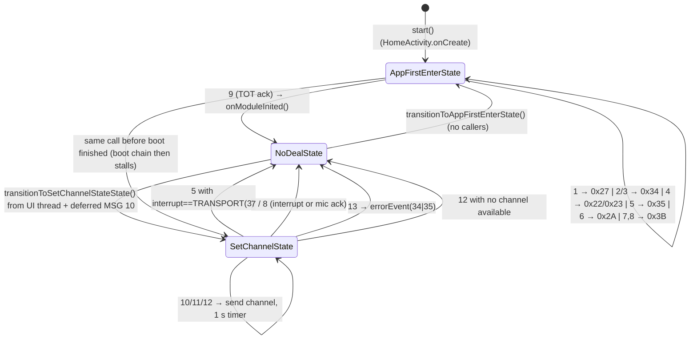
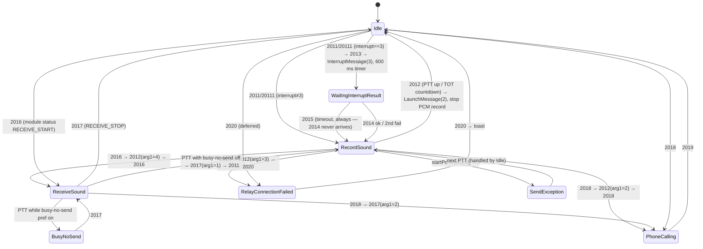

# 03 — OEM State Machines, `DmrManager`, and the Radio Control Flow

**Scope.** How the OEM PriInterPhone app (`com.pri.prizeinterphone`) drives the DMR MCU: the two hierarchical state machines (`CmdStateMachine` for channel programming / boot, `TalkBackStateMachine` for PTT / RX), the `DmrManager` façade that owns the in-memory channel model and builds every outgoing command, the foreground service that opens the UART, and the threads all of this runs on. Packet encodings (`message/*`) and response decoders (`handler/*`) are covered in other chapters; here they appear only as the events that advance the machines.

**Summary of key findings.**

- `state/StateMachine.java` is the AOSP `com.android.internal.util.StateMachine` copied verbatim (same `SmHandler`, `-1`/`-2` control messages, deferred-message replay). Each machine runs on its own `HandlerThread`.
- `CmdStateMachine` (singleton, thread `"CmdState"`) has only three states. It runs the boot handshake (`0xAA` init → version → set channel → interrupt/mic → TOT) and every channel programming transaction (`SetChannelState`, 1 s no-reply timer, one retry on NACK, one retry on silence, then `errorEvent`). Replies are **dropped** unless the machine is in `AppFirstEnterState` or `SetChannelState`.
- `transitionToSetChannelStateState()` is called from the **UI thread** and works by a "send + defer the same message" trick; the transition is only realised when the next message is pumped on the SM thread. That is the race source.
- `TalkBackStateMachine` (one per `InterPhoneTalkBackFragment`, thread `"TalkBack"`) has 8 states in a 3-level hierarchy. PTT start is debounced 200 ms; TX = `LaunchMessage(launch=1)` + PCM record; RX is driven by `MODULE_PRINT_STATUS_INFO` (0x36) status bytes. The "interrupt result" path (`MSG_INTERRUPT_GET_RESULT`) is dead code: nothing ever calls `DmrManager.notifyInterruptReceive`.
- `DmrManager` holds the cached `List<ChannelData> channels`; "current channel" = the first entry with `active==1`. `localId` (the radio's own DMR ID) lives on `DmrManager`, is loaded from prefs, and is copied into `DigitalMessage.localId` at build time.
- Volume, squelch-only, listen/monitor, encryption, RSSI, audio-receive-info, power-save, polite-policy and mix-check **builders and handlers exist but the OEM app never sends them**; their handlers are empty. Squelch/encryption/relay are only pushed as fields of the full Analog/Digital channel packet.
- No `com.action.broadcast.TALK_RECEIVING_UPDATE` broadcast exists in the OEM tree. UI is updated by direct fragment method calls from the SM thread (wrapped in `runOnUiThread`) and by `DmrManager` listener interfaces.
- Incoming packets are handled on a **2–4 thread pool** (`serial-port-dispatch-t`), so two consecutive replies can be processed concurrently/out of order (inferred from pool config).

## Source files

| File | Lines | Role |
|---|---|---|
| `app/src/main/java/com/pri/prizeinterphone/state/StateMachine.java` | 1170 | AOSP hierarchical state machine (copied) |
| `app/src/main/java/com/pri/prizeinterphone/state/State.java`, `IState.java` | 24 / 16 | Base state (`enter/exit/processMessage/getName`) |
| `app/src/main/java/com/pri/prizeinterphone/state/CmdStateMachine.java` | 385 | Boot + channel-programming machine (singleton) |
| `app/src/main/java/com/pri/prizeinterphone/state/TalkBackStateMachine.java` | 603 | PTT / RX / phone-call machine (per fragment) |
| `app/src/main/java/com/pri/prizeinterphone/manager/DmrManager.java` | 1078 | Singleton façade: channel model, command builders, listener fan-out, DB helpers |
| `app/src/main/java/com/pri/prizeinterphone/manager/{ChannelListener,ContactLisenter,InterruptResultListener,LaunchListener,MessageLisenter}.java` | 5–17 | Listener interfaces |
| `app/src/main/java/com/pri/prizeinterphone/InterPhoneService.java` | 124 | Foreground service: opens UART, wake lock, firmware-update Messenger |
| `app/src/main/java/com/pri/prizeinterphone/PrizeInterPhoneApp.java` | 42 | Application: creates `DmrManager`, starts service |
| `app/src/main/java/com/pri/prizeinterphone/AppObserver.java` | 72 | Process-lifecycle observer; remote-kill handling |
| `app/src/main/java/com/pri/prizeinterphone/talkbak/{Talkbak,BaseTalkbak,SendTalkbak}.java` | 9 / 39 / 30 | Orphaned duplicate of the message base for cmd 0x26 |
| `app/src/main/java/com/pri/prizeinterphone/InterPhoneHomeActivity.java` | 566 | Boot orchestration, `InitializedFeedBack` |
| `app/src/main/java/com/pri/prizeinterphone/fragment/InterPhoneTalkBackFragment.java` | 739 | Owner of `TalkBackStateMachine`; PTT / channel ± UI |
| `app/src/main/java/com/pri/prizeinterphone/fragment/InterPhoneChannelFragment.java` | 469 | Channel list "use" path |
| `app/src/main/java/com/pri/prizeinterphone/serial/MessageDispatcher.java`, `codec/AsyncPacket{Reader,Writer}.java`, `Util/ExecutorManager.java` | — | Threading of RX/TX packets (cited for section 8) |

Line numbers below refer to the decompiled sources at the repo HEAD (`14e484a2`). Three of these files carry post-decompile edits by the repo owner (see §10, "Modified OEM sources").

---

## 1. `StateMachine.java` — the AOSP hierarchical state machine

It is `com.android.internal.util.StateMachine` (and its inner `SmHandler`, `LogRec`, `LogRecords`) re-packaged as `com.pri.prizeinterphone.state.StateMachine`, byte-for-byte in behaviour (`StateMachine.java:20-1170`). The only decompilation damage is the `removeState` predicate lambda, stubbed by JADX to `return false` (`StateMachine.java:599-605`); `removeState` is never called by the app.

Mechanics that matter for the two concrete machines:

| Mechanism | Where | Behaviour |
|---|---|---|
| Thread | `StateMachine(String)` `:708-713` | Creates and starts a `HandlerThread` named after the machine; `SmHandler` is bound to its `Looper`. Both concrete machines use this ctor (`CmdStateMachine.java:77`, `TalkBackStateMachine.java:78`). |
| Control messages | `:23-24`, `:301-308` | `what=-2` (`SM_INIT_CMD`) with `obj==mSmHandlerObj` completes construction and calls `enter()` down the initial stack; `what=-1` (`SM_QUIT_CMD`) quits. Any message before `start()` throws `RuntimeException` (`:307`). |
| `start()` | `:1093-1099` → `completeConstruction()` `:384-409` | Computes max depth, builds the initial state stack, posts `-2` **at the front of the queue**. |
| `addState(child, parent)` | `:559-594` | Builds the parent/child `StateInfo` tree. Parent chain = hierarchy. |
| `processMsg` | `:411-438` | Calls `processMessage` on the current (leaf) state; if it returns `NOT_HANDLED` (`false`) the message bubbles to the parent, and so on; at the root `unhandledMessage()` is called (`:426`). |
| `transitionTo(IState)` | `:642-652` | **Only records** `mDestState`. If a transition is already in progress it logs `Log.wtf` but still overwrites. The transition is executed by `performTransitions()` (`:320-363`) **after** the current `processMessage` returns — i.e. only when a message is being handled on the SM thread. |
| Transition execution | `:336-354` | Exits states up to the common ancestor (`invokeExitMethods` `:440-458`), enters the new branch (`invokeEnterMethods` `:460-480`), then `moveDeferredMessageAtFrontOfQueue()` (`:482-491`). Loops if `enter()` itself calls `transitionTo`. |
| `deferMessage(Message)` | `:655-663` | Copies the message into `mDeferredMessages`; replayed at the front of the queue on the next transition (in original order, `:483-489`). |
| `sendMessage*/sendMessageDelayed*/removeMessages` | `:866-1016` | Thin wrappers over `Handler`; all silently no-op once `mSmHandler==null` (after quit). |
| `quit()` / `quitNow()` | `:666-679`, `:1061-1075` | Posts `-1` (back / front); `cleanupAfterQuitting` (`:365-381`) quits the looper and nulls everything. |
| `getCurrentState()` | `:747-753` | Reads `mStateStack[top]` with no synchronisation — used cross-thread by the UI (§8). |
| `HaltingState` / `QuittingState` | `:258-279` | Present but the app never calls `transitionToHaltingState()`; `TalkBackStateMachine.onHalting` `notifyAll()`s (`TalkBackStateMachine.java:106-110`) — unused. |

`State.getName()` strips the outer class name after `$` (`State.java:20-22`), so log lines read `enter SetChannelState`, etc.

---

## 2. `CmdStateMachine`

Singleton (`instance` is `volatile`, double-checked; `CmdStateMachine.java:28, 92-101`), thread name `"CmdState"` (`:96`). Constructed lazily by the first `getInstance()` — normally `InterPhoneHomeActivity.onCreate` (`InterPhoneHomeActivity.java:162-163`). Three flat states, no hierarchy (`:83-86`); initial = `AppFirstEnterState` (`:86`). `mDealStateList = {AppFirstEnterState, SetChannelState}` (`:87-89`) gates which states accept module replies.

### 2.1 Message constants

| `what` | Name (`:13-26`) | Produced by | Meaning |
|---|---|---|---|
| 0 | `MSG_NOTHING_DO` | `getCmdResultFromModule` default branch `:181` | Any other cmd; ignored by all states |
| 1 | `MSG_QUERY_WHETHER_INITIALIZED` | `InterPhoneHomeActivity.mToastInitTry` at +6 s (`InterPhoneHomeActivity.java:108-114, 166`) | Ask module whether it booted |
| 2 | `MSG_INITIALIZED_FEEDBACK_FROM_MODEL_ACTIVE` | cmd `0xAA` (`MODULE_INIT_CMD`, unsolicited "I booted") `:126-127` | Module announced boot |
| 3 | `MSG_INITIALIZED_FEEDBACK_FROM_MODEL` | cmd `0x27` (`QUERY_INIT_STATUS_CMD`) with `sr==0` `:128-131` | Reply to msg 1 |
| 4 | `MSG_VERSION_FEEDBACK_FROM_MODEL` | cmd `0x34` (`QUERY_VERSION_CMD`) `sr==0` `:132-135` | Version received |
| 5 | `MSG_SET_DIGITAL_STATUS_FEEDBACK_FROM_MODEL` | cmd `0x22` (`SET_DIGITAL_INFO_CMD`) `sr==0` `:136-142` | Digital channel accepted |
| 6 | `MSG_SET_ANALOG_STATUS_FEEDBACK_FROM_MODEL` | cmd `0x23` (`SET_ANALOG_INFO_CMD`) `sr==0` `:151-157` | Analog channel accepted |
| 7 | `MSG_TRANSMISSION_INTERRUPT_STATUS_FEEDBACK_FROM_MODEL` | cmd `0x35` (`INTERRUPT_TRANSMIT_CMD`) `sr==0` `:166-170` | Interrupt mode accepted |
| 8 | `MSG_SET_MIC_GAIN_STATUS_FEEDBACK_FROM_MODEL` | cmd `0x2A` (`SET_GAIN_MIC_CMD`) `sr==0` `:171-175` | Mic gain accepted |
| 9 | `MSG_SET_TOT_STATUS_FEEDBACK_FROM_MODEL` | cmd `0x3B` (`SET_TOTO_CMD`) `sr==0` `:176-179` | TOT accepted → boot done |
| 10 | `MSG_SET_CHANNEL` | `DmrManager.syncChannelInfo*` (`DmrManager.java:203-204, 213-214`) | Program `tmpChannelData` (or current channel) |
| 11 | `MSG_SET_CHANNEL_AGAIN_FOR_FAIL` | cmd 0x22/0x23 with `sr!=0`, first time `:143-146, 158-161` | Module NACKed; resend once |
| 12 | `MSG_SET_CHANNEL_AGAIN_FOR_NO_REPLY` | `sendMessageDelayed(12, 1000)` after msg 10/11 `:322, 326` | No reply in 1 s; resend |
| 13 | `MSG_SET_CHANNEL_ERROR` (`arg1` = cmd 34/35) | second NACK `:149, 164`; or `sendMessageDelayed(13, cmd, 1000)` after msg 12/5/6 `:299, 307, 335, 343` | Give up → `errorEvent(cmd)` |

### 2.2 Reply ingestion — `getCmdResultFromModule(BaseMessage)` (`:115-184`)

Called on a **dispatch-pool thread** by eight handlers (`handler/{Init,QueryInit,Version,Digital,Analog,Interrupt,Mic,Tot}MessageHandler.java`). Guards, in order: null message; `!isStart()`; **current state not in `mDealStateList` → dropped with log "no On DealStateList, not deal"** (`:120-121`). Consequences:

- In `NoDealState` (normal running) every ack — including 0x22/0x23 acks for packets a hooking module sends directly — is discarded and **`DmrManager.dealEvent` is not called** for them (`dealEvent` for 34/35 is only invoked from inside this method, `:142, 157`).
- Interrupt acks (0x35) are likewise discarded outside a channel transaction, which is why `TalkBackStateMachine`'s interrupt-result path never fires (§3.4).

For cmd 34/35 the method also does the retry bookkeeping itself: `removeMessages(12); removeMessages(13)` (`:137-138, 152-153`), then on `sr==0` resets `setChannelAgainAlreadyForFail`, posts msg 5/6 **and synchronously calls `DmrManager.dealEvent(cmd, msg)`** (`:140-142, 155-157`) — so UI listeners run *before* the state machine has processed msg 5/6. On `sr!=0` it posts 11 once, then 13.

### 2.3 States

| State | `enter`/`exit` | `processMessage` |
|---|---|---|
| `NoDealState` `:187-206` | log only | Swallows every message (`return true`, `:203-204`). Idle/running state. |
| `AppFirstEnterState` `:209-261` | log only | Boot chain: **1**→`sendQueryInitializedCmdToMdl()` (cmd 0x27) `:227-229`; **2**→`InitializedFeedBack.initializedNotify()` then `sendQueryVersionCmdToMdl()` (0x34) `:230-235`; **3**→version query `:236-238`; **4**→`sendSetChannelCmdToMdl()` (current channel, 0x22/0x23) `:239-241`; **5**→`sendTransmissionInterruptCmdToMdl()` (0x35, current channel's `interrupt`) `:242-244`; **6**→`sendSetMicGainCmdToMdl()` (0x2A) `:245-247`; **7, 8**→`sendSetTotCmdToMdl()` (0x3B, `tot=0`) `:248-250`; **9**→`DmrManager.onModuleInited()` then `transitionTo(NoDealState)` `:251-256`. Everything else (incl. 10–13) swallowed `:257-258`. Note the digital path is 4→5→7→9 and the analog path 4→6→8→9: at boot, digital channels never get the standalone mic-gain command (mic gain is inside `DigitalMessage` anyway) and analog channels never get the interrupt command. |
| `SetChannelState` `:264-354` | log only | Holds `tmpChannelData` (`:265`, a clone set via `setChannelData`, `:368-380`; `null` ⇒ use `DmrManager.getCurrentChannel()` at send time). **10**: reset fail flag, `sendSetChannelCmdToMdl(tmp)`, arm 1 s msg 12 `:318-323`. **11**: resend, re-arm 12 `:324-327`. **12**: resend; arm 1 s msg 13 with `arg1` = 35 if `type!=0` else 34; if `tmp==null` and `getCurrentChannel()==null` → `NoDealState` `:328-344`. **5** (digital ack): if channel `interrupt==3` (`TRANSPORT`) → `NoDealState` immediately; else arm 1 s msg 13 and send `InterruptMessage(channel.interrupt)` `:288-301`. **6** (analog ack): arm 1 s msg 13, `sendSetMicGainCmdToMdl()` `:302-309`. **7, 8** (interrupt / mic ack, which also `removeMessages(13)` in `:168, 173`) → `NoDealState` `:310-314`. **13**: `DmrManager.errorEvent((byte)arg1)` → `NoDealState` `:345-351`. **9** and others swallowed. |

Note the asymmetry: at boot (`AppFirstEnterState`) `:242-244` uses the *current channel's* interrupt setting, whereas `SetChannelState` `:294-301` uses `tmpChannelData.interrupt` and short-circuits when it is `TRANSPORT` (3) — so a TRANSPORT channel change is acked one packet earlier.

### 2.4 Transition graph



| From | Event | Action | To |
|---|---|---|---|
| AppFirstEnter | 1 | `QueryInitMessage` (0x27) | AppFirstEnter |
| AppFirstEnter | 2 | `initializedNotify()`; `VersionMessage` (0x34) | AppFirstEnter |
| AppFirstEnter | 3 | `VersionMessage` | AppFirstEnter |
| AppFirstEnter | 4 | `sendSetChannelCmdToMdl()` — current channel | AppFirstEnter |
| AppFirstEnter | 5 | `InterruptMessage(currentChannel.interrupt)` | AppFirstEnter |
| AppFirstEnter | 6 | `MicMessage(pref mic gain)` | AppFirstEnter |
| AppFirstEnter | 7, 8 | `TotMessage(tot=0)` | AppFirstEnter |
| AppFirstEnter | 9 | `DmrManager.onModuleInited()` | **NoDeal** |
| NoDeal | any | nothing | NoDeal |
| (any) | external `transitionToSetChannelStateState()` | recorded; realised on next pumped message | SetChannel |
| SetChannel | 10 | clear fail flag; send channel; arm 12 @1 s | SetChannel |
| SetChannel | 11 | send channel; arm 12 @1 s | SetChannel |
| SetChannel | 12 | send channel; arm 13 @1 s (or NoDeal if no channel) | SetChannel |
| SetChannel | 5 | `interrupt==3` → NoDeal; else arm 13 @1 s, send `InterruptMessage` | SetChannel / NoDeal |
| SetChannel | 6 | arm 13 @1 s; send `MicMessage` | SetChannel |
| SetChannel | 7, 8 | — | **NoDeal** |
| SetChannel | 13 | `errorEvent(arg1)` | **NoDeal** |

**Timeouts / retries.** Worst case for a dead module: msg 10 @0 s → msg 12 @1 s (resend) → msg 13 @2 s → `errorEvent`. For a NACKing module: 10 → NACK → 11 (resend) → NACK → 13 (immediately). After the channel ack, a missing interrupt/mic ack costs another 1 s before msg 13 → `errorEvent` — even though the channel itself *was* accepted (UI shows "operate fail" for a channel the radio already switched to; the DB `active` flags were nevertheless flipped by the `dealEvent` listener, §7b).

**What `transitionToSetChannelStateState()` actually does** (`:360-362` → `StateMachine.transitionTo` `:755-757` → `SmHandler.transitionTo` `:642-652`). Every caller is `DmrManager.syncChannelInfo()` / `syncChannelInfoWithData()` (`DmrManager.java:197-215`), which run on the **caller's thread (UI)** and do, in order: `startCmdMachine()` (no-op if started), `transitionToSetChannelStateState()` (writes `mDestState` from the UI thread, unsynchronised), `setChannelData(clone|null)`, `deferMessage(10)`, `sendMessage(10)`. On the SM thread the **sent** msg 10 is processed by the *current* state (NoDeal swallows it), then `performTransitions` sees `mDestState` and exits/enters `SetChannelState`, then the **deferred** copy of msg 10 is replayed at the front of the queue and finally processed in `SetChannelState`. The pair "send + defer the same message" exists purely to pump the machine once so the externally-set destination is realised. Failure modes:

1. **Already in `SetChannelState`** (a transaction in flight): the sent msg 10 is processed *in* `SetChannelState` → immediate send of the new `tmpChannelData` (overwriting the previous clone), then the self-transition exits/re-enters `SetChannelState` (`setupTempStateStackWithStatesToEnter` walks to the null parent so the state is exited and re-entered) and the deferred msg 10 sends **again**; old 1 s timers (msg 12 from the first transaction) are *not* removed on msg 10, so up to three channel packets and stray retry timers interleave. The OEM UI guards against this by refusing when `getCurrentState()==getSetChannelState()` (`InterPhoneTalkBackFragment.java:289`, `InterPhoneChannelFragment.java:343`, `InterPhoneChannelActivity.java:786`), but `DmrManager.updateChannel/setLocalId/resetData` and `FragmentLocalDeviceAreaActivity` (`:352-354`) do not.
2. **Collision with an SM-thread transition**: if the SM thread is inside `processMessage` for msg 13/7/8 (which call `transitionTo(NoDealState)`) when the UI thread writes `mDestState=SetChannelState`, whichever write lands last wins (`Log.wtf` at `StateMachine.java:645` if the SM side is mid-transition). If NoDeal wins, the deferred msg 10 is replayed into `NoDealState` and **the channel change is silently lost**: no packet, no `dealEvent`, no `errorEvent`; the UI dialog just times out (3 s / 5 s / `ACTIVITY_CONSIDERED_RESUME`) with the DB unchanged.
3. **Before boot completes** (`AppFirstEnterState`): the sent msg 10 is swallowed, the machine jumps to `SetChannelState`, the channel is programmed, but the boot chain's later msgs (4/9) are then swallowed by `SetChannelState`, so `onModuleInited()` never fires and `InterPhoneHomeActivity.updateModuleInit` never builds the fragments. Only mod code can trigger this (OEM fragments don't exist yet).
4. `setChannelData()` and `tmpChannelData` reads (`:290, 303, 321, 325, 330`) are unsynchronised across threads (benign in practice: a reference swap).

### 2.5 Other API

| Method | Notes |
|---|---|
| `startCmdMachine()` `:103-108` | `start()` once. Called by Home `onCreate` and every `syncChannelInfo*`. |
| `quitCmdMachine()` `:110-113` | `quit()` and `instance=null` — `InterPhoneHomeActivity.onDestroy` (`:227`). The next `getInstance()` builds a fresh machine in `AppFirstEnterState`; a later `syncChannelInfo()` will `start()` it and jump straight to `SetChannelState` (works, no boot chain). |
| `setInitializedFeedBack(cb)` `:382-384` | Home activity registers itself (`:162`) to cancel the 6 s query on msg 2 (`InterPhoneHomeActivity.java:418-420`). |
| `getSetChannelState()` `:364-366` | Used by the UI guards above. |
| `transitionToAppFirstEnterState()` `:356-358` | No callers. |
| `msg2Str(int)` `:41-74` | Log helper. |

---

## 3. `TalkBackStateMachine`

Created per `InterPhoneTalkBackFragment` via `makePerson(fragment)` (`TalkBackStateMachine.java:99-103`, called at `InterPhoneTalkBackFragment.java:175`), thread name `"TalkBack"`; `quit()` from `onDestroy` after posting `2012` (`InterPhoneTalkBackFragment.java:456-460`). It holds a hard reference to the fragment and calls its methods directly from the SM thread.

### 3.1 Hierarchy (`:88-96`)

```
IdleState (root, initial)
├── SendExceptionState            (returns NOT_HANDLED for everything → behaves as Idle)
│   └── RecordSoundState          (TX)
├── BusyNoSendState
│   └── ReceiveSoundState         (RX)
└── WaitIngInterruptResultState
RelayConnectionFailedState (root)
PhoneCallingState          (root)
```

### 3.2 Message constants (`:9-26`) and who sends them

| `what` | Name | Sender (`InterPhoneTalkBackFragment.java`) |
|---|---|---|
| 2011 | `MSG_RECORD_SOUND_START` | internal only (re-posted after transitions; `ReceiveSoundState` "record again") |
| 20111 | `MSG_RECORD_SOUND_START_NEED_DELAY` | PTT down: touch `ACTION_DOWN` `:400-407` and broadcast `com.interphone.ptt.down` `:498-505` — `removeMessages(20111)` then `sendMessageDelayed(20111, 200)` (200 ms debounce) |
| 20112 | `MSG_RECORD_SOUND_START_REFRESH_UI` | internal, 500 ms after TX start on the delayed path `:336` |
| 2012 | `MSG_RECORD_SOUND_END` | PTT up: `ACTION_UP/CANCEL` `:408-413`, `com.interphone.ptt.up` `:506-512`, TX time-limit countdown `onFinish` `:695-697`, fragment `onDestroy` `:458` |
| 2013 | `MSG_INTERRUPT_START` | internal (Idle when channel `interrupt==3`) |
| 2014 | `MSG_INTERRUPT_GET_RESULT` (`arg1`=result) | `onReceiveInterrupt` `:485-488` ← `DmrManager.notifyInterruptReceive` — **never called anywhere** (dead) |
| 2015 | `MSG_INTERRUPT_GET_NO_RESULT` | internal 600 ms timer |
| 2016 | `MSG_RECEIVE_SOUND_START` | `LaunchListener.onReceiveStart` `:552-557` ← module status 1 |
| 2017 | `MSG_RECEIVE_SOUND_END` | `onReceiveStop` `:560-565` ← module status 2 |
| 2018 | `MSG_PHONE_CALLING` | `PhoneStateListener` ringing/offhook `:100-103` |
| 2019 | `MSG_PHONE_END` | `PhoneStateListener` idle `:104-106` |
| 2020 | `MSG_RELAY_CONNECTION_FAILED` | `onSendTimeout` `:568-573` ← module status 6 `RELAY_ACTIVITY_TIME_OUT` |
| 2021 | `MSG_CHANNEL_CHANGE` (`obj`=Boolean up) | channel −/+ buttons `:379-393` |
| 2022 | `MSG_RECORD_SOUND_START_FEEDBACK_FROM_MODULE` | **no sender** (`LaunchListener.onSendStart` is empty `:122-123`) |
| 2023 | `MSG_RECORD_SOUND_END_FEEDBACK_FROM_MODULE` | **no sender** (`onSendStop` empty `:126-127`) |
| `STATE_IDLE/RECORD/RECEIVE` 0/1/2 | `:24-26` | unused constants |

`RecordSoundState.NEED_SEND_RELAY_CONNECTION_FAILED=3`, `NEED_SEND_RECEIVE_SOUND_START=4` (`:210-211`) and `PhoneCallingState.NEED_SEND_PHONE_CALLING_AGAIN=2` (`:426`) are the `arg1` values carried on 2012/2017 to chain a follow-up transition.

### 3.3 States

| State | `processMessage` |
|---|---|
| `IdleState` `:113-206` (`isInterruptSendAgain` flag `:114`) | **2011 / 20111**: if `fragment.isInterruptTransport()` (channel `interrupt==3`) → `sendMessage(2013)`; else `transitionTo(RecordSoundState)` and re-post the same message `:141-149, 171-179`. **2013**: `transitionTo(WaitIngInterruptResultState)` (if not already), `fragment.sendInterrupt()` (= `InterruptMessage(3)`), arm 600 ms **2015**; if `isInterruptSendAgain` also re-arm 2013 @500 ms `:150-165`. **2016**: → `ReceiveSoundState`, re-post 2016 `:166-170`. **2018**: → `PhoneCallingState`, re-post `:182-187`. **2019**: → Idle `:188-191`. **2020**: → `RelayConnectionFailedState`, **defer** 2020 `:192-197`. **2021**: `fragment.updateChannelId(up)` `:198-200`. Others swallowed. |
| `RecordSoundState` `:209-357` | **2011** `:338-354` / **20111** `:320-337`: if `fragment.isSendStatus()` ignore; else `fragment.launchCommand()` (`LaunchMessage launch=1`, cmd 0x26), `createRecordFile()`, `startPcmRecord()`; if `<0` → toast `interphone_send_timeout_toast`, bg 0, `stopPcmRecord()`, → `SendExceptionState`; else `setSendStatus(1)` and (2011) `setStartRecordPrepare()`+`showLimitRecordTime()` immediately, (20111) `setTalkbackRecordBg(1)` and arm **20112** @500 ms. **20112**: `setStartRecordPrepare()` (bg, audio focus, start tone) + `showLimitRecordTime()` (countdown `pref_person_limit_send_time`, default 30 s → 2012) `:263-265`. **2012** `:231-255`: `removeMessages(20112)`; if `!isSendStatus()` ignore; `launchEnd()` (`launch=2`), `stopPcmRecord()`, `setStopRecordPrepare()` (bg 0, end tone, save recording, cancel countdown, abandon focus), `setSendStatus(0)`, → Idle; then `arg1` 2 → post 2018, 3 → `RelayConnectionFailedState` + post 2020, 4 → `ReceiveSoundState` + post 2016. **2016** → post `2012(arg1=4)` `:256-258` (RX pre-empts TX). **2018** → post `2012(arg1=2)` `:259-261`. **2020** → post `2012(arg1=3)` `:268-271`. **2021** → toast `interphone_talk_send_status_toast` `:272-273`. **2022/2023**: module-ack variants of start/stop `:275-317` — unreachable. Always returns `true` (`:355`). |
| `ReceiveSoundState` `:360-422` | **2016**: `setStartReceivePrepare()` (audio focus, bg 2) + `startPcmRead()` `:383-386`. **2017**: `stopPcmRead()`, `setStopReceivePrepare()` (save RX recording if pref, abandon focus, bg 0), → Idle; `arg1` 1 → post 2011 ("record again"), 2 → post 2018 `:387-405`. **2018** → post `2017(arg1=2)` `:406-409`. **2011/20111** (PTT during RX): if `fragment.getBusyNoSend()` (pref `pref_person_busy_no_send`, default true) → `BusyNoSendState` + post 2011; else post `2017(arg1=1)` (stop RX then record) `:411-419`. Always `true`. |
| `BusyNoSendState` `:542-574` | **2011/20111** → toast `interphone_recevice_no_send_toast`. **2017** → `ReceiveSoundState` + re-post 2017 (so RX is torn down normally). Others swallowed. |
| `WaitIngInterruptResultState` `:459-517` | **2013** → `NOT_HANDLED` (bubbles to Idle, which sends the interrupt) `:477-478`. **2014**: `removeMessages(2015)`; `arg1==0` → clear flag, `removeMessages(2013)`, → `RecordSoundState` + 2011; else first failure → set flag, post 2013 (retry); second → clear flag, → Record + 2011 anyway `:479-506`. **2015** (600 ms, no result) → Record + 2011 `:507-513`. Everything else (incl. 2016/2017/2012) swallowed while waiting. |
| `SendExceptionState` `:520-539` | Returns `false` for everything → parent Idle handles. It is a named Idle used after `startPcmRecord()` failure. |
| `RelayConnectionFailedState` `:577-602` | **2020** → toast `relay_connection_failed`, → Idle. Everything else swallowed (but 2020 is always sent/deferred together with the transition, so the state is transient). |
| `PhoneCallingState` `:425-456` | **2018** → toast `interphone_call_state_toast`; **2019** → Idle; everything else swallowed — during a phone call RX starts (2016) and PTT are ignored. |

### 3.4 Transition graph



**Audio start/stop triggers.** TX: `fragment.startPcmRecord()` → `PrizePcmManager.startPcmRecord()` (`InterPhoneTalkBackFragment.java:606-608`) right after `launchCommand()`; stop via `stopPcmRecord()` on 2012. RX: `fragment.startPcmRead()` → `PCMReceiveManager.startPcmRead()` (`:618-620`) on 2016; `stopPcmRead()` on 2017. Note also `InterPhoneHomeActivity` starts PCM read during boot and stops it on module init (`InterPhoneHomeActivity.java:164, 393`) — audio chapter.

**UI notification.** No broadcasts are sent by the OEM app (grep for `sendBroadcast` / `com.action.broadcast` finds nothing; the only broadcasts are the *received* `com.interphone.ptt.down/up`, `:50-51, 138-142`). The machine calls fragment methods on the SM thread; those touching views use `runOnUiThread` (`setTalkbackRecordBg` `:584-593`, `showLimitRecordTime` `:671-680`, `cancelLimitRecordTime` `:704-713`, `updateChannelId` `:291-298`). `showToast` (`:472-482`) runs directly on the SM thread (legal: `HandlerThread` has a `Looper`). TX state is also mirrored into SharedPreferences `pref_person_send_status` via `setSendStatus` (`DmrManager.java:938-944`) and read by every other screen's `isTalkSend()` guard (e.g. `InterPhoneChannelFragment.java:459-466`).

---

## 4. `DmrManager`

Plain lazy singleton, **not synchronised** (`DmrManager.java:63, 124-129`); first `getInstance()` is `PrizeInterPhoneApp.onCreate` on the main thread (`PrizeInterPhoneApp.java:20`), so in practice it is created before any other thread exists. `init()` (`:131-137`) constructs the SMS/contact/conversation/record DB helpers. Channel DB helpers (`mInitChannelDataDB`) are created later by `initChannelData()` — anything calling `getChannelList()`/`getCurrentChannel()` before the version reply arrives throws NPE (both fragments catch this, `InterPhoneTalkBackFragment.java:185-187`).

### 4.1 State (fields `:61-88`)

| Field | Purpose / caching notes |
|---|---|
| `List<ChannelData> channels` `:77` | **The in-memory channel list for the selected area.** Replaced (not mutated) by `updateChannelList()`/`updateModuleInit()` (`:218, 228`) and by the empty-list fallback in `getCurrentChannel()` (`:287-289`). Never refreshed by direct DB writes — a mod writing SQLite directly leaves this stale until something calls `updateChannelList()`. |
| `int mChannelIndex` `:85` | Index of the active channel as of the **last** `getCurrentChannel()` call (`:283`). |
| `int localId = 1` `:78` | The radio's own DMR ID. Loaded from pref `pref_person_device_id` in `initChannelData()` (`:163`), written by `setLocalId()` (`:301-307`), reset to 1 by `resetData()` (`:900-901`). Not on `ChannelData`. Copied into `DigitalMessage.localId` at build time (`:331`). |
| `chatId`, `chatType` `:79-80` | Contact selection for SMS UI (prefs). |
| `background = true` `:81` | Never written; makes `onSmsReceived` always play the ringtone (`:469-471`). |
| `isLauncher` `:82` | Set by module status SEND_START/STOP/TIMEOUT (`:430, 437, 444`); read by `isLauncher()` `:739`. |
| `mLastMsg` `:86` | The SMS awaiting SEND_SUCCESS/FAIL (`:495, 500-511`) — NPE if status 8/9 arrives with no pending send. |
| `currentChannel`, `currentContact`, `mHandler`, `mUpdateChannelDataNotificationListener` `:64-65, 71, 84` | Unused or write-only. `setUpdateChannelDataNotificationListener` (`:918-920`) has no callers → the service notification text is never updated (`InterPhoneService.MSG_UPDATE_NOTIFICATION` has no sender). |
| Listener lists `:72-76, 87-88` | Plain `ArrayList`s except `mMessageListenerLists` (`ArrayMap<Byte, CopyOnWriteArrayList>` with `synchronized` accessors `:830-883`). |
| `static moduleVersion`, `frqcBandName` `:61-62` | Parsed from the firmware version string on each `isSupport*FrequencyBand()` call (`:946-979`). |

### 4.2 Public API

Grouped; signatures exact. "Sends" = builds a `message/*` object and calls `.send()` (→ `SerialManager.send` → write thread).

**Lifecycle / boot**

| Method | Behaviour |
|---|---|
| `boolean init()` `:131-137` | DB helpers. |
| `void initSerialPort()` / `releaseSerialPort()` `:177-183` | `SerialManager.init()/release()`. Called by `InterPhoneService.onCreate` and `restartApp`. |
| `void onVersionReceived(VersionMessage)` `:885-893` | Persists version to pref `PREF_PERSON_DEVICE_DMR_VERSION`; `Constants.initDefChannelAreas()`; `initChannelData()`. Called by `VersionMessageHandler` (`handler/VersionMessageHandler.java:16-17`) **before** it feeds `CmdStateMachine` — so the channel cache exists by the time msg 4 sends the channel. |
| `void initChannelData()` `:162-171` | Loads `localId` from pref; creates `UtilInitChannelData`; seeds the DB if empty; `updateChannelList()`. |
| `void onModuleInited()` `:185-187` → `updateModuleInit()` `:227-235` | Reloads `channels`, calls `UpdateListener.updateModuleInit()` on all registered listeners (Home activity builds fragments there). |
| `void queryInitStatus()` `:727` (`InitMessage`, 0xAA), `setSmsProtocol()` `:731` (0x3A) | No callers. |
| `void restartApp()` `:1070-1077` | Stops service, releases YModem, pulls the module power GPIO low, releases serial, schedules relaunch via `AlarmManager` in 1 s, `System.exit(0)`. Used by firmware update. |

**Channel model**

| Method | Behaviour |
|---|---|
| `List<ChannelData> getChannelList()` `:237` / `getChannelList(String area)` `:241` | Fresh DB query (not the cache). |
| `UtilChannelData getCurrentDbHelper()` `:245` / `getDefaultDbHelper()` `:249` | DB for the selected area / default area. |
| `ChannelData getCurrentChannel()` `:280-291` | First cached entry with `active==1`; else reloads if cache empty and returns index 0 (throws `IndexOutOfBounds` if still empty). Returns the **live cached object** — callers mutate it in place (`InterPhoneContactsFragment.java:228-233`). |
| `int getCurrentChannelIndex()` `:293` | See `mChannelIndex`. |
| `void updateChannelList()` `:217-225` | Reload cache; `UpdateListener.updateTalkBackChannelList()` fan-out (fragments post UI refresh). |
| `void updateChannel(ChannelData)` `:253-257` / `updateChannel(String area, ChannelData)` `:259-263` | DB update → `updateChannelList()` → `syncChannelInfo(channel)` (hardware **only if** `channel.active==1`, `:189-195`). |
| `void createChannel(String, ChannelData)` `:265`, `deleteChannel(ChannelData)` `:270`, `deleteChannel(String, ChannelData)` `:275` | DB + cache reload; no hardware. |
| `void syncChannelInfo()` `:197-205` | Program the **current channel** (as resolved on the SM thread at send time) via `CmdStateMachine` (§2.4). |
| `void syncChannelInfoWithData(ChannelData)` `:207-215` | Program the given channel (cloned into the machine). **This is the OEM hardware-write path**; it does not touch the DB or UI — that is done by whichever listener the caller registered for cmd 34/35. |
| `void syncChannelInfo(ChannelData)` `:189-195` | Guarded variant used by `updateChannel`. |
| `UtilInitChannelData getInitChannelDataDB()` `:173` | Raw access (used by area screens). |
| `int getLocalId()` `:297` / `void setLocalId(int)` `:301-307` | Pref write; if changed, `syncChannelInfo()` (full channel re-program with the new ID). |
| `int getChatId()/setChatId`, `getChatType()/setChatType` `:309-323` | SMS UI state. |
| `void resetData()` / `resetData(boolean)` `:895-916` | Resets prefs (device id 1, TX limit 30 s, tones, record, area, busy-no-send, mic gain), all DBs, then `updateChannelList()` + `syncChannelInfo()`. |

**Hardware command builders** (all fire-and-forget unless noted)

| Method | Packet | Notes |
|---|---|---|
| `private sendDigitalMessage(ChannelData)` `:329-367` | `DigitalMessage` (0x22) | Fields copied: `localId=getLocalId()`, `rxFreq`, `txFreq`, `power`, `contactType`, `txContact`, `cc`, `inboundSlot`, `outboundSlot`, `channelMode`, `encryptSw`, `encryptKey` (channel key bytes or 8 zero bytes via `getByteDefault()` `:384-390`), `groupList = channelData.groups` **only when `contactType==1`** (else the `DigitalMessage` default — `groupList[0]=1`, `message/DigitalMessage.java:41, 56`), `mic` from pref `PREF_PERSON_MiC_GAN_VALUE`, `relay`. Lines `:344-364` are repo-owner debug logging (tag `DMRModHooks_GroupDebug`), not OEM. |
| `private sendAnalogMessage(ChannelData)` `:369-382` | `AnalogMessage` (0x23) | `band`, `power`, `txFreq`, `rxFreq`, `sq`, `rxType`, `rxSubCode`, `txType`, `txSubCode`, `relay`. Squelch and relay for analog channels reach the radio **only** here. |
| `void sendSetChannelCmdToMdl()` `:792-801` | 0x22/0x23 | Uses `getCurrentChannel()` (live cached object). |
| `void sendSetChannelCmdToMdl(ChannelData)` `:803-814` | 0x22/0x23 | `null` → no-arg variant. `type==0` → digital else analog. |
| `void sendTransmissionInterruptCmdToMdl()` `:782-784` / `(int)` `:786-790` | `InterruptMessage` (0x35) | `ChannelInterrupt`: 1 OPEN, 2 OFF, 3 TRANSPORT (`ChannelData.java:60-64`). TalkBack sends `3` before TX on TRANSPORT channels. |
| `void sendSetMicGainCmdToMdl()` `:816-820` | `MicMessage` (0x2A) | Value from pref. Also called directly by settings (`FragmentLocalSettingsActivity.java:534`). |
| `void sendSetTotCmdToMdl()` `:776-780` | `TotMessage` (0x3B), `tot=0` | Boot only. |
| `void sendQueryVersionCmdToMdl()` `:768`, `sendQueryInitializedCmdToMdl()` `:772` | 0x34, 0x27 | Boot only. |
| `void launchCommand()` `:743-747` / `launchEnd()` `:762-766` | `LaunchMessage` (0x26) `launch=1` / `2` | PTT start/stop. Reply handler is empty (`handler/LaunchMessageHandler.java:7-8`). |
| `void relayCommand()` `:749-753` | `RelayMessage` (0x33 `SET_OFFLINE_MODE_CMD`) with **`getCurrentChannel().getRelay()`** | Called by the channel editor on save (`InterPhoneChannelActivity.java:663-669`) — sends the *currently active* channel's relay value, not the value being edited. Reply handler empty. |
| `void enhanceFunction(byte fun, int callNum)` `:755-760` | `EnhanceMessage` (0x28) | Remote kill (`fun=4`) / revive (`5`) of another radio (`FragmentLocalSettingsActivity.java:269-272`). Reply → `EnhanceMessageHandler` → `dealEvent(0x28)`. |
| `boolean sendSms(MessageData)` `:482-498` / `saveSms` `:476-480` | `SendSmsMessage` (0x2C) | `msgType` from current channel `contactType` (0→1 private, 1→3 group, 2→2 all); destination = current channel `txContact`. |
| `void onNewSmsNotify()` `:447-449` | `FetchSmsMessage` (0x2D) | Triggered by module status 5. |

Not present in `DmrManager` (and never sent by the OEM app anywhere — grep for `new VolumeMessage|SquelchMessage|MonitorMessage|EncryptMessage|SignalMessage|DigitalAudioMessage|PowerSaveMessage|PolicyMessage|MixCheckMessage` finds only the `message/` classes themselves and the `handler/*.decode(Packet)` constructors that wrap *incoming* packets): **volume** (0x2E), **squelch** (0x30), **listen/monitor** (0x2F), **encryption function** (0x29), **RSSI** (0x32), **digital audio receive info** (0x2B), power save (0x31), polite policy (0x37), mix check (0x38/0x39). Their handlers are registered in `MessageDispatcher` (`serial/MessageDispatcher.java:52-67`) but are empty. Speaker enable (`SET_SPK_EN_CMD` 0x3C, `protocol/Const.java:57`) has no message class and no handler at all. Speaker volume is therefore an Android-side concern (audio chapter), analog squelch is only the `sq` byte of `AnalogMessage`, and encryption is only `encryptSw/encryptKey` of `DigitalMessage`.

**Module status & listener fan-out** (all invoked on dispatch-pool threads)

| Method | Behaviour |
|---|---|
| `void onModuleStatusReceived(byte)` `:392-412` | From `ModuleStatusMessageHandler` (which first ACKs with a cmd 0x36 packet `body={1}`, `handler/ModuleStatusMessageHandler.java:19-31`). 1→`onReceiveStart`, 2→`onReceiveStop`, 3→`onSendStart` (+`isLauncher=true`), 4→`onSendStop`, 6→`onSendTimeout` (`RELAY_ACTIVITY_TIME_OUT`), 5→`onNewSmsNotify`, 8/9→SMS result, 7→`onChannelBusy()` (empty). 10–13 (mix-check) ignored. |
| `LaunchListener` fan-out `:414-445` | Iterates `launchListeners` (plain `ArrayList`). Only `InterPhoneTalkBackFragment` registers (`addLaunchListener`, no remove — leaks a fragment per re-creation). |
| `registerEventListener(byte cmd, MessageListener)` `:830-838`, `unregisterEventListener(Byte, MessageListener)` `:874-883`, `dealEvent(byte, BaseMessage)` `:840-855`, `errorEvent(byte)` `:857-872` | Per-command listener map. Producers: `CmdStateMachine.getCmdResultFromModule` for 34/35 success, `SetChannelState` msg 13 for errors, `EnhanceMessageHandler` (0x28), `TestBiteErrorRateMessageHandler` (0x3F). Consumers register for 34/35 around each channel change and unregister on the first event. |
| `registerUpdateListener/unregisterUpdateListener(UpdateListener)` `:822-828` | `updateModuleInit()` / `updateTalkBackChannelList()`. |
| `addInterruptListener/removeInterruptListener`, `notifyInterruptReceive(byte)` `:681-701` | **`notifyInterruptReceive` has no callers** — dead. |
| Contact / message listeners and DB pass-throughs `:147-160, 325, 451-675, 703-725` | SMS/contacts/records (`getAllRecordList/deleteRecordFile/addRecordDb`, `getCurrentContact()` `:325` = DB active contact, `onSmsReceived`, `sendSms`, `saveSms`, `deleteSms`, `getAllContacts`, `notify*`, `add/removeContactListener`, `addChannelListener`, `add/removeMessageListener`); not radio control. |
| `void setTestBitErrorRate(boolean)` / `boolean isTestBitErrorRate()` `:139-145` | Flag for the 0x3F bit-error-rate test screen; Home `onCreate` resets it to `false` (`InterPhoneHomeActivity.java:156`). |
| `boolean needSaveRecordFile()`, `playStartPromptTone()`, `playEndPromptTone()`, `getBusyNoSend()`, `setSendStatus(int)`, `isSendStatus()` `:922-944` | Pref reads used by the TalkBack machine. |
| Version helpers `:953-1068` | Band detection from version string (`split[2]` or `[1]`), firmware asset lookup (`DMR*.bin`). |
| `getLaunchTime()`=60, `setLaunchTime`, `onChannelBusy` `:111-119` | Stubs. |

### 4.3 Field caching that can produce stale hardware state

1. `channels` cache vs DB: `sendSetChannelCmdToMdl()` (no-arg, used by boot msg 4 and every `syncChannelInfo()` path) programs from the cache. Any DB edit not followed by `updateChannelList()` is not what the radio gets.
2. `localId` cache vs pref: `setLocalId` keeps them in sync; a direct pref write does not update `localId` until the next `initChannelData()` (i.e. next boot).
3. Mic gain and `encryptKey` are read fresh at build time (pref / channel object); `relayCommand()` reads the *old* current channel.
4. `getCurrentChannel()` reflects the **DB `active` flags as of the last cache reload** — during a channel change it still returns the previous channel until the 34/35 listener flips flags and calls `updateChannelList()` (§7b).
5. In-place mutation: `InterPhoneContactsFragment` mutates the cached `ChannelData` (`txContact`, `contactType`) before `updateChannel()`; `syncChannelInfo()` paths pass the cached object itself to `sendDigitalMessage`, so a hook that mutates `param.args[0]` there mutates the cache.

---

## 5. Other classes in `manager/`

Only listener interfaces besides the PCM managers:

| Interface | Methods | Implementors / producers |
|---|---|---|
| `LaunchListener` (`manager/LaunchListener.java`) | `onReceiveStart/Stop`, `onSendStart/Stop`, `onSendTimeout` | Impl: `InterPhoneTalkBackFragment` (`:121-127, 551-573`). Producer: `DmrManager.onModuleStatusReceived`. |
| `ChannelListener` (`ChannelListener.java`) | default no-op `onChannelAdded/Removed/Updated`, `onChannelSetResultCallBack(int, boolean)` | `addChannelListener` exists (`DmrManager.java:711`) but **nothing ever fires these**; `removeMessageListener(ChannelListener)` is a misnamed remover (`:715`). |
| `InterruptResultListener` | `onReceiveInterrupt(int)` | Impl: TalkBack fragment; producer dead (§4.2). |
| `ContactLisenter`, `MessageLisenter` | contact / SMS CRUD callbacks | UI fragments; producers in `DmrManager` `:633-675`. |

`talkbak/` (`Talkbak`, `BaseTalkbak`, `SendTalkbak`) is a second copy of the `message/` base classes for cmd 0x26 (`SendTalkbak` = `Packet(SET_LAUNCH_INFO_CMD)`, `dataInfo=1`, `talkbak/SendTalkbak.java:14-17`; `BaseTalkbak.send()` `:64-68` writes via `SerialManager.send` like `BaseMessage`). Nothing outside `handler/BaseTalkbakHandler` / `handler/SendTalkbakHandler` (neither is registered in `MessageDispatcher`) references it — dead code; the live PTT path is `LaunchMessage`.

---

## 6. `InterPhoneService`, `PrizeInterPhoneApp`, `AppObserver`

**`PrizeInterPhoneApp.onCreate`** (`PrizeInterPhoneApp.java:14-23`): caches app context, registers `AppObserver` with `ProcessLifecycleOwner`, `DmrManager.getInstance().init()` (`:20`), notification channel init, starts `InterPhoneService` (`startForegroundService` on O+, `:29-36`). ⚠️ The service start and the `startForegroundService` branch are **repo-owner edits** (`git diff 0b39daa7 HEAD`; the decompiled original had the call commented out and used `startService`). State machines are *not* created here.

**`InterPhoneService`** (`InterPhoneService.java`):

| Aspect | Detail |
|---|---|
| Manifest | `app/src/main/AndroidManifest.xml:41`: `exported="true"`, `persistent="true"`, `priority="1000"`, `foregroundServiceType="microphone"`. `android:persistent` on a `<service>` is honoured only for system apps and `android:priority` is not a `<service>` attribute (inferred: both are inert for a user-installed build). |
| `onCreate` `:56-67` | `startForeground(1, …)` with the running-notification (`foregroundServiceType MICROPHONE` branch is a repo-owner edit, `:104-112`), **`DmrManager.initSerialPort()`** (`:61`) → `SerialManager.init()` opens `/dev/ttyS0` @57600 (`serial/Serial.java:31`) and starts the reader thread, then acquires a `PARTIAL_WAKE_LOCK` (`newWakeLock(1, "dmr_service")`, `:64-66`) held for the service lifetime. |
| `onStartCommand` `:69-73` | `super` → default `START_STICKY` (inferred from `Service` default) — the system restarts it after a kill, which re-opens the UART. |
| `onBind` `:49-54` | Returns a `Messenger` (`mHandler` `:28-44`): `128 MSG_UPDATE_NOTIFICATION` (no sender), `129 MSG_UPDATE_FIRMWARE_2_SVC` (stops reader/writer, starts YModem, `startUpdateFirmware` `:118-123`), `131` unregister. Only `UpdateFirmwareActivity` binds (`activity/UpdateFirmwareActivity.java:123`). |
| `onDestroy` `:75-86` | Releases wake lock, pulls module power GPIO low (`ReadFileUtils.pullDownPwdFoot` → `/sys/devices/platform/dmr009/pwd`, `Util/ReadFileUtils.java:18, 99-104`) unless a firmware update is running, `stopForeground(true)`. Does **not** release the serial port. |
| Restart behaviour | `DmrManager.restartApp()` (`:1070-1077`) is the only deliberate restart (post firmware update). No watchdog. |

**`AppObserver`** (`AppObserver.java`): `ProcessLifecycleOwner` observer. `onResume` sets `isAppFg=true`, registers itself as a `MessageListener` for cmd 0x28 and, if pref `PREF_PERSON_IS_ALREADY_KILL!=0`, launches `DeviceKilledActivity` (`:34-42`); `onPause` sets `isAppFg=false` (`:44-48`); `onStop` unregisters (`:50-54`); `dealEvent` re-launches the kill screen when a 0x28 packet arrives while the kill flag is set (`:65-71`). `isAppFg` is exposed via `PrizeInterPhoneApp.isAppFg()` but `DmrManager.background` ignores it.

---

## 7. End-to-end flows

### 7a. Cold start → radio ready

```mermaid
sequenceDiagram
    participant App as PrizeInterPhoneApp (main)
    participant Svc as InterPhoneService
    participant Home as InterPhoneHomeActivity (main)
    participant Cmd as CmdStateMachine ("CmdState")
    participant Dmr as DmrManager
    participant UART as SerialManager / write thread
    participant Disp as dispatch pool
    App->>Dmr: init()
    App->>Svc: startForegroundService
    Svc->>UART: SerialManager.init() open /dev/ttyS0, reader thread
    Home->>Cmd: setInitializedFeedBack(this); startCmdMachine()  [AppFirstEnterState]
    Home->>Home: +1 s pullUpPwdFoot() (module power GPIO high); +6 s MSG 1; +10 s fail runnable
    Note over UART,Disp: module boots, sends 0xBF/0xAA
    Disp->>Cmd: InitMessageHandler → getCmdResultFromModule → MSG 2
    Cmd->>Home: initializedNotify() (cancel 6 s query)
    Cmd->>UART: VersionMessage 0x34
    Disp->>Dmr: VersionMessageHandler → onVersionReceived(): prefs, initChannelData(), updateChannelList()
    Disp->>Cmd: MSG 4
    Cmd->>UART: sendSetChannelCmdToMdl() → Digital/AnalogMessage (current channel)
    Disp->>Cmd: 0x22/0x23 sr=0 → MSG 5 | 6 (+ dealEvent(34|35) → Home global listener unregisters)
    Cmd->>UART: InterruptMessage (digital) | MicMessage (analog)
    Disp->>Cmd: 0x35 | 0x2A ack → MSG 7 | 8
    Cmd->>UART: TotMessage tot=0
    Disp->>Cmd: 0x3B ack → MSG 9
    Cmd->>Dmr: onModuleInited() → updateModuleInit()
    Dmr->>Home: UpdateListener.updateModuleInit() → stop PCM read, dismiss dialog, build fragments (runOnUiThread)
    Cmd->>Cmd: transitionTo(NoDealState)
```

Details: `InterPhoneHomeActivity.onCreate` (`:144-177`) shows a "module initialising" dialog, starts the machine, starts PCM read, and posts three runnables: `mModulePowerOn` @1 s (`init()` → `ReadFileUtils.pullUpPwdFoot()`, `:115-120, 204-206`), `mToastInitTry` @6 s (msg 1 → `QueryInitMessage`), `mToastInitFail` @10 s (stop PCM read, dismiss dialog — **no retry, machine stays in `AppFirstEnterState`, fragments are never created**). The `0xBF 0xAA` boot frame is special-cased by the decoder (`codec/AsyncPacketReader.java:144-152`). If the module was already running (warm start), it answers msg 1 with 0x27 → msg 3 → same chain from the version query.

### 7b. User selects a channel in the list → hardware → UI

```mermaid
sequenceDiagram
    participant UI as InterPhoneChannelFragment (main)
    participant Dmr as DmrManager
    participant Cmd as CmdStateMachine ("CmdState")
    participant UART as write thread
    participant Disp as dispatch pool
    participant TB as InterPhoneTalkBackFragment
    UI->>UI: onItemClick → showDialog → "use" → saveData()
    UI->>Cmd: guard getCurrentState()==SetChannelState? abort
    UI->>Dmr: registerEventListener(34|35, listener); syncChannelInfoWithData(channels[pos])
    Dmr->>Cmd: startCmdMachine(); transitionToSetChannelStateState(); setChannelData(clone); deferMessage(10); sendMessage(10)
    Cmd->>Cmd: MSG 10 in NoDeal (swallowed) → performTransitions → enter SetChannelState → deferred MSG 10 to front
    Cmd->>Dmr: sendSetChannelCmdToMdl(clone) → sendDigital/AnalogMessage
    Dmr->>UART: BaseMessage.send() → SerialManager.send → AsyncPacketWriter
    Cmd->>Cmd: arm MSG 12 @1 s
    Disp->>Cmd: 0x22/0x23 sr=0 → removeMessages(12,13); sendMessage(5|6); dealEvent(34|35)
    Cmd-->>UI: listener.dealEvent (dispatch thread): old.active=0, new.active=1 → DB; updateChannelList(); unregister; post dismiss + updateAdapter
    Dmr->>TB: updateTalkBackChannelList() → post updateUI() (re-reads getCurrentChannel())
    Cmd->>UART: InterruptMessage(clone.interrupt) | MicMessage; arm MSG 13 @1 s
    Disp->>Cmd: 0x35 | 0x2A ack → MSG 7 | 8 → NoDealState
```

Intermediate methods, in order: `InterPhoneChannelFragment.onItemClick` (`:131-141`) → `showDialog` (`:246-270`) → `onClick(local_device_area_dialog_use)` → `saveData()` (`:342-355`) → `DmrManager.registerEventListener` ×2 → `DmrManager.syncChannelInfoWithData` (`:207-215`) → `CmdStateMachine.startCmdMachine/transitionToSetChannelStateState/setChannelData/deferMessage/sendMessage` → SM thread `SetChannelState.processMessage(10)` (`:318-323`) → `DmrManager.sendSetChannelCmdToMdl(ChannelData)` (`:803-814`) → `sendDigitalMessage`/`sendAnalogMessage` → `BaseMessage.send()` (`message/BaseMessage.java:35-38`; `encode()` `:18-21` sets `rw=1, sr=1`) → `SerialManager.send` (`:95-100`) → `AsyncPacketWriter.write` → radio → `AsyncPacketReader` → `MessageDispatcher.onReceive` → `DigitalMessageHandler.handle` → `CmdStateMachine.getCmdResultFromModule` (`:136-150`) → `DmrManager.dealEvent(34, msg)` → `InterPhoneChannelFragment$2.dealEvent` (`:376-401`: DB flip, `updateChannelList()`, unregister, `mHandler.post(updateAdapter)`) and `InterPhoneHomeActivity.mGlobalSetChannelMessageListener.dealEvent` (`:84-92`, unregisters itself) → `DmrManager.updateChannelList` → `InterPhoneTalkBackFragment.updateTalkBackChannelList` → `updateUI()` on main (`:191-269`). The TalkBack −/+ buttons take the same path via `TalkBackStateMachine` msg 2021 → `updateChannelId` (`InterPhoneTalkBackFragment.java:288-363`), which flips the DB in its own listener (`:336-351`). The channel editor's save on an *active* channel does the same via `InterPhoneChannelActivity` (`:785-795`); saving a non-active channel only updates the DB (`:798`, `syncChannelInfo(channel)` skipped because `active!=1`).

Failure: NACK twice or silence → msg 13 → `errorEvent(34|35)` → fragment listener shows `operate_fail` and unregisters (`:365-374`); Home's global listener shows the persistent "set channel fail, restart" snackbar (`InterPhoneHomeActivity.java:76-82`). DB is untouched (the flip only happens in `dealEvent`).

### 7c. PTT press → TX → release

```mermaid
sequenceDiagram
    participant Key as PTT key / button (main)
    participant TB as TalkBackStateMachine ("TalkBack")
    participant Frag as InterPhoneTalkBackFragment
    participant Dmr as DmrManager
    participant UART as write thread
    participant Disp as dispatch pool
    Key->>TB: removeMessages(20111); sendMessageDelayed(20111, 200 ms)
    alt channel.interrupt == 3 (TRANSPORT)
        TB->>TB: Idle: 2013 → WaitIngInterruptResult
        TB->>Dmr: sendTransmissionInterruptCmdToMdl(3) → InterruptMessage 0x35
        Note over Disp,TB: 0x35 ack dropped by CmdStateMachine (NoDeal); 2014 never sent
        TB->>TB: 2015 @600 ms → RecordSoundState + 2011
    else
        TB->>TB: Idle → RecordSoundState + 20111
    end
    TB->>Dmr: fragment.launchCommand() → LaunchMessage launch=1 (0x26)
    TB->>Frag: createRecordFile(); startPcmRecord()  [<0 → toast, SendExceptionState]
    TB->>Frag: setSendStatus(1) (pref), setTalkbackRecordBg(1); 20112 @500 ms → audio focus, start tone, TOT countdown
    Disp->>Dmr: module status 3 SEND_START → isLauncher=true (UI ignores)
    Key->>TB: PTT up → removeMessages(20111); sendMessage(2012)
    TB->>Dmr: launchEnd() → LaunchMessage launch=2
    TB->>Frag: stopPcmRecord(); setStopRecordPrepare() (end tone, save recording, cancel countdown); setSendStatus(0)
    TB->>TB: → IdleState
    Disp->>Dmr: module status 4 SEND_STOP → isLauncher=false
```

A press shorter than 200 ms never transmits (`removeMessages(20111)` on release). TX is force-ended by: TOT countdown (`pref_person_limit_send_time`, default 30 s, `:683-702`), incoming RX (status 1 → 2016 → `2012(arg1=4)` → RX), relay timeout (status 6 → 2020 → `2012(arg1=3)` → toast `relay_connection_failed`), phone call (2018 → `2012(arg1=2)`), and fragment destruction. The radio's own SEND_START/STOP acks are not required for the UI.

### 7d. Incoming call → RX → end

```mermaid
sequenceDiagram
    participant Radio
    participant Disp as dispatch pool
    participant Dmr as DmrManager
    participant TB as TalkBackStateMachine
    participant Frag as InterPhoneTalkBackFragment
    Radio->>Disp: 0x36 status=1 RECEIVE_START
    Disp->>Radio: ACK packet (cmd 0x36, body {1})
    Disp->>Dmr: onModuleStatusReceived(1) → onReceiveStart() → LaunchListeners
    Dmr->>TB: fragment.onReceiveStart() → sendMessage(2016)
    TB->>TB: Idle → ReceiveSoundState (+2016)
    TB->>Frag: setStartReceivePrepare() (audio focus, bg=2); startPcmRead() → PCMReceiveManager
    Note over Frag: PTT now → BusyNoSend toast (pref) or 2017(arg1=1) then TX
    Radio->>Disp: 0x36 status=2 RECEIVE_STOP
    Disp->>Dmr: onReceiveStop() → TB 2017
    TB->>Frag: stopPcmRead(); setStopReceivePrepare() (save RX recording if pref, abandon focus, bg=0)
    TB->>TB: → IdleState (arg1==1 → 2011 record again)
```

Caller-ID (`QUERY_DIGITAL_AUDIO_RECEIVE_INFO` 0x2B) is neither requested nor decoded by the OEM app (`DigitalAudioMessageHandler.handle` is empty).

### 7e. Settings change → hardware

| Setting | Path | Hardware effect |
|---|---|---|
| Speaker volume | Android `AudioTrack`/`AudioManager` (audio chapter) | None on the radio; `VolumeMessage` is never sent. |
| Relay ("relay disconnect") | `InterPhoneChannelActivity` save (`:663-669`): `channelData.setRelay(1|2)` + `DmrManager.relayCommand()` (0x33 with the **current** channel's relay), then if the edited channel is active → `syncChannelInfoWithData(channelData)` (relay byte inside 0x22/0x23) | Immediate 0x33 (possibly stale value) + full channel re-program. Non-active channel: DB only. |
| Mic gain | `FragmentLocalSettingsActivity.java:530-535`: pref write + `sendSetMicGainCmdToMdl()` | 0x2A immediately; ack dropped (NoDeal), fine. Digital channels also carry `mic` in 0x22 on the next program. |
| Device ID (`localId`) | `:299` → `setLocalId(int)` | pref + `syncChannelInfo()` (full re-program, 0x22 carries new `localId`; analog channels get a pointless 0x23). |
| Kill / revive remote radio | `:269-272` → `enhanceFunction(4|5, id)` | 0x28; result via `dealEvent(0x28)`. |
| Channel area (zone) | `FragmentLocalDeviceAreaActivity.java:350-354`: `Constants.saveSelectedChannelArea`, `updateChannelList()`, `syncChannelInfo()` | Programs the new area's active channel; no `SetChannelState` guard. |
| Contact "use" | `InterPhoneContactsFragment.java:228-233`: mutate cached current channel, `updateChannel(channel)` | DB + re-program (0x22 with new `txContact/contactType`). |
| Interrupt / busy-no-send / tones / record / TX limit | prefs only (`pref_person_busy_no_send`, `pref_person_limit_send_time`, …) | Read by TalkBack machine at use time; interrupt is per-channel (`ChannelData.interrupt`) and sent during programming. |
| Factory reset | `InterPhoneLocalFragment.java:465` → `resetData(true)` | DB/prefs reset + `syncChannelInfo()`. |

### 7f. MCU stops responding

- **At boot**: no `0xAA` → msg 1 at 6 s (`QueryInitMessage`) → no 0x27 → at 10 s `mToastInitFail` stops PCM read and dismisses the dialog. `CmdStateMachine` stays in `AppFirstEnterState` forever; `updateModuleInit` never runs, so the Home activity has **no fragments** (blank) until the process is restarted. No further retries, no reconnect.
- **Channel change**: msg 12 at 1 s (resend), msg 13 at 2 s → `errorEvent` → UI "operate fail"/"restart" snackbar; machine returns to `NoDealState`, so later attempts are allowed. The DB `active` flag is not flipped (UI list still shows the old selection).
- **PTT**: `LaunchMessage` has no ack tracking; the TalkBack machine records and shows TX regardless; ends on release/TOT. `isLauncher` stays false.
- **RX**: nothing happens (status packets never arrive).
- **Serial not open** (`Serial.isConnected()==false`): `SerialManager.send` silently drops packets (`:97-99`); `AsyncPacketWriter` queue >100 pending → `RejectedHandler` logs and drops (`Util/ExecutorManager.java:26, 70-78`).
- Recovery paths: process restart (service `START_STICKY` re-opens UART; Home activity `onCreate` re-runs the boot chain and pulls the power GPIO high again) or the firmware-update flow's `restartApp()`.

---

## 8. Threads & concurrency

| Thread | Created by | Runs |
|---|---|---|
| main | — | Activities/fragments, all `syncChannelInfo*` calls (→ `transitionTo` from off-thread), `DmrManager` listener registration, `updateUI`. |
| `"CmdState"` `HandlerThread` | `CmdStateMachine` ctor | `AppFirstEnterState`/`SetChannelState` handlers → every boot/channel packet build (`sendDigitalMessage` etc.), 1 s timers, `errorEvent` fan-out. |
| `"TalkBack"` `HandlerThread` (one per fragment) | `makePerson` | PTT/RX logic; `LaunchMessage`/`InterruptMessage` builds; direct calls into the fragment (`startPcmRecord`, `startPcmRead`, toasts). |
| `serial-port-read-t` | `AsyncPacketReader.startRead` (`codec/AsyncPacketReader.java:36-41`) | Blocking read of `/dev/ttyS0`, frame decode, `MessageDispatcher.onReceive`. |
| `serial-port-dispatch-t` pool, **core 2 / max 4**, 1 s keep-alive, queue 100 (`Util/ExecutorManager.java:34`; thread-name constants `:12-18`) | `MessageDispatcher` | All `handler/*.handle()`: `CmdStateMachine.getCmdResultFromModule`, `DmrManager.onModuleStatusReceived/onVersionReceived/onSmsReceived`, `dealEvent`/`errorEvent` listener bodies (UI listeners write the channel DB **here**). Because two core threads exist, two consecutive packets can be handled concurrently — ordering of e.g. RECEIVE_START/RECEIVE_STOP or 0x22-ack/0x35-ack is not guaranteed (inferred from pool configuration; no ordering key is used). |
| `serial-port-write-t` single thread, queue 100 (`:26`) | `AsyncPacketWriter` | Encodes and writes packets in FIFO order. |
| `serial-port-timer-t` (`ScheduledThreadPoolExecutor(1)`, `:39-42`) | `ExecutorManager.getTimerThread` | Not used by the classes in this chapter. |

Main-thread touch points from SM/dispatch threads: all go through `Handler.post`/`runOnUiThread` in the fragments (`mHandler.post(mUpdateUIRunnable)`, `mDismissRunnable`, `updateAdapter`), except `Snackbar.make(...).show()` in the 34/35 error/deal listeners (`InterPhoneHomeActivity.java:78`, `InterPhoneChannelFragment.java:369`, `InterPhoneTalkBackFragment.java:329`) which run directly on the dispatch thread.

Locks / shared state:

- `DmrManager.registerEventListener/dealEvent/errorEvent/unregisterEventListener` are `synchronized` on the `DmrManager` instance and iterate `CopyOnWriteArrayList`s — safe. Note `dealEvent` holds the lock while running UI listeners (which do DB I/O).
- `launchListeners`, `messageListeners`, `contactListeners`, `mUpdateChannelListListeners`, `interruptResultListeners` are unsynchronised `ArrayList`s written on main and iterated on dispatch threads → possible `ConcurrentModificationException` during fragment create/destroy.
- `CmdStateMachine.mDestState` written from main via `transitionTo` and read/written on `"CmdState"` — the race in §2.4. `getCurrentState()` reads are likewise unsynchronised.
- `DmrManager.channels` reference swap is atomic-ish; the `ChannelData` objects inside are shared and mutated in place.
- Prefs (`pref_person_send_status`) act as the cross-screen TX lock.
- Static singletons: `DmrManager.presenter` (unsynchronised), `CmdStateMachine.instance` (volatile DCL), `SerialManager.instance` (volatile DCL, nulled by `release()`), `ExecutorManager.INSTANCE`, `ReadFileUtils.instance`, `PrizeInterPhoneApp.mContext/mAppObserver`.

---

## 9. Practical section for a hooking module

All signatures are on `com.pri.prizeinterphone.manager.DmrManager` unless noted. Thread of the hook is given in brackets.

**(a) Observe channel changes**

| Hook | Fires | Notes |
|---|---|---|
| `public synchronized void dealEvent(byte cmd, BaseMessage msg)` — filter `cmd==0x22 || cmd==0x23` [dispatch thread] | Exactly once per **successful** programming (boot and every change; also the 0x22/0x23 acks of `SetChannelState` retries, but only the first success clears the timers). | At this instant `getCurrentChannel()` still returns the **previous** channel; the OEM UI listeners flip the DB on this same call (later in the CopyOnWrite iteration order — listeners registered first run first). The programmed data is the `ChannelData` last passed to `sendDigital/AnalogMessage` — capture it there. |
| `public void updateChannelList()` afterHook [any thread, usually dispatch] | After the DB flip and cache reload. | `getCurrentChannel()` is now correct. Also fires on create/delete/area switch/boot with no hardware change — compare `getCurrentChannel()` identity/fields to detect a real change. Equivalent without hooking: `registerUpdateListener(proxy of DmrManager$UpdateListener)`. |
| `private void sendDigitalMessage(ChannelData)` / `private void sendAnalogMessage(ChannelData)` beforeHook [`"CmdState"` thread] | "About to program" — includes boot msg 4, all changes, and msg 11/12 retries (same object resent). | Intent, not success. |
| `public synchronized void errorEvent(byte cmd)` [`"CmdState"`] | Programming gave up. | |

**(b) Override channel parameters before the hardware send**

- Hook `sendAnalogMessage(ChannelData)` / `sendDigitalMessage(ChannelData)` **before**, and mutate `param.args[0]` (`sq`, `relay`, `power`, `txContact`, `contactType`, `groups`, `encryptSw/encryptKey`, `interrupt`, …). This is the last point where the value is still a `ChannelData` field; inside the method it is copied into a local `AnalogMessage`/`DigitalMessage` that an `afterHookedMethod` cannot reach (the existing `hookDmrManager` after-hook at `DMRModHooks/.../MainHook.java:10533-10561` acknowledges this). Caveats: (1) for `syncChannelInfoWithData` the arg is a **clone** (`CmdStateMachine.setChannelData` `:371`), but for `syncChannelInfo()`/boot it is the **live cached object** — mutating `sq` there changes what the OEM UI and later resends see; restore it in `afterHookedMethod` if that is undesirable. (2) The hook runs for msg 11/12 retries too, so it must be idempotent. (3) It does not catch packets a mod sends itself.
- Fields that are not on `ChannelData`: `DigitalMessage.localId` (from `getLocalId()`, `:331`) and `mic` (pref). Override them by hooking `com.pri.prizeinterphone.message.BaseMessage.send()` (before) and checking `instanceof DigitalMessage`/`AnalogMessage` — this is what the mod actually does (`MainHook.java:10746-10803`). That hook also catches direct sends and the `InterruptMessage`/`LaunchMessage` traffic; it runs on `"CmdState"`, `"TalkBack"` or main depending on the caller.
- Alternatively hook `public int getLocalId()` — but it is also used for SMS addressing (`:463` uses the pref directly, `:331` uses the getter).

**(c) Observe RX/TX transitions**

- `public void onModuleStatusReceived(byte status)` before-hook [dispatch thread]: the single choke point for 1 RECEIVE_START, 2 RECEIVE_STOP, 3 SEND_START, 4 SEND_STOP, 6 RELAY_ACTIVITY_TIME_OUT, 5/8/9 SMS, 7 CHANNEL_BUSY (`:392-412`). Fires for every status the radio reports, regardless of UI state. Prefer it to hooking `ModuleStatusMessageHandler.handle` only if you want to skip the ACK; the handler ACKs *before* calling it (`handler/ModuleStatusMessageHandler.java:21-22`).
- UI-level truth (what the app *thinks* it is doing): `InterPhoneTalkBackFragment.launchCommand()`/`launchEnd()` (`:663-669`) bracket TX exactly once per PTT cycle; `startPcmRead()`/`stopPcmRead()` (`:618-624`) bracket RX playback. `DmrManager.setSendStatus(int)` (`:938`) is the pref-level TX flag.
- The TalkBack states themselves are inner classes (`TalkBackStateMachine$RecordSoundState.enter/exit`, etc.) — hookable, but the machine instance is per-fragment and the fragment reference is private.

**(d) Inject a command without racing the state machine**

- Direct `new AnalogMessage(...).send()` (the mod's MON path) bypasses `CmdStateMachine`; its ack is dropped in `NoDealState` (§2.2) — harmless — but if `CmdStateMachine` is currently in `SetChannelState` your 0x22/0x23 ack will be consumed as the ack for the OEM transaction (`getCmdResultFromModule` does not match acks to requests), possibly completing it early with the wrong parameters on the radio. **Check `CmdStateMachine.getInstance().getCurrentState() != getSetChannelState()` before a direct send**, exactly as the OEM UI does (`InterPhoneTalkBackFragment.java:289`), and do not send while `isSendStatus()` is true (radio is transmitting).
- Do not call `transitionToSetChannelStateState()` yourself; use `syncChannelInfoWithData(ChannelData)` when you want the OEM retry/ack semantics and are prepared to register a 34/35 `MessageListener` (via a proxy of `DmrManager$MessageListener`) to learn the result — that listener is also the correct place to flip DB `active` flags if the channel identity changes. Guard it with the `SetChannelState` check; the OEM helper does not.
- Serial writes are serialised on one thread and packets are byte-framed, so interleaving at the UART level is safe; the hazard is purely ack attribution and the 1 s timers.
- After a successful `dealEvent(0x22|0x23)`, the machine still sends `InterruptMessage` (digital, unless `interrupt==3`) or `MicMessage` (analog) and waits up to 1 s for the ack before `NoDealState`. A "re-apply 300 ms later" direct send lands inside this window; it works because direct sends do not consult the machine, but the OEM's own follow-up packet (0x35/0x2A) then also lands — order on the wire: your packet, then theirs. If your re-apply must be the last word, hook `SetChannelState` exit (`TalkBackStateMachine`-style inner class `CmdStateMachine$SetChannelState.exit()`) or wait for `getCurrentState()==NoDealState`.

Why "before the send" rather than "after a state transition": the state transition to `NoDealState` happens ~0–1 s *after* the channel packet was already written; anything done then is a second programming, subject to the ack-attribution race above and visible as a second channel switch on the radio. Mutating `ChannelData` in the `send*Message` before-hook changes the bytes of the one packet the OEM was going to send anyway — no extra traffic, no timer interaction, and it automatically covers boot (msg 4) and retries (msg 11/12).

---

## 10. Gotchas

1. **Acks are not correlated to requests.** `getCmdResultFromModule` uses only `packet.cmd`/`sr`; any 0x22/0x23 ack during `SetChannelState` completes the transaction.
2. **Replies are dropped in `NoDealState`**, including `dealEvent` for 34/35 — a direct `AnalogMessage.send()` never produces a `MessageListener` callback.
3. **`syncChannelInfo()` vs `syncChannelInfoWithData()`**: the former sends the *cached current channel resolved on the SM thread*; the latter sends a clone taken on the caller's thread. Both start with an unsynchronised cross-thread `transitionTo`.
4. **Double programming** if `syncChannelInfo*` is called while already in `SetChannelState` (no guard in `DmrManager`); **lost programming** if it collides with a `NoDealState` transition (§2.4).
5. **`errorEvent` after a successful channel ack**: if the follow-up 0x35/0x2A ack is missing, the UI reports failure although the radio switched, and the DB was already flipped by `dealEvent`.
6. **TRANSPORT interrupt channels** skip the interrupt command after programming and add a fixed 600 ms delay before every TX (`WaitIngInterruptResultState` timeout); the 0x35 result path is dead.
7. **200 ms PTT debounce** and **`pref_person_send_status` TX lock**: if the app is killed mid-TX the pref stays `1`; `RecordSoundState` then ignores the next PTT (`isSendStatus()` true) until `2012` clears it — and `2012` is also ignored when the flag is… actually `2012` requires the flag to be *set*, so a stale `1` is cleared by the first release. A stale `1` does block channel changes (`isTalkSend()`) until then.
8. **`relayCommand()` sends the old channel's relay value** (`:751`).
9. **`getCurrentChannel()` throws** when the area DB is empty (`channels.get(0)` on an empty list) and returns `channels[0]` (not necessarily active) when no channel is active.
10. **`launchListeners` is append-only**: each `InterPhoneTalkBackFragment` instance registers and never unregisters; destroyed fragments keep receiving RX callbacks and forward them to a quit state machine (silently ignored because `mSmHandler==null`), but they leak.
11. **Dispatch pool concurrency**: handler ordering is not guaranteed across packets (2 core threads).
12. **Boot has no retry** beyond one 0x27 query at 6 s; failure leaves a blank activity.
13. **`InterPhoneService` never closes the UART** on destroy; `SerialManager.releaseWriter()` nulls the *reader* field (`serial/SerialManager.java:88-93`, OEM bug).
14. **Modified OEM sources** in this repo (repo-owner edits, verified with `git diff 0b39daa7 HEAD`): `DmrManager.sendDigitalMessage` debug logging (`:344-364`), `PrizeInterPhoneApp.startInterPhoneService` re-enabled + `startForegroundService`, `InterPhoneService.startForegroundNotification` microphone FGS type, plus small edits in `InterPhoneChannelActivity`, `FragmentLocalInformationActivity`, `Constants`. `InterPhoneHomeActivity` carries `setDefaultDisplay` disabled and a `try/catch` around init that were already present in the initial import (`0b39daa7`) — inferred to be pre-import edits.
15. **Dead code worth not chasing**: `talkbak/*`, `SendTalkbakHandler`, `ChannelListener`, `InterruptResultListener` producer, `UpdateChannelDataNotificationListener`, TalkBack msgs 2022/2023, `STATE_*` constants, `transitionToAppFirstEnterState`, `queryInitStatus`, `setSmsProtocol`, `DmrListener` interface (`serial/DmrListener.java`, unimplemented).

### ⚠️ Doc drift — `.grok/rules/copilot-instructions.md` vs. the code

| Rules doc | Code |
|---|---|
| "Frequently-Hooked OEM Class Paths": `ui.activity.MainActivity`, `ui.fragment.TalkBackFragment`, `ui.fragment.LocalFragment`, `handler.ModuleStatusHandler`, `handler.DigitalAudioHandler`, `serial.communication.Packet/SerialPort`, `protocol.MessageDispatcher` (`:317-333`) | Actual classes: `com.pri.prizeinterphone.InterPhoneHomeActivity` (root package), `fragment.InterPhoneTalkBackFragment`, `fragment.InterPhoneLocalFragment`, `handler.ModuleStatusMessageHandler`, `handler.DigitalAudioMessageHandler`, `protocol.Packet`, `serial.port.SerialPort`, `serial.MessageDispatcher`. (`MainHook.java` uses the correct names, e.g. `:8455`.) |
| Pitfall 15: the `localId` override is "inside `hookDmrManager` → `sendDigitalMessage` `beforeHookedMethod` at MainHook.java line ~10458" (`:867-882`) | `DigitalMessage` is a local inside `sendDigitalMessage`; the override actually lives in the `BaseMessage.send()` hook (`MainHook.java:10746-10803`, `setObjectField(digitalMessage,"localId",…)` at `:10801`). The `sendDigitalMessage` before-hook (`:10567+`) only mutates `ChannelData`. The rest of Pitfall 15 (`localId` is on `DmrManager`, copied at `DmrManager.java:331`) is correct. |
| Critical Helper Methods: `syncChannelInfoWithData(Object)` — "Refresh UI after backup restore — NOT the right path for hardware writes" (`:310`) | `DmrManager.syncChannelInfoWithData` **is** the OEM hardware-write path (`CmdStateMachine` transaction with retry, §7b). It does not refresh the UI by itself; UI/DB updates come from the 34/35 listener the caller registers. It is the *right* path when you want ack/retry semantics, provided you guard on `SetChannelState` and register a listener. |
| Pitfall 8: DB `updateChannel()` + `syncChannelInfo()` "gets cached/raced by `CmdStateMachine.transitionToSetChannelStateState()`. The hardware reverts." (`:804-816`) | Partly. `updateChannel()` reloads the cache before `syncChannelInfo()` (`:253-257`), so caching is not the issue on that path — but `syncChannelInfo(ChannelData)` **only programs when `active==1`** (`:189-195`), and there is no "revert" logic in `CmdStateMachine`; a later OEM re-program (channel change/boot/`setLocalId`) simply re-sends the DB value (`sq=2`). The direct-`AnalogMessage` workaround is valid but its ack is dropped/unattributed (§9d). |
| Pattern 3 / Pitfall 6 / "When Changing Hardware Commands": hook `sendAnalogMessage` before send; "No race conditions with state machine timing"; "Delayed Re-apply: Schedule 300ms+" (`:393-421, 789-792, 1417-1422`) | Hooking before the send is confirmed as the right layer (§9b) and does cover boot + retries. The 300 ms re-apply, however, lands *inside* `SetChannelState` (the machine is still waiting for the 0x35/0x2A ack for up to 1 s) and its 0x22/0x23 ack can be consumed as the OEM transaction's ack — this is a plausible mechanism for Pitfall 13 ("occasionally the state machine wins"). Deterministic alternative: wait for `dealEvent(0x23)` or `NoDealState` before re-applying. |
| Key Hook Methods: `hookModuleStatusHandler()` "Radio state (RX/TX/idle)" | Consistent; note `DmrManager.onModuleStatusReceived(byte)` is the equivalent single choke point after the ACK. |
| Any mention of a `com.action.broadcast.TALK_RECEIVING_UPDATE` broadcast (project notes) | Not present in the OEM tree; only `com.interphone.ptt.down/up` are *received*. |
