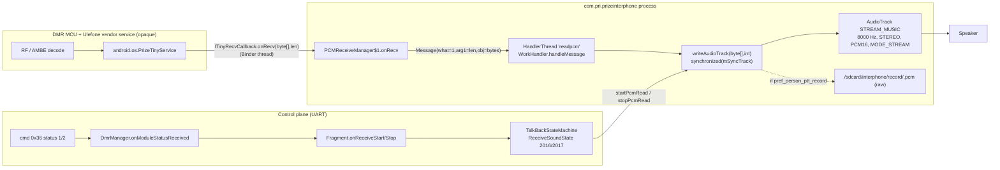
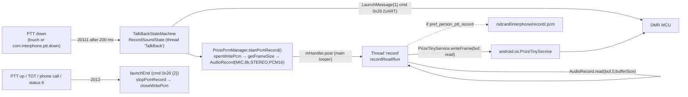

# 04 — OEM Audio Pipeline (PriInterPhone `com.pri.prizeinterphone`)

**Summary.** Voice PCM does **not** travel inside the app's UART packets. Both directions go through a Ulefone framework class, `android.os.PrizeTinyService` (platform-signed, not in the AOSP SDK, no source in this repo). RX: the service pushes `byte[]` chunks into the app over an AIDL callback (`ITinyRecvCallback.onRecv(byte[], int)`), which are queued to a `HandlerThread("readpcm")` and written to a `MODE_STREAM` `AudioTrack` (8 000 Hz, `CHANNEL_OUT_STEREO`, `ENCODING_PCM_16BIT`, `STREAM_MUSIC`) by `PCMReceiveManager.writeAudioTrack(byte[], int)`. TX: PTT sends `SET_LAUNCH_INFO_CMD` (0x26) over the UART, opens the service's write channel, and a `Thread("record")` copies `AudioRecord` (MIC, 8 000 Hz stereo 16-bit by default) reads straight into `PrizeTinyService.writeFrame(byte[], int)`. Vocoding (AMBE) is therefore not done in Java — it is on the MCU or inside the vendor service (inferred). The UART carries only control/status: RX start/stop and TX start/stop are signalled by `MODULE_PRINT_STATUS_INFO_CMD` (0x36) status bytes, which drive `TalkBackStateMachine`. Optional call recording writes raw `.pcm` (no header) to `/sdcard/interphone/record/` and indexes it in `record_database.db`. Several audio classes in the APK (`SoundEffectPresenter`, `AudioRecordPresenter`, `record/*`, `talkbak/*`, `RecordItem`) are **dead code**.

All paths below are relative to `app/src/main/java/com/pri/prizeinterphone/` unless stated otherwise. Line numbers are from the decompiled Java in this repo.

## Source files

| File | Role | Live? |
|---|---|---|
| `manager/PCMReceiveManager.java` | RX: `PrizeTinyService` callback → `HandlerThread` → `AudioTrack`; optional raw-PCM file tap | Yes |
| `manager/PrizePcmManager.java` | TX: `AudioRecord` → `PrizeTinyService.writeFrame`; optional raw-PCM file tap | Yes |
| `fragment/InterPhoneTalkBackFragment.java` | PTT UI, hardware-PTT broadcasts, SoundPool beep, audio focus, recording DB inserts | Yes |
| `state/TalkBackStateMachine.java` | Orchestrates TX/RX start/stop on its own `HandlerThread("TalkBack")` | Yes |
| `manager/DmrManager.java` | Module status fan-out (`onModuleStatusReceived`), launch cmd, mic gain, prefs, record DB façade | Yes |
| `handler/ModuleStatusMessageHandler.java`, `message/ModuleStatusMessage.java` | Cmd 0x36 status byte → `DmrManager` | Yes |
| `message/LaunchMessage.java` | Cmd 0x26 body `[1]`=TX on, `[2]`=TX off | Yes |
| `message/MicMessage.java`, `message/VolumeMessage.java`, `message/DigitalMessage.java`, `message/AnalogMessage.java`, `message/MixCheckMessage.java` | MCU-side gain/volume bytes | Mic: yes; Volume cmd: never sent |
| `audio/PCMAudioPlayer.java` | Playback of recorded `.pcm` files (`AudioTrack`) | Yes (RecordListActivity) |
| `activity/RecordListActivity.java` | Recording list / play / delete UI | Yes |
| `serial/data/AudioRecordData.java`, `serial/data/UtilRecordData.java`, `serial/data/DBAudioRecordHelper.java` | Recording index (SQLite) | Yes |
| `InterPhoneService.java`, `app/src/main/AndroidManifest.xml` | Foreground service, `foregroundServiceType="microphone"` | Yes |
| `audio/SoundEffectPresenter.java`, `audio/ISoundEffectInterface.java` | MediaPlayer sound-effect helper | **Dead** (no callers) |
| `audio/AudioRecordPresenter.java`, `audio/IAudioRecordInterface.java` | 44.1 kHz mono test recorder | **Dead** (no callers) |
| `record/AudioRecorder.java`, `record/PcmToWav.java`, `record/WaveHeader.java`, `record/FileUtil.java`, `record/RecordStreamListener.java` | 16 kHz recorder + WAV writer | **Dead** (only `AudioRecorder` calls `PcmToWav`; nothing calls `AudioRecorder`) |
| `talkbak/BaseTalkbak.java`, `talkbak/SendTalkbak.java`, `talkbak/Talkbak.java`, `handler/BaseTalkbakHandler.java`, `handler/SendTalkbakHandler.java` | Duplicate of `LaunchMessage` (cmd 0x26, body `[1]`) | **Dead** (`SendTalkbakHandler` never registered in `MessageDispatcher`; `BaseTalkbakHandler` referenced only by it) |
| `activity/RecordItem.java` | POJO | **Dead** (no references) |
| `original-decompiled/smali_classes4/.../manager/PCMReceiveManager*.smali`, `PrizePcmManager.smali` | Authoritative signatures | Reference |

Vendor API surface used (from `invoke-virtual` in the smali; no stub in repo):

| `android.os.PrizeTinyService` method | Used by | Line |
|---|---|---|
| `registerRecvCallback(ITinyRecvCallback)` | `PCMReceiveManager.initPcmRead` | `PCMReceiveManager.java:104` |
| `openRecvPcm() : boolean` (return ignored) | `startPcmRead` | `:152` |
| `closeRecvPcm() : void` | `stopPcmRead` | `:174` |
| `openWritePcm() : boolean` | `PrizePcmManager.startPcmRecord` | `PrizePcmManager.java:141` |
| `getFrameSize() : int` | `startPcmRecord` | `:145` |
| `writeFrame(byte[], int) : int` (return ignored) | `recordReadRun` | `:72` |
| `closeWritePcm() : void` | `startPcmRecord` (error path), `stopPcmRecord` | `:149`, `:183` |
| `android.os.ITinyRecvCallback.Stub.onRecv(byte[] data, int len)` | callback into app | `:42` (smali `onRecv([BI)V`) |

Each manager instantiates its **own** `new PrizeTinyService()` (`PCMReceiveManager.java:48`, `PrizePcmManager.java:54`); `PCMReceiveManager` is a lazy singleton (`:53-62`), `PrizePcmManager` is created per fragment instance (`InterPhoneTalkBackFragment.java:137`).

---

## 1. RX path (radio → speaker)

### 1.1 Where the bytes come from

* **Not a serial packet.** `MessageDispatcher` registers cmd 0x2B `QUERY_DIGITAL_AUDIO_RECEIVE_INFO` (`serial/MessageDispatcher.java:54`), but its handler is empty (`handler/DigitalAudioMessageHandler.java:8-9`) and `DigitalAudioMessage.decodeBody` is empty (`message/DigitalAudioMessage.java:11-12`). That packet carries caller metadata (see chapter on packets), never PCM.
* PCM arrives via `ITinyRecvCallback.Stub.onRecv(byte[] bArr, int i)` (`PCMReceiveManager.java:41-47`), registered once at singleton construction (`:49` → `:99-105`). The callback is a Binder stub, so `onRecv` runs on a **Binder thread** of the app process (inferred from `.Stub`).
* `onRecv` does `new String(bArr)` (result discarded — a wasted full-buffer decode per callback, `:43`), logs `"onRecv " + len` (`:44`), then posts `Message(what=1, arg1=len, obj=bArr)` to `mReadThreadHandler` (`:45`). The `byte[]` is passed by reference; nothing copies it.

### 1.2 Thread hop and AudioTrack write

* `HandlerThread("readpcm")` created in `initPcmRead` (`:100-103`), default priority (no `THREAD_PRIORITY_AUDIO`). `WorkHandler.handleMessage` (`:114-120`) dispatches `what==1` to `writeAudioTrack((byte[]) msg.obj, msg.arg1)`.
* **Exact signature** (private; Xposed hooks it fine): `private void writeAudioTrack(byte[] bArr, int i)` — smali `.method private writeAudioTrack([BI)V` (`PCMReceiveManager.smali:312`). JADX shows it as `public` with a "Access modifiers changed" note (`PCMReceiveManager.java:123-124`); the bridge `-$$Nest$mwriteAudioTrack` (`smali:64`) exists because the inner handler calls it.
* Behaviour (`:124-142`):

```java
synchronized (this.mSyncTrack) {
    AudioTrack audioTrack = this.mAudioTrack;
    if (audioTrack != null) {
        int write = audioTrack.write(bArr, 0, i);          // blocking, MODE_STREAM
        if (DmrManager.getInstance().needSaveRecordFile()) {
            if (mOutputStream != null) mOutputStream.write(bArr);   // NOTE: whole array, not i bytes
        }
        Log.d(TAG, "writeAudioTrack " + write);
    }
}
```

  * If `mAudioTrack == null` (i.e. `stopPcmRead` already ran) the chunk is silently dropped.
  * The file tap writes `bArr.length` bytes, not `i` — harmless only if the service always hands over an exactly-sized array (unverified).
  * Return value of `write` is only logged; no underrun / partial-write handling.

### 1.3 AudioTrack configuration

| Parameter | Value | Source |
|---|---|---|
| `streamType` | `3` = `STREAM_MUSIC` | `:23`, `:66` |
| `sampleRateInHz` | `8000` | `:22`, `:66` |
| `channelConfig` | `12` = `CHANNEL_OUT_STEREO` | `:20`, `:66` |
| `audioFormat` | `2` = `ENCODING_PCM_16BIT` | `:19`, `:66` |
| `bufferSizeInBytes` | `AudioTrack.getMinBufferSize(8000, 12, 2) * 2` | `:65-66` |
| `mode` | `1` = `MODE_STREAM` | `:21`, `:66` |
| Audio attributes / session / volume API | none — deprecated int-stream constructor, default volume 1.0, no `setVolume`, no `AudioAttributes`, no session id | `:66` |

Derived: **32 000 bytes/s** (8 000 × 2 ch × 2 B); 1 ms = 32 B; one stereo frame = 4 B.

### 1.4 Start / stop conditions

`startPcmRead()` (`:144-165`): `synchronized(mSyncTrack){ initAudioTrack(); play(); }` → `mPrizeTinyService.openRecvPcm()` (return ignored) → if `needSaveRecordFile()` (pref `pref_person_ptt_record`, default `false`, `DmrManager.java:922-924`) create `/sdcard/interphone/record/yyyyMMdd-HHmmss.pcm` and `mOutputStream` (`:154-163`; the `Date date = null` in JADX is an artifact — smali constructs `new Date()`, `PCMReceiveManager.smali` ~552-568).

`stopPcmRead()` (`:167-188`): `synchronized(mSyncTrack){ stop(); release(); mAudioTrack=null; }` → `closeRecvPcm()` → `removeMessages(1)` (drops queued chunks) → close file.

A **new `AudioTrack` is created per RX call** and released at the end; the HandlerThread and Binder registration live for the process lifetime. `releaseService()` (`:215-217`) only nulls the reference and is never called.

Callers:

| Caller | Event | File:line |
|---|---|---|
| `TalkBackStateMachine.ReceiveSoundState` msg `2016 MSG_RECEIVE_SOUND_START` | `fragment.setStartReceivePrepare(); fragment.startPcmRead();` | `state/TalkBackStateMachine.java:383-386` → `fragment/InterPhoneTalkBackFragment.java:618-620` |
| `ReceiveSoundState` msg `2017 MSG_RECEIVE_SOUND_END` | `fragment.stopPcmRead(); fragment.setStopReceivePrepare(); → Idle` | `:387-391` → fragment `:622-624` |
| `InterPhoneHomeActivity.onCreate` | `startPcmRead()` during module init (before any status arrives) | `InterPhoneHomeActivity.java:164` |
| `InterPhoneHomeActivity.updateModuleInit` / `mToastInitFail` / `onDestroy` | `stopPcmRead()` | `:393`, `:104`, `:236` |

The state-machine events originate from UART status: `ModuleStatusMessageHandler.handle` (`handler/ModuleStatusMessageHandler.java:19-23`) acks cmd 0x36 with body `[1]` (`:25-31`) then calls `DmrManager.onModuleStatusReceived(status)` (`manager/DmrManager.java:392-410`): `1 RECEIVE_START → onReceiveStart()`, `2 RECEIVE_STOP → onReceiveStop()` (`Const.moduleStatus2Str`, `protocol/Const.java:101-125`). `DmrManager` fans out to `LaunchListener`s (`:414-424`); the fragment registered in `onCreate` (`InterPhoneTalkBackFragment.java:143`) posts `2016`/`2017` to the state machine (`:552-565`).

So `AudioTrack` life is **tied to module status 1/2**, not to the presence of PCM. If PCM arrives while the track is null (e.g. before `RECEIVE_START` is processed) it is dropped.

### 1.5 Gain, volume, underrun, latency

* No software gain on RX. Loudness is controlled by (a) Android `STREAM_MUSIC` volume and (b) the MCU-side `volume` byte (see §5).
* No underrun handling; `MODE_STREAM` will output silence on starvation and `write` blocks when the track buffer is full — this back-pressures the `readpcm` queue, not the Binder caller (messages accumulate).
* Latency components (inferred): vendor service chunking (see §6) + `HandlerThread` hop + `AudioTrack` buffer of `2 × minBufferSize` + per-call `AudioTrack` construction (`startPcmRead` runs on the `TalkBack` state-machine thread, so track creation cost is on that thread, not UI).

### 1.6 Data-flow diagram



---

## 2. TX path (mic → radio)

### 2.1 PTT → control command

Two PTT sources, both in `InterPhoneTalkBackFragment`:

| Source | Down | Up |
|---|---|---|
| On-screen button `R.id.fragment_talkback_record` (`OnTouchListener`, `:395-416`) | `ACTION_DOWN` → `sendMessageDelayed(20111 MSG_RECORD_SOUND_START_NEED_DELAY, 200 ms)` (`:400-407`) | `ACTION_UP/CANCEL` → `sendMessage(2012 MSG_RECORD_SOUND_END)` (`:408-413`) |
| Hardware PTT via broadcasts `com.interphone.ptt.down` / `.up` (`InterPhoneReceiver`, `:491-515`, registered `:138-142`) | same 200 ms-delayed `20111` (`:503-505`) | `2012` (`:509-511`) |

The broadcasts are not sent by anything in this APK (repo-wide grep); the sender is the Ulefone framework key handler (inferred).

`RecordSoundState` on `20111` (`state/TalkBackStateMachine.java:320-337`) or `2011` (`:338-354`):

1. `fragment.launchCommand()` → `DmrManager.launchCommand()` → `LaunchMessage{launch=1}.send()` = UART cmd `0x26 SET_LAUNCH_INFO_CMD`, body `[0x01]` (`DmrManager.java:743-747`, `message/LaunchMessage.java:14-27`, `protocol/Const.java:50`).
2. `fragment.createRecordFile()` → `PrizePcmManager.createRecordFile()` (`PrizePcmManager.java:207-221`, only if `needSaveRecordFile()`).
3. `fragment.startPcmRecord()` → `PrizePcmManager.startPcmRecord()`; `<0` → toast, `stopPcmRecord()`, `SendExceptionState` (`:325-331`).
4. `setSendStatus(1)` (pref `pref_person_send_status`, `DmrManager.java:938-940`), button bg → recording; after 500 ms `20112` → `setStartRecordPrepare()` + `showLimitRecordTime()` (`:336`, `:263-265`).

`RecordSoundState` on `2012` (`:231-255`): `launchEnd()` (`LaunchMessage{launch=2}`, `DmrManager.java:762-766`) → `stopPcmRecord()` → `setStopRecordPrepare()` → `setSendStatus(0)` → Idle. `2012` is also produced by the TOT countdown (`pref_person_limit_send_time`, default 30 s, `InterPhoneTalkBackFragment.java:685-697`), fragment `onDestroy` (`:458`), incoming phone call (`2018 → 2012 arg 2`, `:259-261`), module status 6 `RELAY_ACTIVITY_TIME_OUT` (`onSendTimeout → 2020 → 2012 arg 3`, `:268-271`), and RX start during TX (`2016 → 2012 arg 4`, `:256-258`).

Module status `3 SEND_START` / `4 SEND_STOP` reach `fragment.onSendStart/onSendStop`, which are **no-ops** (`InterPhoneTalkBackFragment.java:121-127`); state-machine messages `2022`/`2023` ("feedback from module") are handled (`:275-317`) but never sent by anyone (grep). TX timing is therefore purely app-driven.

### 2.2 `PrizePcmManager.startPcmRecord()` (`PrizePcmManager.java:140-155`)

```
openWritePcm()  false → return -1
mFrameSize = getFrameSize(); <=0 → closeWritePcm(); return -2
initRecord()
startRecord()   false → return -3
return 0
```

`initRecord()` (`:93-117`):

| Parameter | Value | Note |
|---|---|---|
| `audioSource` | `1` = `MIC` | `:115` |
| `sampleRateInHz` | `SystemProperties.getInt("debug.rate", 8000)` | `:103` |
| `channelConfig` | `debug.channel==2` (default) → `12` = `CHANNEL_IN_STEREO`; else `16` = `CHANNEL_IN_MONO` | `:98-102` |
| `audioFormat` | `debug.bits==16` (default) → `2` = `PCM_16BIT`; else `22` = `ENCODING_PCM_32BIT` | `:104-108` |
| `bufferSizeInBytes` | `max(AudioRecord.getMinBufferSize, AudioTrack.getMinBufferSize)` rounded **down** to a multiple of 8 | `:110-114` |

No `AudioRecord.Builder`, no `AcousticEchoCanceler`/`NoiseSuppressor`/`AutomaticGainControl`, no `AudioManager.setMode`, no mic mute. The three `debug.*` sysprops are the only runtime knobs.

`startRecord()` (`:123-138`): `mRecord.startRecording()` then `mHandler.post(notifyRecordThread)` — `mHandler` is `new Handler()` bound to the thread that constructed the manager (fragment `onCreate` → main thread, `:34`), so the record thread is released via the **main looper**.

### 2.3 Capture loop (`recordReadRun`, `:61-82`)

Runs on `Thread("record")` (`:35-53`), started in the constructor (`:57`), default priority, loops for process lifetime (`mIsExit` is never set to true) waiting on `mRecordWait`.

```java
if (bufferSize < mFrameSize) bufferSize = mFrameSize;
buffer = new byte[bufferSize];
while (mIsRecording) {
    int read = mRecord.read(buffer, 0, bufferSize);      // blocking, fills bufferSize
    if (read > 0) {
        mPrizeTinyService.writeFrame(buffer, read);
        if (needSaveRecordFile() && isSaveRecord) mOutputStream.write(buffer);   // whole array
    }
}
```

* **Framing:** one `writeFrame` per `AudioRecord.read`, size = `bufferSize` bytes (≥ `getFrameSize()`). There is no re-chunking to `mFrameSize`; the vendor service must accept arbitrary multiples (unverified). Pacing is implicit: `read` blocks at the capture rate (32 000 B/s at defaults).
* **No serial packets** are involved; `writeFrame` is the only sink. No codec in Java — AMBE encode happens downstream (inferred).
* `stopRecord()` (`:157-179`) sets `mIsRecording=false`, `stop()`/`release()` the `AudioRecord`, closes the file. Race: the loop may still be inside `read()` on a released record (returns error, loop exits). `stopPcmRecord()` (`:181-184`) then `closeWritePcm()`.
* `getFrameSize()` value is not logged anywhere authoritative in this repo; `docs/APRS_FREQUENCY_AND_TX_INJECTION.md:226` shows `"Radio frame size: 320 bytes"` in an *expected-output* block (not a captured log). 320 B = 160 × 16-bit mono samples = 20 ms @ 8 kHz, the DMR/AMBE vocoder frame (inferred, unverified).

### 2.4 Mute / echo / VOX

None in the app. `isSendStatus()` gates the recording player and settings while transmitting (`activity/RecordListActivity.java:244-246`, `audio/PCMAudioPlayer.java:100-102`), and the state machine prevents RX playback during TX (`2016` in `RecordSoundState` ends TX first). `getBusyNoSend()` (pref `pref_person_busy_no_send`, default `true`, `DmrManager.java:934-936`) refuses PTT while receiving (`TalkBackStateMachine.java:411-419`, `BusyNoSendState :556-573`).

### 2.5 TX diagram



---

## 3. Sound effects

| Item | Value | Source |
|---|---|---|
| Resources | `res/raw/start_send.ogg` (used), `start_record.ogg`, `stop_record.ogg` (unused — only `R.raw.start_send` is referenced) | `InterPhoneTalkBackFragment.java:444` |
| Engine | `SoundPool.Builder().setMaxStreams(1).setAudioAttributes(usage=1 USAGE_MEDIA, contentType=2 CONTENT_TYPE_MUSIC)` | `:433-439` |
| Trigger: TX start | `setStartRecordPrepare()` → if `playStartPromptTone()` (pref `pref_person_ptt_start_tone`, default `true`) → `playSound()` | `:626-632`, `DmrManager.java:926-928` |
| Trigger: TX end | `setStopRecordPrepare()` → if `playEndPromptTone()` (`pref_person_ptt_end_tone`, default `true`) → `playSound()` — same clip | `:634-642`, `DmrManager.java:930-932` |
| RX start / errors | no sound | — |
| Playback | `playSound()` re-`load()`s the sample every time (priority 1) and `OnLoadCompleteListener` plays it: `play(id, 0.7f, 0.7f, 1, 0, 1.0f)`; samples are never unloaded | `:441-446`, `:87-92` |
| Audio focus | `AudioFocusRequest.Builder(3)` = `AUDIOFOCUS_GAIN_TRANSIENT_MAY_DUCK` (`3`; `EXCLUSIVE` would be `4`), requested in `setStartRecordPrepare` and `setStartReceivePrepare`, abandoned in the matching stop methods; focus-change callback only logs | `:517-542`, `:524`, `:628`, `:645`, `:641`, `:659`, `:109-114` |
| `SoundEffectPresenter` (MediaPlayer, `STREAM_MUSIC`, play/pause/stop state machine) | dead code | `audio/SoundEffectPresenter.java:31-79` |
| `ToneGenerator` | not used | — |

Note the TX-start beep is queued 500 ms after PTT (via `20112`) on the `20111` path, i.e. after `writeFrame` has already begun — the beep is played to the local speaker only (SoundPool → Android mixer), it is not injected into the TX stream.

---

## 4. Call recording (raw PCM) and playback

### 4.1 Trigger and files

| Direction | Where captured | File | Timestamp |
|---|---|---|---|
| RX (`direction=1`) | `PCMReceiveManager.writeAudioTrack` tap (`:129-138`), file opened in `startPcmRead` (`:153-163`) | `/sdcard/interphone/record/yyyyMMdd-HHmmss.pcm` (`:39`, `:154-156`) | `new Date().getTime()` at `startPcmRead` (`:155`) |
| TX (`direction=0`) | `PrizePcmManager.recordReadRun` tap (`:73-79`), file opened in `createRecordFile` (`:207-221`) | same dir/pattern (`:33`, `:210-212`) | `:211` |

Gate: `DmrManager.needSaveRecordFile()` = pref `pref_person_ptt_record` (default `false`; reset to `false` in `resetData`, `DmrManager.java:905`). TX additionally requires `isSaveRecord` (`PrizePcmManager.java:219`, cleared in `saveSendRecord`, fragment `:420`).

**Format: headerless little-endian PCM exactly as it passed through the AudioTrack/AudioRecord** — nominally 8 000 Hz, 2 ch, 16-bit (32 000 B/s). No WAV header is ever written in the live path. Second-resolution names collide if two calls start within the same second (file overwritten, DB gets two rows).

### 4.2 WAV writer (dead code, but documents the intended format)

`record/PcmToWav.makePCMFileToWAVFile` / `mergePCMFilesToWAVFile` (`record/PcmToWav.java:73-125`, `:16-71`) fill `WaveHeader` with `SamplesPerSec=8000`, `Channels=2`, `BitsPerSample=16`, `FormatTag=1` (PCM), `BlockAlign=4`, `AvgBytesPerSec=32000`, `FmtHdrLeth=16`, `fileLength=len+36`, `DataHdrLeth=len` (`:77-87`). `WaveHeader.getHeader()` emits the canonical 44-byte RIFF/WAVE/fmt /data header, little-endian (`record/WaveHeader.java:22-49`). `FileUtil` puts files under `<ext>/interphone/` (`record/FileUtil.java:10-12`, `:18-58`). `AudioRecorder` (the only caller) is itself uncalled and would record 16 kHz mono (`record/AudioRecorder.java:14-17`, `:57-62`) — inconsistent with the header it would write.

### 4.3 Database

`serial/data/DBAudioRecordHelper.java`: file `record_database.db` (`:11`), version 1, table `record_database` (`:13`):

```sql
CREATE TABLE IF NOT EXISTS record_database(
  _id integer primary key autoincrement,
  record_name varchar, record_channelName varchar,
  record_timestamp integer, record_direction integer, record_filePath varchar)   -- :43
```

`serial/data/UtilRecordData.java`: column constants `:14-18`; `getAllRecordFiles()` ordered `record_timestamp desc` (`:32-44`); `addRecordData` inserts only `record_name` (`:52-56`) then `DmrManager.addRecordDb` immediately `updateRecordData` by `_id` with all columns (`DmrManager.java:155-159`, `UtilRecordData.java:58-69`); `removeRecordFile` deletes by **`record_timestamp`**, not `_id` (`:46-50`). `AudioRecordData` fields `id,name,channelName,timestamp,direction,filePath,isplay` (`serial/data/AudioRecordData.java:20-26`), `SmsDirection.SENT=0 / RECEIVE=1` (`:29-32`); `channelName` is actually the channel **number** as a string (fragment `:425`, `:653`).

Inserts: RX in `setStopReceivePrepare` (`InterPhoneTalkBackFragment.java:649-658`, executed on every RX stop when the pref is on — even if the file is empty), TX in `saveSendRecord` (`:418-431`).

### 4.4 `RecordListActivity` playback / deletion

* List from `DmrManager.getAllRecordList()` (`activity/RecordListActivity.java:119`); row shows name, "channel N", Send/Receive, `yyyy-MM-dd HH:mm:ss` (`:130-141`, `:226-230`).
* Tap row: `stopPlayAudio()`; if file exists and not transmitting → `startPlayAudio(path)`; if missing → delete DB row + toast (`:166-183`).
* `startPlayAudio` builds a **new `PCMAudioPlayer()`** (public default ctor; the `getInstance()` singleton is unused here) (`:91-96`); `onStop` → `stopPlay(); release()` (`:77-89`).
* `PCMAudioPlayer` (`audio/PCMAudioPlayer.java`): `AudioTrack(STREAM_MUSIC, 8000, STEREO, PCM16, minBuf*2, MODE_STREAM)` created in field init (`:22-23`), single-thread executor (`:24`), `PlayRunnable` sets `THREAD_PRIORITY_URGENT_AUDIO (-19)` and streams the raw file in `minBufferSize` chunks until EOF, `stopPlay`, or `isTalkSend()` (`:81-96`). No seek, no progress UI.
* Multi-select delete: checkbox → `deleteList`; delete button deletes file + DB row for each (`:198-212`); refused while transmitting (`:55-58`).

---

## 5. Audio settings: MCU vs Android

| Control | Mechanism | Sent when | Source |
|---|---|---|---|
| Speaker loudness (Android) | `STREAM_MUSIC` volume — the app never calls `AudioManager.setStreamVolume`/`setMode`/`setSpeakerphoneOn` | user hardware keys | — |
| Speaker loudness (MCU) | `volume` byte inside `SET_DIGITAL_INFO_CMD (0x22)` / `SET_ANALOG_INFO_CMD (0x23)` / `SET_MIX_CHECK_INFO_CMD (0x38)` bodies, default `8`, never changed by UI | every channel program | `message/DigitalMessage.java:25,52,149`; `message/AnalogMessage.java:21,38,68`; `message/MixCheckMessage.java:79` |
| `SET_VOL_CMD (0x2E)` | `VolumeMessage{vol=8}` body `[vol]` — class exists, handler registered, **never instantiated/sent** by the app | — | `message/VolumeMessage.java:14-29`; `serial/MessageDispatcher.java:57` |
| Mic gain (MCU) | `SET_GAIN_MIC_CMD (0x2A)` body `[gain]` from pref `pref_person_mic_gan_value` (default 0); also copied into `DigitalMessage.mic` | settings dialog pick; `CmdStateMachine` init | `DmrManager.java:816-820`, `:360`; `activity/FragmentLocalSettingsActivity.java:526-534`; `state/CmdStateMachine.java:246,308` |
| Monitor / squelch open | `SET_LISTEN_CMD (0x2F)` `MonitorMessage` | see channel chapter | `message/MonitorMessage.java:15` |
| `SET_SPK_EN_CMD (0x3C)` | constant only, no message class | never | `protocol/Const.java:57` |
| Routing | earpiece/speaker/Bluetooth/wired: **nothing** in app. Output follows Android's default policy for `STREAM_MUSIC` (speaker, or BT A2DP/wired if connected — inferred). Input is `MIC` source, so a BT SCO headset is not used. | — | — |
| Phone call | `PhoneStateListener` (`LISTEN_CALL_STATE`): ringing/off-hook → `2018` stops RX (`2017 arg 2`) and TX (`2012 arg 2`), `PhoneCallingState` refuses PTT; idle → `2019` | `InterPhoneTalkBackFragment.java:96-108`, `:144`; `TalkBackStateMachine.java:406-409`, `:425-456` |

Manifest (`app/src/main/AndroidManifest.xml`): `FOREGROUND_SERVICE` (`:6`), `FOREGROUND_SERVICE_MICROPHONE` (`:7`), `WAKE_LOCK` (`:8`); `InterPhoneService` `foregroundServiceType="microphone"`, `persistent="true"` (`:41`); `startForeground(..., FOREGROUND_SERVICE_TYPE_MICROPHONE)` on Q+ (`InterPhoneService.java:105-112`) plus a `PARTIAL_WAKE_LOCK` held for the service's life (`:62-66`). `RECORD_AUDIO` is requested at runtime (`InterPhoneHomeActivity.java:128`) but this repo's manifest (a rebuilt variant — note the `com.macgyver.dmr.*` authorities, `:4-5`, `:38`, `:42`) declares no `RECORD_AUDIO`/`MODIFY_AUDIO_SETTINGS`; the shipped platform-signed APK's manifest may differ.

---

## 6. Threading & timing

| Thread | Created | Runs | Priority |
|---|---|---|---|
| Binder pool thread | system | `PCMReceiveManager$1.onRecv` (`:42-46`) | default |
| `HandlerThread("readpcm")` | `initPcmRead` (`:100-103`) | `writeAudioTrack` incl. blocking `AudioTrack.write` and file I/O | default |
| `Thread("record")` | `PrizePcmManager` ctor (`:35-57`) | `AudioRecord.read` → `writeFrame` → file I/O | default |
| `HandlerThread("TalkBack")` | `StateMachine(String)` (`state/StateMachine.java:708-713`) via `TalkBackStateMachine.makePerson` (`:99-103`) | all `startPcmRead/stopPcmRead/startPcmRecord/stopPcmRecord`, `AudioTrack`/`AudioRecord` construction, UART `LaunchMessage.send()` | default |
| Main thread | — | PTT touch/broadcast → state-machine post; `PrizePcmManager.mHandler` wake-up post (`:126-131`); SoundPool; audio focus; `HomeActivity` start/stop of PCM read | — |
| `PCMAudioPlayer` executor | field init (`:24`) | file playback | `-19` (`:83`) |
| Serial reader thread | `SerialManager` | cmd 0x36 → `DmrManager.onModuleStatusReceived` → `LaunchListener` → state-machine post | see serial chapter |

Cadence arithmetic (defaults, both directions): 8 000 Hz × 2 ch × 2 B = **32 000 B/s → 32 B/ms**.

| Chunk (bytes) | Duration | Note |
|---|---|---|
| 320 | 10 ms stereo / 20 ms if mono | `getFrameSize()` value claimed in docs (unverified) |
| 640 | 20 ms | one DMR vocoder frame at stereo |
| 2 048 | 64 ms | **observed RX callback size** per `DMRModHooks/.../MainHook.java:9726` comment ("2048 bytes/64ms") → ≈15.6 callbacks/s |
| `2 × minBufferSize` | device-dependent | `AudioTrack` buffer; `getMinBufferSize` is not logged |

The observed 2 048 B / 64 ms rate equals 32 000 B/s, consistent with the `AudioTrack` config. Whether the payload is 8 kHz interleaved stereo (as configured) or 8 kHz mono duplicated L/R or 16 kHz mono is **not decidable from code** — the module's transcription path treats it as 16 kHz mono and works, which is byte-rate-equivalent. Test on device: compare `pcm[i..i+1]` with `pcm[i+2..i+3]`; identical pairs ⇒ duplicated mono at 8 kHz.

Per-callback budget: at 64 ms per chunk, anything under ~10 ms on the `readpcm` thread is safe; but the `AudioTrack.write` inside the same synchronized block already consumes most of the 64 ms wall time when the track buffer is full, so extra work in a *before* hook shifts, rather than adds to, latency until the queue starts growing.

---

## 7. Hooking guide (LSPosed/Xposed)

### (a) Intercept RX PCM before the speaker

Hook `com.pri.prizeinterphone.manager.PCMReceiveManager#writeAudioTrack(byte[], int)` (private instance method; `XposedHelpers.findAndHookMethod(cls, "writeAudioTrack", byte[].class, int.class, hook)` — exactly what `MainHook.hookPCMReceiveManager` does, `DMRModHooks/app/src/main/java/com/dmrmod/hooks/MainHook.java:9938-9942`).

* `param.args[0]` = `byte[]` PCM (mutable in place — zeroing it mutes the speaker and the file tap), `param.args[1]` = valid length (`int`). `param.thisObject` = the singleton; `mAudioTrack` field is null outside an RX call.
* Runs on `HandlerThread("readpcm")`, **inside** the caller? No — the hook runs before `synchronized(mSyncTrack)` is taken, so it does not hold the lock; but `stopPcmRead` can null the track concurrently, so never touch `mAudioTrack` from the hook.
* Earlier alternative: hook `PCMReceiveManager$1#onRecv(byte[], int)` (Binder thread; avoid — blocking there stalls the vendor service).
* To detect chunk size/rate on-device: `adb logcat -s PCMReceiveManager` prints `onRecv <len>` and `writeAudioTrack <written>` per chunk (`:44`, `:139`).

### (b) Intercept TX PCM before the MCU

There is no app-level method between `AudioRecord.read` and `writeFrame` — both are inline in `PrizePcmManager.recordReadRun()` (`:69-81`). Options:

1. Hook `android.os.PrizeTinyService#writeFrame(byte[], int)` (framework class in the app's classloader; args mutable; runs on `Thread("record")`). Cleanest, covers the OEM loop and anything else that writes.
2. Hook `android.media.AudioRecord#read(byte[], int, int)` after-hook, filter by `thisObject == XposedHelpers.getObjectField(prizePcmManager, "mRecord")`.
3. To inject synthetic TX audio: obtain the fragment's `mPrizePcmManager` (`InterPhoneTalkBackFragment.java:65`), call `startPcmRecord()`/`stopPcmRecord()` or use its `mPrizeTinyService` directly (`openWritePcm → getFrameSize → writeFrame… → closeWritePcm`) — but you must also send `LaunchMessage{1}`/`{2}` (`DmrManager.launchCommand/launchEnd`, `:743-747`, `:762-766`) or the MCU never keys. Pace writes at 32 000 B/s (or whatever `getFrameSize()`/rate the service expects).

### (c) Know when a call starts/stops

| Signal | Hook point | Thread |
|---|---|---|
| RX start/stop (module truth) | `DmrManager#onModuleStatusReceived(byte)` — `1`/`2`; or `#onReceiveStart()`/`#onReceiveStop()` (`DmrManager.java:392-424`) | serial reader |
| RX audio actually flowing | `PCMReceiveManager#startPcmRead()` / `#stopPcmRead()` (`:144`, `:167`) | `TalkBack` state-machine thread (or main from `HomeActivity`) |
| TX keyed by app | `DmrManager#launchCommand()` / `#launchEnd()` (`:743`, `:762`) or `PrizePcmManager#startPcmRecord()` / `#stopPcmRecord()` (`:140`, `:181`) | `TalkBack` thread |
| TX confirmed by module | `onModuleStatusReceived` `3`/`4` (app ignores them) | serial reader |
| Caller ID for the RX call | cmd 0x2B `DigitalAudioMessageHandler#handle` (empty in OEM; see packet chapter) | serial reader |
| Send-state flag | pref `pref_person_send_status` via `DmrManager#isSendStatus()` (`:942-944`) | any |

### Performance rules for the `readpcm` hook

* Budget: aim ≤ 2–5 ms per 2 048-byte chunk; hard ceiling ≈ 60 ms before the queue grows and latency creeps.
* Do not allocate per call beyond one `Arrays.copyOf` if you need a pristine copy; the OEM already allocates one `byte[]` + one `String` per chunk on the Binder side.
* Never do file/network/DB/Binder work, `Thread.sleep`, or UI (`View` mutation) on this thread; hand copies to your own `HandlerThread`/executor.
* Do not call `AudioTrack` methods, `startPcmRead/stopPcmRead`, or anything that takes `mSyncTrack` from the hook (deadlock risk with `stopPcmRead` running on the `TalkBack` thread).
* Do not throw — an uncaught exception kills the `readpcm` looper and all RX audio until process restart.

---

## 8. Gotchas

1. **PCM is not in the UART stream.** Any "parse audio from serial packets" plan is wrong; the serial layer only sees status/launch commands. `QUERY_DIGITAL_AUDIO_RECEIVE_INFO` is metadata.
2. **`PrizeTinyService` needs platform UID.** Calling it from a re-signed APK throws `NoSuchMethodError` (`DMRModHooks/README.md:1731-1738`); hooks must run inside the original app.
3. **AudioTrack lifecycle ≠ PCM arrival.** The track exists only between status `RECEIVE_START` and `RECEIVE_STOP` (plus the init window in `HomeActivity`). Chunks arriving outside are dropped; `stopPcmRead` also discards queued chunks (`removeMessages(1)`, `:178`).
4. **Config vs content ambiguity.** `AudioTrack` says 8 kHz stereo; the module's transcription treats the same bytes as 16 kHz mono. Both yield 32 000 B/s. Decide empirically before doing DSP that depends on true sample rate (APRS/AFSK detection is sensitive to this).
5. **Per-call `AudioTrack`/`AudioRecord` construction** on the `TalkBack` thread adds start-up latency and can fail (`startRecord` catches and returns `-3`, `:133-137`); on RX the `try` only wraps `play()` (`:72-76`), not the constructor (`:66`): a track that comes back `STATE_UNINITIALIZED` makes `play()` throw, which is only `printStackTrace`'d and leaves `mAudioTrack` non-null-but-uninitialised → `write` returns an error every chunk; an `IllegalArgumentException` from the constructor itself is uncaught and would propagate up the `TalkBack` state-machine thread.
6. **File taps write `buffer.length`, not the valid length** (`PCMReceiveManager.java:133`, `PrizePcmManager.java:75`) and recording filenames have 1 s resolution (collisions).
7. **DB delete is by timestamp**, so two rows with equal `record_timestamp` are deleted together (`UtilRecordData.java:49`); DB insert happens even when no file was written (RX path has no `isSaveRecord` guard).
8. **`SoundPool.load` on every beep** and never `unload` — sample IDs leak; `maxStreams=1` means overlapping beeps cut each other.
9. **Audio focus is `GAIN_TRANSIENT_MAY_DUCK`** (`Builder(3)`, `InterPhoneTalkBackFragment.java:524`) on both RX and TX; other media apps lower their volume (duck) rather than pause for every call, and the app itself ignores focus loss (listener only logs).
10. **Hardware-PTT path is a plain broadcast** (`com.interphone.ptt.down/up`) registered without a permission (`:142`) — any app can key the radio; also useful for automation.
11. **`onSendStart/onSendStop` are no-ops**; TX state in the app is optimistic (set by the app, not confirmed by the module). If the MCU refuses TX, the app still records mic audio and writes frames.
12. **`mIsExit` never set**: `Thread("record")` lives forever per `PrizePcmManager`; each `InterPhoneTalkBackFragment.onCreate` makes a new manager + thread (`:137`) and never stops the old one — leaks a thread and a `PrizeTinyService` per fragment recreation.
13. **`debug.rate` / `debug.channel` / `debug.bits`** sysprops silently change the TX capture format without changing what the service expects (`PrizePcmManager.java:98-108`); leave them unset.
14. **Two `PrizeTinyService` instances** (RX and TX managers each `new` one). Hooks on the class cover both; hooks on a captured instance do not.

---

## ⚠️ Doc drift

| Repo note | Claim | Code |
|---|---|---|
| `.grok/rules/copilot-instructions.md:1411` ("When Modifying Audio Pipeline") | "Audio hook runs at 8kHz sample rate — keep processing under 2ms" | 8 kHz matches the `AudioTrack` config (`PCMReceiveManager.java:22,66`) but the track is **stereo 16-bit (32 000 B/s)**, and the hook is invoked per chunk (observed 2 048 B ≈ 64 ms, `MainHook.java:9726`), not per sample. A 2 ms budget is conservative but fine; the real ceiling is ~60 ms per callback. |
| `.grok/rules/copilot-instructions.md:276-282` ("Audio Processing Hooks") | `hookPCMReceiveManager` "intercepts all PCM audio before speaker" | True for RX. It does **not** see recorded-file playback (`PCMAudioPlayer` writes its own `AudioTrack`, `audio/PCMAudioPlayer.java:89`) nor TX audio. |
| `.grok/rules/copilot-instructions.md:378-390` ("Audio Pipeline Hook Pattern") | Muting via `Arrays.fill(audioData, 0, length, 0)` | Correct — but note this also silences the OEM `.pcm` recording tap (`:133`), since the tap uses the same array after the hook. |
| `DMRModHooks/.../MainHook.java:9726-9727`, `:183`, `:193`, `:11025-11081` | "DMR radio sends 16 kHz mono"; WAVs written as 16 000 Hz/1 ch; APRS resampler assumes 16 kHz | OEM configures the sink as **8 000 Hz / 2 ch / 16-bit**; the byte rate is identical, so playback speed is right either way, but the true sample rate is unproven (see Gotcha 4). |
| `.grok/rules/key-files.md:21-22` | `DigitalAudioMessageHandler` = "RX digital audio + caller info packets" | It carries caller info only; no audio bytes traverse the serial handler (`DigitalAudioMessage.decodeBody` is empty). |
| `.grok/rules/copilot-instructions.md:291` | "UART logging on `/dev/ttyS0`" vs `README.md:1008` "`/dev/ttyS1`" | Out of scope for this chapter; verify in the serial chapter. |
