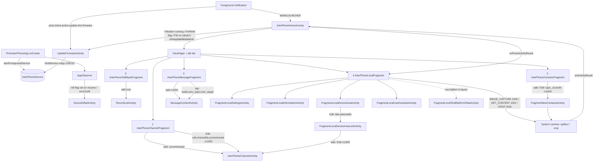

# 06 — OEM UI, Screens, Navigation and Process Lifecycle (PriInterPhone)

**Scope.** How the OEM app `com.pri.prizeinterphone` (Ulefone Armor 26 Ultra DMR controller) boots, keeps its process alive, draws its five-tab UI, and wires every button to `DmrManager` / `CmdStateMachine` / SQLite. Everything below is derived from the decompiled Java under `app/src/main/java/com/pri/prizeinterphone/` and the resources under `app/src/main/res/`. Statements not directly supported by code are marked **inferred**.

**Summary.** The app is a single `AppCompatActivity` (`InterPhoneHomeActivity`) hosting a `ViewPager` with five `BaseViewPagerFragment` subclasses (Intercom, Channel, Contact, Message, Device) and a hand-rolled bottom tab bar (a `LinearLayout` with five `android:onClick="tapOnClick"` children). A persistent foreground `InterPhoneService` opens the serial port and holds a partial wake-lock for the life of the process. Almost every user action funnels into `DmrManager` (DB + serial commands) or `CmdStateMachine` (channel programming) and UI refresh happens through listener interfaces (`DmrManager.UpdateListener`, `MessageLisenter`, `ContactLisenter`, `LaunchListener`) plus `Handler.post`. The UI is created **only after** the DMR module reports initialised (`updateModuleInit()`), not in `onCreate()`.

Path abbreviations used in citations:

| Abbrev | Path |
|---|---|
| `J/` | `app/src/main/java/com/pri/prizeinterphone/` |
| `L/` | `app/src/main/res/layout/` |
| `V/` | `app/src/main/res/values/` |

## Source files

| File | Lines | Role |
|---|---|---|
| `app/src/main/AndroidManifest.xml` | 47 | Components, service flags, protected-broadcast |
| `J/PrizeInterPhoneApp.java` | 42 | `Application`; boots managers + service |
| `J/AppObserver.java` | 72 | `ProcessLifecycleOwner` observer; remote-kill watchdog |
| `J/InterPhoneService.java` | 124 | Foreground service (serial port + wakelock + firmware-update messenger) |
| `J/InterPhoneHomeActivity.java` | 566 | Launcher activity, tab bar, ViewPager, module-init gate |
| `J/fragment/BaseViewPagerFragment.java` | 158 | Common title bar + `FrameLayout` container |
| `J/fragment/ViewPagerFragmentAdapter.java` | 61 | `FragmentPagerAdapter` |
| `J/fragment/InterPhoneTalkBackFragment.java` | 739 | Intercom page (PTT, channel ±, RX/TX indicator) |
| `J/fragment/InterPhoneChannelFragment.java` | 469 | Channel list of the selected area |
| `J/fragment/InterPhoneContactsFragment.java` | 505 | Person/group contacts; "Activate" sets `txContact` |
| `J/fragment/InterPhoneMessageFragment.java` | 396 | Conversation list |
| `J/fragment/InterPhoneLocalFragment.java` | 518 | "Device" page (avatar, settings entry points, reset, exit) |
| `J/activity/InterPhoneChannelActivity.java` | 1165 | Channel editor |
| `J/activity/GroupGridAdapter.java` | 113 | 32-cell RX group-list grid in the editor |
| `J/activity/FragmentNewContactsActivity.java` | 645 | Contact create/edit |
| `J/activity/MessageContentActivity.java` | 506 | SMS conversation / compose |
| `J/activity/FragmentLocalSettingsActivity.java` | 708 | Settings |
| `J/activity/FragmentLocalDeviceAreaActivity.java` | 438 | Device-area (channel bank) list |
| `J/activity/FragmentLocalDeviceAreaListActivity.java` | 351 | Channels inside one area |
| `J/activity/FragmentLocalInformationActivity.java` | 69 | About/versions |
| `J/activity/FragmentLocalUseAssistantActivity.java` | 28 | Static help |
| `J/activity/FragmentLocalTestBiteErrorRateActivity.java` | 78 | BER test console |
| `J/activity/RecordListActivity.java` | 247 | PTT recording list |
| `J/activity/RecordItem.java` | 50 | Unused POJO |
| `J/activity/DeviceKilledActivity.java` | 84 | Modal "killed remotely" dialog-activity |
| `J/widget/*.java` | — | `CircleProgressDrawable`, `CircleFramedDrawable`, `SpinerPopWindow`, `NumberProgressBar`, `CameraDialog`, `PrizeTextView` |
| `J/notification/MyNotificationManager.java` | 101 | Notification channel + builders |
| `com/pri/support/**`, `com/pri/didoui/**`, `com/pri/anim/spring/**` | 1675 total | Bundled third-party overscroll/bounce library (see §6.4) |

---

## 1. Process & lifecycle

### 1.1 Application class — `PrizeInterPhoneApp`

`J/PrizeInterPhoneApp.java:15-24`:

1. Caches `getApplicationContext()` in static `mContext` (`:17-18`; `getContext()` at `:26`).
2. Creates `AppObserver` and registers it with `ProcessLifecycleOwner.get().getLifecycle()` (`:19-20`).
3. `DmrManager.getInstance().init()` (`:21`) — DB helpers, listeners (other chapter).
4. `MyNotificationManager.getInstance().init()` (`:22`) — creates the notification channel (§5).
5. `startInterPhoneService()` (`:23`, body `:30-37`) — `startForegroundService()` on API ≥ 26. The source comment `// Re-enabled - service starts foreground notification automatically` (`:23`) shows this line was touched during the rebrand; treat as OEM-equivalent behaviour.

`isAppFg()` (`:39-41`) is a static proxy to `AppObserver.isAppFg()`.

### 1.2 `AppObserver` (ProcessLifecycleOwner)

`J/AppObserver.java:15` — `implements LifecycleObserver, DmrManager.MessageListener`. Uses the deprecated `@OnLifecycleEvent` annotations.

| Event | Behaviour | Cite |
|---|---|---|
| `ON_RESUME` | `isAppFg = true`; registers itself for cmd `SET_ENHANCE_FUNCTION_CMD` (0x28 = 40); if pref `pref_person_is_already_kill != 0` → `startActivity(DeviceKilledActivity)` with `FLAG_ACTIVITY_NEW_TASK` | `:34-42` |
| `ON_PAUSE` | `isAppFg = false` | `:44-48` |
| `ON_STOP` | unregisters the cmd-40 listener | `:50-54` |
| `dealEvent` | on any cmd-40 packet while the kill flag is set → launch `DeviceKilledActivity` | `:65-71` |

`ProcessLifecycleOwner` is initialised via `androidx.startup.InitializationProvider` → `ProcessLifecycleInitializer` in the manifest (`AndroidManifest.xml:42-45`).

### 1.3 Foreground service — `InterPhoneService`

Manifest (`AndroidManifest.xml:41`): `enabled`, `exported="true"`, `android:persistent="true"`, `android:priority="1000"`, `foregroundServiceType="microphone"`. `persistent` only has effect for system apps; the OEM build ran as `android:sharedUserId="android.uid.system"` (`decompiled/AndroidManifest.xml:2`) — the rebrand dropped the shared UID and added `FOREGROUND_SERVICE`, `FOREGROUND_SERVICE_MICROPHONE`, `WAKE_LOCK` permissions (`AndroidManifest.xml:6-8`; absent from `decompiled/AndroidManifest.xml`).

| Phase | What happens | Cite |
|---|---|---|
| `onCreate` | `startForeground(1, …)` with text `interphone_service_running` ("InterPhone service is running"), type `FOREGROUND_SERVICE_TYPE_MICROPHONE` on Q+; `DmrManager.initSerialPort()`; acquires `PARTIAL_WAKE_LOCK` tagged `"dmr_service"` **and never releases it until `onDestroy`** | `J/InterPhoneService.java:57-67`, `:105-112` |
| `onStartCommand` | returns `super.onStartCommand()` (framework default = `START_STICKY`) — no explicit restart logic, no intent handling | `:70-73` |
| `onBind` | returns a `Messenger` binder | `:51-54` |
| `onDestroy` | release wakelock; `ReadFileUtils.pullDownPwdFoot()` unless a YModem update is running (module power-down — **inferred** from the name); `stopForeground(true)` | `:76-86` |

Messenger protocol (`:23-44`):

| `what` | Const | Direction | Effect |
|---|---|---|---|
| 128 | `MSG_UPDATE_NOTIFICATION` | client→svc, `obj = ChannelData` | re-posts foreground notification with `getChannelDataStr()` text: `"<name or 'Digtal channel N'>\n<area name>  TX:xxx.xxxxxx  RX:xxx.xxxxxx"` (`:89-102`). **No sender exists in the app** — `DmrManager.setUpdateChannelDataNotificationListener()` is never called and `InterPhoneHomeActivity.updateNotification()` is empty (`J/InterPhoneHomeActivity.java:134-136`). Dead path. |
| 129 | `MSG_UPDATE_FIRMWARE_2_SVC` | client→svc, `replyTo` = client messenger | `YModemManager.registerCallbackMessenger(replyTo)`; releases serial reader/writer; `YModemManager.startUpdateFirmware()` (`:36-38`, `:119-123`) |
| 130 | `MSG_UPDATE_FIRMWARE_2_CLT` | svc→client | progress replies (YModem chapter). Also (ab)used as the literal `130` in `MessageContentActivity.reFreshListUI()` → `mListView.setSelection(130)` (`J/activity/MessageContentActivity.java:151`) |
| 131 | `MSG_UPDATE_ACTIVITY_DESTROY_2_SVC` | client→svc | unregister callback messenger (`:39-42`) |

Only `UpdateFirmwareActivity` binds (`J/activity/UpdateFirmwareActivity.java:123`).

**Restart behaviour.** Nothing in the app restarts the service. "Exit App" on the Device page explicitly `stopService()`s it and calls `System.exit(0)` (`J/fragment/InterPhoneLocalFragment.java:491-499`); `DmrManager` also stops it in one path (`J/manager/DmrManager.java:1071`). Otherwise survival relies on `START_STICKY` + foreground state + (OEM only) system UID/persistent.

### 1.4 `DeviceKilledActivity` — remote "stun/kill"

"Killed" = the DMR **remote kill** feature. `EnhanceMessageHandler.handle()` sets pref `PREF_PERSON_IS_ALREADY_KILL` = 1 when a cmd-40 packet with `fun == 4` arrives and = 0 when `fun == 5` (revive) (`J/handler/EnhanceMessageHandler.java:23-28`). The same command family is *sent* from Settings → "Kill walkie-talkie"/"Revive walkie-talkies" (§3.10). The handler keys only on `fun`, not on `rw/sr`, so whether the module's ACK of an *outgoing* kill also flips the local flag is **not determinable from the UI code** (protocol chapter).

`J/activity/DeviceKilledActivity.java`:

- Manifest: `launchMode="singleTask"`, theme `DeviceKilledDialog` (= `AppTheme_Dialog` = `Theme.AppCompat.Dialog`, `V/styles.xml:2557`, `:32`), has a `MAIN`/`DEFAULT` intent-filter but **not** `LAUNCHER` (`AndroidManifest.xml:32-37`).
- Layout `L/device_kill_dialog.xml`: one red (`@color/red8`) centred `TextView` (no id) whose text is `@string/interphone_kill_tip` = "Your walkie-talkies has been killed remotely!!!" (`:4`; string `V/strings.xml:274`).
- `onCreate`: `FEATURE_NO_TITLE`; finishes immediately if app not foreground or flag already 0; `setFinishOnTouchOutside(false)`; bottom-sheet-style window 90 % width, gravity bottom, y=60 (`:30-44`, `:74-83`).
- `onResume`: registers cmd-40 listener; `dealEvent` finishes when the flag becomes 0 (revive received) (`:18-26`, `:48-55`).
- `onBackPressed` is swallowed while killed (`:58-65`).

Launch paths: `AppObserver.onResume`/`dealEvent` (§1.2). The activity does not block PTT itself — the module is presumably muted by firmware (**inferred**).

### 1.5 Broadcasts & intents between components

| Action / target | Sender | Receiver | Extras | Cite |
|---|---|---|---|---|
| `com.action.broadcast.TALK_RECEIVING_UPDATE` | **none in Java** | **none in Java** | — | Declared as `<protected-broadcast>` only (`AndroidManifest.xml:3`); no `sendBroadcast`/receiver anywhere in `app/src/main/java`. Dead declaration (OEM leftover). |
| `com.interphone.ptt.down` | **not in app** — **inferred**: OEM framework/key-handler for the hardware PTT key | `InterPhoneTalkBackFragment.InterPhoneReceiver`, registered on the *application* context in `onCreate` (no permission, no `RECEIVER_EXPORTED` flag) | none | `J/fragment/InterPhoneTalkBackFragment.java:50-51`, `:138-142`, `:496-514` |
| `com.interphone.ptt.up` | same | same | none | same |
| `prize.intent.action.update.dmr.firmware` | `MyNotificationManager` PendingIntent (`FLAG_IMMUTABLE`) | `UpdateFirmwareActivity` (`exported=true`, `singleTask`) | none | `J/notification/MyNotificationManager.java:58`; `AndroidManifest.xml:10-15` |
| `MAIN`+`LAUNCHER` explicit to `InterPhoneHomeActivity`, `FLAG_ACTIVITY_NEW_TASK` | notification content intent | `InterPhoneHomeActivity` | none | `MyNotificationManager.java:61-65` |
| explicit `DeviceKilledActivity` + `NEW_TASK` | `AppObserver` | — | none | `J/AppObserver.java:40`, `:70` |
| explicit `UpdateFirmwareActivity` | `InterPhoneHomeActivity` | — | none | `J/InterPhoneHomeActivity.java:125`, `:160`, `:413` |
| explicit `RecordListActivity` | TalkBack `doAddAction` | — | none | `TalkBackFragment:274` |
| explicit `InterPhoneChannelActivity` | Channel fragment, DeviceAreaList | — | `currentAreaId:String`; edit mode adds `edit:boolean=true`, `channelId:int` (row `_id`); `startActivityForResult(…,1005)` for edit | `J/fragment/InterPhoneChannelFragment.java:120-122`, `:321-325`; `J/activity/FragmentLocalDeviceAreaListActivity.java:261-263`, `:294-298` |
| explicit `FragmentNewContactsActivity` | Contacts fragment | — | `type:int` (`UtilContactsData.TABLE_TYPE`, 0 person / 1 group); edit adds `_id:int`, `isedit:boolean`; request 1004 | `J/fragment/InterPhoneContactsFragment.java:248-260` |
| explicit `MessageContentActivity` | Message fragment | — | new: none (request 1001 via activity); open: `isedit=true`, `conv_type:int`, `conv_target:int` (`UtilConversationData.TABLE_CONVTYPE/TABLE_CONVTARGET`) | `J/fragment/InterPhoneMessageFragment.java:140`, `:163-168` |
| explicit `FragmentLocalDeviceAreaListActivity` | DeviceArea activity | — | `title:String`, `selectedId:String` (area key) | `J/activity/FragmentLocalDeviceAreaActivity.java:326-329` |
| explicit `FragmentLocal{Settings,Information,DeviceArea,UseAssistant,TestBiteErrorRate}Activity` | Local fragment | — | none | `J/fragment/InterPhoneLocalFragment.java:418-445` |
| `android.media.action.IMAGE_CAPTURE` (req 1002), `android.intent.action.GET_CONTENT` `image/*` (req 1001), `UtilPicture.ACTION_CROP` (req 1003) | Local fragment / NewContacts | system camera/gallery/crop | `output` = FileProvider URI (`UtilPicture.FILE_PATH` authority), `crop=true`, `aspectX/Y=1`, `outputX/Y=@dimen/interphone_circle_view_size` | `LocalFragment:218-243`, `:313-337`; `NewContactsActivity:473-507`, `:583-607` |
| `InterPhoneService` bind (Messenger) | `UpdateFirmwareActivity` | service | msgs 129/131 | `UpdateFirmwareActivity:123`, `:220` |

Result codes back into the host: `InterPhoneHomeActivity.onActivityResult` forwards 1001/1002/1003 with `RESULT_OK` to `mFmLocal.onPrizeActivityResult()` (`J/InterPhoneHomeActivity.java:446-455`). `InterPhoneMessageFragment.onActivityResult` only logs (`:143-147`); 1004/1005 results are ignored (fragments refresh in `onResume`).

---

## 2. `InterPhoneHomeActivity`

Manifest: launcher activity, `exported=true`, portrait, handles every `configChanges` itself (`AndroidManifest.xml:25-30`). Theme `AppTheme`. `requestWindowFeature(FEATURE_NO_TITLE)` (`J/InterPhoneHomeActivity.java:147`).

### 2.1 Layout — `L/activity_interphone_home.xml`

```
LinearLayout (vertical)
 ├─ ViewPager  @id/interphone_viewpager   weight 0.9            (:4)
 └─ LinearLayout @id/interphone_tap_view  bg pri_title_background, h=interphone_tap_height (:5)
     ├─ LinearLayout @id/talkback  onClick="tapOnClick"  [ImageView talkback_img | TextView talkback_title "Intercom"]  (:6-9)
     ├─ LinearLayout @id/channel   … [channel_img | channel_title "Channel"]                                      (:10-13)
     ├─ LinearLayout @id/contacts  … [contacts_img | contacts_title "Contact"]                                    (:14-17)
     ├─ LinearLayout @id/message   … [RelativeLayout message_fragment {message_img, TextView message_unread (red dot, gone)} | message_title "Message"] (:18-24)
     └─ LinearLayout @id/local     … [local_img | local_title "Device"]                                           (:25-28)
```

**Confirmed:** the bottom bar is a plain `LinearLayout` of five `LinearLayout` children, each `layout_weight="0.2"`, wired by XML `android:onClick="tapOnClick"`. There is no `BottomNavigationView`. Icons are state-list drawables `interphone_tap_*_seletor` (selected/pressed → `*_seleted`, else `*_unseleted`; `app/src/main/res/drawable/interphone_tap_talkback_seletor.xml`).

### 2.2 Tab handling

```java
// J/InterPhoneHomeActivity.java:358-378
public void tapOnClick(View view) {
    switch (view.getId()) {
        case R.id.channel:  i = 1; break;   // 2131296358
        case R.id.contacts: i = 2; break;   // 2131296377
        case R.id.local:    i = 4; break;   // 2131296620
        case R.id.message:  i = 3; break;   // 2131296701
        default:            i = 0; break;   // talkback
    }
    setCurrentViewPagerItem(i);
}
```

Page index → fragment: 0 TalkBack, 1 Channel, 2 Contacts, 3 Message, 4 Local (`initViewPager` `:248-262`). `setCurrentViewPagerItem` (`:381-388`) sets the pager item and calls `updateTapView(i)` (`:320-334`) which sets `TextView` colour `pri_tap_text_color_selected` (`#f09700`) / `_unselected` (`#969696`) and `ImageView.setSelected()` across `mTvList`/`mImgList`. `ViewPageChangeListener.onPageSelected` (`:437-441`) re-invokes `setCurrentViewPagerItem`, `updateTapView`, then `mAdapter.updateFragmentView(i)` → `BaseViewPagerFragment.updateView()` of the newly selected page only. `setOffscreenPageLimit(4)` (`:260`) keeps all five fragments alive.

### 2.3 Startup sequence (`onCreate`, `:144-177`)

1. `setContentView(R.layout.activity_interphone_home)`; StrictMode VM policy reset.
2. `DmrManager.registerUpdateListener(this)`, `addMessageListener(this)`, `setTestBitErrorRate(false)`.
3. `showProgressDialog(module_initializing)` (non-cancellable `ProgressDialog`, `:179-186`).
4. If `YModemManager.isRunning()` **or** `!Util.isDmrUpdateIdle()` (NVRAM flag, `J/Util/Util.java:59-61`) **or** `YModemManager.isExternalSdcardHaveFirmware()` → dismiss and `startActivity(UpdateFirmwareActivity)` (`:158-160`).
5. Else: `CmdStateMachine.setInitializedFeedBack(this)`, `startCmdMachine()`, `PCMReceiveManager.startPcmRead()`, then timers on `mHandler`:
   - +1000 ms `mModulePowerOn` → `init()` → `ReadFileUtils.pullUpPwdFoot()` (module power GPIO — **inferred**) (`:115-120`, `:204-206`)
   - +6000 ms `mToastInitTry` → `CmdStateMachine.sendMessage(MSG_QUERY_WHETHER_INITIALIZED=1)` (`:108-114`)
   - +10000 ms `mToastInitFail` → `PCMReceiveManager.stopPcmRead()` + dismiss dialog (no toast despite the name) (`:100-107`)
6. Whole block wrapped in `try/catch(Throwable)` with a rebrand comment about missing system APIs (`:169-173`).
7. `mLlInterPhoneTapView = findViewById(interphone_tap_view)`; registers `mGlobalSetChannelMessageListener` for cmds 34/35 (`SET_DIGITAL_INFO_CMD`/`SET_ANALOG_INFO_CMD`) — on `errorEvent` shows an indefinite `Snackbar` "The channel switching failed, please manually restart the app." then unregisters (`:74-93`, `:175-176`).

**The tab bar and fragments are not built in `onCreate`.** They are built in `updateModuleInit()` (`DmrManager.UpdateListener`, fired by `DmrManager.updateModuleInit()` ← `onModuleInited()`): stop PCM read, dismiss dialog, cancel timers, then on the UI thread `initTapView()`, `updateAllTapViewText()`, `initFragmentList()`, `initViewPager()`, and if `YModemManager.isNeedUpdateDmr()` → `UpdateFirmwareActivity` (`:390-415`). `initializedNotify()` (`CmdStateMachine.InitializedFeedBack`) just cancels the 6 s retry (`:417-420`).

If the module never answers, the user is left with an empty `ViewPager` and no tab bar after 10 s (**observed from code**).

### 2.4 Other lifecycle

| Method | Behaviour | Cite |
|---|---|---|
| `onResume` | `updateUnreadDot()` | `:338-342` |
| `onDestroy` | `CmdStateMachine.setInitializedFeedBack(null)`, `quitCmdMachine()`, clear handler, unregister 34/35 + update/message listeners, `pullDownPwdFoot()` unless YModem running, `PCMReceiveManager.stopPcmRead()` | `:224-238` |
| `onConfigurationChanged` | `setDefaultDisplayWhenDensityAndFontChange()` (uses hidden `WindowManagerGlobal.getWindowManagerService().getInitialDisplayDensity`) + `updateAllTapViewText()` | `:502-507`, `:545-565` |
| `onSaveInstanceState`/`onRestoreInstanceState` | log only; **`onRestoreInstanceState` does not call `super`** | `:510-518` |
| `onRequestPermissionsResult` | code 1000: all granted → `init()`, else `finish()`. **Nothing ever calls `requestPermissions`**; `checkHasPermissions()`/`dangrousPermissions` (`READ/WRITE_EXTERNAL_STORAGE`, `READ_PHONE_STATE`, `RECORD_AUDIO`) are dead code | `:128`, `:195-202`, `:521-543` |
| Back | not overridden → default `finish()` |  |
| `MessageLisenter` | `onMessageReceived/onUnreadStatusUpdated/onMessageDelete/onConversationClean` → `updateUnreadDot()` sums `ConversationData.getUnReadCount()` over `DmrManager.getAllConversations()` and shows/hides `message_unread` | `:457-499` |

`setDefaultDisplay(this)` in `onCreate` is commented out in this tree (`:148`).

---

## 3. Fragments and activities

### 3.0 `BaseViewPagerFragment` (common)

`L/fragment_base_view_pager.xml` (9 lines): vertical `LinearLayout` → title bar `RelativeLayout` (bg `pri_title_background`, `TextView @id/fragment_title`, `ImageView @id/fragment_add` right-aligned) → `FrameLayout @id/fragment_container`; bound in `initView` (`J/fragment/BaseViewPagerFragment.java:88-100`).

Fields (all **public** except noted): `mRootView`, `mFragmentTile` (sic), `mFragmentAdd`, `mFragmentContainer`, `mTitle`, `mCurrentPosition`, `mHandler`, `mDismissRunnable`; private `mProgressDialog`, `mListener` (`J/fragment/BaseViewPagerFragment.java:22-38`).

`onCreateView` inflates the base layout and calls `initView(mRootView)` (`:81-86`). `initView` binds title + add icon (click → `doAddAction()`) + container (`:88-100`). Helpers: `setTitle`, `setAddButton(drawableRes)` (makes the icon visible), `showProgressDialog`/`dismissProgressDialog` (`:102-157`). `updateView()` is the per-page-select hook (§2.2).

Every concrete fragment follows the same pattern in `initView`: inflate its own layout into a **private `View mLocalView`** and `mFragmentContainer.addView(mLocalView)`.

Common guard: `isTalkSend()` = pref `pref_person_send_status == 1` → toast `interphone_talk_send_status_toast` ("Please stop sending intercom voice before performing this operation!") and abort. Present in all fragments/activities.

Common dialog style: `Dialog` with custom view, `gravity=BOTTOM`, `y=60`, width 90 % of screen, transparent window background (`setDialogWindowLayoutParams` in each class).

### 3.1 Intercom / TalkBack page — `InterPhoneTalkBackFragment`

Purpose: show the active channel, switch channel, PTT, RX indication, open the recording list.

Layout `L/fragment_talkback_view.xml` (bg `fragment_local_img_color` = `#000000`):

| View id | Type | Field | Shown text / drawable | Cite |
|---|---|---|---|---|
| `fragment_talkback_sub` | `ImageButton` | `mImgTalkbackSub` | `interphone_talkback_sub.png` (channel −) | layout `:5` |
| `fragment_talkback_num_one` / `_num_two` | `ImageButton` 34×58 dp | `mImgTalkbackNumOne/Two` | numeral sprites `interphone_talkback_num_0..9` | layout `:7-8` |
| `fragment_talkback_add` | `ImageButton` | `mImgTalkbackAdd` | `interphone_talkback_add.png` (channel +). XML has `android:onClick="setTalkbackClick"` — no such method exists; harmless because `setOnClickListener` replaces it (layout `:10`; Java `:159-161`) | |
| `fragment_talkback_power` | `TextView` | `mTvTalkbackPower` | `"Power:High power"` / `"Power:Low power"` | layout `:13`; Java `:201-207` |
| `fragment_talkback_color_or_noise` | `TextView` | `mTvTalkbackColorOrNoise` | digital: `"ColorCode:<cc>"`, analog: `"Squelch Level:<sq>"` | layout `:14`; Java `:208-214` |
| `fragment_talkback_send` | `TextView` | `mTvTalkbackSend` | `"Send:4xx.xxxxxx"` (txFreq Hz, dot after 3 digits) | layout `:15`; Java `:215-221` |
| `fragment_talkback_recieve` | `TextView` | `mTvTalkbackReceive` | `"Receive:4xx.xxxxxx"` | layout `:16`; Java `:222-227` |
| `fragment_talkback_call_name` | `TextView` | `mTvTalkbackCallName` | digital only: `"Contact :Person <id>"` / `"Contact:Group <id>"` / `"Contact:All"`; `INVISIBLE` on analog | layout `:17`; Java `:228-244` |
| `fragment_talkback_progress` | `CircleProgressDrawable` 176 dp | `mImgTalkbackProgress` | orange TOT ring (`progColor=pri_title_background_seleted`), hidden until TX | layout `:20` |
| `fragment_talkback_record` | `ImageButton` 176 dp | `mImgTalkbackRecord` | PTT: `interphone_talkback_record` idle, `_recording` TX, `_recv` RX; selector `interphone_talkback_record_seletor` set in `initView` (Java `:165`) | layout `:21` |
| title (`fragment_title`) | — | base | `"<name>(UHF|VHF)"` or `"Digtal channel N"`/`"Aanalog channel N"`; band suffix when both tx/rx inside 400–480 MHz or 136–174 MHz | `:245-268` |
| add icon (`fragment_add`) | — | base | `interphone_record_list_selector` → opens `RecordListActivity` | `:172`, `:271-275` |

Channel numerals: `updateChannelNumber()` (`:365-376`) uses `Util.FRAGMENT_TALKBACK_NUM_RES` (`J/Util/Util.java:13`); `<10` → tens digit sprite `num_0`. Shows `ChannelData.getNumber()` (1-based user number, not list index).

State held: `channels` (public `List<ChannelData>`), `mCurrentChannelData`, `mCurrentChannelIndex`, `tmpCurrentChannelIndex`, `mMaxChannelId` (= list size), `mTalkBackStateMachine`, `mPrizePcmManager`, `isPTTRecord`, `isButtonRecord`, `isReceiveStart` (public, unused) (`:56-95`).

`onCreate` (`:134-146`): creates `PrizePcmManager`, registers the PTT `BroadcastReceiver` (§1.5) on the app context, `DmrManager.addLaunchListener(this)`, `TelephonyManager.listen(mPhoneStateListener, LISTEN_CALL_STATE)`, grabs `AudioManager`.

`initView` (`:149-176`): binds views, `registerUpdateListener(this)`, `addInterruptListener(this)`, `mTalkBackStateMachine = TalkBackStateMachine.makePerson(this)`.

`initData`/`updateUI` (`:178-269`): pulls `DmrManager.getChannelList()`, `getCurrentChannel()`, `getCurrentChannelIndex()`; formats the labels above. Called from `onResume` (`:545-549`), `onConfigurationChanged` (`:277-281`) and `updateTalkBackChannelList()` (`:467-470`, posted on `mHandler`).

**User actions → calls**

| Action | Handler | Effect |
|---|---|---|
| Tap `−` / `+` | `onClick` `:378-393` | `mTalkBackStateMachine.sendMessage(MSG_CHANNEL_CHANGE=2021, Boolean up)`. In `IdleState` the machine calls back `fragment.updateChannelId(up)` (`J/state/TalkBackStateMachine.java:199`); in `RecordSoundState` it toasts "stop sending first" (`:270-273`). |
| `updateChannelId(up)` `:288-363` | — | refuses if `CmdStateMachine` is in `SetChannelState`; clamps index to `[0, mMaxChannelId-1]` (no wrap-around); registers a one-shot cmd-34/35 listener; `DmrManager.syncChannelInfoWithData(channels[tmp].clone())` (drives `CmdStateMachine` `MSG_SET_CHANNEL=10`, `J/manager/DmrManager.java:207-215`); shows "Switch channel..." progress for 3 s. On ACK: old channel `active=0`, new `active=1` via `getCurrentDbHelper().updateChannel()`, then `DmrManager.updateChannelList()` (fans out `updateTalkBackChannelList` to all `UpdateListener`s). On error: `Snackbar operate_fail`. |
| PTT button touch DOWN (`ACTION_DOWN`) | `onTouch` `:396-416` | if not already in a hardware-PTT transmission: `requestDisallowInterceptTouchEvent(true)` (blocks ViewPager swipe), `isButtonRecord=true`, sends `MSG_RECORD_SOUND_START_NEED_DELAY (20111)` **delayed 200 ms** (debounce). |
| PTT UP / CANCEL | same | if `isButtonRecord`: remove pending 20111, send `MSG_RECORD_SOUND_END (2012)`. Returns `true` always → no long-press semantics; PTT is hold-to-talk (a tap <200 ms sends nothing). |
| Hardware PTT broadcast down/up | `InterPhoneReceiver` `:496-514` | same messages, gated by `isPTTRecord`/`isButtonRecord` so the two sources don't interleave. |
| Add icon | `doAddAction` | `startActivity(RecordListActivity)` |

**State-machine → fragment callbacks** (all public, used by `TalkBackStateMachine`):

| Callback | What it does | Cite |
|---|---|---|
| `setStartRecordPrepare()` | PTT bg → `_recording`, request audio focus (`new AudioFocusRequest.Builder(3)` = `AUDIOFOCUS_GAIN_TRANSIENT_MAY_DUCK`, `:524-526`), play `R.raw.start_send` via `SoundPool` if `playStartPromptTone()` | `:626-632` |
| `showLimitRecordTime()` | shows ring; pref `pref_person_limit_send_time` (default 30 s; `-1` = no limit → no timer) → `CountDownTimer` updating `mImgTalkbackProgress.setProgress(0..100)`; on finish sends 2012 (auto-unkey TOT) | `:671-702` |
| `setStopRecordPrepare()` | bg → idle, end tone, `saveSendRecord()` (writes `AudioRecordData` direction 0 if `pref_person_ptt_record`), cancel ring, abandon focus | `:634-642`, `:418-431` |
| `setStartReceivePrepare()` / `setStopReceivePrepare()` | RX indicator (`_recv`) + focus; on stop saves RX recording (direction 1) if enabled | `:644-661` |
| `launchCommand()` / `launchEnd()` | `DmrManager.launchCommand()/launchEnd()` — PTT key-up/down to module | `:663-669` |
| `startPcmRecord()/createRecordFile()/stopPcmRecord()` | mic capture via `PrizePcmManager` | `:606-616` |
| `startPcmRead()/stopPcmRead()` | speaker path via `PCMReceiveManager` | `:618-624` |
| `sendInterrupt()` / `isInterruptTransport()` | `DmrManager.sendTransmissionInterruptCmdToMdl(3)`; true when channel `interrupt == 3` ("transmit" mode: interrupt an ongoing call before TX) | `:575-582` |
| `setSendStatus(int)` / `isSendStatus()` / `getBusyNoSend()` | proxies to prefs via `DmrManager` (`pref_person_send_status`, `pref_person_busy_no_send`) | `:728-738` |
| `showToast(int)` | single reusable `Toast` | `:472-482` |

**Inbound events**

| Source | Method | Message to state machine |
|---|---|---|
| `LaunchListener.onReceiveStart/Stop` (module reports RX) | `:552-565` | 2016 / 2017 |
| `LaunchListener.onSendTimeout` | `:568-573` | 2020 (`MSG_RELAY_CONNECTION_FAILED`) |
| `InterruptResultListener.onReceiveInterrupt(int)` | `:485-488` | 2014 with result |
| `PhoneStateListener` ringing/offhook → 2018 (`MSG_PHONE_CALLING`), idle → 2019 | `:96-108` | cellular call suspends PTT |
| `UpdateListener.updateTalkBackChannelList` | `:467-470` | UI refresh |

`onDestroy` (`:453-465`): sends 2012, `quit()` machine, unregister receiver/listeners.

There is **no** volume, MON/monitor, or relay control on this page; "relay" and "squelch" are channel-editor properties (§3.3). The `GroupGridAdapter` belongs to the channel editor, not to this page.

### 3.2 Channel page — `InterPhoneChannelFragment`

Layout `L/fragment_channel_view.xml`: single `ListView @id/fragment_channel_device_area_list` (layout `:4`; bound in `initView` `:71-79`). Title = current area name (`Constants.getChannelAreaName()`, `:110-112`). Add icon → `InterPhoneChannelActivity` (create) with `currentAreaId` = pref `pref_person_channel_area_selected_index` (`:114-123`).

`initData` (`:82-108`, called from `onResume` and `updateTalkBackChannelList`): `dbChannelHelper = DmrManager.getInitChannelDataDB().getCurrentDb(area)`, `channels = DmrManager.getChannelList(area)`, finds `active == 1` → `mCurrentSelected`, rebuilds `DeviceAreaListAdapter` (single-choice). Row layout `L/fragment_local_device_area_channel_list_item.xml`: `device_area_list_item_title` (name or "Digtal channel<number>"), `_tx` (`"tx: <Hz>"`), `_rx`, `local_device_area_list_item_select` tick for active (`:192-228`).

Item tap → `showDialog(isActive, pos)` (`L/local_device_area_dialog.xml`, title "Device Area"): rows **Activate** (`local_device_area_dialog_use`), **Edit**, **Delete**, **Reset**; for the active channel only *Edit* is visible; *Reset* is always hidden here (`:242-265`).

| Dialog row | Method | Effect |
|---|---|---|
| Activate | `saveData()` `:342-355` | refuse if `CmdStateMachine` busy; progress "Switch channel..."; register cmd 34/35 listener; `DmrManager.syncChannelInfoWithData(channels[pos])`; auto-dismiss after `LaunchConfig.ACTIVITY_CONSIDERED_RESUME` ms. On ACK (`AnonymousClass2` `:360-408`): flip `active` flags in DB via `dbChannelHelper.updateChannel`, `DmrManager.updateChannelList()`, refresh adapter. On error: Snackbar `operate_fail`. |
| Edit | `:315-326` | `InterPhoneChannelActivity` with `edit=true`, `channelId`, `currentAreaId`, request 1005 |
| Delete | `:292-314`, `:430-449` | `AlertDialog` "Delete channel" / "Are you sure to delete %s?" → `DmrManager.deleteChannel(channel)` (current DB) + refresh. **No guard against deleting the active channel here** (the dialog hides Delete for the active row, so only reachable for inactive rows). |

`Util.isMonkeyRunning()` (`ActivityManager.isUserAMonkey`) blocks Edit/Delete/Activate during monkey tests (`:294`, `:317`, `:332`).

### 3.3 Channel editor — `InterPhoneChannelActivity`

Layout `L/interphone_channel_activity.xml`: root `LinearLayout @id/root` → title bar (`interphone_channel_back_button` cancel, `interphone_channel_title` (never set — stays empty), `interphone_channel_save`) → `ScrollView @id/all_options` of row `LinearLayout`s. Each row = label `TextView` + split glyph + value (`EditText` for `*_edit`/`*_set` inputs, `TextView` with `onClick="onClick"` for dropdowns). Rows are shown/hidden by `hideDigitalMenu()`/`hideAnalogMenu()` (`J/activity/InterPhoneChannelActivity.java:511-547`). The `LIN_RES_ID` map (`:145-172`) links each input id to its row so `updateSelectedItem()` can highlight the row (`setSelected`) and manage keyboard focus (`:1059-1103`).

Dropdowns are `SpinerPopWindow` popups anchored below the value view, `width = 3.3×50 dp`, height = `rows × 50 dp` (`showPopupWindow` `:929-936`); selection arrives in `setOnItemClick(String)` keyed by `mCurrentViewId` (`:939-1057`).

**Editable properties** (defaults from `initData` `:287-332`; edit-mode load `:338-491`):

| Row id | Label (EN) | Widget | Values shown | Visible for | `ChannelData` mapping on save (`saveChannelData` `:637-805`) |
|---|---|---|---|---|---|
| `interphone_channel_name` / `_name_edit` | Channel name | `EditText` maxLength 32 | free text | both | `name` (edit: only if changed from the auto name "Digtal channelN"); required |
| `interphone_channel_type` / `_type_set` | Channel type | popup (2) | "Digtal channel", "Aanalog channel" | **create only** (row hidden in edit, `:396`) | `type` 0 digital / 1 analog |
| `interphone_channel_frequency_band` / `_band_set` | Frequence band | popup (2) | UHF / VHF | only if `DmrManager.isSupportUVFrequencyBand()` (`:238-240`) | not stored; sets hints & validation range |
| `interphone_channel_frequency_send_edit` | Send frequence | `EditText` number, maxLength 9, hint "(400000000-480000000)" | Hz | both | `txFreq` (int Hz) |
| `interphone_channel_frequency_recieve_edit` | Recv frequence | same | Hz | both | `rxFreq` |
| `interphone_channel_band` / `_band_set` | Band | popup (2) | Narrow Band / Wide Band | analog | `band` 0 narrow / 1 wide |
| `interphone_channel_power` / `_power_set` | Power | popup (2) | Low power / High power (default High) | both | `power` 1 high / 0 low |
| `interphone_channel_color` / `_color_set` | ColorCode | popup (4 rows, scroll) | 0–15 (default 1) | digital | `cc` |
| `interphone_channel_mode_type` / `_mode_set` | Channel Mode | popup (2) | Direct mode / Double slot | digital | `channelMode` 0 / 4 |
| `interphone_channel_slot_type` / `_slot_set` | Slot | popup (2) | Slot 1 / Slot 2 | digital | `inBoundSlot` & `outBoundSlot` both 0 / 1 |
| `interphone_channel_contact_type` / `_contact_type_set` | Contact | popup (3) | Person / Group / All | digital | `contactType` 0/1/2; All also forces `txContact = 16777215` (`:678-680`) |
| `interphone_channel_call_name` / `_call_name_set` | Contact Number / Group Number (label switches, `interphone_channel_call_name_title`) | `EditText` number maxLength 8 | 1–16776415 | digital, hidden when Contact = All | `txContact` |
| `interphone_channel_encryption` / `_encryption_set` | Encrypt switch | popup (2) | Disabled / Enabled | digital | `encryptSw` 2 disabled / 1 enabled |
| `interphone_channel_encryption_key` / `_encryption_key_set` | Encrypt key | `EditText` number maxLength 8 | digits | digital & Enabled | `encryptKey`; if length 2..7 it is left-padded with zeros to 8 (**length 1 is not padded**, `:687`) |
| `interphone_channel_relay_disconnecte` / `_relay_disconnecte_set` | Relay disconnection | popup (2) | Disable / Enable (default Disable) | both | `relay` 2 disable / 1 enable **and immediately** `DmrManager.relayCommand()` (sends `RelayMessage` with the *current* channel's relay value, `J/manager/DmrManager.java:749-753`) |
| `interphone_channel_relay_disconnecte_label` | (label with info icon) | click → `AlertDialog` `interphone_channel_relay_help_*` | — | — | **Rebrand addition** (no `/* 2131… */` id comment on the case at `:858`, strings `V/strings.xml:234-235`); not OEM |
| `interphone_channel_interrupt_transmission` / `_interrupt_transmission_set` | Transmission interruption | popup (3) | ON / OFF / transmit (default OFF) | digital | `interrupt` 1/2/3; choosing "transmit" toasts `interphone_is_transmit_prohibit_sending_when_busy_toast` and on save sets pref `pref_person_busy_no_send=false` (`:708`) |
| `interphone_channel_group_list` / `interphone_channel_group_grid` | Group List | `GridView` 4 cols × 8 rows of `EditText` (`L/interphone_channel_group_item.xml`, id `interphone_channel_group_number_set`) via `GroupGridAdapter` | 32 ints; new channel default `[1,0,0,…]` (`:497-502`) | digital | `groups` (`int[32]`, `setGroups(gridAdapter.getGroupList())`) — RX group list |
| `interphone_channel_sq` / `_sq_set` | Squelch Level | popup (8) | 1–9 (default 2) | analog | `sq` |
| `interphone_channel_txtype` / `_txtype_set` | Send type | popup (4) | Wave / ctcsss / Forward DCS / Backward DCS | analog | `txType` 0–3 |
| `interphone_channel_txsubcode` / `_txsubcode_set` | Send Sub audio code | popup (8, scroll) | CTCSS list (`62.5Hz`…), FDCS (`023N`…), BDCS (`023l`…) from `V/arrays.xml:424-646` | analog & type ≠ Wave | `txSubCode` = **index** into the selected list (`:735-741`) |
| `interphone_channel_rxtype`, `_rxsubcode` | Receive type / Receive Sub audio code | same | same | analog | `rxType`, `rxSubCode` |

Unused data loaded in `initData`: `interphone_channel_id_values` (21–24) and `interphone_channel_call_name_values` (default/public/private) — no UI rows (`:289-290`, `:305-306`).

`GroupGridAdapter` (`J/activity/GroupGridAdapter.java`): `getView` binds `grouplist[i]` into a numeric `EditText`; `afterTextChanged` parses back into `grouplist[i]` (`:78-94`); focus → `activity.updateSelectedItem(interphone_channel_group_number_set)` (`:70-77`).

**Validation** — `isParamsCorrect()` (`:562-619`), each failure is a toast:

1. name non-empty (`interphone_channel_name_hint`);
2. send/recv frequency non-empty;
3. both frequencies within band: UV-capable → UHF 400 000 000–480 000 000 or VHF 136 000 000–174 000 000 per the band dropdown; U-only or unknown → UHF; V-only → VHF (`Constants.CHANNEL_FRQC_BAND_*`) (`interphone_channel_frequency_len_warning` with the range);
4. digital: call number required unless Contact = All; 1 ≤ n ≤ 16776415; every group-list cell ≤ 16776415.

**Save paths** (`:757-804`):

| Mode | Action |
|---|---|
| create | `DmrManager.createChannel(currentAreaId, channelData)` → `addChannel` + `updateChannelList()`; `finish()`. No hardware write. |
| edit, `channelData.active == 1` | if `CmdStateMachine` in `SetChannelState` → Snackbar `operate_fail`, abort; else progress "Saving...", register cmd 34/35 listener, `syncChannelInfoWithData(channelData)`; on ACK `getCurrentDbHelper().updateChannel()` + `updateChannelList()` + finish after delay; error → dismiss + Snackbar. **Note:** writes go to the *selected* area DB, not `currentAreaId` (`:775`). Fallback dismiss after 5 s without finishing. |
| edit, not active | `DmrManager.updateChannel(currentAreaId, channelData)` (`J/manager/DmrManager.java:259-263`: DB update + `updateChannelList()` + `syncChannelInfo(channel)` which only reprograms when `active==1`); `finish()`. |

Other: `onConfigurationChanged` → `finish()` (edits lost) (`:505-509`); `dispatchTouchEvent` only records touch coords (`:1105-1112`); `isShouldHideKeyboard` is unused.

### 3.4 Contacts page — `InterPhoneContactsFragment`

Layout `L/fragment_contacts_view.xml`: two toggle tabs `fragment_contacts_people_rel` / `fragment_contacts_group_rel` (icon-only, selector backgrounds), two `ListView`s `fragment_contacts_people_list` / `_group_list`, and an empty-state block `fragment_contacts_nopeople_lin` with `fragment_contacts_no_people` ("You don't have any person contacts yet" / "…group contacts yet") and orange link `fragment_contacts_create` ("Creat new person contact" / "…group contact") (bound in `initView` `:78-108`). Title "Contact"; add icon `interphone_add_seletor`.

Row `L/fragment_contacts_list_item.xml`: `contacts_list_item_icon` (`CircleFramedDrawable` of `ContactData.bitmap` or default person/group drawable), `_name`, `_id` (number), `_select` tick when this contact is the active channel's `txContact`+`contactType`, `_line` (`:432-467`).

`initData` (`:111-136`): `mActiveContactId = getCurrentChannel().getTxContact()`, `mActiveContactType = getContactType()`, `mPeopleList = DmrManager.getAllContacts(0)`, `mGroupList = getAllContacts(1)`; `refreshUI(mCurrentType)`.

| Action | Method | Effect |
|---|---|---|
| tap People/Group tab | `refreshUI(0/1)` `:263-294` | toggles lists + empty state |
| add icon / create link | `createActivity(type, null)` `:248-260` | `FragmentNewContactsActivity` (`type`), request 1004 |
| tap row that **is** active | `showDialog()` `:317-325` | `L/fragment_contacts_no_edit_dialog.xml` "The contact is using now , can not be edited !" (`interphone_contacts_no_edit_dialog_content`) + OK (`contacts_no_edit_dialog_ok`) |
| tap other row | `showEditDialog(i)` `:327-338` | `L/fragment_contacts_edit_dialog.xml`: **Activate** (`contacts_edit_dialog_use`), **Edit**, **Delete** |
| Activate | `saveSelectedData()` `:219-235` | see below |
| Edit | `showEditActivity()` `:198-207` | `FragmentNewContactsActivity` with `_id`, `isedit=true` |
| Delete | `deleteData()` `:209-217` | `DmrManager.deleteContact(contact)` |

**`saveSelectedData()` — verified.** It parses the tapped contact's `number` string to an int, then mutates the *live* current channel object and persists it:

```java
// J/fragment/InterPhoneContactsFragment.java:228-234
ChannelData currentChannel = DmrManager.getInstance().getCurrentChannel();
if (currentChannel != null) {
    currentChannel.setTxContact(this.mCurrentSeletedId);   // DMR ID of person or talk-group
    currentChannel.setContactType(this.mCurrentType);      // 0 person, 1 group
}
DmrManager.getInstance().updateChannel(currentChannel);
initData();
```

`DmrManager.updateChannel(ChannelData)` (`J/manager/DmrManager.java:253-257`) = `getCurrentDbHelper().updateChannel()` + `updateChannelList()` + `syncChannelInfo(channel)` → because the channel is active this triggers a full channel reprogram of the module (`CmdStateMachine` `MSG_SET_CHANNEL`). So "Activate" on a contact = set the active channel's TX target. It does not check the channel type (works on analog too, harmlessly).

Inbound: `ContactLisenter.onContactAdded/Removed/Updated` → `initData()` (`:369-385`); `UpdateListener.updateTalkBackChannelList` → posted `initData()+refreshUI` (`:62-70`, `:387-390`) so the tick follows channel changes. `onResume` → `initData()`.

### 3.5 Contact editor — `FragmentNewContactsActivity`

Layout `L/fragment_new_contacts_activity.xml`: title bar (`interphone_contacts_back_button`, `interphone_contacts_title` — never set, stays blank, `interphone_contacts_save`), avatar `interphone_contacts_img` + camera button `interphone_contacts_camera`, four rows of which two are shown per type: `interphone_people_name`/`_name_edit` ("Contact Name"), `interphone_people_number`/`_number_edit` ("Contact Number", `inputType=phone`, maxLength 8, digits only, hint "(1-16776415)"), `interphone_group_name`/`_edit` ("Group Name"), `interphone_group_number`/`_edit` ("Group Number"; same `phone`/maxLength 8 input) (bound in `initView` `:92-143`). Focus highlights the row via `updateSeletedItm` + `LIN_RES_ID` (`:48`, `:189-204`).

`initData` (`:145-187`): reads `isedit`, `type`, `_id`; edit → `DmrManager.getContact(id)` and prefill (+ `CircleFramedDrawable` avatar).

`saveData()` (`:279-357`): name non-empty (`interphone_contacts_input_not_empty`), number non-empty, `[0-9]+` (`fragment_local_setting_device_id_illegal_char_toast`), 1–16776415 (`…person_number_edit_limit_toast`); person contacts also store the avatar bitmap (`drawableToBitamp`). Edit → `DmrManager.updateContact(mEditContactData)`; new → duplicate check `DmrManager.getContact(type, number) != null` → `L/contacts_new_activity_create_error_dialog.xml` (OK button `contacts_create_acitivyt_dialog_ok`), else `DmrManager.saveContact()`. Then `onBackPressed()`.

Photo flow identical to the Local page (`interphone_camera_dialog` → Take photo / Pick photo → crop) (`:431-616`); `onPhotoCropped.doInBackground` is a decompiler stub returning `null` (`:568-571`) so in this tree cropping never yields a bitmap (**decompilation loss, not OEM behaviour**). `onConfigurationChanged` → `finish()` (`:459`).

### 3.6 Messages page — `InterPhoneMessageFragment`

Layout `L/fragment_message_view.xml`: `ListView @id/fragment_message_listview`, `TextView @id/empty_message_warning` ("Once you start a new conversation… switch to digital channel, select group or person, and click the add icon…") (bound in `initView` `:72-78`). Title "Message"; add icon.

Conversation row `L/fragment_message_list_item.xml`: `message_list_item_icon` (person/group icon by `convType`), `_name`, `_content` (last SMS via `DmrManager.getLastSms(type,target)`), `_unread` badge (`99+` cap), `_time` (`yyyy.MM.dd HH:mm:ss`), `_line` (`:308-348`).

`reFreshUI` (`:109-132`): `getAllConversations()`, **drops conversations whose `getName()` is `""`**, toggles empty text. Called from `onResume`, `updateView` (page selected), `onMessageReceived`, `onMessageSend`, and `Handler` message `11111` (`:51-59`, nothing in this class sends it).

| Action | Method | Effect |
|---|---|---|
| add icon | `doAddAction` `:135-141` | `getActivity().startActivityForResult(MessageContentActivity, 1001)` — new conversation with the active channel's contact |
| tap row | `onItemClick` `:156-169` | `conversation.setUnReadCount(0)`, `DmrManager.updateConversation()`, open `MessageContentActivity(isedit=true, conv_type, conv_target)` |
| long-press row | `onItemLongClick` `:187-195` → `showPopupWindow` `:212-224` | `SpinerPopWindow` with one item "Delete" (`setNotShowSelect(true)` swaps the tick for a trash icon), width 3.3×50 dp |
| popup "Delete" | `setOnItemClick` `:198-210` | `DmrManager.deleteConverList(conv)` + `deleteAllSms(type,target)`; toast "Message list have deleted" |

### 3.7 Conversation — `MessageContentActivity`

Layout `L/interphone_message_activity.xml` (17 lines): bottom bar `interphone_message_edit_rel` with `EditText interphone_message_edit` (hint "Please input message content!", **no `maxLength`**) and `Button interphone_message_send`; above it a title row (`back_button`, `interphone_message_title`) and `ListView interphone_message_listview` (bound in `initView`, Java `:105-117`). Bubbles: `L/interphone_message_list_item_left.xml` (RX; ids `interphone_message_list_left_name` = sender DMR ID, `_left_time`, `_left_value`, `_left_icon` — note **no `item_` in the id names**) and `_item_right.xml` (TX; `interphone_message_list_right_time`, `_right_value`, `_right_icon`) selected by `getItemViewType` = `direction==1 ? 0 : 1` (`:369-423`).

`initData` (`:154-206`): `mActiveChannelData = getCurrentChannel()`, `mActiveContactData = getContact(contactType, txContact)`. `isedit` → conversation from extras; if it is **not** the active channel's target, `hideEditBar()` (read-only). New → target = active contact (or raw `contactType/txContact` if no contact record). Title = contact name, else number, else target id. Avatars: contact bitmap / default; own avatar from pref `pref_person_icon`.

Send (`onClick` `:263-270` → `saveAndSendMsg` `:215-225`): builds `MessageData{content, from=pref pref_person_device_id, to=convTarget, timestamp, direction=0, convType, conv_target}` → `DmrManager.saveSms(messageData)` (persist + transmit; wire encoding/length limits are in the messaging chapter — the UI enforces none). Clears the field, disables the button (`freshSendButton(false)`, grey `interphone_message_send_unselected`) and re-enables after 3.5 s or when `onMessageSend` reports status 2 or 3 (`:316-329`).

List refresh `reFreshListUI` (`:144-152`): reloads `getAllSms(type,target)` and `setSelection(130)` (jump toward bottom). Time header hidden when consecutive messages are < 18 000 ms apart (`isInThreeMins` is misnamed: 18 s) (`:437-439`); format `"yyyy.MM.dd  ahh:mm"` (`:441-443`).

Tap on a bubble → `showListDialog(pos)` (`L/interphone_message_list_dialog.xml`: **Copy**, **Delete**, **Clean all**) (`:445-456`): copy → clipboard; delete → `DmrManager.deleteSms()` (+ `deleteConverList` if it was the last message); clean all → `deleteAllSms` + `deleteConverList` + `onBackPressed()` (`:227-251`). Toast "Message deleted".

Inbound: `MessageLisenter.onMessageReceived` → refresh; `onMessageSend(msg)` → button + refresh.

### 3.8 Device page — `InterPhoneLocalFragment`

Layout `L/fragment_local_view.xml`: black header with `fragment_local_img_show` (unused backdrop), avatar `fragment_local_img` (`CircleFramedDrawable`, default `interphone_big_contacts_default`), camera `Button fragment_local_camera`; then a `ScrollView` of rows:

| Row id | Title view | EN text | Tap → |
|---|---|---|---|
| `local_seting` | `local_seting_title` | Setting | `FragmentLocalSettingsActivity` |
| `local_information` | `local_information_title` | Information | `FragmentLocalInformationActivity` |
| `local_device_area` | `local_device_area_title` + subtitle `local_device_area_setings` (current area name) | Device Area | `FragmentLocalDeviceAreaActivity` (blocked under monkey) |
| `local_factory_reset` | `local_factory_reset_title` | Factory Reset | `L/fragment_local_factoryreset_dialog.xml` (`fragment_local_factory_reset_cancle/_ok`) → `localFactoryReset()` |
| `local_use_assistant` | `local_use_assistant_title` | Use Assistant | `FragmentLocalUseAssistantActivity` |
| `local_exit_app` | `local_exit_app_title` | Exit App | `L/fragment_local_exitapp_dialog.xml` → `localmExitApp()` |
| `local_test_bite_error_rate` | — | Test Bite Error Rate | **`visibility="gone"` in layout** (`:42`); handler exists (`:441-443`) |

(`L/fragment_local_view.xml:11-45`; Java `:85-120`, `:347-450`). Page title is `fragment_title_local` = **"Device id"** (`:203`). `onResume` re-applies all row strings (locale change support) (`:199-212`).

- Avatar: `showCameraDialog()` → `L/interphone_camera_dialog.xml` ("Replace photo": `interphone_camera_take_picture`, `interphone_camera_seleted_picture`) → `takePhoto()`/`choosePhoto()` via the host activity (`getActivity().startActivityForResult`) → `onPrizeActivityResult` → `cropPhoto()` → `onPhotoCropped` → `updateLocalImg(bitmap)` stores `pref_person_icon` (`:126-150`, `:218-345`). Same decompiler stub caveat as §3.5 (`:300-303`).
- `localFactoryReset()` (`:463-469`): progress "Factory reseting...", `DmrManager.resetData(true)` (resets prefs, all channel DBs, contacts, conversations, messages, then `syncChannelInfo()` — `J/manager/DmrManager.java:899-916`), default avatar, refresh area label after 1 s.
- `localmExitApp()` (`:491-499`): `YModemManager.releaseYModem()`, `pullDownPwdFoot()`, `DmrManager.releaseSerialPort()`, `stopService(InterPhoneService)`, `finishAffinity()`, `finish()`, `System.exit(0)`.
- `onConfigurationChanged` re-shows any open dialog; note the bug at `:183` where the exit dialog branch dismisses `mFactoryResetDialog` (NPE if that is null).

### 3.9 Information — `FragmentLocalInformationActivity`

Layout `L/fragment_local_information_activity.xml`: rows Software version (`local_information_software_version_value` = `PackageInfo.versionName` or "V1.0"), MCU Firmware version (row `gone`), DMR Firmware version (`local_information_dmrfirmware_version_value` = pref `pref_person_device_dmr_version`, default `Constants.DEF_MODULE_VERSION`), and **"MacGyver Mod Version"** = `"0.1"` (`local_information_macgyver_mod_version_value`) — the last row and its string are a **rebrand addition** (`J/activity/FragmentLocalInformationActivity.java:35-47`, `:57-68`). Back via `back_button`.

### 3.10 Settings — `FragmentLocalSettingsActivity`

Layout `L/fragment_local_settings_activity.xml`; all rows `fragment_local_setting_height` high with `Switch`es skinned by `interphone_switch_thumb/track_selector`.

| Row id | EN label | Widget | Values | Stored | Command sent | Cite |
|---|---|---|---|---|---|---|
| `local_setting_device_id` | Device Id | value `local_setting_device_id_value` + dialog `L/local_device_id_dialog.xml` (`local_device_id_edit`, `_cancle`, `_ok`) | digits, 1–16776415, maxLength 8 | pref `pref_person_device_id` | `DmrManager.setLocalId(id)` → stores pref, and if changed `syncChannelInfo()` (re-programs active channel with new own-ID) (`J/manager/DmrManager.java:301-306`) | `:99-103`, `:282-308`, `:396-414`, `:463-466` |
| `local_setting_limit_send_time` | Limit send time | value `local_setting_limit_send_time_value` + dialog `L/local_limit_send_time_dialog.xml` list (`local_limit_send_time_list`, items `limit_send_time_title/_seleted/_line`) | "15 s","30 s","60 s","120 s","No limit" → 15/30/60/120/−1 (`V/arrays.xml:657-670`) | pref `pref_person_limit_send_time` (default 30) | none from here (used by the PTT `CountDownTimer`, §3.1) | `:104-108`, `:166-196`, `:468-503` |
| `local_setting_ptt_start_tone_switch` | PTT start tone | `Switch` | on/off (default on) | `pref_person_ptt_start_tone` | none | `:109-111`, `:344-349` |
| `local_setting_ptt_end_tone_switch` | PTT end tone | `Switch` | default on | `pref_person_ptt_end_tone` | none | `:332-337` |
| `local_setting_ptt_record_switch` | PTT record | `Switch` | default off | `pref_person_ptt_record` | none (enables saving TX/RX PCM to `AudioRecordData`) | `:338-343` |
| `local_setting_busy_no_sending_switch` | Busy no sending (+ `tv_busy_no_send_descr` "Transmission interrupted, usage disabled") | `Switch` | default on; **disabled** when the active channel is digital with `interrupt == 3` | `pref_person_busy_no_send`; forced `false` if pref `pref_person_interrupt_transmission_value == 3` | none | `:118-120`, `:147-150`, `:309-319` |
| `local_setting_channel_mic_gain` | Mic gain | value `fragment_local_setting_mic_gain_value` + dialog `L/local_mic_gain_value_dialog.xml` (reuses the limit-send-time item layout) | "0 db","4 db","8 db","12 db","16 db","20 db" → 0..5 | pref `pref_person_mic_gan_value` | `DmrManager.sendSetMicGainCmdToMdl()` → `MicMessage{gain}` (`DmrManager.java:816-820`) | `:121-125`, `:505-541` |
| `local_setting_kill_other_device` | Kill walkie-talkie | dialog `L/local_device_kill_revive_walkie_talkies.xml` (`title`, `local_device_id_edit`, `bt_local_device_kill_revive_cancel/_ok`, button `tag`=isKill) | target DMR ID 1–16776415 | — | registers cmd-40 listener; `DmrManager.enhanceFunction(4, id)` → `EnhanceMessage{fun=4, callNum}` (`DmrManager.java:755-760`) | `:126-129`, `:256-279`, `:437-461` |
| `local_setting_revive_other_device` | Revive walkie-talkies | same dialog | same | — | `enhanceFunction(5, id)` | same |

Kill/Revive rows are hidden when the active channel is analog (`:143-146`). ACK handling `AnonymousClass1` (`:366-394`): cmd 40 with `rw == 0` → `sr == 0` "Set successfully!!!" else "Set failed!!!"; listener unregistered in `onPause`.

While transmitting (`isTalkSend()`), the switch clicks are reverted to their stored state and the toast shown (`:224-246`).

### 3.11 Device Area — `FragmentLocalDeviceAreaActivity` / `FragmentLocalDeviceAreaListActivity`

**What a "device area" is.** A named **channel bank / regional preset** (zone). Each area key maps to its own SQLite channel table via `InitChannelDataDB.getCurrentDb(key)`. Built-ins (`J/constant/Constants.java:57-75`): `channel_area_default` (or `_default_uhf` + `_default_vhf` on UV radios), `channel_area_china`, `channel_area_tw` (constant `KEY_CHANNEL_AREA_CHINA_TW`, `Constants.java:25`), `_eu`, `_usa`, `_aus`, `_rus`, `_iran`, `_korea`, `_malaysia`, `_japan`, `_norway`, `_south_af`; display names resolve through `getResources().getIdentifier(value,"string",…)` → `fragment_local_device_area_*_db` ("Default", "USA_FRS", "EU_FRS", "China_FRS", …) (`Constants.java:100-117`; `V/strings.xml:85-104`). User-created areas get key `extra_channel_area_<random>` (`randExtraChannelAreaName`, `:50-52`) and store the display name directly. The area map is persisted as JSON in pref `PREF_PERSON_DEVICE_AREA_LIST`; the selected key in `pref_person_channel_area_selected_index` (`Constants.java:129-135`). `KEY_DEF_AREA` is UHF-default on UV radios (`:47`).

**`FragmentLocalDeviceAreaActivity`** (`L/fragment_local_device_area_activity.xml`: `back_button`, title "Device Area", add `Button local_device_area_add`, `ListView local_device_area_list`; row `L/fragment_local_device_area_list_item.xml` `local_device_area_list_item_title/_select`):

| Action | Effect | Cite |
|---|---|---|
| Add | `L/local_device_area_add_dialog.xml` (`local_device_area_edit`, `_cancle`, `_ok`); name filtered live to `[a-zA-Z0-9一-龥]` (≤13 chars caret); duplicate name → toast "The current region name is duplicate"; else `InitChannelDataDB.addChannelDataList(newKey, map)` | `:94-125`, `:360-393` |
| tap area | dialog `L/local_device_area_dialog.xml`; for the selected area only *Edit*; otherwise *Activate*/*Edit*/*Delete*, plus *Reset* for built-ins; *Activate* hidden for an empty custom area | `:127-171` |
| Activate | `Constants.saveSelectedChannelArea(key)`, `DmrManager.updateChannelList()`, `DmrManager.syncChannelInfo()` (programs the new area's active channel) | `:341-356` |
| Edit | `FragmentLocalDeviceAreaListActivity(title, selectedId)` | `:317-330` |
| Delete | `AlertDialog` "Delete area" → `InitChannelDataDB.removeChannelDataList(key)` | `:299-316`, `:401-418` |
| Reset | `InitChannelDataDB.resetChannelDataList(key)` (restore factory channels of a built-in) | `:331-340` |

`onCreateOptionsMenu` inflates `R.menu.menu` (`action_add`, empty title, `abc_vector_test` icon) but there is no `onOptionsItemSelected` and the theme has no action bar — dead (`:84-88`; `app/src/main/res/menu/menu.xml`).

**`FragmentLocalDeviceAreaListActivity`** (`L/fragment_local_device_area_list_activity.xml`, same chrome; title `fragment_local_device_area_list_title` = area name): lists that area's channels (`dbChannelHelper.getAllChannels()`, active row ticked). Add → `InterPhoneChannelActivity(currentAreaId=selectedId)`; tap → dialog with **Edit** (+ **Delete** unless active) — `showDialog(true,…)` always hides Activate/Reset (`:103-128`, `:168-172`); Delete of an active channel → toast "Can't delete activated channel !" (`:311-329`); `onResume` reloads (`:138-142`). Same dead options menu.

### 3.12 Use Assistant — `FragmentLocalUseAssistantActivity`

`L/fragment_local_use_assistant_activity.xml`: static six-section help ("1. How to send intercom … 6. How to send message", `V/strings.xml:140-154`). Only `back_button`.

### 3.13 BER test — `FragmentLocalTestBiteErrorRateActivity`

`L/fragment_local_test_bite_error_rate_activity.xml`: title + scrolling `TextView tv_info`. `onCreate`: `FLAG_KEEP_SCREEN_ON`; `DmrManager.setTestBitErrorRate(true)`; registers for cmd 63 (`TEST_BIT_ERROR_RATE`); sends `TestBiteErrorRateMessage{protocol=2}` (`:26-36`). Each reply body is decoded as **GBK** text and appended (`:45-70`). **`onBackPressed()` is empty** — the screen cannot be left with Back (`:20-22`); `onDestroy` unregisters. Not reachable from the UI (row hidden, §3.8).

### 3.14 Recordings — `RecordListActivity`

`L/activity_record_list.xml`: title bar (`title` "Record list", `delete_select` trash `ImageButton`, `select_all` `CheckBox`), `RecyclerView record_list`; item `L/record_item_layout.xml` (`record_file_name`, `_channel` = "Channel"+number, `_type` Send/Receive, `_timestamp` `yyyy-MM-dd HH:mm:ss`, `_select`). Data `DmrManager.getAllRecordList()`. Tap → `PCMAudioPlayer.startPlay(path)` (raw PCM), or if the file is missing → `DmrManager.deleteRecordFile()` + toast "Record file not exist !"; checkboxes feed `deleteList`; trash → delete files + DB rows; `onStop` stops playback (`J/activity/RecordListActivity.java:42-224`). `RecordItem` is an unused POJO.

---

## 4. Widgets (`J/widget/`)

| Class | Kind | Used by | Notes |
|---|---|---|---|
| `CircleProgressDrawable` | custom `View` (despite the name) drawing a background ring + progress arc from 275°; attrs `backColor/backWidth/progColor/progWidth/progress`, optional gradient | TalkBack TOT ring `fragment_talkback_progress` | `setProgress(int)`, `setProgress(int,long)` animated (`:91-112`) |
| `CircleFramedDrawable` | `Drawable` that centre-crops a `Bitmap` into a circle of `@dimen/interphone_circle_view_size` | avatars everywhere (`getInstance(ctx, bitmap)`) | 95-line file; `getInstance` `:38-40`, cropping ctor `:42+` |
| `SpinerPopWindow` | `PopupWindow` with a `ListView` (`L/interphone_channel_spiner_window.xml`, item `_item.xml`: `interphone_channel_spinner_value/_selete/_split`); `refreshData(list, selected)`, callback `PrizeOnItemClickListener.setOnItemClick(String)`; `setNotShowSelect(true)` replaces the tick with `interphone_record_list_delete` | channel-editor dropdowns; message-list delete popup | `:39-133` |
| `NumberProgressBar` | horizontal bar with "NN%" text (classic OSS widget) | `UpdateFirmwareActivity` `update_bar` only | `:73-121` |
| `CameraDialog` | `AlertDialog` (`L/fragment_camera_dialog.xml`: `local_take_photo`, `local_select_photo`, `local_delete_photo`) with `onClickCameraDialogListener` | **unused** — fragments/activities inflate `interphone_camera_dialog` into a plain `Dialog` instead | `:58-79` |
| `PrizeTextView` | empty `AppCompatTextView` subclass | unused | |

---

## 5. Notifications — `MyNotificationManager`

- Singleton over `PrizeInterPhoneApp.getContext()` (`J/notification/MyNotificationManager.java:31-42`).
- One channel: id `notification_channel_dmr_id`, name literal `"notification_channel_dmr_name"` (not a resource), `IMPORTANCE_LOW` (2), lights on, badge on, `VISIBILITY_PUBLIC` (`:69-77`).
- Builder: `setChannelId`, content text = argument, `setWhen(now)`, small icon `interphone_ic_title_icon`; **no content title** (`:79-83`).
- `getStartHomeLauncherNotification(text)` — content intent = explicit `MAIN`/`LAUNCHER` to `InterPhoneHomeActivity`, `NEW_TASK`, `PendingIntent.FLAG_IMMUTABLE` (`:60-66`, `:85-87`). Used for the foreground notification, **id 1** (`InterPhoneService.java:107-110`): text "InterPhone service is running" at service start; would show channel/TX/RX text on `MSG_UPDATE_NOTIFICATION` (dead, §1.3).
- `notifyUpdate2Notification(state, pct)` (`:89-100`), called from `YModemManager` (`J/ymodem/YModemManager.java:112`, `:136`, `:158`, `:184`): `32` → "Update successfully" (home intent, not ongoing); `64` → "Update failed" (intent `prize.intent.action.update.dmr.firmware`); other → "The InterPhone firmware update is in progress: %d%%" with `setProgress(100,pct)` ongoing. All use **id 1**, so they replace the foreground notification's content.
- No notifications for incoming SMS or calls — unread state is only the in-app red dot (§2.4).

---

## 6. Theming & resources

### 6.1 Themes (`V/styles.xml`)

| Style | Parent | Used by | Key items |
|---|---|---|---|
| `AppTheme` (`:19-26`) | `Theme.AppCompat.DayNight.NoActionBar` | application default | `windowBackground=@color/colorAccent` (#1c1c1e), transparent status/navigation bars, `colorPrimary/Dark/Accent` all `#1c1c1e` |
| `AppTheme_ActionBar` (`:27-31`) | `Theme.AppCompat.Light.NoActionBar` | unused in manifest | |
| `AppTheme_Dialog` (`:32`) | `Theme.AppCompat.Dialog` | `UpdateFirmwareActivity` | |
| `DeviceKilledDialog` (`:2557`) | `AppTheme_Dialog` | `DeviceKilledActivity` | |

### 6.2 Colours (`V/colors.xml`)

| Name | Value | Role |
|---|---|---|
| `pri_title_background` / `colorPrimary` / `colorAccent` | `#1c1c1e` | title bars, tab bar, settings pages |
| `pri_title_background_seleted` / `pri_tap_text_color_selected` / `pri_switch_color_selected` | `#f09700` | orange accent: selected tab text, TOT ring, dialog action rows, switches |
| `pri_tap_text_color_unselected` | `#969696` | idle tab text |
| `pri_text_color` | `#ffffff` | primary text |
| `pri_sub_text_color` | `#a6a6a6` | secondary text |
| `pri_hint_text_color` | `#4dffffff` | hints |
| `fragment_local_img_color` | `#000000` | page backgrounds (talkback, contacts, channel, message, editor) |
| `pri_switch_color_unselected` | `#3d3d3d` | switch track off |

### 6.3 Drawables

- Numeral sprites: `interphone_talkback_num_0.png … num_9.png` (indexed by `Util.FRAGMENT_TALKBACK_NUM_RES`, `J/Util/Util.java:13`), drawn 34×58 dp in two `ImageButton`s = two-digit channel number.
- PTT: `interphone_talkback_record.png` (idle), `interphone_talkback_recording.png` (TX), `interphone_talkback_recv.png` (RX); `interphone_talkback_record_seletor.xml` (pressed → recording). Channel ±: `interphone_talkback_sub.png`, `interphone_talkback_add.png`.
- Tabs: `interphone_tap_{talkback,channel,contact,message,local}_{seleted,unseleted}.xml` + `_seletor.xml`. Unread badge `shape_red_dot`.
- Dialog sheet background `interphone_dialog_background`; list arrow `interphone_list_arrow`; add/back/save/cancel `interphone_add_seletor`, `interphone_back_seletor`, `interphone_channel_save_seletor`, `interphone_channel_cancel_seletor`; contact icons `interphone_contacts_people_icon`, `_group_icon`, `interphone_big_contacts_default`, `_group_default`; message send `interphone_message_send_selector`/`_unselected`; recording list `interphone_record_list_selector`/`_delete`.
- `R.raw.start_send` — PTT prompt tone (used for both start and end, `TalkBackFragment:441-446`).

### 6.4 Bundled libraries

`com/pri/support/**` (`OverScrollHelper`, `VerticalOverScrollBounceEffectDecorator`, `RecyclerViewOverScrollDecorAdapter`, …), `com/pri/didoui/core/view/NestedScrollingParent*` and `com/pri/anim/spring/**` (`SpringSystem`, `SpringOverScroller`, …) are a repackaged overscroll-bounce library (Facebook *Rebound* springs + *OverScroll-Decor*). No class under `com/pri/prizeinterphone` references them (`grep OverScrollHelper|SpringOverScroller` → none), so they are dead weight from the OEM build.

---

## 7. Navigation map



---

## 8. Practical section for a hooking module

### 8.1 Where to hook, per screen

| Screen | Class | Best hook point | Why |
|---|---|---|---|
| Home / tab bar | `com.pri.prizeinterphone.InterPhoneHomeActivity` | `updateModuleInit()` **after** (public) — or the private `initViewPager()` after | Tab views and fragments do not exist before this; `onCreate` after is too early (`mTvList`, `mImgList`, `mAdapter` are null). `mLlInterPhoneTapView` *is* available after `onCreate`. Synthetic `lambda$updateModuleInit$0()` runs on the UI thread and is where the views are actually created. |
| Tab switch | same | `tapOnClick(View)` / private `setCurrentViewPagerItem(int)` / private `updateTapView(int)` after | re-apply custom tab colours after the OEM recolours them |
| Any page fragment | `…fragment.BaseViewPagerFragment` | `initView(View)` after (public, overridden in every subclass) | after the subclass version returns, `mLocalView` and all child views are bound; `mFragmentContainer` is the injection parent |
| Intercom | `…fragment.InterPhoneTalkBackFragment` | `initView` after for view injection; `updateUI()` (private) after to re-read labels; `setTalkbackRecordBg(int)` for TX/RX state (1 TX, 2 RX, 0 idle); `onResume` | `updateUI` is called on resume, config change and every channel-list update |
| Channel list | `…fragment.InterPhoneChannelFragment` | `initData()` (private) after / `updateAdapter()` | adapter is rebuilt in `initData` |
| Contacts | `…fragment.InterPhoneContactsFragment` | `initData()` (private) after; `saveSelectedData()` (private) before/after to observe TX-contact changes | |
| Messages | `…fragment.InterPhoneMessageFragment` | `reFreshUI()` (private) after | |
| Device page | `…fragment.InterPhoneLocalFragment` | `initView` after; `onResume` after (it resets row strings) | |
| Channel editor | `…activity.InterPhoneChannelActivity` | `onCreate` after (calls `initView()`+`initData()`); `saveChannelData()` public before (intercept the `channelData` field); `isParamsCorrect()` public; `setOnItemClick(String)` public | rows are `LinearLayout`s inside `ScrollView @id/all_options` — add rows there |
| Settings / other activities | `…activity.FragmentLocalSettingsActivity`, `FragmentLocalDeviceAreaActivity`, `FragmentLocalDeviceAreaListActivity`, `FragmentLocalInformationActivity`, `FragmentNewContactsActivity`, `MessageContentActivity`, `RecordListActivity` | `onCreate` after | all call `setContentView` + `initView/initData` inside `onCreate` |
| Process | `com.pri.prizeinterphone.PrizeInterPhoneApp` | `onCreate` after | `DmrManager` and notification channel initialised; service start requested |

### 8.2 Field names (verified)

`InterPhoneHomeActivity` (all private): `mAdapter`, `mFmTalkBack` (`InterPhoneTalkBackFragment`), `mFmChannel`, `mFmContacts`, `mFmMessage` (`BaseViewPagerFragment`), `mFmLocal` (`InterPhoneLocalFragment`), `mInterPhoneViewPager`, `mLlInterPhoneTapView`, `mImgTalkBack/mImgChannel/mImgContacts/mImgMessage/mImgLocal`, `mTvTalkBack/mTvChannel/mTvContacts/mTvMessage/mTvLocal`, `mImgList`, `mTvList`, `mTvUnread`, `mProgressDialog`, `mHandler`, `mFragmentManager` (`:50-73`); public `mDismissRunnable` (`:94`).

`BaseViewPagerFragment` (public): `mRootView`, `mFragmentTile`, `mFragmentAdd`, `mFragmentContainer`, `mTitle`, `mHandler`, `mDismissRunnable`, `mCurrentPosition`.

Per fragment — content root is **`private View mLocalView`** in all five (`TalkBack:63`, `Local:68`, `Contacts:49`, `Channel:54`, `Message:43`). **There is no `mFragmentView` field anywhere.** Other useful fields:

| Fragment | Fields |
|---|---|
| TalkBack | `mImgTalkbackNumOne`, `mImgTalkbackNumTwo`, `mImgTalkbackSub`, `mImgTalkbackAdd`, `mImgTalkbackRecord`, `mImgTalkbackProgress`, `mTvTalkbackPower`, `mTvTalkbackColorOrNoise`, `mTvTalkbackSend`, `mTvTalkbackReceive`, `mTvTalkbackCallName`, `mTalkBackStateMachine`, `mCurrentChannelData`, `mCurrentChannelIndex`, `mMaxChannelId`, `mPrizePcmManager`, public `channels`, `isPTTRecord`, `isButtonRecord`, `receiver`, static `PTTDOWNINTER`/`PTTUPINTER` |
| Channel | `mListView`, `mDeviceAreaListAdapter`, `mCurrentSelected`, `mCurrentClickPosition`, `dbChannelHelper`, public `channels` |
| Contacts | `mPeopleListView`, `mGroupListView`, `mPeopleAdapter`, `mGroupAdapter`, `mPeopleList`, `mGroupList`, `mActiveContactId`, `mActiveContactType`, `mCurrentType`, `mCurrentClick`, `mRelContactsPeople/Group`, `mLinContactsNoPeople`, `mTvContactsNoPeople`, `mTvContactsCreate` |
| Message | `mMessagetListView`, `mMessageListAdapter`, `mConversationDataList`, `mEmptyMessageWarning`, `mPopWindow`, public `deleteIndex`, public `mHandler` (msg 11111 → refresh) |
| Local | `mLocalImg`, `mLocalImgShow`, `mLocalCamera`, `mLocalSetting`, `mLocalInformation`, `mLocalDeviceArea`, `mLocalFactoryTest`, `mLocalUseAssistant`, `mLocalExitApp`, `mLocalTestBitErrorRate` |

`InterPhoneChannelActivity`: `rootView`, `tvTitle`, `btnSave`, `btnCancel`, `mEditChannelName`, `mEditFrequncySend`, `mEditFrequncyRecieve`, `mTvChannel{Type,FrqBand,Power,Color,InputMode,Slot,ContactType,Encryption,RelayDisconnet,InterruptTransmission,Band,Sq,Txtype,Rxtype,TxSub,RxSub}`, `mTvChannelCallNumber`/`mTvChannelEncryptionKey` (`EditText`), `groupGridview`, `gridAdapter`, `channelData`, `isEdit`, `currentAreaId`, `mPopWindow`, `mCurrentViewId`, the `mCurrent*` string mirrors and `mData*` lists (`:45-124`).

### 8.3 Refreshing OEM UI after external DB changes

| What changed | Call | Effect |
|---|---|---|
| channel rows in the selected area (incl. `active`) | `DmrManager.getInstance().updateChannelList()` | reloads `DmrManager.channels` and fires `updateTalkBackChannelList()` on TalkBack (→ `updateUI`), Channel (→ `initData`), Contacts (→ `initData`+`refreshUI`) (`J/manager/DmrManager.java:217-225`) |
| …and push it to the radio | `DmrManager.syncChannelInfo()` / `syncChannelInfoWithData(ChannelData)` | drives `CmdStateMachine` `MSG_SET_CHANNEL`; the fragments do their own DB `active` bookkeeping only when *they* initiated the switch — if you switch externally, update `active` flags in the DB yourself, then `updateChannelList()` |
| contacts | `DmrManager.deleteContact/saveContact/updateContact` fire `ContactLisenter` → Contacts fragment `initData()`; direct DB writes require calling the fragment's private `initData()` or just relying on its `onResume` |
| conversations / SMS | anything that fires `MessageLisenter` (`onMessageReceived`, `onMessageSend`, `onUnreadStatusUpdated`) refreshes the Message fragment, `MessageContentActivity` and the home unread badge (`InterPhoneHomeActivity.updateUnreadDot()` is public) |
| selected device area | `Constants.saveSelectedChannelArea(ctx,key)` then `updateChannelList()` + `syncChannelInfo()` (exactly what the Device Area screen does) |
| home tab labels | `InterPhoneHomeActivity.updateAllTapViewText()` (private) |

### 8.4 ⚠️ Doc drift vs `.grok/rules/copilot-instructions.md`

| Note claim | Reality |
|---|---|
| "Frequently-Hooked OEM Class Paths": `ui.activity.MainActivity`, `ui.fragment.TalkBackFragment`, `ui.fragment.LocalFragment` | No `ui` package exists. Actual classes: `com.pri.prizeinterphone.InterPhoneHomeActivity`, `com.pri.prizeinterphone.fragment.InterPhoneTalkBackFragment`, `com.pri.prizeinterphone.fragment.InterPhoneLocalFragment` (plus `InterPhoneChannelFragment`, `InterPhoneContactsFragment`, `InterPhoneMessageFragment`). |
| "bottom nav is a custom XML `LinearLayout` of 5 tab children — NOT a `BottomNavigationView`; handler is `tapOnClick(View)`" | **Correct** (`L/activity_interphone_home.xml:5-29`; `InterPhoneHomeActivity.java:358`). |
| "use `mLocalView` to find views inside fragment content — `mFragmentView` does NOT exist" | **Correct** for all five fragments. Note `mLocalView` is `private`; the public alternative is `BaseViewPagerFragment.mFragmentContainer` (its only child is `mLocalView`). |
| `syncChannelInfoWithData(Object)` — "Refresh UI after backup restore — NOT the right path for hardware writes" | Inverted. `syncChannelInfoWithData` **is** the hardware-write path (starts `CmdStateMachine`, `transitionToSetChannelStateState`, sends `MSG_SET_CHANNEL`; `DmrManager.java:207-215`). It does **not** refresh UI; UI refresh is `updateChannelList()` (fired by the OEM cmd-34/35 ACK listeners). |
| `hookChannelEditActivity()` — "Channel editor (adds Zone + TG-List rows)" | Class name is `InterPhoneChannelActivity`; rows live in `ScrollView @id/all_options`. Consistent, just naming. |
| `hookMainActivity()` — "Main app initialization, status bar colors" | Must not assume tab views exist in `onCreate`; see §8.1. |

---

## 9. Gotchas

1. **UI is gated on module init.** No tab bar / fragments until `DmrManager.updateModuleInit()` fires (`InterPhoneHomeActivity.java:390-415`). After the 10 s `mToastInitFail` the progress dialog closes and the screen stays empty; nothing retries.
2. **PTT debounce.** Touch/PTT-key down sends `MSG_RECORD_SOUND_START_NEED_DELAY` after 200 ms; a shorter tap sends nothing. Releasing always sends `MSG_RECORD_SOUND_END`. There is no long-press toggle mode.
3. **Hardware PTT is a plain implicit broadcast** (`com.interphone.ptt.down/up`) registered on the app context with no permission (`TalkBackFragment:142`). Any app can key the radio by broadcasting it; on Android 14+ an unflagged `registerReceiver` for non-system actions throws — the OEM ran as system UID.
4. `com.action.broadcast.TALK_RECEIVING_UPDATE` is declared protected but never sent or received.
5. **Channel switching writes `active` flags only on ACK** (cmd 34/35) inside fragment listeners; an external switcher must update the DB and call `updateChannelList()` itself. Channel ± clamps at list ends (no wrap).
6. **`updateChannelId` refuses while `CmdStateMachine` is in `SetChannelState`**; so do Channel-page Activate and editor Save for the active channel (Snackbar `operate_fail`).
7. **Contacts "Activate" reprograms the radio** (`updateChannel` → `syncChannelInfo` on the active channel) — it is not a DB-only change.
8. **Channel editor**: `onConfigurationChanged` → `finish()` (edits lost); `relayCommand()` is sent *at save time* even for a non-active channel and uses the *current* channel's relay value (`DmrManager.java:749-753`); encryption key of length 1 is not zero-padded; edit-save of an active channel writes to the *selected-area* DB regardless of `currentAreaId`; new channels are DB-only until activated.
9. **Message conversations with an empty name are hidden** by `InterPhoneMessageFragment.reFreshUI()` (`:115-121`); an SMS from an unknown ID relies on `ConversationData.getName()` being non-empty (see messaging chapter).
10. `MessageContentActivity.isInThreeMins` is 18 s; `setSelection(130)` uses a service constant as a magic scroll index.
11. **BER test activity cannot be exited with Back** (`onBackPressed` empty) and is unreachable from the UI anyway (row `gone`).
12. `FragmentLocalDeviceAreaActivity`/`ListActivity` inflate an options menu that is never shown or handled.
13. **`isTalkSend()` gate everywhere** reads pref `pref_person_send_status`; a crash mid-TX can leave it stuck at 1 and every list tap will toast "Please stop sending intercom voice…" until a successful TX end resets it (`TalkBackStateMachine` → `setSendStatus(0)`).
14. `onRestoreInstanceState` skips `super`; combined with `FragmentPagerAdapter` restoring fragments by tag while `initFragmentList()` creates fresh instances, `mFm*` fields may point at fragments that are not the attached ones after process death (**inferred**).
15. **Photo crop is a decompiler stub** in this tree (`doInBackground` returns `null` in both `InterPhoneLocalFragment:300-303` and `FragmentNewContactsActivity:568-571`); avatar changes will not take effect in the rebuilt app until re-implemented.
16. Runtime permissions are never requested (`checkHasPermissions`/`dangrousPermissions` are dead); the rebranded (non-system) build depends on `RECORD_AUDIO`/storage being granted elsewhere.
17. `DeviceKilledActivity` blocks Back and is re-launched on every foreground resume while the kill flag is set; the flag lives in prefs (`pref_person_is_already_kill`) and is cleared only by a cmd-40 `fun=5` packet or presumably factory reset (not in `resetData`, so **a factory reset does not clear it**).
18. The rebrand added: relay-help dialog (`interphone_channel_relay_disconnecte_label`), "MacGyver Mod Version" row, `FOREGROUND_SERVICE*`/`WAKE_LOCK` permissions, `try/catch` around home init, and FileProvider authority `com.macgyver.dmr.files`. Everything else in this chapter is OEM behaviour.
