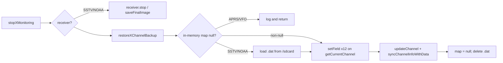
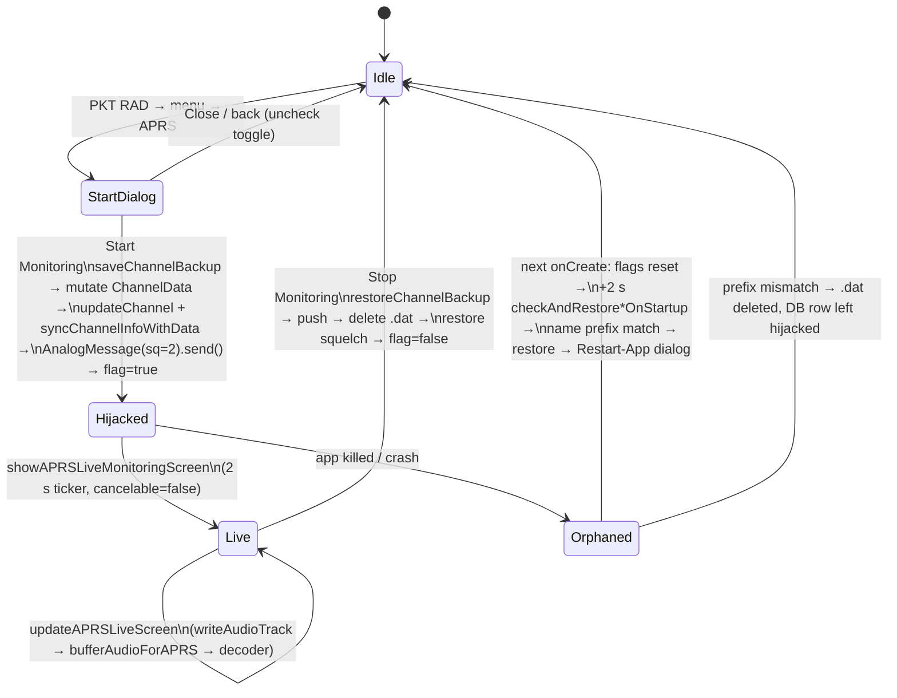

# 09 — DMRModHooks Monitoring Modes: APRS, SSTV, NOAA APT, VFO

**Scope.** The four "monitoring modes" in `MainHook.java` that temporarily *hijack* the radio's active channel: **APRS** (AFSK packet RX), **SSTV** (slow-scan TV image RX), **NOAA APT** (weather-satellite image RX) and **VFO** (free-tune analog/digital TX+RX). All four share one technique — mutate the in-memory `ChannelData` of the active channel, push it to the MCU, and keep a serialised backup on `/sdcard/` so the original channel can be restored after a normal stop *or* a crash. This chapter documents the shared framework, each mode's UI/lifecycle, the audio plumbing into the decoders, and the places where the code and `.grok/rules/copilot-instructions.md` disagree.

Decoder internals (`AFSKDecoder*`, `APRSPacketDecoder`, `SSTV*Demod`, `SSTVImageDecoder*`, `NOAAReceiver` DSP) are covered in the DSP chapter; codeplug export/import and recording/transcription are in their own chapters. Here they are referenced by name only.

All paths are relative to the repo root `D:\Documents\code\personal\phonedmrapp\`. `MainHook.java` = `DMRModHooks/app/src/main/java/com/dmrmod/hooks/MainHook.java` (16,306 lines, module version `3.4.6` at `MainHook.java:93`).

## Source files / regions

| File / region | Lines | What it holds |
|---|---|---|
| `MainHook.java` static state | 113, 151–152, 183, 192–193, 213–222, 240–306 | Soft-squelch flags, APRS audio buffer, all mode flags, dialog/handler/receiver refs, VFO parameters |
| `isAPRSChannel` | 311–323 | Name-prefix test `"APRS ("` used to hide hijacked channels from lists |
| `handleLoadPackage` reset | 337–346 | One-time APRS static reset when LSPosed loads the module |
| `hookMainActivity` | 1030–1215 | Per-launch Zygisk static reset (1128–1172) + delayed `checkAndRestore*OnStartup` calls (1174–1184) |
| `hookTalkBackFragment` entry buttons | 2524–2654 | `PKT RAD` toggle (→ `showPacketRadioMenu`) and `VFO` toggle (→ `showVFODialog`/`stopVFOMode`) |
| `hookTalkBackFragment.updateUI` hook | 2873–2885 | Skips channel reload while `isVFOModeActive` |
| APRS dialogs | 4227–5382 | Received stations, settings, packet-radio menu, start dialog, live screen + 2 s ticker |
| `createAPRSChannelIfNeeded` | 5387–5448 | **Dead code** (no callers) — legacy "create a real APRS channel" path |
| `startAPRSMonitoring` / `stopAPRSMonitoring` | 5453–5620 | APRS hijack + restore |
| SSTV dialogs | 5626–6545 | Settings, received images, start dialog, live screen (1 s ticker), live-image dialog, decoded-image dialog, PNG save |
| `startSSTVMonitoring` / `stopSSTVMonitoring` | 6551–6779 | SSTV hijack + receiver callbacks + restore |
| Shared (APRS) backup | 6780–6921 | `channelBackup`, `saveChannelBackup`, `*ToFile`, `loadChannelBackupFromFile`, `deleteChannelBackupFile`, `restoreChannelBackup` |
| SSTV backup | 6925–7117 | `saveSSTVChannelBackup`, `restoreSSTVChannelBackup`, `checkAndRestoreSSTVChannelOnStartup` |
| `checkAndRestoreAPRSChannelOnStartup` | 7122–7335 | APRS crash recovery |
| NOAA | 7340–8318 | All NOAA dialogs, pass prediction, start/stop, backup/restore/startup |
| `hookPCMReceiveManager` | 9926–10095 | `writeAudioTrack` hook: clean-audio copy → soft squelch → decoder feeds |
| `enable/disableSoftwareSquelchOnCurrentChannel` | ~10340–10460 | Direct `AnalogMessage.send()` with `sq=0` / `sq=2` |
| `hookDmrManager` | 10521–10865 | `sendDigitalMessage` hook; `BaseMessage.send()` hook with VFO `localId` override (10798–10804) |
| APRS audio buffer | 10980–11104 | `bufferAudioForAPRS`, `processAPRSBuffer`, `resample16to48` |
| `sendAnalogMessage` before-hook | ~12330–12360 | Forces `sq=0` on every analog channel program while soft-squelch is on |
| Channel-list hiding | 12426–12570 | `isAPRSChannel` filter in channel count/get hooks |
| VFO | 14611–16182 | `showVFODialog`, `showVFOControlDialog`, `applyVFOChanges`, `startVFOMode` (**dead**), `stopVFOMode`, backup/restore, `sendVFOChannelToHardware`, nav lock, `determineBand`, `checkAndRestoreVFOChannelOnStartup` |
| `APRSReceiver.java` | 1–81 | `processAudio(short[], int)` → `AFSKDecoder.decode` → `APRSPacketDecoder.decode` → `APRSReceivedDatabase.storeStation` |
| `APRSDatabase.java` | 1–307 | `dmrmod_aprs.db` per-channel table + `dmrmod_aprs_global` SharedPreferences |
| `APRSReceivedDatabase.java` | 1–524 | `dmrmod_aprs_received.db`, TXT/GPX auto-export |
| `LocationDatabase.java` | 1–144 | `dmrmod_locations.db` per-channel lat/lon/elev (used by the channel-location feature at `MainHook.java:3191`, **not** by APRS mode) |
| `SatellitePassPredictor.java` | 1–541 | J2-secular "SGP4-lite" pass finder, bundled TLEs, Celestrak/SatNOGS refresh |
| `NOAAReceiver.java` | 1–826 | APT AM demod → 4160 Hz → line sync → Bitmap; auto-save; WAV capture |
| `SSTVReceiver.java` | 1–1262 | VIS detect (bg thread) → streaming decode (audio thread) → PNG save |
| `SSTVMode.java` | 1–172 | 12 mode definitions keyed by VIS code |
| OEM `manager/DmrManager.java` | 189–303, 329–360 | `syncChannelInfo`, `syncChannelInfoWithData`, `updateChannel`, `createChannel`, `getCurrentChannel`, `getLocalId`, `sendDigitalMessage` |
| OEM `serial/data/ChannelData.java` | 25–50 | Public fields mutated by the hijack |
| OEM `message/AnalogMessage.java`, `DigitalMessage.java` | 82–178 / 16, 79–80, 133 | Setters used for direct sends; `localId` field |

---

## 1. Common mode framework

### 1.1 Mode flags and per-mode static state

| Mode | Active flag | Dialog / handler / receiver refs | Backup map (instance field) | Backup file |
|---|---|---|---|---|
| APRS | `isAPRSMonitoringActive` (`MainHook.java:244`) | `aprsMonitoringDialog`, `aprsUpdateHandler`, `aprsUpdateRunnable`, `aprsRssiDisplayTextView` (247–252); toggle `aprsMonitoringToggleButton` (216) | `channelBackup` (6780) | `/sdcard/aprs_channel_backup.dat` (6816) |
| SSTV | `isSSTVMonitoringActive` (265) | `sstvMonitoringDialog`, `sstvUpdateHandler`, `sstvUpdateRunnable`, `sstvReceiver` (267–270); live-image refs `sstvImageDialog`, `sstvLiveImageView`, `sstvProgressText`, `sstvImageModeText` (273–276) | `sstvChannelBackup` (6925) | `/sdcard/sstv_channel_backup.dat` (6948) |
| NOAA | `isNOAAMonitoringActive` (279) | `noaaMonitoringDialog`, `noaaUpdateHandler`, `noaaUpdateRunnable`, `noaaReceiver`, `noaaLiveImageView`, `noaaProgressText`, `noaaTimerText`, `noaaColorModeButton`, `noaaSignalStartTime` (280–288) | `noaaChannelBackup` (289, **static**) | `/sdcard/noaa_channel_backup.dat` (8171) |
| VFO | `isVFOModeActive` (255) | `vfoDialog`, `vfoModeToggleButton` (256–257) | `vfoChannelBackup` (306, **static**) | `/sdcard/vfo_channel_backup.dat` (15696) |

All four flags are `private static volatile boolean`. Because LSPosed/Zygisk keeps the module's static state alive across target-app restarts (Pitfall 14), every one of them is force-reset in `InterPhoneHomeActivity.onCreate` (see §1.8).

Additional shared state: `currentChannelType` (`MainHook.java:113`, 0 = digital, 1 = analog) is overwritten by every mode on start (`5505`, `6693`, `8087`, `15165`/`15466`) and by VFO restore (`15845`); `appClassLoader` (`246`) is captured in `handleLoadPackage` (`337`) and used by every `XposedHelpers.findClass` in mode code.

### 1.2 Mutual exclusivity (what the code actually enforces)

There is **no central guard**; each entry point does its own partial check:

| Entering | Checks / actions | Lines |
|---|---|---|
| APRS start | None against SSTV/NOAA/VFO. Turns off intercom Soft SQ, REC MON and TXT toggles first | `4787–4817` |
| SSTV start | `if (isAPRSMonitoringActive) stopAPRSMonitoring()` — nothing for NOAA/VFO | `6556–6559` |
| NOAA start | `if (isAPRSMonitoringActive) stopAPRSMonitoring(); if (isSSTVMonitoringActive) stopSSTVMonitoring();` — nothing for VFO | `8013–8014` |
| VFO open | `if (isAPRSMonitoringActive) { toast; uncheck VFO button; return; }` — nothing for SSTV/NOAA | `14614–14620` |

Consequence: SSTV → NOAA and APRS → NOAA chain-stop correctly; **VFO can be started on top of SSTV/NOAA, and SSTV/NOAA can be started on top of VFO** — each will back up the *already-hijacked* channel and the later restore will write the earlier mode's temporary values back into the database (see §7.2).

### 1.3 The channel-hijack technique

Every mode grabs the *live* `ChannelData` object from `DmrManager.getInstance().getCurrentChannel()` (`DmrManager.java:280–291` — the entry with `active == 1` in the cached `channels` list) and mutates its public fields in place with `XposedHelpers.setIntField/setObjectField`. Fields touched per mode:

| `ChannelData` field (`ChannelData.java:25–50`) | APRS (`5481–5494`) | SSTV (`6588–6602`) | NOAA (`8039–8050`) | VFO (`15168–15250`) |
|---|---|---|---|---|
| `type` | 1 (analog) | 1 | 1 | `vfoChannelMode` (0/1) |
| `name` | `"APRS (" + orig + ")"` | `"SSTV (" + orig + ")"` | `"NOAA (" + orig + ")"` | `"VFO-FM 146.5200"` / `"VFO-DMR …"` |
| `rxFreq` / `txFreq` | `aprs_frequency` Hz | `sstv_frequency` Hz | `noaa_frequency` Hz | `vfoFrequencyMHz` Hz (simplex) |
| `sq` | 2 | 2 | 2 | untouched |
| `band` | hard-coded 1 (VHF) | `determineBand()` | `determineBand()` | `determineBand()` |
| `channelMode` | 0 (12.5 kHz NFM) | 0 | **1 (25 kHz WFM)** | untouched |
| `power` | 1 (high) | 1 | 1 | `vfoPowerLevel` |
| `rxType/rxSubCode/txType/txSubCode` | 0/0/0/0 | 0/0/0/0 | 0/0/0/0 | `vfoRx/TxToneType`, `vfoRx/TxToneCode` (analog only) |
| `contactType, txContact, cc, inBoundSlot, outBoundSlot, groups, encryptSw, encryptKey` | – | – | – | digital only (`15190–15243`) |

Then the modified object is pushed to hardware. **This differs per mode** — it is the most important table in the chapter:

| Mode | Push on start | Extra direct send | Push on restore |
|---|---|---|---|
| APRS | `dmrManager.updateChannel(ch)` + `dmrManager.syncChannelInfoWithData(ch)` (`5501–5502`) | Yes — builds `AnalogMessage`, copies band/power/freqs/tones, `setSq((byte)2)`, `.send()` (`5515–5545`) | `updateChannel` + `syncChannelInfoWithData` (`6909–6910`) |
| SSTV | same (`6605–6606`) | Yes — identical `AnalogMessage` block, `sq=2` (`6700–6733`) | same, wrapped in try/catch (`7000–7005`) |
| NOAA | same (`8053–8054`) | **No** direct send | same (`8213–8218`) |
| VFO | `sendVFOChannelToHardware(ch, mode)` (`15259`): analog → `AnalogMessage` with `setRelay` + `sq=2`, `.send()` (`15865–15895`); digital → `dmrManager.updateChannel(ch)` only (`15898–15919`) | – | analog: `sendVFOChannelToHardware(ch,1)` + `getCurrentDbHelper().updateChannel(ch)` + `updateChannelList()` — **deliberately no `syncChannelInfo`** (`15826–15836`); digital: `updateChannel(ch)` (`15838–15842`) |

What the OEM calls do (`DmrManager.java`):
- `updateChannel(ChannelData)` (`253–257`) = write row to the current channel DB → `updateChannelList()` (reload cache + notify listeners) → `syncChannelInfo(channelData)` (`189–195`), which only proceeds if `active == 1` and then calls `syncChannelInfo()` (`197–205`) — starts `CmdStateMachine`, `transitionToSetChannelStateState()`, **`setChannelData(null)`**, message 10.
- `syncChannelInfoWithData(ChannelData)` (`207–215`) = same state-machine kick but with `setChannelData(channelData)` so the machine programs *this* object rather than re-reading.
- Because `updateChannel` writes the hijacked values **into the SQLite channel row**, the hijack is persisted on disk until restore — that is why crash recovery is needed at all.
- The direct `AnalogMessage.send()` exists because the state machine is "unreliable" (`5513–5514`) and the firmware only honours `sq ∈ {0, 2}` (Hard Constraints table, `copilot-instructions.md:74`).

### 1.4 Name-wrapping convention and nesting guard

- Prefixes: `"APRS ("`, `"SSTV ("`, `"NOAA ("` (wrap original name in parentheses); VFO uses `"VFO-FM "`/`"VFO-DMR "` + `%.4f` MHz (`15170–15172`). Startup recovery also accepts a legacy `"VFO ("` prefix (`16090`).
- Original name comes from the backup map (`channelBackup.get("name")`, `5482–5484`), defaulting to `"Channel"` if null/empty.
- `isAPRSChannel` (`311–323`) is the only prefix helper; it drives channel-list hiding in the channel-fragment hooks (`12426–12570`) so a stuck `"APRS (…)"` row is not shown or counted.
- **Nesting guard:** SSTV has a comment "strip was done there" (`6589`) but `saveSSTVChannelBackup` (`6927–6957`) performs **no strip** — none of the four `save*Backup` methods check for an existing prefix. Double-wrapping (`"SSTV (APRS (Ch1))"`) is possible if a mode is started on an already-hijacked channel. See doc drift §8.

### 1.5 Backup file format

All four files are `java.io.ObjectOutputStream.writeObject(HashMap<String,Object>)` (Java serialisation; values are boxed `Integer`/`String`/`Boolean`). Keys:

| Key | APRS `saveChannelBackup` (`6785–6809`) | SSTV (`6927–6957`) | NOAA (`8147–8177`) | VFO (`15609–15689`) |
|---|---|---|---|---|
| `number`, `type`, `name`, `rxFreq`, `txFreq`, `sq`, `band`, `power` | ✔ | ✔ | ✔ | ✔ |
| `rxType`, `rxSubCode`, `txType`, `txSubCode` | ✔ | ✔ (try/catch → 0) | ✔ (try/catch → 0) | ✔ (only read when `type==1`, else 0) |
| `channelMode` | ✘ | ✘ | ✔ (try/catch → 0) | ✘ |
| `contactType`, `txContact`, `colorCode` (from field `cc`), `inBoundSlot`, `outBoundSlot` | ✘ | ✘ | ✘ | ✔ (read when `type==0`; defaults 1/9/1/1/1 otherwise) |
| `localId` | ✘ | ✘ | ✘ | only written (=1) in the analog-channel branch (`15672`); never read back |
| `wasSoftwareSquelchEnabled` (Boolean), `savedSquelchThreshold` | ✘ | ✘ | ✘ | ✔ (`15677–15678`) |

Restore writes back the same keys (`restoreChannelBackup 6869–6921`, `restoreSSTVChannelBackup 6959–7012`, `restoreNOAAChannelBackup 8180–8224`, `restoreVFOChannelBackup 15749–15857`), including `number` — so if the user changed channel while a mode was active, the *new* active channel row is overwritten with the backed-up one (Pitfall 10-adjacent desync; see §7.2). APRS/SSTV never restore `channelMode`, so a 25 kHz channel hijacked by APRS/SSTV (which set `channelMode=0`) comes back as 12.5 kHz.

### 1.6 Restore logic (normal stop)



Differences: APRS and VFO restore **only** from the in-memory map (`6872–6875`, `15752–15755`); SSTV and NOAA fall back to reading the file (`6961–6975`, `8182–8192`). VFO additionally restores `isSoftwareSquelchEnabled`/`softwareSquelchThreshold` from the map (`15810–15817`) and sets `currentChannelType` (`15845`).

### 1.7 Startup crash-recovery dialog

`hookMainActivity` posts a 2 s delayed runnable (`1176–1184`) that calls, in order, `checkAndRestoreAPRSChannelOnStartup`, `…SSTV…`, `…VFO…`, `…NOAA…`. Each follows the same shape:

1. If the `.dat` file does not exist → return (`7131–7134`).
2. Set `shouldDeleteBackup = true` — the file is **always deleted in `finally`** unless the restore path already did (`7327–7334`, `7108–7114`, `8311–8316`, `16176–16180`).
3. `DmrManager.getInstance()` / `getCurrentChannel()` null → log and return (file still deleted).
4. Name-prefix test on the **current channel name** (`"APRS ("`, `"SSTV ("`, `"NOAA ("`, `"VFO-"`/`"VFO ("`). Only then is the file loaded and the fields restored + pushed.
5. Show a non-cancelable `AlertDialog` "⚠️ … Channel Restored" / "VFO Mode Crash Recovery" whose only button is **Restart App**: builds a launch intent, schedules it 100 ms out via `AlarmManager.set(RTC, …, PendingIntent FLAG_ONE_SHOT|FLAG_IMMUTABLE)` and calls `System.exit(0)` (`7230–7290`, `7060–7092`, `8262–8294`, `16111–16158`).

APRS's version also logs BEFORE/AFTER field dumps (`7170–7203`) and wraps the state-machine push in its own try/catch because the machine may not be ready 2 s after `onCreate` (`7207–7215`). Note the prefix check means: if the app crashed *and the user changed channel on the radio before relaunch*, the backup is silently deleted and the hijacked row stays in the DB.

### 1.8 Zygisk static-state reset

`hookMainActivity.beforeHookedMethod` (`1128–1172`) runs on every `InterPhoneHomeActivity.onCreate`:
- APRS: flag false, `aprsAudioBuffer.clear()`, null dialog/handler/runnable/RSSI view (`1129–1138`).
- VFO: `isVFOModeActive=false` (logged as "stuck"), `vfoDialog=null` (`1142–1147`). **`vfoLocalId` is intentionally not reset** (comment at `15543`).
- SSTV: flag, dialog, handler, runnable, `sstvReceiver`, all four live-image refs (`1150–1161`).
- NOAA: flag, dialog, handler, runnable, `noaaReceiver`, image/progress/timer views, `noaaSignalStartTime` (`1164–1172`).
- Also `param.args[0] = null` to discard `savedInstanceState` (`1051–1055`) — prevents fragment-restore crashes after a mode crash.

`handleLoadPackage` (`337–346`) performs a one-time APRS-only reset when LSPosed first loads the module (comment notes it does not run per app restart).

### 1.9 Bottom-navigation lock (VFO only)

`disableBottomNavigation` (`15930–15993`) saves each button's existing `OnClickListener` (via `getListenerInfo().mOnClickListener`) into an Xposed additional-instance field `originalOnClickListener`, then replaces it with a toast-only listener, for (a) the module's own `zoneButton` and (b) the OEM view with resource id `channel`. `enableBottomNavigation` (`15998–16029`) restores the saved listeners. Only VFO uses this pair — **and only from `startVFOMode` (`15508`), which is dead code** (see §5.6); `stopVFOMode` still calls `enableBottomNavigation` (`15586`), which is a harmless no-op. In practice the lock is never engaged; the real guard against channel changes during VFO is the `updateUI` early-return (`2880–2885`).

### 1.10 Software-squelch interplay

Relevant globals: `isSoftwareSquelchEnabled` (`151`, audio-pipeline gate), `softwareSquelchThreshold` (`152`, 0–9, shared by every slider), `isAprsSoftwareSquelchEnabled` (`219`, APRS-page UI mirror), `savedIntercomSquelchThreshold` (`222`, default 5).

| Event | Effect |
|---|---|
| Any analog `sendAnalogMessage` while `isSoftwareSquelchEnabled \|\| isAprsSoftwareSquelchEnabled` | before-hook forces `ChannelData.sq = 0` and re-applies `enableSoftwareSquelchOnCurrentChannel()` after a delay (`~12330–12360`) |
| `hookPCMReceiveManager.writeAudioTrack` | `useSquelch = (isSoftwareSquelchEnabled \|\| isAPRSMonitoringActive) && softwareSquelchThreshold > 0` (`9966`) — APRS mode gates audio **even when the toggle is off** if threshold > 0; decoders always get the pre-mute copy (`9949–9955`, `10068`) |
| APRS start | Intercom Soft SQ/REC/TXT toggles forced off (`4787–4817`); `savedIntercomSquelchThreshold = softwareSquelchThreshold` (`5497`); both flags set false (`5509–5510`) |
| APRS live screen draw | `softwareSquelchThreshold = APRSDatabase.getAprsSquelch()` on **every 2 s redraw** (`5180`) |
| APRS Soft SQ toggle ON | sets both flags, reloads threshold from `aprs_squelch`, `enableSoftwareSquelchOnCurrentChannel()` + 2.5 s re-apply (`5192–5228`) |
| APRS stop | `softwareSquelchThreshold = savedIntercomSquelchThreshold`; updates intercom slider/label via tags `DMR_SQUELCH_SEEKBAR`/`DMR_SQUELCH_VALUE`; unchecks intercom toggle; both flags false (`5574–5601`) |
| SSTV start | both flags false (`6696–6697`); SSTV slider writes `softwareSquelchThreshold` directly and is **not persisted** (`6154`) |
| SSTV stop | **no squelch cleanup** — if Soft SQ was toggled on in the SSTV screen it stays enabled on the restored channel (`6746–6779`) |
| NOAA stop | `if (isSoftwareSquelchEnabled) { false; disableSoftwareSquelchOnCurrentChannel(); }` (`8128–8131`) |
| VFO apply/start | disables Soft SQ if on, hides slider, `disableSoftwareSquelchOnCurrentChannel()` (`15139–15161`) |
| VFO restore | restores `isSoftwareSquelchEnabled` + threshold from backup (`15810–15817`) but does **not** call `enableSoftwareSquelchOnCurrentChannel()` — hardware stays at the `sq` restored from backup |

`enableSoftwareSquelchOnCurrentChannel` sends an `AnalogMessage` with `sq=0` and writes `ChannelData.sq = 0`; `disable…` sends `sq=2` and writes `sq = 2` (`~10378`, `~10448`). Both are analog-only.

### 1.11 Lifecycle state diagram (APRS shown; SSTV/NOAA identical shape)



---

## 2. APRS mode

### 2.1 Entry UI

- Intercom page: `ToggleButton` tag `DMR_PKT_RAD_BUTTON`, text `📡 PKT RAD`, 76×52 dp, right column below MON (`2524–2586`). Its click handler immediately unchecks itself and opens `showPacketRadioMenu` (`2578–2583`) — it is a menu button, but `startAPRSMonitoring`/`stopAPRSMonitoring` still set it checked/unchecked as an "APRS active" indicator (`5548–5550`, `5606–5608`).
- Device/Local page (`addButtonToLayout`, `4078–4221`) adds only Export/Import/RadioID buttons — **no mode entry points there**.

### 2.2 Packet-radio menu — `showPacketRadioMenu` (`4526–4660`)

Title `📡 Packet Radio Modes`; three 60 dp buttons: APRS (green `0xFF00AA00`) → `showAPRSMonitoringDialog`; SSTV (purple `0xFF6B5FD9`) → `showSSTVMonitoringDialog`; NOAA APT (teal `0xFF007B9E`) → `showNOAAMonitoringDialog`; footer "More modes coming soon…"; Close.

### 2.3 Dispatcher — `showAPRSMonitoringDialog` (`4666–4687`)

If active and the live dialog is showing → return; if active → `showAPRSLiveMonitoringScreen`; else `showAPRSStartDialog`.

### 2.4 Start dialog — `showAPRSStartDialog` (`4692–4847`)

| Element | Content / behaviour |
|---|---|
| Status | "⚫ MONITORING INACTIVE…" |
| Statistics | `getStationCount()` total, `getRecentStations().size()` (last hour) from `APRSReceivedDatabase` |
| Info | "auto-logged to text and GPX files in Download/DMR/APRS/" |
| Button `📡 APRS Received` | `showReceivedStationsDialog` |
| Button `⚙️ APRS Settings` | `showAPRSSettingsDialog(activity, onSaved)`; on save dismisses and re-opens the start dialog (`4772–4782`) |
| Positive `Start Monitoring` | force-off intercom Soft SQ (+`disableSoftwareSquelchOnCurrentChannel`), REC MON (+`stopRecording` if recording), TXT; then `startAPRSMonitoring` + `showAPRSLiveMonitoringScreen` (`4785–4824`) |
| Negative `Close` / cancel | unchecks `aprsMonitoringToggleButton` (`4827–4844`) |

### 2.5 Settings — `showAPRSSettingsDialog` (`4378–4520`)

Fields (all via `APRSDatabase`, prefs file `dmrmod_aprs_global`, `APRSDatabase.java:28–34`):

| Control | Pref key | Validation | Default |
|---|---|---|---|
| Callsign (caps) | `callsign` | ≤ 6 chars, upper-cased | `N0CALL` |
| SSID | `ssid` | 0–15 | 7 |
| APRS Frequency (MHz) | `aprs_frequency` | 1.0–999.999 (string stored) | `"144.390"` |

Not exposed in this dialog but present in prefs: `default_symbol_table` (`'/'`), `default_symbol_code` (`'['`), `aprs_squelch` (default 1, set from the live-screen slider). The info text explicitly says RX-only.

### 2.6 Live screen — `showAPRSLiveMonitoringScreen` / `updateAPRSLiveScreen` (`4852–5382`)

Dialog "📡 APRS Live Monitoring", `setCancelable(false)`; positive **Stop Monitoring** → `stopAPRSMonitoring`, cancel ticker, null refs (`4879–4889`); an `OnCancelListener` does the same (`4894–4905`). Ticker: `Handler(mainLooper).postDelayed(…, 2000)` re-arms while active and showing (`4907–4917`). Each tick **rebuilds the whole layout** (`mainLayout.removeAllViews()`, `4928`):

1. Status row (60 %): "🟢 MONITORING ACTIVE / Frequency: X MHz / Receiving APRS packets…" + RSSI box (40 %) showing `📶 <currentRssi> dBm` or invisible when `-999` (`4947–5007`).
2. `Soft SQ` toggle (blue, 90×40 dp) bound to `isAprsSoftwareSquelchEnabled` (`5012–5060`, listener `5192–5241`).
3. "Software Squelch:" slider 0–9, initial value `getAprsSquelch()`; drag updates `softwareSquelchThreshold`; release persists via reflection `setAprsSquelch` + toast (`5063–5177`).
4. Stats: total, last hour, last 5 min (`5244–5263`).
5. Up to 10 recent stations as underlined links `📡 CALL-SSID - Ns ago / lat, lon` → `geo:lat,lon?q=…(CALL)` intent (`5266–5323`); else "Waiting for APRS packets…".
6. Footer "💾 Auto-logging to: Download/DMR/APRS/", divider, `APRS Received` and `APRS Settings` buttons (`5326–5376`).

Because the slider is recreated every 2 s, a slider drag longer than the tick is interrupted; `softwareSquelchThreshold` is also re-read from prefs each tick (`5180`).

### 2.7 Received-stations dialog — `showReceivedStationsDialog` (`4227–4368`)

Lists `getRecentStations()` (last hour, `APRSReceivedDatabase.java:195–236`). Per station: `📡 CALL-SSID`, `🕐 time-ago`, clickable `📍 lat, lon` → `station.getMapUrl()` (`geo:` URI, `APRSReceivedDatabase.java:106`), `⛰ alt m` if > 0, `💬 comment`. Buttons: `Clear All` → `db.clearAll()`, `Close`. Empty state explains the TXT/GPX export. **No distance/bearing is computed** — `currentGpsLocation` (`240`) and `LocationDatabase` are not referenced by any APRS dialog.

### 2.8 `createAPRSChannelIfNeeded` (`5387–5448`) — dead code

Builds a brand-new `ChannelData` named `"APRS"` with `number = max+1`, `sq=1`, `band=1`, `active=1`, inserts via `dmrManager.createChannel("default", ch)` + `updateChannelList()`. It has **no callers** (grep shows only the definition); the hijack in `startAPRSMonitoring` replaced it. `isAPRSChannel` would not even match its `"APRS"` name (needs `"APRS ("`).

### 2.9 Start / stop — `startAPRSMonitoring` (`5453–5560`), `stopAPRSMonitoring` (`5566–5620`)

Start: read `aprs_frequency` → Hz; `getCurrentChannel` (throws if null); `saveChannelBackup`; mutate fields (§1.3, note `band` hard-coded 1 even for a UHF frequency); save intercom threshold; `updateChannel` + `syncChannelInfoWithData`; flag + `currentChannelType=1`; both Soft-SQ flags false; direct `AnalogMessage` `sq=2` send; toggle checked; toast. No receiver object is created — APRS decoding is driven entirely from `hookPCMReceiveManager`.

Stop: `restoreChannelBackup`; restore threshold + intercom slider/label; uncheck intercom Soft SQ; flags false; `isAPRSMonitoringActive=false`; uncheck toggle; reset `isAPRSSquelchOpen`/`aprsStoredSquelch` (unused elsewhere); toast.

### 2.10 Audio path

```mermaid
flowchart LR
  A[PCMReceiveManager.writeAudioTrack\nbyte[] 16-bit LE mono 16 kHz] -->|copy before mute 9949| B[bufferAudioForAPRS 10980]
  B -->|List&lt;Short&gt; aprsAudioBuffer\n≥ APRS_BUFFER_SIZE 32000 = 2 s| C[processAPRSBuffer 11008]
  C -->|resample16to48 linear interp ×3 11080| D[new Thread]
  D -->|context from mLocalViewObject| E[APRSReceiver.processAudio 48 kHz short[]]
  D -->|no context| F[AFSKDecoder.decode only logs]
  E --> G[AFSKDecoder.decode → AFSKDecoderIQ.demodulateAFSK\nAFSKDecoder.java:49,192 SAMPLE_RATE=48000]
  G --> H[APRSPacketDecoder.decode per AX.25 frame]
  H -->|isValid| I[APRSReceivedDatabase.storeStation]
  I --> J[exportToTextFile → CALL-SSID.txt append]
  I --> K[exportSingleCallsignToGPX → CALL-SSID.gpx rewrite]
  C -->|keep last 8000 samples 0.5 s overlap| B
```

Rates: the radio delivers **16 kHz** PCM (`APRS_BUFFER_SIZE` comment `193`; `MAX_BUFFER_SIZE` = 30 s at 16 kHz `183`); `resample16to48` (`11080–11104`) triples it because `AFSKDecoder.SAMPLE_RATE = 48000` (`AFSKDecoder.java:24`). `APRSReceiver.processAudio` ignores inputs shorter than 4800 samples (`APRSReceiver.java:34`). When not in APRS mode the buffer is also flushed on `RECEIVE_STOP` (`8526–8529`) — but since `bufferAudioForAPRS` only runs while active, the buffer is normally empty there. Every call logs two lines (`10982`, `10987`) — noisy at ~15 calls/s.

Outputs under `/sdcard/Download/DMR/APRS/` (`APRSReceivedDatabase.java:267–402`):
- `CALLSIGN-SSID.txt` — append-only log; header on first create; per packet: callsign, time (`yyyy-MM-dd HH:mm:ss`), position `%.6f, %.6f`, altitude m, symbol table+code, comment, channel number.
- `CALLSIGN-SSID.gpx` — fully rewritten from the DB each packet; GPX 1.1 `<trk><trkseg><trkpt lat lon><ele><time ISO-Z><desc>`.
- `aprs_tracks.gpx` (all stations) exists via `exportToGPX()` (`408`) but is not called from mode code.

Databases: `dmrmod_aprs_received.db` table `received_stations` (v2, keeps full history, `APRSReceivedDatabase.java:27–43`); `dmrmod_aprs.db` table `channel_aprs(channel_number, enabled, comment, symbol_table, symbol_code)` with `isEnabled/setEnabled/getChannelSettings/saveChannelSettings` (`APRSDatabase.java:20–25, 189–290`) — the **per-channel enable flag is not consulted anywhere in the four modes**; it belongs to the (never-shipped) TX feature.

### 2.11 Why there is no APRS TX

The Hard Constraints table (`copilot-instructions.md:70`) records that APRS TX over this radio's analog FM path is impossible: the voice-optimised DSP chain destroys AFSK (96 % → 27 % of AFSK energy survives), six injection methods were tested and none decoded at the far end; `AFSKGenerator.java` is retained only as reference and an external TNC or different radio is required. The settings dialog therefore states "📡 RX-Only Mode" (`4453`), the callsign/SSID/symbol prefs exist for logging/identification only, and nothing in `MainHook.java` keys an AFSK transmit.

---

## 3. SSTV mode

### 3.1 Settings — `showSSTVSettingsDialog` (`5630–5721`)

Prefs `dmrmod_sstv_global`, key `sstv_frequency` (string, default `"144.500"`, `5633–5634`). Validation: VHF 136–174 or UHF 400–520 MHz (`5695–5706`). Info text (`5680–5681`) lists `Download/DMR/SSTV/` and "Supported Modes: Scottie, Martin, Robot, PD, Wraase" — `SSTVMode.java` defines **no Wraase mode** (12 modes: Robot 36/72/8BW/12BW/24C, Martin M1/M2, Scottie S1/S2/DX, PD 120/180; `SSTVMode.java:72–95`).

### 3.2 Start dialog — `showSSTVStartDialog` (`5839–5955`)

Status text with current frequency; "Supported Modes (Phase 1 – VIS Detection)" list; orange "Phase 1 … Image decoding coming in Phase 2!" (stale — streaming decode is implemented); licence note; buttons `📺 SSTV Received Images` → `showSSTVReceivedImagesDialog`, `⚙️ SSTV Settings` (re-opens start dialog on save); positive **Start Monitoring** → `startSSTVMonitoring` + `showSSTVLiveMonitoringScreen`; `Close`. Unlike APRS, no toggle state to reset.

### 3.3 Live screen — `showSSTVLiveMonitoringScreen` / `updateSSTVLiveScreen` (`5960–6330`)

Dialog "📺 SSTV Live Monitoring", non-cancelable, positive **Stop Monitoring**; **1 s** ticker (`5993–6005`), full rebuild each tick. Content:

| Block | Source |
|---|---|
| "🟢 MONITORING ACTIVE / Frequency / HW Squelch: 2" | prefs (`6022–6025`) |
| `Soft SQ` toggle (green/gray, full width) bound to `isSoftwareSquelchEnabled` | `6033–6060`, listener `6184–6207` (enable + 2.5 s re-apply / disable) |
| SQ slider 0–9 → `softwareSquelchThreshold` (not persisted) | `6070–6170` |
| "● Signal: N dBm" green when `\|currentRssi\| < 95` | `6210–6217` |
| "Decoder Status:" `sstvReceiver.getStatus()`; if `getCurrentMode()` non-null: mode name, WxH, duration s, RGB/YUV; "Audio received: N sec" (`getReceivedDuration`) | `6220–6252` |
| "📷 Decoding <mode> L/T lines (P%)" + "Live image dialog is open ↗", or "📷 Real-time decode ready — listening for VIS…" | `6255–6271` |
| False-positive squelch tip | `6274–6282` |
| `SSTV Received Images`, `SSTV Settings` buttons | `6290–6325` |

### 3.4 Live image dialog — `showSSTVLiveImageDialog` (`6335–6394`) and decoded image — `showSSTVDecodedImage` (`6399–6499`)

On VIS detect: dismiss any previous, title "📡 Receiving: <mode>", mode line `name — W×H RGB/YUV (Ns)`, progress text, black placeholder `Bitmap` of mode size, `Hide` button; refs stored in the four `sstv*` statics. Line callback swaps in the snapshot bitmap and writes "Decoding: L/T lines (P%)" (`6632–6655`). Mode-change callback toasts and re-opens for the new mode (`6658–6677`). On completion `showSSTVDecodedImage` reuses the live dialog (title "✓ SSTV Complete", green status) if showing; otherwise builds a fresh dialog with success text, save-path label, 800 px `ImageView`, `Save Again`/`Close` — and calls `saveSSTVImageToGallery` (`6505–6545`) which writes **a second copy** (`SSTVReceiver` already saved one at `SSTVReceiver.java:1030`) as `SSTV_<ModeNoSpaces>_yyyyMMdd_HHmmss.png` in `/sdcard/Download/DMR/SSTV/` and broadcasts `ACTION_MEDIA_SCANNER_SCAN_FILE`.

### 3.5 Received-images dialog — `showSSTVReceivedImagesDialog` (`5727–5807`)

Lists `*.png`/`*.jpg` in `Download/DMR/SSTV/` newest-first as buttons; tap → `ACTION_VIEW image/png` with `Uri.fromFile` (may hit `FileUriExposedException` on API ≥ 24 — caught as "No image viewer found").

### 3.6 Receiver lifecycle and threads

`startSSTVMonitoring` (`6551–6741`): exclusivity vs APRS only; `saveSSTVChannelBackup`; hijack (§1.3, `determineBand`); `updateChannel`+`syncChannelInfoWithData`; `sstvReceiver = SSTVReceiver.getInstance(activity); reset()` (`6611–6612`) — `reset()` restarts the background detection thread (`SSTVReceiver.java:199–232`); four callbacks registered (`6613–6690`), all marshalled with `runOnUiThread`; flag; Soft-SQ flags false; direct `AnalogMessage` `sq=2`.

`SSTVReceiver` threading (`SSTVReceiver.java`): `processAudio(byte[],int)` (`241`) runs on the AudioTrack write thread with a < 2 ms budget — appends to a 1 MB ring (`34`, ≈32 s at 16 kHz) and, once `streamDecoderInitialized`, feeds 1024-sample chunks inline. A background thread (`313–340`) runs Phase 1 every 500 ms: Goertzel VIS scan + sync-family auto-detect (`416–620`, `626–720`), then initialises Phase 2 and feeds the backlog (`343–414`). A 500 ms timeout checker (`112–170`) aborts false detections (no line in 3.5 × line period), declares end after 3 missed line periods, or 3 s of silence, then `handleTransmissionComplete` (`973–1058`) finalises the streaming bitmap (batch `SSTVImageDecoderIQ` fallback), dumps `/sdcard/sstv_audio.wav`, saves the PNG, fires `onImageDecoded`, and `reset()`s for the next image.

`stopSSTVMonitoring` (`6746–6779`): `sstvReceiver.stop()` (stops timeout checker only, `SSTVReceiver.java:1258–1261` — the background thread is left to its own `bgStop`), `restoreSSTVChannelBackup`, dismiss live-image dialog, null refs, flag false, `sstvReceiver = null`. No squelch cleanup (§1.10).

### 3.7 Backup / restore specifics

`saveSSTVChannelBackup` (`6927–6957`) writes the map and file in one method (no `*ToFile` helper). `restoreSSTVChannelBackup` (`6959–7012`) loads the file when the map is null, null-checks every key, wraps the push in try/catch, deletes the file. `checkAndRestoreSSTVChannelOnStartup` (`7017–7117`) loads the file into `sstvChannelBackup` and delegates to the same restore, so the file is deleted by restore (`shouldDeleteBackup=false`, `7057`).

---

## 4. NOAA APT mode

### 4.1 Settings — `showNOAASettingsDialog` (`7716–7768`)

Prefs `dmrmod_noaa_global`, key `noaa_frequency` (string, default `"137.100"`). Validation 100–180 MHz (`7750–7754`). Lists NOAA-19 137.100 / NOAA-15 137.620 / NOAA-18 137.9125 and the save folder.

### 4.2 Start dialog — `showNOAAStartDialog` (`7358–7443`)

Status text (frequencies, "Images update every ~15 seconds (30 scan lines)", "~15 minutes (1800 lines)"); buttons `⚙️ NOAA Settings`, `🖼️ Received Images` (`showNOAAReceivedImagesDialog`), `📅 Next Satellite Passes` (`showNOAANextPassesDialog`); positive **Start Monitoring** dismisses, `startNOAAMonitoring`, `showNOAALiveMonitoringScreen`; `Close`.

### 4.3 Pass prediction — `showNOAANextPassesDialog` / `showNOAAPassListDialog` (`7771–7946`)

Flow: "Calculating…" dialog → background thread: `SatellitePassPredictor.fetchFreshTles()` (errors swallowed) → `getLastLocation(activity)` (best-accuracy `getLastKnownLocation` over all enabled providers, `SatellitePassPredictor.java:436–457`; falls back to 0°,0° with a warning string) → `findPasses(lat, lon, alt, 3 days, 5.0° min elevation)` → UI.

TLE source (`SatellitePassPredictor.java:467–474`): tried in order `https://celestrak.org/NOAA/elements/gp.php?GROUP=weather&FORMAT=tle`, `https://celestrak.org/pub/TLE/noaa.txt`, `https://db.satnogs.org/api/tle/?format=json`; 8 s connect / 12 s read timeouts, UA `SatPass/1.0`; updates the in-memory `tle15/18/19` arrays (`51–68`, bundled fallback epoch ≈ March 2026, names `NOAA 15/18/19` with `"0 "` prefix tolerated). Nothing is cached on disk.

Algorithm (`177–219`, `321–393`): parse TLE line 1 epoch and line 2 mean elements; precompute J2 secular rates for RAAN, argument of perigee and mean motion; propagate = secular update + Kepler solve + rotation to ECI; observer ECI from lat/lon/alt + GMST; topocentric az/el via SEZ rotation. Coarse scan every 20 s over the window; AOS/LOS refined by bisection (`400–418`); pass kept if `maxEl ≥ minEl` and duration > 30 s; sorted by AOS. Header comment claims ±2–3 min vs full SGP4 (`23`).

Table columns (`7896–7910`): **Satellite | AOS (UTC) | Max El | LOS (UTC) | Dur**; rows grouped by UTC date separators; Max El coloured ≥60° green, ≥30° light-green, ≥15° amber, else grey (`7930–7935`). Empty-state text explains ~14 passes/day per satellite. No "Start Mon" action exists despite the hint "Tap \"Start Mon\" to listen at AOS" (`7882`).

### 4.4 Live screen — `showNOAALiveMonitoringScreen` / `updateNOAALiveScreen` (`7446–7708`)

Built **once** (not rebuilt per tick): `⏱` timer (counts from first decoded line, `noaaSignalStartTime`), progress text ("Calibrating sync…" → `getStatus()` + "(N lines ≈ N/2 sec)"), square `ImageView` `FIT_XY` (width = screen − 80 px), info "Left = Channel A (visible/IR) | Right = Channel B (thermal)", **Soft SQ toggle + slider** (added v3.3.5, `README.md:203–224`; code `7493–7625`, identical semantics to SSTV incl. 2.5 s re-apply), colour-mode button cycling `COLOR_GRAY → COLOR_THERMAL → COLOR_MSA` via `noaaReceiver.setColorMode` and immediate redraw (`7628–7650`), negative **Stop** → `stopNOAAMonitoring`, neutral **Save Now** → `noaaReceiver.saveFinalImage()`; `setCancelable(false)`; 2 s ticker (`7666–7675`) that only refreshes timer/progress/bitmap. The line callback (`8059–8078`) also pushes snapshots every 30 lines.

### 4.5 Receiver and outputs

`startNOAAMonitoring` (`8008–8096`): stop APRS/SSTV; backup; hijack with `channelMode=1` (25 kHz WFM) and `determineBand`; `updateChannel`+`syncChannelInfoWithData` (**no direct `AnalogMessage`**, so hardware `sq` relies on the state machine); `NOAAReceiver.getInstance(activity).reset()`; callbacks; flag; `currentChannelType=1`.

`NOAAReceiver` (`NOAAReceiver.java`): input 16 kHz (`179`), I/Q AM demod of the 2400 Hz subcarrier with two cascaded 1 kHz IIR LPFs, resample to 4160 Hz, 8-line sync calibration then ±30-sample per-line re-lock, 2080 samples/line, pixels 909 A + 909 B = 1818 wide, max 1800 lines (`65–90`). `reset()` (`296–323`) also **starts a diagnostic WAV capture** of the first 90 s of raw PCM to `Download/DMR/NOAA/noaa_pcm_<ts>.wav` (`332–347`). Line callback every 30 lines, auto-save every 300 lines (`680–695`) to `Download/DMR/NOAA/NOAA_<yyyyMMdd_HHmmss>[_thermal|_msa].png` plus a `_gray` twin when a colour mode is active (`757–811`); `saveFinalImage()` = same, returns path, null if 0 lines (`818–821`). `processAudio` is `synchronized` and runs on the audio thread (`450`).

`stopNOAAMonitoring` (`8101–8142`): `saveFinalImage` + `stop()` (frees bitmap, seals WAV), dismiss dialog, null refs, cancel ticker, flag false, disable soft squelch if on, `restoreNOAAChannelBackup`.

`showNOAAReceivedImagesDialog` (`7951–8004`): lists `*.png` in `Download/DMR/NOAA` with size in KB; tap → `ACTION_VIEW` (same `Uri.fromFile` caveat).

### 4.6 Backup / restore

`saveNOAAChannelBackup` (`8147–8177`) is the only backup that records `channelMode`; `restoreNOAAChannelBackup` (`8180–8224`) restores it in a try/catch; `checkAndRestoreNOAAChannelOnStartup` (`8227–8318`) mirrors SSTV. `noaaChannelBackup` is `static` (`289`) unlike `channelBackup`/`sstvChannelBackup` (instance fields on the `MainHook` singleton — equivalent in practice).

---

## 5. VFO mode

### 5.1 Entry

Intercom `ToggleButton` tag `DMR_VFO_TOGGLE`, `🎛️ VFO`, amber, left column below TXT (`2588–2654`). Checked → `showVFODialog`; unchecked → `stopVFOMode`. `showVFODialog` (`14611–14636`) only refuses when APRS is active, then opens `showVFOControlDialog` **without hijacking** — the hijack is deferred to Apply (comment `14623–14628`).

### 5.2 Control dialog — `showVFOControlDialog` (`14642–15094`)

Non-cancelable "📻 VFO Mode". Controls and the static they map to:

| Control | Details | Static |
|---|---|---|
| Mode radio | Analog (FM) / Digital (DMR); toggles the two sub-layouts (`14979–14991`) | `vfoChannelMode` (1 = analog default, `260`) |
| Frequency `EditText` | `%.4f` MHz, decimal keypad | `vfoFrequencyMHz` (146.520) |
| Step buttons | `-5M -500k -25k +25k +500k +5M`; result must fall in 136–174 or **400–480** MHz else toast (`14710–14745`) | – |
| Power radio | Low / High | `vfoPowerLevel` (1) |
| Analog: RX/TX Tones radio | None / CTCSS / DCS — sets `vfoRxToneType=vfoTxToneType` to 0/1/2; **no tone-code selector**, `vfoRxToneCode`/`vfoTxToneCode` stay 0 (`14794–14818`, `15021–15033`) | `vfoRxToneType`, `vfoTxToneType` |
| Digital: Contact Type radio | Private (0) / Group (1) / All Call (2) with helper text (`14831–14903`) | `vfoContactType` (1) |
| Digital: TX Contact | numeric TG or DMR ID | `vfoTxContact` (9) |
| Digital: Color Code | 0–15 (unvalidated) | `vfoColorCode` (1) |
| Digital: Timeslot radio | Slot 1 (0) / Slot 2 (1) | `vfoSlot` (1) |
| Digital: DMR Device ID | prefilled from `vfoLocalId` if > 0 else `PersonSharePrefData.getIntData(ctx,"pref_person_device_id",1)` (`14948–14981`) | `vfoLocalId` (−1) |
| **Apply Changes** | parses all fields, sets statics, `applyVFOChanges`, toast, `vfoDialog=null` (`15003–15070`) | |
| **Exit VFO** / back | `stopVFOMode` (`15073–15089`) | |

Not present in the UI although declared: `vfoBandWidth` (`296`, never read or written anywhere), tone-code selection. Band is auto-detected by `determineBand` (`16034–16046`: 136–174 → 1 VHF, 400–520 → 0 UHF, else VHF with a warning).

### 5.3 `applyVFOChanges` (`15100–15307`)

1. If `!isVFOModeActive`: `saveVFOChannelBackup`, init `vfoLocalId` from system pref if < 0, disable Soft SQ (flag, checkbox tag `DMR_SOFT_SQUELCH_CHECKBOX`, container `DMR_SQUELCH_CONTAINER`, `disableSoftwareSquelchOnCurrentChannel`), set flag and `currentChannelType` (`15117–15166`).
2. Mutate the live `ChannelData`: `type`, `name` `"VFO-FM|DMR %.4f"`, `rxFreq=txFreq`, `band`, `power`; analog tones; or digital block: **All-Call workaround** — `contactType 2 → 1` and `groups[0..30] = TG 1..31, groups[31] = txContact` (`15193–15220`); Group → `groups = [txContact, 0…]` (`15221–15232`); always `encryptSw=2`, `encryptKey=""` to avoid an NPE in `DmrManager.sendDigitalMessage` (`15236–15243`, cf. `DmrManager.java:342`).
3. `sendVFOChannelToHardware(ch, vfoChannelMode)` (`15259`).
4. `talkBackFragmentInstance.updateUI()` (`15257–15264`) — the `updateUI` after-hook returns early while VFO is active (`2880–2885`), so the OEM UI repaints the mutated object but the module's channel-tracking is frozen.
5. Show/hide `DMR_SOFT_SQUELCH_TOGGLE`, MON (`monitoringModeToggle`) for analog; GPS `POS` button for digital (`15267–15296`).

Re-applying while active repeats 2–5 only (no second backup), so successive Apply presses are safe.

### 5.4 `sendVFOChannelToHardware` (`15862–15925`)

Analog: `AnalogMessage` with band/power/freqs, **`setSq((byte)2)` always**, tones, `setRelay`, `.send()`. Digital: `dmrManager.updateChannel(channel)` — persists to DB + state machine (comment: `DigitalMessage` lacks the setter API; v3.1.6 commit "use state machine for proper channel switching").

### 5.5 `localId` override — Pitfall 15

`DmrManager.sendDigitalMessage` builds a `DigitalMessage` with `localId = getLocalId()` (`DmrManager.java:329–331`); `ChannelData` has no such field. The module's override lives in `hookDmrManager` — **not** in the `sendDigitalMessage` before-hook (`10564–10608`, which only handles MON All-mode forcing) but in the later `BaseMessage.send()` before-hook: after reading `localId` (`10778`), `if (isVFOModeActive && vfoLocalId > 0) setObjectField(digitalMessage, "localId", vfoLocalId)` (`10798–10804`). `DigitalMessage.encodeBody` then serialises it at offset 8 (`DigitalMessage.java:133`). `vfoLocalId` survives `stopVFOMode` (`15543`) and the Zygisk reset, so the override persists until the module process dies.

### 5.6 Persisted vs in-memory

| Item | Where |
|---|---|
| All `vfo*` parameters | static fields only (`260–303`); no SharedPreferences |
| Hijacked channel row | **persisted** into the OEM channel DB by `updateChannel` (digital) — analog path only sends `AnalogMessage`, so the DB row is untouched until restore writes it again |
| Backup | `vfoChannelBackup` + `/sdcard/vfo_channel_backup.dat` |

`startVFOMode` (`15312–15530`) duplicates `applyVFOChanges` and additionally calls `disableBottomNavigation` — but it has **no callers** (dead since the "don't start until Apply" refactor, `14623–14628`).

### 5.7 Stop and restore

`stopVFOMode` (`15535–15604`): `restoreVFOChannelBackup`; flag false; `updateUI`; restore button visibility from `currentChannelType`; `enableBottomNavigation` (no-op, §1.9); uncheck toggle; dismiss dialog; toast. `restoreVFOChannelBackup` (`15749–15857`) restores common fields, analog tones if `type==1`, DMR fields (`cc` from key `colorCode`) if `type==0`, squelch flags, then pushes per §1.3 — analog restore deliberately avoids `syncChannelInfo` because leftover digital fields corrupted SharedPreferences (v3.2.2, commit `2a4e49dc`). Toast "VFO Mode exited – channel restored".

### 5.8 Startup recovery

`checkAndRestoreVFOChannelOnStartup` (`16051–16182`): prefix `"VFO-"` or `"VFO ("`, `loadVFOChannelBackupFromFile`, `restoreVFOChannelBackup` (which deletes the file), dialog "⚠️ VFO Mode Crash Recovery" with Restart App. Note `restoreVFOChannelBackup` toasts with the passed `Context` — fine here because the context is the Activity.

### 5.9 The "VFO session fix" and All-Call TX

`copilot-instructions.md:72` says "TX All-Call now works post-VFO-session fix". The code trail: commit `92d5344e` "Fix VFO DMR mode: Color Code field name, DMR ID persistence, and reactivation logic" fixed `cc` (was `colorCode`), made `vfoLocalId` persist across VFO sessions, made `applyVFOChanges` re-initialise VFO when inactive, and removed a conflicting `updateChannel()` call; `068e72f9` (v3.1.6) switched digital push back to the state machine; `2a4e49dc` (v3.2.2) fixed SharedPreferences corruption when starting VFO from an analog channel. The All-Call path itself is the `contactType 2 → GROUP + TG 1–31 list` workaround (`15193–15220`) — RX of group calls remains a firmware limitation, TX with the override `localId` works. No code comment literally says "VFO session fix".

---

## 6. Cross-mode comparison

| | APRS | SSTV | NOAA APT | VFO |
|---|---|---|---|---|
| Default frequency | 144.390 (`APRSDatabase.java:41`) | 144.500 (`5638`) | 137.100 (`7368`) | 146.520 (`261`) |
| Prefs file / keys | `dmrmod_aprs_global`: `callsign, ssid, default_symbol_table, default_symbol_code, aprs_frequency, aprs_squelch` | `dmrmod_sstv_global`: `sstv_frequency` | `dmrmod_noaa_global`: `noaa_frequency` | none (statics) |
| Frequency validation | 1.0–999.999 | VHF 136–174 / UHF 400–520 | 100–180 | steps: 136–174 / 400–480 |
| Backup map / file | `channelBackup` / `aprs_channel_backup.dat` | `sstvChannelBackup` / `sstv_channel_backup.dat` | `noaaChannelBackup` / `noaa_channel_backup.dat` | `vfoChannelBackup` / `vfo_channel_backup.dat` |
| Name prefix | `APRS (` | `SSTV (` | `NOAA (` | `VFO-FM ` / `VFO-DMR ` (+ legacy `VFO (`) |
| Channel type forced | analog | analog | analog | user choice |
| `band` | hard-coded VHF | `determineBand` | `determineBand` | `determineBand` |
| `channelMode` | 0 (NFM) not restored | 0 (NFM) not restored | 1 (WFM) restored | untouched |
| Hardware `sq` | 2 via direct `AnalogMessage` | 2 via direct `AnalogMessage` | 2 via state machine only | 2 (analog direct) / n.a. digital |
| Soft squelch on start | forced OFF (both flags) | forced OFF | untouched | forced OFF + slider hidden |
| Soft squelch on stop | restore threshold, OFF | untouched | OFF + `sq=2` | restore flag+threshold from backup |
| Hardware push | `updateChannel` + `syncChannelInfoWithData` + `AnalogMessage.send` | same | `updateChannel` + `syncChannelInfoWithData` | `AnalogMessage.send` (analog) / `updateChannel` (digital) |
| Decoder | `AFSKDecoder`→`AFSKDecoderIQ` + `APRSPacketDecoder` (48 kHz, via `resample16to48`) | `SSTVReceiver` (16 kHz, Goertzel VIS + IQ streaming decode) | `NOAAReceiver` (16 kHz → 4160 Hz APT) | none |
| Audio feed | `bufferAudioForAPRS` 2 s batches on a new `Thread` | `sstvReceiver.processAudio` inline | `noaaReceiver.processAudio` inline | – |
| Output folder | `Download/DMR/APRS/` `CALL-SSID.txt/.gpx` + `dmrmod_aprs_received.db` | `Download/DMR/SSTV/SSTV_<Mode>_<ts>.png` + `/sdcard/sstv_audio.wav` | `Download/DMR/NOAA/NOAA_<ts>[_thermal\|_msa][_gray].png` + `noaa_pcm_<ts>.wav` | – |
| Dialogs | Packet menu, Start, Live (2 s), Settings, Received stations | Start, Live (1 s), Live image, Decoded image, Settings, Received images | Start, Live (2 s), Settings, Next passes (+loading), Received images | Control dialog |
| Live dialog cancelable | no | no | no | no |
| Bottom-nav lock | – | – | – | intended, dead (§1.9) |
| Startup check | `checkAndRestoreAPRSChannelOnStartup` | `…SSTV…` | `…NOAA…` | `…VFO…` |
| Exclusivity enforced | none | stops APRS | stops APRS, SSTV | refuses if APRS |

---

## 7. Practical

### 7.1 Checklist for adding a fifth mode (derived from what all four do)

1. **State**: `private static volatile boolean isXModeActive`, dialog/handler/runnable/receiver statics, `xChannelBackup` map (`MainHook.java:244–306` pattern).
2. **Zygisk reset**: add flag + every static ref to `hookMainActivity.beforeHookedMethod` (`1128–1172`); consider `handleLoadPackage` too.
3. **Exclusivity**: at start, explicitly stop *all* other modes (`isAPRSMonitoringActive`, `isSSTVMonitoringActive`, `isNOAAMonitoringActive`, `isVFOModeActive`) — none of the existing modes do this completely; also add your flag to their checks.
4. **Backup**: `saveXChannelBackup(channel)` writing `number,type,name,rxFreq,txFreq,sq,band,power,channelMode,rxType,rxSubCode,txType,txSubCode` (+ DMR fields if you may hijack a digital channel) to a map **and** `/sdcard/x_channel_backup.dat` via `ObjectOutputStream`. Copy the NOAA version — it is the most complete.
5. **Name guard**: strip an existing `"APRS (", "SSTV (", "NOAA (", "VFO-"` prefix before wrapping (nobody does this yet — implement it once as a helper and reuse).
6. **Hijack**: mutate the live `getCurrentChannel()` object; `updateChannel` + `syncChannelInfoWithData`; for analog also send a direct `AnalogMessage` with `sq=2` (state machine is unreliable, firmware accepts only 0/2). Use `determineBand`, not a constant.
7. **Squelch save/restore**: save `softwareSquelchThreshold`/`isSoftwareSquelchEnabled` before touching them; on stop restore both, uncheck the intercom toggle (`softwareSquelchToggleButton`) and re-sync the slider via tags `DMR_SQUELCH_SEEKBAR`/`DMR_SQUELCH_VALUE` (APRS stop, `5577–5596`, is the reference).
8. **Audio**: add `if (isXModeActive && xReceiver != null) xReceiver.processAudio(processingAudio, length)` in `hookPCMReceiveManager` after the clean copy (`10068–10084`) and add your flag to the copy condition (`9952–9954`). Keep the audio-thread work < 2 ms (see `SSTVReceiver` comments).
9. **Restore**: `restoreXChannelBackup` that falls back to the file, null-checks keys, pushes, clears map, deletes file; make `stopXMode` idempotent.
10. **Startup**: `checkAndRestoreXChannelOnStartup` with the prefix test + Restart-App dialog; register it in the 2 s delayed runnable (`1176–1184`).
11. **Nav lock**: if the mode must block channel switching, call `disableBottomNavigation`/`enableBottomNavigation` from the *live* start/stop paths, and add the `isXModeActive` early return in the `updateUI` hook (`2880`).
12. **Entry UI**: add a button to `showPacketRadioMenu` (`4526`) or a toggle in `hookTalkBackFragment` (`2524–2654` pattern); wire `startX` → `showXLiveScreen`.
13. **Docs**: update the tables in `copilot-instructions.md` (§ "Mode Flags", "Critical Helper Methods", SharedPreferences, backup files, folders).

### 7.2 Known open issues visible in code/comments

| # | Issue | Evidence |
|---|---|---|
| Pitfall 10 | Soft-SQ tri-state desync (`isSoftwareSquelchEnabled` / `isAprsSoftwareSquelchEnabled` / shared `softwareSquelchThreshold`); APRS overwrites the threshold every 2 s tick | `5180`, `5196`, `copilot-instructions.md:823–826` ("Proper bidirectional sync is still open") |
| Pitfall 13 | Post-channel-change squelch race: `enableSoftwareSquelchOnCurrentChannel` via `postDelayed` can lose to the state machine; the 2.5 s re-apply in every mode's toggle (`5219–5226`, `6194–6199`, `7611–7616`) is a mitigation, not a fix | `copilot-instructions.md:847–850` |
| Exclusivity gaps | VFO ⇄ SSTV/NOAA and APRS ⇄ VFO (from the APRS side) are not guarded; stacking modes backs up hijacked values | §1.2 |
| Restore-to-wrong-channel | Restores write into whatever `getCurrentChannel()` is *now*, including `number`; a channel change during a mode (possible for APRS/SSTV/NOAA — no nav lock) corrupts that row | `6894`, `6986`, `8198`, `15771` |
| `channelMode` loss | APRS/SSTV force NFM and never restore bandwidth | §1.5 |
| Nesting guard missing | Comment claims strip "was done there" but no code strips | `6589` vs `6927–6957`; `copilot-instructions.md:865` |
| Dead code | `createAPRSChannelIfNeeded`, `startVFOMode` (+ therefore `disableBottomNavigation`), `previousChannelBeforeAPRS/STV`, `isAPRSSquelchOpen`, `aprsStoredSquelch`, `vfoBandWidth`, `vfoRx/TxToneCode` (always 0) | grep: no callers/writers |
| SSTV squelch leak | `stopSSTVMonitoring` leaves soft squelch enabled if toggled in-screen | `6746–6779` |
| NOAA no direct `sq` send | Relies on state machine for `sq=2`; other analog modes needed a direct send | `8053–8054` |
| `Uri.fromFile` viewers | SSTV/NOAA image lists use `file://` URIs; `FileUriExposedException` on API ≥ 24 is swallowed as "No image viewer found" | `5779–5789`, `7982–7991` |
| APRS band | `band` hard-coded 1 even for UHF `aprs_frequency` | `5488` |
| Startup prefix dependence | If the user changed channel before relaunch, the backup is deleted and the hijacked DB row remains | §1.7 |
| Log spam | `bufferAudioForAPRS` logs twice per audio callback | `10982`, `10987` |
| Stale UI text | SSTV "Phase 1 … Image decoding coming in Phase 2", "Wraase" listed, NOAA "Tap Start Mon" hint | `5876–5878`, `5681`, `7890` |

---

## 8. Gotchas and doc drift vs `.grok/rules/copilot-instructions.md`

| Doc section / claim | Code reality |
|---|---|
| "Mode Flags (Mutually Exclusive)" (`202–208`) | ⚠️ **Doc drift** — no code enforces full exclusivity; see §1.2 table. |
| "APRS / Squelch UI State": `savedIntercomSquelchThreshold = 2`, `aprsToggleButton`, `softwareSquelchContainer` typed `View` (`217–224`) | ⚠️ Default is **5** (`MainHook.java:222`); the field is `aprsMonitoringToggleButton` (`216`); container is `LinearLayout` (`214`). |
| VFO state block: `vfoFrequencyMHz`, `vfoLocalId`, `vfoBandWidth` declared `volatile` (`244–248`) | ⚠️ None of the `vfo*` settings are `volatile` (`260–303`); `vfoBandWidth` is unused. |
| "Mode-Specific Default Frequencies (hardcoded in MainHook.java)" — APRS 144.390 (`254–260`) | ⚠️ APRS default lives in `APRSDatabase.DEFAULT_APRS_FREQUENCY` (`APRSDatabase.java:41`) and is user-editable; SSTV/NOAA defaults are literal fallback strings at each `getString` call site, not one constant. |
| Critical Helper Methods: `restoreChannelBackup()` "Loaded … on startup if mode flag was left stale" (`564`) | ⚠️ Startup restore is `checkAndRestoreAPRSChannelOnStartup` (`7122`), which inlines the restore rather than calling `restoreChannelBackup`; trigger is the **name prefix**, not the flag (flags are reset before the check). |
| Helper table: `updateAPRSLiveScreen/updateSSTVLiveScreen/updateNOAALiveScreen` are "2-second dialog refresh tickers" (`315`) | ⚠️ SSTV ticks every **1 s** (`5999`). |
| Helper table: `syncChannelInfoWithData` "Refresh UI after backup restore — NOT the right path for hardware writes" (`310`) | ⚠️ It *is* a hardware-write path: it kicks `CmdStateMachine` with the given `ChannelData` (`DmrManager.java:207–215`); every mode uses it for the hijack push. The UI refresh comes from `updateChannelList()` inside `updateChannel`. |
| "7. Mode Exclusivity & Channel Backup" pattern: "Save current channel to SharedPreferences (MUST include localId — see Pitfall 15)" (`625`); "Restore channel from SharedPreferences" (`645`); "Enable software squelch if needed" on activation (`637–639`); "Refresh UI: syncChannelInfoWithData(restoredChannel)" (`652`) | ⚠️ Backups are Java-serialised `HashMap`s on `/sdcard/*.dat`, not SharedPreferences; `localId` must **not** be in the backup (Pitfall 15 itself says so — the two sections contradict); modes force soft squelch **OFF** on start; the restore push is `updateChannel` + `syncChannelInfoWithData`. |
| Pitfall 14: "check for `"APRS ("` / `"SSTV ("` prefix … Name nesting guard: first check if the name already starts with the prefix … extract the inner name" (`852–865`) | ⚠️ NOAA (`"NOAA ("`) and VFO (`"VFO-"`/`"VFO ("`) prefixes are also checked; **no nesting guard is implemented** in any `save*Backup`/`start*` method. |
| Pitfall 15: override is "inside `hookDmrManager.sendDigitalMessage` `beforeHookedMethod` at line ~10458" (`873–879`) | ⚠️ It is in the `BaseMessage.send()` before-hook, `MainHook.java:10798–10804`; the `sendDigitalMessage` hook (`10564–10608`) does not touch `localId`. Line reference is stale. |
| Pitfall 15: "`localId` … populated from `DmrManager.getLocalId()`" | ✔ Confirmed `DmrManager.java:331`. |
| Backup-file table: "`/sdcard/sstv_channel_backup.dat` Loaded by `restoreSSTVChannelBackup()`" etc. (`562–567`) | ✔ Correct for SSTV/NOAA (they load from file); ⚠️ APRS and VFO `restore*` never read the file — only the `checkAndRestore*OnStartup` methods do (`7169`, `16094`). |
| SharedPreferences table lists `dmrmod_aprs_global` keys (`549–550`) | ✔ Matches `APRSDatabase.java:29–34`. |
| Artifact folders table (`571–579`): `DMR/Recordings/`, `/sdcard/DMR/api_key.txt` "OpenAI Whisper" | ⚠️ Outside this chapter's scope but visible: the module creates `Download/DMR/Audio` and `Download/DMR/api_key.txt` with **Google Cloud** Speech instructions (`MainHook.java:1067–1101`). Mode folders (`DMR/APRS`, `DMR/SSTV`, `DMR/NOAA`) are correct; the table omits the diagnostic `noaa_pcm_*.wav` and `/sdcard/sstv_audio.wav` dumps. |
| "Frequently-Hooked OEM Class Paths": `ui.activity.MainActivity`, `ui.fragment.TalkBackFragment` (`319–322`) | ⚠️ Code hooks `com.pri.prizeinterphone.InterPhoneHomeActivity` (`1034`) and `com.pri.prizeinterphone.fragment.InterPhoneTalkBackFragment` (`1225`). |
| README v3.1.5 VFO notes: "Bandwidth (Analog): 12.5 kHz or 25 kHz", "tone type … and code selection" (`README.md:436–437`) | ⚠️ Neither a bandwidth control nor a tone-code picker exists in `showVFOControlDialog`; `channelMode` is not set by VFO and tone codes are always 0. |
| README: "VFO … Analog: Frequency, power, bandwidth, RX/TX tones all functional" (`451`) | ⚠️ Tones are type-only (no code); bandwidth untouched. |
| Hard Constraints: "TX All-Call now works post-VFO-session fix" (`72`) | ✔ Implemented as the GROUP + TG 1–31 workaround (`15193–15220`), not as `contactType=2`; there is no code artefact named "VFO session fix" (see §5.9). |

### Other gotchas

- **`softwareSquelchThreshold` is global.** Every slider (intercom, APRS, SSTV, NOAA) writes the same static; only APRS persists (`aprs_squelch`) and only APRS restores the intercom value on exit.
- **Live dialogs are `setCancelable(false)`** and hold the Activity; rotating or backgrounding the app during a mode leaves the dialog reference dangling — this is why every ref is nulled in `onCreate`.
- **`updateChannel` persists the hijack.** After a crash the *database row* is the hijacked one; recovery depends on the current channel still carrying the prefix.
- **`getCurrentChannel()` can return `channels.get(0)`** when no row is `active` (`DmrManager.java:286–290`); a restore then writes the backup into channel 0's object.
- **APRS mode gates audio regardless of the toggle** (`useSquelch` includes `isAPRSMonitoringActive`, `9966`) whenever `softwareSquelchThreshold > 0` — because the live screen sets the threshold from `aprs_squelch` (default 1), APRS audio is soft-squelched by default even though the toggle shows OFF.
- **Decoders always receive unmuted audio** — the copy at `9949–9955` is taken before the mute, so soft squelch never starves the decoders (Pitfall 7 fixed).
- **`Toast` from background threads**: `restoreVFOChannelBackup` toasts with whatever `Context` it gets; all current callers are on the UI thread.
