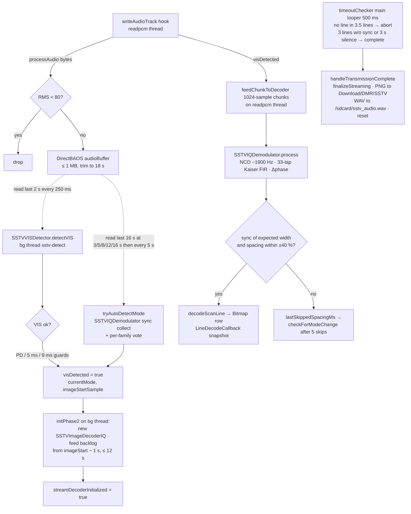
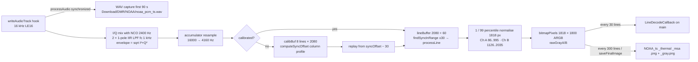

# 12 — Signal Decoders: APRS, SSTV, NOAA APT, DSP helpers, CircuitBoardView

**Scope.** The software demodulators/decoders that DMRModHooks feeds with the radio's RX PCM stream, their interfaces, and the DSP helpers around them. Mode UI/lifecycle (`startXxxMonitoring`, dialogs, channel hijack) is covered in the `MainHook.java` chapter; this chapter covers the decoders themselves and the exact glue that hands them audio.

**Summary.** One hook on `PCMReceiveManager.writeAudioTrack(byte[],int)` delivers 2048-byte, 16-bit LE PCM chunks every ~64 ms. The module treats the stream as **16 kHz mono** (the OEM `AudioTrack` is opened as **8 kHz stereo** — identical byte rate). Three decoders consume it: **APRS** (buffer 2 s → linear-interpolate to 48 kHz → IQ/FIR AFSK demod with a Dire Wolf-style digital PLL → NRZI → HDLC flag / "longest-gap" framing → bit-unstuff → CRC-16-CCITT → AX.25/APRS parse), **SSTV** (Goertzel VIS detector + sync-spacing auto-detect on a background thread, then a streaming IQ FM demodulator ported from xdsopl's *robot36* that paints a `Bitmap` line by line), and **NOAA APT** (I/Q AM demod of the 2400 Hz subcarrier → 4160 Hz → per-line sync re-lock → 1818-px lines, thermal/MSA palettes). Roughly half of the decoder classes in the tree are dead experiments (Goertzel/FFT/zero-crossing SSTV demods, a JNI Dire Wolf shim with no NDK build, an unreferenced PLL class). `.grok/rules/copilot-instructions.md` is stale on several of these points — see §10.

Path shorthands used below:
- `H/` = `DMRModHooks/app/src/main/java/com/dmrmod/hooks/`
- `S/` = `DMRModHooks/app/src/main/java/com/example/dmrmodhooks/sstv/`
- `OEM/` = `app/src/main/java/com/pri/prizeinterphone/`

## Source files

| File | Lines | Status | Role |
|---|---|---|---|
| `H/AFSKDecoder.java` | 477 | **used** | APRS pipeline owner: AGC → (delegates demod to `AFSKDecoderIQ`) → NRZI → flag/longest-gap framing → unstuff → CRC. Also dumps every buffer to `/sdcard/aprs_debug/*.wav`. Its own Goertzel demod is gone. |
| `H/AFSKDecoderIQ.java` | 162 | **used** | Production AFSK demod: IQ mix at 1200/2200 Hz, 32-tap moving-average FIR, envelope subtraction, digital PLL bit clock. |
| `H/AFSKDecoderPLL.java` | 165 | dead | Goertzel-per-bit + Dire Wolf AGC + PLL sketch; returns an empty list (body ends in a comment stub). No references. |
| `H/AFSKGenerator.java` | 244 | reference-only (unreferenced) | Bell 202 AFSK TX audio generator at 8 kHz. No callers anywhere in `DMRModHooks/app/src`; kept per its own header as a reference for external-TNC use. TX proven impossible on this hardware. |
| `H/APRSPacketDecoder.java` | 246 | **used** | AX.25 address/SSID/digipeater/control/PID parse + uncompressed APRS position parse. |
| `H/APRSReceiver.java` | 81 | **used** | Glue: `AFSKDecoder.decode` → `APRSPacketDecoder.decode` → `APRSReceivedDatabase.storeStation`. |
| `H/DireWolfDecoder.java` | 66 | dead | JNI wrapper; `libdirewolf_decoder.so` is never built. |
| `DMRModHooks/app/src/main/cpp/direwolf_jni.cpp`, `CMakeLists.txt` | 75 / 39 | dead | JNI shim with demodulation left as `// TODO`; CMake points at `C:/Users/Joshua/Downloads/direwolf/src`. NDK block commented out in `build.gradle`. |
| `H/SSTVMode.java` | 172 | **used** | Mode DB (12 modes), VIS codes, timings, sync families. |
| `H/SSTVVISDetector.java` | 507 | **used** | Goertzel VIS decoder with purity/CV gates, parity + Hamming correction. |
| `H/SSTVAutoDetector.java` | 163 | **used** (partially) | Sync-spacing mode matcher; `matchToleranceFor()` used by `SSTVReceiver`; `feedSync()` path unused. |
| `H/SSTVReceiver.java` | 1262 | **used** | 1 MB audio buffer, bg detection thread, streaming decode, timeouts, mode-change detection, PNG save. |
| `H/SSTVImageDecoderIQ.java` | 648 | **used** | Production image decoder (streaming + batch) over `S/SSTVIQDemodulator`. |
| `H/SSTVVISResult.java` | 18 | **used** | `(visCode, imageStartSample)` tuple. |
| `S/SSTVIQDemodulator.java` | 214 | **used** | Core: complex NCO mix → Kaiser FIR → phase-diff FM demod → Schmitt sync detector. |
| `S/SSTVComplex, SSTVPhasor, SSTVComplexConvolution, SSTVKaiser, SSTVFilter, SSTVFrequencyModulation, SSTVSimpleMovingSum, SSTVSimpleMovingAverage, SSTVDelay, SSTVSchmittTrigger` | ~10–100 each | **used** | robot36 primitives consumed by `SSTVIQDemodulator`. |
| `S/SSTVExponentialMovingAverage.java` | 63 | dead | Ported but never instantiated. |
| `H/SSTVImageDecoder.java` | 658 | dead | Pre-IQ decoder, hardcoded 8 kHz, uses `SSTVFMDemodRobot36` + `SSTVFFTDemodulator`. No references. |
| `H/SSTVFMDemodRobot36.java` | 146 | dead | Earlier robot36 port (uses `H/` helpers). Only referenced by dead `SSTVImageDecoder`. |
| `H/SSTVFFTDemodulator.java` | 392 | dead | O(N²) DFT per pixel with a "2× frequency correction". |
| `H/SSTVGoertzelDemod.java` | 232 | dead | Goertzel bank per pixel. |
| `H/SSTVZeroCrossingDemod.java` | 164 | dead | Zero-crossing rate per pixel. |
| `H/SSTVPhaseDemod.java` | 189 | dead | Despite the name, zero-crossing with 2× correction. |
| `H/SSTVFilter.java` | 20 | dead | Duplicate of `S/SSTVFilter` (sinc/lowPass). |
| `H/NOAAReceiver.java` | 826 | **used** | APT decoder + PNG/WAV writer. |
| `H/SatellitePassPredictor.java` | 541 | **used** | J2-secular "SGP4-lite" pass finder, TLE fetch. |
| `H/FrequencyModulation.java` | 32 | dead | robot36 phase-diff FM demod; only used by dead `SSTVFMDemodRobot36`. |
| `H/Complex.java`, `H/Phasor.java`, `H/Kaiser.java`, `H/ComplexConvolution.java` | 94/22/43/38 | dead | robot36 helpers; only used by dead `SSTVFMDemodRobot36`. |
| `H/ToneConverter.java` | 221 | **used** (not DSP) | CTCSS/DCS index ↔ string tables for CSV import/export and display. |
| `H/CircuitBoardView.java` | 266 | **used** | Animated PCB/rain/VU-bar background view. |

Dead-ness determined by grep across `DMRModHooks/app/src/main/java`: `AFSKDecoderPLL`, `DireWolfDecoder`, `SSTVImageDecoder` (non-IQ), `SSTVFFTDemodulator`, `SSTVGoertzelDemod`, `SSTVZeroCrossingDemod`, `SSTVPhaseDemod`, `SSTVFMDemodRobot36`, `FrequencyModulation`, `Phasor`, `Kaiser`, `ComplexConvolution`, `SSTVExponentialMovingAverage` have no callers outside their own dead cluster. `SSTVReceiver` imports only `com.example.dmrmodhooks.sstv.SSTVIQDemodulator` (`H/SSTVReceiver.java:11`); `SSTVImageDecoderIQ` imports `com.example.dmrmodhooks.sstv.*` (`H/SSTVImageDecoderIQ.java:6`). **The `com.example.dmrmodhooks.sstv` package is the production SSTV DSP; the `H/` copies of the same helpers are the dead first port.**

---

## 1. Input signal

### 1.1 What the OEM hook delivers

- Hook point: `PCMReceiveManager.writeAudioTrack(byte[] bArr, int i)` (`OEM/manager/PCMReceiveManager.java:124-142`), hooked with `beforeHookedMethod` at `H/MainHook.java:9942-10105`.
- Thread: the OEM `HandlerThread("readpcm")` (`OEM/manager/PCMReceiveManager.java:100-104`); `onRecv(byte[],int)` from `PrizeTinyService` posts each chunk to it (`:42-46`). **The hook therefore runs on the OEM audio thread, not the UI thread.**
- Format as the OEM opens its `AudioTrack`: `DEFAULT_SAMPLE_RATE = 8000`, `DEFAULT_CHANNEL_CONFIG = 12` (= `CHANNEL_OUT_STEREO`), `DEFAULT_AUDIO_FORMAT = 2` (= `ENCODING_PCM_16BIT`) (`OEM/manager/PCMReceiveManager.java:19-22`, `:65-66`). Byte rate = 8000 × 2 ch × 2 B = 32 000 B/s.
- Chunk size: 2048 bytes every ~64 ms (`docs/APRS_DECODING_ISSUES.md:40`; `docs/APRS_TX_PROBLEM.md:203-204` derives 2048 B ÷ 4 B/frame ÷ 8000 Hz = 64 ms).
- How the module interprets it: **16 kHz, mono, 16-bit little-endian** — `APRS_BUFFER_SIZE = 32000; // 2 seconds at 16kHz` (`H/MainHook.java:193`), `sampleRate = 16000` (`H/SSTVReceiver.java:35`), `inputRate = 16000` (`H/NOAAReceiver.java:179`) with the note "inputRate is confirmed at 16000 Hz by spectral analysis" (`H/NOAAReceiver.java:571`). Byte rate is the same 32 000 B/s, so buffer arithmetic is consistent either way. Treating interleaved L/R frames as consecutive mono samples is exact only if L == R (the TX path is described as "convert mono→stereo (duplicate L+R)", `docs/APRS_TX_PROBLEM.md:79`); the earlier SSTV demods that assumed 8 kHz mono all needed a "2× frequency correction" (`H/SSTVFFTDemodulator.java:352-355`, `H/SSTVPhaseDemod.java:61-66`), which is the same fact seen from the wrong side.
- Bytes → shorts everywhere as `(short)((b[i+1] << 8) | (b[i] & 0xFF))` (`H/MainHook.java:10990`, `H/SSTVReceiver.java:249`, `H/NOAAReceiver.java:474`).
- Pre-squelch copy: when any decoder is active, `originalAudio = Arrays.copyOf(audioData, length)` is taken **before** the software squelch may zero the buffer (`H/MainHook.java:9949-9956`, mute via `Arrays.fill(audioData, 0, length, (byte) 0)` at `:10019`); decoders receive `processingAudio` = the copy (`:10068-10084`). Decoders always see unsquelched audio.

### 1.2 Resampling — `resample16to48`

`H/MainHook.java:11080-11103`. Fixed 3× upsample by **linear interpolation**: for each input pair, emit `x[i]`, `(2x[i]+x[i+1])/3`, `(x[i]+2x[i+1])/3`; the last input sample is repeated three times. No anti-imaging filter, integer math (truncating division). Only APRS uses it (`:11026`). Quality is adequate for 1200/2200 Hz tones (images land at ≥ 13.8 kHz, far outside the 32-tap moving-average passband in `AFSKDecoderIQ`).

### 1.3 Rate expected by each decoder

| Decoder | Expected rate | How obtained | Cite |
|---|---|---|---|
| `AFSKDecoderIQ` / `AFSKDecoder` | 48 000 Hz mono | 2 s of 16 kHz buffered in `List<Short>` then `resample16to48` (linear 3×) | `H/AFSKDecoderIQ.java:15`, `H/MainHook.java:193`, `:11026` |
| `SSTVVISDetector`, `SSTVIQDemodulator`, `SSTVImageDecoderIQ` | 16 000 Hz mono | raw stream, no conversion; all timings derived from `sampleRate` ctor arg | `H/SSTVReceiver.java:35`, `:183`, `:347` |
| `NOAAReceiver` | 16 000 Hz in, internally resampled to 4 160 Hz (APT rate) | sample-and-hold accumulator `resampleStep = 4160/16000 = 0.26` | `H/NOAAReceiver.java:199-201`, `:496-502` |
| `AFSKGenerator` (TX, reference) | 8 000 Hz out | n/a | `H/AFSKGenerator.java:27` |
| dead SSTV demods (`SSTVImageDecoder`, `SSTVFMDemodRobot36`, FFT/Goertzel/ZC) | 8 000 Hz hardcoded | — | `H/SSTVImageDecoder.java:17` |

---

## 2. APRS RX chain

### 2.1 Data flow

```mermaid
flowchart LR
  A[writeAudioTrack hook<br/>16 kHz LE16 bytes<br/>readpcm thread] -->|bufferAudioForAPRS| B[List&lt;Short&gt; aprsAudioBuffer<br/>≥ 32000 samples = 2 s]
  B -->|processAPRSBuffer| C[resample16to48<br/>linear 3×]
  C -->|new Thread| D[APRSReceiver.processAudio]
  D --> E[AFSKDecoder.decode]
  E --> E0[saveAudioToWAV<br/>/sdcard/aprs_debug/aprs_rx_NNN.wav]
  E --> F[applyAGC<br/>target RMS 5000, gain ≤ 50]
  F --> G[AFSKDecoderIQ.demodulateAFSK<br/>IQ mix 1200/2200 · 32-tap MA · PLL]
  G -->|boolean bits| H[decodeNRZI]
  H --> I[findPacketBits<br/>0x7E flags · longest gap &gt; 50 bits]
  I --> J[removeBitStuffingFromBits]
  J --> K[LSB-first bytes · verifyFCS CRC-16-CCITT]
  K -->|byte[] minus FCS| L[APRSPacketDecoder.decode<br/>AX.25 addr · UI/0xF0 · position]
  L --> M[APRSReceivedDatabase.storeStation]
```

Buffer overlap: after each 2 s decode the newest 8000 samples (0.5 s) are retained (`H/MainHook.java:11061-11068`). A packet straddling a boundary by more than 0.5 s is lost.

### 2.2 `AFSKDecoderIQ` — demodulator (`H/AFSKDecoderIQ.java`)

| Item | Value | Cite |
|---|---|---|
| Constants | `SAMPLE_RATE 48000`, `BAUD 1200`, `MARK 1200`, `SPACE 2200` | `:15-18` |
| Oscillators | 32-bit phase accumulators, `MARK_PHASE_INC = 2^32·1200/48000`, `SPACE_PHASE_INC = 2^32·2200/48000` | `:30-31`, `:107`, `:119` |
| `fastSin` | top 8 bits of phase → index 0..255 → **calls `Math.sin` each time** (no table; "fast" is a misnomer, but it quantises phase to 256 steps) | `:37-42` |
| Mixer | `I = x·cos(φ)`, `Q = x·sin(φ)` for each of mark and space | `:105-106`, `:117-118` |
| Low-pass | `FIRFilter` = **32-sample moving average** (boxcar), one per I/Q per tone (4 total); first null at 48000/32 = 1.5 kHz | `:27`, `:54-76` |
| Envelope | `amp = sqrt(I²+Q²)` per tone | `:114`, `:126` |
| Slicer | `demodOut = markAmp − spaceAmp; bit = demodOut > 0` | `:129-130` |

PLL (Dire Wolf `demod_afsk` style), same file:

```java
// H/AFSKDecoderIQ.java:21-24, 95, 133-150
TICKS_PER_PLL_CYCLE = 0x100000000L;                       // 2^32
PLL_STEP_PER_SAMPLE = (int)((TICKS_PER_PLL_CYCLE*1200)/48000); // 107374182
PLL_LOCKED_INERTIA = 0.89; PLL_SEARCHING_INERTIA = 0.41;
int pllCounter = (int)(TICKS_PER_PLL_CYCLE / 2);          // start mid-cycle
...
if (demodData != prevDemodData && bitsList.size() > 5)   // on data transition
    pllCounter = (int)(pllCounter * (dataDetect ? 0.89 : 0.41)); // pull toward 0
int prev = pllCounter; pllCounter += PLL_STEP_PER_SAMPLE; // free-running
if (prev > 0 && pllCounter < 0) { bitsList.add(demodData); // sample on wrap
    if (bitsList.size() > 20) dataDetect = true; }
```

The counter is an `int` that wraps every 40 samples (one bit); the bit is sampled at the wrap (nominal bit centre). Transitions multiply the counter toward zero, i.e. re-centre the sampling instant on the edge. `dataDetect` is a crude "have ≥20 bits" flag, not a DCD. State is **not** carried across calls — each 2 s buffer starts cold.

Public API: `static boolean[] demodulateAFSK(short[] samples48k)` (`:81`).

### 2.3 `AFSKDecoderPLL` (`H/AFSKDecoderPLL.java`) — dead

Goertzel state per tone, power computed every `SAMPLES_PER_BIT = 40` (`:34`, `:79-81`), Dire Wolf peak/valley AGC (`:28-29`, `:87-112`, `agc()` `:159-164`), PLL with `TICKS_PER_PLL_CYCLE = 0x80000000` (2^31, `:20`) and same inertias (`:24-25`). `decode()` collects bits then ends with `// ... rest of AFSKDecoder logic ...` and returns an empty list (`:145-153`). Not referenced anywhere.

### 2.4 `AFSKDecoder` — framing pipeline (`H/AFSKDecoder.java`)

Public API: `static List<byte[]> decode(short[] audio48k)` (`:49`) returning FCS-valid frames **without** the 2 FCS bytes (`:117-121`).

Steps (all `static`, called in order from `decode`):

1. `saveAudioToWAV` — writes every buffer to `/sdcard/aprs_debug/aprs_rx_%03d.wav` (48 kHz mono, 44-byte header) with a static counter (`:53-54`, `:426-475`). Always on; ~192 KB per 2 s while APRS is active.
2. `applyAGC` — RMS to target 5000, gain capped at 50×, clip to ±32767 (`:137-182`).
3. `demodulateAFSK` → `AFSKDecoderIQ.demodulateAFSK` (`:187-193`).
4. `decodeNRZI` — `decoded[i] = (enc[i] == prev)`, `prev` starts `true` (`:199-210`). No transition = 1, transition = 0.
5. `findPacketBits` — scans for `01111110` at every bit offset (`:222-227`), then the **longest-gap algorithm**: among consecutive flag positions pick the largest gap > 50 bits; the frame is the bits between `flagStart+8` and the next flag (`:236-263`). Only **one** packet per buffer is ever extracted.
6. `removeBitStuffingFromBits` — drop the 0 following five consecutive 1s (`:276-304`); require ≥ 144 bits (18 bytes) (`:93`).
7. Pack LSB-first (`:96-106`), then `verifyFCS`.

CRC-16-CCITT (reflected, AX.25 FCS):

```java
// H/AFSKDecoder.java:361-379
int crc = 0xFFFF;
for (int i = start; i < start + length; i++) {
    crc ^= data[i] & 0xFF;
    for (int j = 0; j < 8; j++)
        crc = ((crc & 1) != 0) ? (crc >> 1) ^ 0x8408 : crc >> 1;
}
return ~crc & 0xFFFF;
// verifyFCS: transmitted = lo | (hi << 8)  (little-endian)   :392-395
```

`removeBitStuffing(byte[])` (`:309-355`) and `reverseByte` (`:415-421`) are leftover unused helpers.

### 2.5 `APRSPacketDecoder` (`H/APRSPacketDecoder.java`)

Public API: `static APRSPacket decode(byte[] frame)` (`:45`); `APRSPacket` fields `sourceCallsign, sourceSSID, destCallsign, destSSID, String[] digipeaters, dataType, latitude, longitude, altitude (m), comment, symbolTable, symbolCode, isValid, rawInfo` (`:14-40`).

| Step | Detail | Cite |
|---|---|---|
| Length guard | `< 16` bytes → invalid | `:50` |
| Address fields | 7 bytes each: 6 chars `>> 1`, SSID `(b6 >> 1) & 0x0F`, last-address bit `b6 & 1`. Dest first, then source, then 0..n digipeaters until the H/last bit | `:58-77`, `extractCallsign :133-144` |
| Control / PID | must be `0x03` (UI) and `0xF0` (no L3) | `:11-12`, `:85-91` |
| Info field | `new String(bytes)` (platform charset) | `:99` |
| Data types | `!`, `=`, `/`, `@` only; `/`,`@` skip a 7-char timestamp | `:112-117`, `:154-158` |
| Position | uncompressed only: `DDMM.HHN` + table + `DDDMM.HHE` + code (needs ≥ 19 chars) | `:162-183`, `:214-245` |
| Altitude | `/A=nnnnnn` feet → metres, stripped from comment | `:190-203` |
| Not supported | compressed positions, Mic-E (`'`/`` ` ``), messages, objects, weather, telemetry — all logged as "Unsupported data type" | `:114-116` |

### 2.6 `APRSReceiver` (`H/APRSReceiver.java`)

Singleton `getInstance(Context)` (`:22-27`). `processAudio(short[] samples48k, int channelNumber)` (`:32`): requires ≥ 4800 samples (0.1 s) (`:34`); for each frame from `AFSKDecoder.decode` runs `APRSPacketDecoder.decode` and, if `isValid`, `APRSReceivedDatabase.getInstance(context).storeStation(pkt, channel)` (`:41-59`). `showNotification` is a TODO that only logs (`:75-80`). When no `Context` is reachable, `MainHook` calls `AFSKDecoder.decode` directly (log-only) (`H/MainHook.java:11048-11053`).

### 2.7 `DireWolfDecoder` + JNI — what exists, why disabled

- Java: `System.loadLibrary("direwolf_decoder")` in a static block (`H/DireWolfDecoder.java:12-19`); `native String[] nativeDecodeAudio(short[], int)` (`:28`); `decodeAudio` converts hex strings → bytes (`:33-52`).
- C++: registers a `app_process_rec_packet` callback that hex-encodes frames (`cpp/direwolf_jni.cpp:23-34`) and a JNI entry that **never calls the demodulator** — initialisation and the sample loop are `// TODO` (`:52-60`).
- CMake: `DIREWOLF_ROOT "C:/Users/Joshua/Downloads/direwolf/src"` (`cpp/CMakeLists.txt:6`) and 10 Dire Wolf sources (`:9-20`) — not in the repo.
- Gradle: "NDK configuration for Dire Wolf decoder - DISABLED, using pure Java PLL implementation" with the `ndk {}` / `externalNativeBuild {}` blocks commented out (`DMRModHooks/app/build.gradle:16-35`).
- Rationale: `docs/DIREWOLF_INTEGRATION.md` weighed full integration (A, `:22`), extracting the core algorithm (B, headed "Recommended", `:34`) and fixing the existing Java decoder (C, `:46`); its closing recommendation (`:57-59`) is "try C first, fall back to B". What shipped is effectively B done in Java: `AFSKDecoderIQ` copies Dire Wolf's IQ-mix + LPF + PLL structure.

### 2.8 `AFSKDecoder`'s Goertzel — why abandoned

`docs/APRS_DECODING_ISSUES.md:6,63` records "100 % FCS verification failures after 40+ different decoding attempts" with a Goertzel-per-bit demod (`:43`) despite flags being found. The fix was to copy Dire Wolf's structure: continuous IQ mixing + low-pass + PLL clock recovery instead of block Goertzel (comment at `H/AFSKDecoderIQ.java:7-11`, `H/AFSKDecoder.java:184-193`). The Goertzel code survives only in dead `AFSKDecoderPLL`.

### 2.9 `AFSKGenerator` — what it generates, why TX fails

`H/AFSKGenerator.java`: Bell 202 at `SAMPLE_RATE = 8000`, 100 % amplitude (`:27`, `:34`). `generateAFSK(byte[])` (`:47-100`) is a naive **non-NRZI** direct mapping (comment `:78-80`). `generateAFSKWithNRZI(byte[] frame)` (`:111-164`) is the correct one: 50 preamble + 10 trailing `0x7E` flags, NRZI toggle on 0 (`:188-190`), continuous phase, floating-point cumulative bit timing to avoid the 6 vs 6.667 samples/bit drift (`:192-208`), bit-stuffing on frame bytes only (`:211-221`). Getters `getSampleRate/getTxDelayMs/getTxTailMs` (`:227-243`).

Why it is reference-only (`docs/APRS_TX_INVESTIGATION_FINAL_REPORT.md`): the generated WAV decodes in direwolf at "audio level = 100" (`:31,41`), but after passing through the radio's analog-FM voice DSP only ~27 % of the energy remains in the AFSK band with a spurious ~1 kHz tone, so direwolf sees nothing (`:86-87`); six injection methods were tested (8 kHz, pre-emphasis compensation, 48 kHz, speaker path, AudioRecord hook, etc. — table at `:65`), all failed; firmware analysis found no DSP controls (`:228,251`). Verdict: "APRS TX abandoned, APRS RX production-ready" (`:817`). Header comment in the class restates this (`H/AFSKGenerator.java:4-16`).

---

## 3. SSTV RX chain

### 3.1 Data flow



### 3.2 `SSTVMode` (`H/SSTVMode.java`)

`Mode(visCode, name, width, height, isRGB, durationMs, lineDurationMs /* per colour channel */, fullLineDurationMs /* sync-to-sync */, colorChannels, syncFamily)` (`:36-67`); `fullLineSamples(rate)` (`:64-66`). Table `MODES` (`:75-97`):

| Mode | VIS | W×H | Colour | Duration ms | Channel ms | Full line ms | Sync family | Colour sequence (as decoded) |
|---|---|---|---|---|---|---|---|---|
| Robot 36 | 0x08 | 320×240 | YCbCr | 36000 | 88.0 | 150.0 | 9 ms | Y + alternating Cb (even) / Cr (odd) lines |
| Robot 72 | 0x0C | 320×240 | YCbCr | 72000 | 138.0 | 300.0 | 9 ms | Y, Cr, Cb per line |
| Martin M1 | 0x2C | 320×256 | RGB | 114000 | 146.432 | 446.446 | 5 ms | G, B, R |
| Martin M2 | 0x28 | 320×256 | RGB | 58000 | 73.216 | 226.798 | 5 ms | G, B, R |
| Scottie S1 | 0x3C | 320×256 | RGB | 110000 | 138.240 | 428.220 | 9 ms | slots G,B,R mapped to R,G,B (see 3.6) |
| Scottie S2 | 0x38 | 320×256 | RGB | 71000 | 88.064 | 277.692 | 9 ms | same |
| Scottie DX | 0x4C | 320×256 | RGB | 316000 | 345.600 | 1050.300 | 9 ms | same |
| PD 120 | 0x5F | 640×496 | RGB (flag) | 126000 | 121.9 | 369.78 | 20 ms | **no line decoder** (see 3.6) |
| PD 180 | 0x60 | 640×496 | RGB (flag) | 188000 | 183.04 | 573.2 | 20 ms | no line decoder |
| Robot 8 BW | 0x02 | 160×120 | mono | 8000 | 56.0 | 66.0 | 5 ms | Y |
| Robot 12 BW | 0x03 | 160×120 | mono | 12000 | 90.0 | 100.0 | 5 ms | Y |
| Robot 24 Color | 0x04 | 320×240 | YCbCr | 24000 | 88.0 | 198.0 | 5 ms | Y, Cr, Cb; 120 audio lines doubled to 240 rows |

Helpers: `getModeByVIS`, `getModeName`, `isSupported`, `getAllModes`, `isRobotMode`, `isRobotBWMode`, `isMartinMode`, `isScottieMode`, `getModesByFamily` (`:102-171`). Sync families `SYNC_FAMILY_FIVE_MS=5`, `NINE_MS=9`, `TWENTY_MS=20` (`:29-31`).

### 3.3 `SSTVVISDetector` (`H/SSTVVISDetector.java`)

Public API: `SSTVVISDetector(int sampleRate)` (`:71`), `SSTVVISResult detectVIS(short[])` (`:85`), `boolean containsPotentialVIS(short[])` (`:426`).

| Parameter | Value | Cite |
|---|---|---|
| Tones | leader 1900, break/sync 1200, bit0 1100, bit1 1300 | `:24-28` |
| Timing | leader ≥ 300 ms, break 10 ms, bit 30 ms, second leader 300 ms | `:73-76` |
| `GOERTZEL_THRESHOLD` | 3.5 (normalised magnitude/length) | `:37` |
| `MIN_DELTA` | 20 (only used for a warning) | `:38`, `:364`, `:376-378` |
| `LEADER_PURITY_RATIO` | 2.0 vs mean of bins 1600/1700/1800/2000/2100/2200 Hz | `:45`, `:238-250` |
| Leader confirmation | 50 ms windows, 25 ms hop, 8 consecutive windows (400 ms), amplitude CV ≤ 0.40 | `:220-222`, `:262-276` |
| Leader end | 10 ms fine scan from confirmed position until magnitude < threshold | `:286-297` |
| Pre-filter | 13-tap FIR labelled "1000-2500 Hz @ 8kHz, 15-tap Hamming" (coefficient set is low-pass shaped) | `:47-51`, `:436-454` |
| Bit decode | 3 × 10 ms Goertzel windows at 0/10/20 ms, compare 1300 vs 1100 mean | `:337-382` |
| Goertzel | `k = round(len·f/fs)`, magnitude/len | `:394-420` |

Sequence in `detectVIS`: leader → break (1200 Hz, 10 ms) → skip break + 300 ms second leader → verify **1200 Hz** start bit 30 ms (`:108-117`; note the class header at `:13` says "1900 Hz" and `verifyStartBit` at 1900 Hz is dead code `:323-332`) → 7 data bits LSB-first (`:124-139`) → even-parity bit (`:141-150`). Parity failure handling (`:151-191`): if a known code is exactly 1 bit away → ambiguous, reject (let sync auto-detect resolve, e.g. M1 0x2C vs M2 0x28); else accept only if the raw code is itself a known code. Then `correctVISWithHamming` (`:462-489`): exact → keep; ≤ 2 bits → snap to nearest of `KNOWN_VIS_CODES` (`:54-67`); > 2 → `MODE_UNKNOWN`. `imageStartSample = parityStart + 2·BIT_SAMPLES` (after parity + stop bit) (`:204`).

### 3.4 `SSTVAutoDetector` (`H/SSTVAutoDetector.java`)

`matchToleranceFor(lineMs) = max(12, 1.5 %·lineMs)` (`:26-28`) — the only part used by production (`H/SSTVReceiver.java:760,855,1095`). `feedSync(int syncSampleIndex, SyncPulseWidth)` keeps `MIN_SYNCS+1 = 5` positions, computes mean/σ of spacings, rejects if σ > tolerance, then `matchMode(family, mean)` picks the closest mode in the sync family within tolerance (`:59-141`). `detectFromMean` (`:107-110`). `SSTVReceiver` reimplements a more robust vote-based matcher instead (3.5).

### 3.5 `SSTVReceiver` (`H/SSTVReceiver.java`)

**Buffer.** `DirectBAOS extends ByteArrayOutputStream` (`:911-944`) pre-allocated to `MAX_BUFFER_SIZE + 65536` where `MAX_BUFFER_SIZE = 1 MB` (`:34`, `:182`) — ~32 s at 16 kHz. When appending would exceed 1 MB, `trimToRecent(sampleRate·18·2)` keeps the last 18 s via `System.arraycopy` (`:259-261`, `:921-926`). `readLastSamples(short[],n)` decodes the tail without allocation (`:934-943`). Guarded by `bufferLock` (`:32`). It is a trimmed linear buffer, **not** a circular buffer, and **not 3 MB** (see §10).

**Threads.**
- `processAudio(byte[],int)` on the readpcm thread: RMS noise gate < 80 → return (`:246-252`); append (`:258-263`); if `visDetected && streamDecoderInitialized`, split into 1024-sample chunks and `feedChunkToDecoder` (`:267-295`). Comment budget "< 2 ms" (`:237-239`).
- `bgDetectionThread` "sstv-detect" (daemon) started in `reset()` (`:226-230`); `runDetectionLoop` sleeps 50 ms between `runDetectionTick`s and exits after `initPhase2` (`:317-340`).
- `timeoutHandler` on the main looper, 500 ms period (`:113`, `:169`, `:957-968`).

**State machine (implicit; flags `visDetected`, `streamDecoderInitialized`, `currentMode`, `decodedLines`).**

| State | Entry | Exit conditions |
|---|---|---|
| Idle / Phase 1 | `reset()` (`:199-232`) | VIS accepted or auto-detect accepted → `visDetected=true` (`:559-562`, `:589-596`) |
| Phase 2 init (bg) | `initPhase2` (`:346-413`): new `SSTVImageDecoderIQ`, `initStreaming`, feed backlog from `imageStartSample − 1 s` capped at last 12 s, drain delta, set `streamDecoderInitialized`, start timeout checker | — |
| Streaming | chunks via `feedChunkToDecoder` (`:1052-1080`) | `isComplete()` (`:290-295`); sync-loss > 3 line periods (`:142-154`); silence > 3 s (`:160-166`); false-detect abort: 0 lines within 3.5 line periods (`:124-135`) → `reset()` |
| Complete | `handleTransmissionComplete` (`:973-1046`) → `reset()` | — |

**Phase-1 tick (`runDetectionTick`, `:419-618`).** VIS: every ≥ 250 ms once ≥ 1 s buffered, on the last 2 s (`:426-448`). Guards after a VIS hit: PD family rejected if any 9 ms or 5 ms sync is found in the first 5 s (`:457-476`); 5 ms and 9 ms families are cross-checked against post-VIS sync spacing for up to 4 s and **sync wins on contradiction** (`:478-557`). Auto-detect schedule: at 3/5/8/12/16 s buffered, then every 5 s (`:422-434`); skipped if the last 256 samples have RMS < 300 (`:570-581`); operates on the last 16 s (`:583-588`).

**`tryAutoDetectMode` (`:634-717`).** One `SSTVIQDemodulator` pass over ≤ 20 s collecting sync positions by width; `runDetectorOnFamily` (`:831-890`) votes each candidate mode's `fullLineDurationMs` against inter-sync spacings (> 30 ms), requires ≥ 4 votes, ≥ 15 % of spacings, and CV of matched spacings ≤ 5 %. Order: 9 ms → 5 ms → 20 ms (only if no 9 ms syncs, or ≥ 4 twenty-ms syncs outnumber them) → combined-width fallback `findBestModeAcrossAll` (≥ 6 votes, ≥ 30 %, CV ≤ 5 %, 5 ms-only guard) (`:701-713`, `:730-791`).

**Mode change mid-stream.** `feedChunkToDecoder` tracks `lastSkippedSpacingMs`; after 5 consecutive skips with ≥ 4 recorded spacings, `checkForModeChange` matches the average against all modes and `handleModeChange` restarts the decoder (old partial image discarded) and fires `ModeChangeCallback` (`:1065-1143`).

**Completion.** Prefers the streaming bitmap (`finalizeStreaming`), else batch `SSTVImageDecoderIQ.decode(samples, imageStartSample)` (`:986-998`); writes the whole buffer to `/sdcard/sstv_audio.wav` (16 kHz mono) (`:1000-1023`); saves `Download/DMR/SSTV/SSTV_<ModeNoSpaces>_yyyyMMdd_HHmmss.png` and broadcasts a media-scan intent (`:1205-1241`); fires `ImageDecodeCallback`; `reset()`.

**Public API.** `getInstance(Context)`, `reset()`, `processAudio(byte[],int)`, `stop()` (only stops the timeout checker, `:1258-1261`), `setImageDecodeCallback / setVISDetectedCallback / setLineDecodeCallback / setModeChangeCallback` (`:174-177`; interfaces `:51-72`), `getStatus()` (`:1166-1176`), `getCurrentMode()`, `isVISDetected()`, `getReceivedDuration()`, `getDecodedLines()`, `getDecodedImage()`. `VISDetectedCallback` fires on the **first decoded line**, not on VIS (`:354-356`). `LineDecodeCallback` is invoked on whichever thread decoded the line (readpcm or sstv-detect) with an immutable bitmap copy (`H/SSTVImageDecoderIQ.java:195-198`). Wiring in `H/MainHook.java:6609-6680` (create/reset/callbacks) and `:6751-6768` (stop, null).

### 3.6 `SSTVImageDecoderIQ` (`H/SSTVImageDecoderIQ.java`) — production image decoder

Public API: ctor `(SSTVMode.Mode, int sampleRate)` (`:73`), streaming `initStreaming()` (`:97`), `boolean processChunk(short[])` (`:145`), `finalizeStreaming()` (`:255`), `getCurrentBitmap/getProcessedLines/getTotalLines/isComplete` (`:264-267`), `setLineDecodeCallback` (`:71`), `public int lastSkippedSpacingMs` (`:67`); batch `Bitmap decode(short[], int startOffset)` (`:278`).

Buffers: `scanLineBuffer = float[(durationMs/1000 + 10)·sampleRate]` — the **entire demodulated transmission** (`:80-82`; Scottie DX ⇒ 5.2 M floats ≈ 21 MB; Robot 36 ≈ 2.9 MB), `scratchBuffer` 7 s, `pixelBuffer[800]`.

Per chunk (`:145-219`): `demodulator.process(chunk, streamDemodBuffer)` → append normalised frequency values; on a sync of the mode's expected width (`:114-121`, `:176`), if spacing to the previous sync is within 60–140 % of `fullLineSamples` (`:110-111`, `:182`) decode one line from `lastSyncPulseIndex`; otherwise record `lastSkippedSpacingMs`. **Line slant / rate error is handled by using the measured sync as the line origin each line; within a line, pixel x samples `start + (x·channelSamples)/width` with nominal channel timing** — so a rate error shows as a per-line horizontal stretch, not as a slanted image, and lines outside ±40 % are dropped rather than resynthesised.

Pixel mapping: `scottieFreqToLevel(v) = clamp((v + 0.444)/0.888)·255` (`:520-525`) where `v` is the demodulator's normalised frequency `(f − 1900)·2/1800` so 1500 Hz → −0.444 → 0 and 2300 Hz → +0.444 → 255. **The `frequencyOffset` argument is passed but never applied** (`decodeScottieScanLine(..., frequencyOffset)` `:423-466` does not use it; `SSTVIQDemodulator.frequencyToBrightness(freq, offset)` `S/SSTVIQDemodulator.java:205-213` is never called). The docs' "automatic frequency offset correction" is therefore not in effect.

Line decoders (`decodeScanLine` `:403-417`):

| Family | Layout after sync end | Cite |
|---|---|---|
| Scottie | SEP 1.5 ms + G + SEP + B + SEP + R; slot "G" → **R**, "B" → **G**, "R" → **B** ("empirically determined") | `:423-466` |
| Martin | PORCH 0.572 + G + SEP 0.572 + B + SEP + R; natural mapping | `:474-512` |
| Robot 36 | PORCH 3 + Y(88) + SEP 4.5 + PORCH 1.5 + C(44); even lines carry Cb, odd Cr; pairs finalised progressively (`finalizeRobot36Pair` `:229-248`) and at end (`:560-575`); ITU-R BT.601 coefficients 1.402/0.3441/0.7141/1.772 | `:532-575` |
| Robot 72 / Robot 24 C | PORCH 3 + Y + SEP 4.5 + PORCH 1.5 + Cr + SEP + PORCH + Cb; Robot 24 doubles rows (`rowMult=2`, `streamMaxLines = height/2`) | `:582-614`, `:112` |
| Robot 8/12 BW | PORCH 3 + Y | `:620-635` |
| PD 120/180 | **no branch → `decodeScanLine` returns false**; VIS/auto-detect can select PD but no pixels are ever written | `:403-417` |

### 3.7 `SSTVIQDemodulator` (`S/SSTVIQDemodulator.java`) — the demod core

```java
// S/SSTVIQDemodulator.java:146-197 (core loop, abridged)
float sample = audioBuffer[i] / 32768f;
baseband.set(sample);
baseband = basebandFilter.push(baseband.mul(basebandOscillator.rotate())); // × e^{-j2π·1900·n/fs}, 33-tap Kaiser(α=2) sinc LPF fc=900 Hz
float frequencyValue = fmDemod.demod(baseband);      // wrap(arg[n]-arg[n-1]) · fs/(1800·π)  → [-1,+1] over 1000..2800 Hz
float syncPulseValue = syncPulseFilter.avg(frequencyValue);          // 2.5 ms moving average (41 taps @16k)
float syncPulseDelayedValue = syncPulseValueDelay.push(syncPulseValue);
demodBuffer[i] = frequencyValue;
if (!syncTrigger.latch(syncPulseValue)) ++syncPulseCounter;          // Schmitt: low <1250 Hz, high >1400 Hz
else if (counter < 2.5 ms || counter > 25 ms || |delayed − f1200| > ±100 Hz) counter = 0;
else { width = <7 ms ? FIVE_MS : <14.5 ms ? NINE_MS : TWENTY_MS;
       syncPulseOffset = i − filterDelay; frequencyOffset = delayed − f1200; detected = true; counter = 0; }
```

Constructor constants: bandwidth 1000–2800 Hz (`:65-67`), FIR length `round(0.002·fs)|1` = 33 taps at 16 kHz with `SSTVKaiser.window(2.0,…)·SSTVFilter.lowPass(900,…)` (`:92-102`), NCO at −1900 Hz (`:105-106`), tolerance ±100 Hz (`:110`), Schmitt thresholds 1250/1400 Hz (`:113-117`), sync width buckets from 2.5/7/14.5/25 ms (`:71-82`). Outputs: `syncPulseWidth`, `syncPulseOffset`, `frequencyOffset` (`:56-58`), return `true` if a sync completed in the chunk (`:146`).

Primitive classes (all "Based on robot36-2 implementation by Ahmet Inan" in their headers): `SSTVComplex` (mutable complex, `:7-98`), `SSTVPhasor` (NCO with per-sample renormalisation, `:7-29`), `SSTVComplexConvolution` (circular-buffer complex FIR, `:7-47`), `SSTVKaiser` (I₀ series, 35 terms, `:9-50`), `SSTVFilter.lowPass` (windowed sinc, `:27-31`), `SSTVFrequencyModulation` (phase-difference FM, scale `fs/(bw·π)`, `:7-50`), `SSTVSimpleMovingSum` (binary-tree O(log N) sum, `:8-38`), `SSTVSimpleMovingAverage`, `SSTVDelay`, `SSTVSchmittTrigger` (`:7-36`), `SSTVExponentialMovingAverage` (dead).

### 3.8 Alternative demodulators — status

| Class | Method | Status / why |
|---|---|---|
| `H/SSTVFFTDemodulator` | Hann window + brute-force DFT over 600–1400 Hz "raw" bins, barycentric peak, ×2 correction, black=1000 Hz | dead; `docs/SSTV_DECODING_PROBLEM.md:34-38` "all black images", 3.6 samples/pixel at assumed 8 kHz |
| `H/SSTVGoertzelDemod` | Goertzel bank (`TEST_FREQS` `:20`) per pixel | dead; produced "random colored noise" (`docs/SSTV_FM_DEMOD_PROBLEM.md:59-75`) |
| `H/SSTVZeroCrossingDemod` | zero-crossing rate | dead; "500-1000 Hz, way too low" (`docs/SSTV_FM_DEMOD_PROBLEM.md:54-57`) |
| `H/SSTVPhaseDemod` | zero-crossing count ×2 (`:61-66`) despite the name | dead |
| `H/SSTVFMDemodRobot36` | first robot36 port using `H/Phasor/Kaiser/ComplexConvolution/FrequencyModulation`, 2 ms filter, fc 900 (`:54-72`) | dead; "detected wrong frequency range (−9.93 to 9.85 Hz)" (`docs/SSTV_FM_DEMOD_PROBLEM.md:43-46`) — the ×2 rate mistake |
| `H/SSTVImageDecoder` | Robot 36 / Scottie S2 batch decoder over the above, `SAMPLE_RATE = 8000` (`:17`) | dead; replaced per `docs/SSTV_IQ_REWRITE_SUMMARY.md:41` |

The winning insight (`docs/ROBOT36_ANALYSIS.md:229-244`, `docs/SSTV_IQ_REWRITE_SUMMARY.md:47-129`): continuous phase-difference FM demod on a complex baseband, no windowing.

### 3.9 Origin and licence of `com.example.dmrmodhooks.sstv`

Every file header reads "Based on robot36-2 implementation by Ahmet Inan" (`S/SSTVIQDemodulator.java:17`, `S/SSTVComplex.java:5`, …); the `H/` helpers read "Ported from robot36 by Ahmet Inan <xdsopl@gmail.com>" (`H/Complex.java:3`, `H/Phasor.java:3`, `H/Kaiser.java:3`, `H/ComplexConvolution.java:3`, `H/FrequencyModulation.java:3`, `H/SSTVFilter.java:3`). `docs/ROBOT36_ANALYSIS.md:250-251` cites `https://github.com/xdsopl/robot36-2`; `docs/SSTV_IMPLEMENTATION_RESEARCH.md:205-206` records robot36's licence as **GPL v3**. The ported files carry no GPL notice, no copyright line, and no `LICENSE` reference. If the module APK is distributed, GPLv3 obligations (source availability, licence text, notices) apply to these derived files — flag for the maintainers; this chapter does not resolve it.

---

## 4. NOAA APT chain

### 4.1 Data flow



### 4.2 `NOAAReceiver` (`H/NOAAReceiver.java`)

| Item | Value | Cite |
|---|---|---|
| APT constants | `APT_RATE 4160`, `SAMPLES_PER_LINE 2080` (2 lines/s), `SUBCARRIER 2400` | `:65-67` |
| Line layout | Sync A 39 · Space A 47 · Image A 909 · Telem A 45 · Sync B 39 · Space B 47 · Image B 909 · Telem B 45; `IMAGE_A_START 86`, `IMAGE_B_START 1126`, total width 1818 | `:48-57`, `:70-76` |
| Limits | `MAX_IMAGE_LINES 1800` (~15 min), `SYNC_CALIB_LINES 8`, `SYNC_MARGIN 30` APT samples (7.2 ms) | `:79-90` |
| AM demod | `cos/sin(ncoPhase)` mix, `alpha = 1 − e^(−2π·1000/fs)` ≈ 0.33 at 16 kHz, two cascaded 1-pole stages ("~25 dB rejection of the 4800 Hz product"), envelope `sqrt(I2²+Q2²)` | `:186-197`, `:477-494` |
| Resample | `resampleAccum += 4160/fs; while ≥ 1 emit envelope` (sample-and-hold) | `:199-201`, `:496-502` |
| Sync calibration | per-column sum of |Δ| over 8 lines; best 39-wide window; Sync A = min(P, P+1040 mod 2080) | `:715-750` |
| Per-line re-lock | search ±30 samples around expected sync for max Σ|Δ| over 39 samples; carry `foundSync + 2080 − 30` forward | `:558-610` |
| Normalisation | sort 1818 pixels, min = idx 18, max = idx 1799 | `:622-636` |
| Colour modes | `COLOR_GRAY 0`, `COLOR_THERMAL 1` (Ch B through 9-stop `THERMAL_LUT`), `COLOR_MSA 2` (A→G, B→R, 255−B→B) | `:95-130`, `:258-268` |
| Callbacks | `LineDecodeCallback.onLineDecoded(line, Bitmap)` every 30 lines and `ImageSavedCallback.onImageSaved(path, lines)` every 300 lines, both posted to the main looper | `:156-172`, `:680-696`, `:799-808` |
| Output | `Download/DMR/NOAA/NOAA_yyyyMMdd_HHmmss[_thermal|_msa].png`, plus `_gray.png` when not grey; PNG 100 | `:757-812` |
| Diagnostic WAV | first 90 s of raw input to `Download/DMR/NOAA/noaa_pcm_<ts>.wav`, header patched on close | `:286`, `:333-370`, `:455-467` |
| Squelch | none of its own; receives pre-squelch audio like the others; `NOAAReceiver` has no RMS gate | `:451-504` |

Public API: `getInstance(Context)` (`:138`), `reset()` (`:296`, also starts WAV capture), `stop()` (`:326`, frees pixels, closes WAV), `processAudio(byte[],int)` (`:451`), `setInputRate(int)` (`:406`; javadoc says "if not 12000 Hz", default is 16000 — never called from `MainHook`), `setLineDecodeCallback/setImageSavedCallback` (`:171-172`), `setColorMode/getColorMode` (`:241-245`, re-renders all lines), `getDecodedLines()`, `getStatus()` (`:419-426`), `getLiveBitmap()` (new `Bitmap` each call, `:432-441`), `saveFinalImage()` (`:818-822`), `getLastSavedPath()`. Wiring: `H/MainHook.java:8056-8083` (create/reset/callbacks), `:8105-8107` (save + stop), `:7636-7654` (colour mode / manual save).

### 4.3 `SatellitePassPredictor` (`H/SatellitePassPredictor.java`)

- **TLE source**: three hardcoded fallback TLEs for NOAA-15/18/19 with epoch `26077.5` ("approx. March 2026") and frequencies 137.620 / 137.9125 / 137.100 MHz (`:48-68`); optional refresh via `fetchFreshTles()` trying, in order, Celestrak `gp.php?GROUP=weather`, Celestrak legacy `noaa.txt`, SatNOGS JSON URL (parsed as 3-line text; the SatNOGS entry only matches if the payload happens to contain `"0 NOAA 15"`-style lines) (`:467-485`, `:521-540`). Stored in `static volatile String[]` (`:51-68`). `MainHook` calls `fetchFreshTles()` on a background thread before `findPasses` (`H/MainHook.java:7789`).
- **Propagator**: not SGP4 — "SGP4-lite" = mean elements + J2 secular rates for RAAN, argument of perigee and mean motion (`:157-168`), Kepler solve by Newton (12 iterations) (`:189-196`), rotation to ECI (`:202-218`). Stated accuracy ±2–3 min (`:23-24`). No drag, no short-period terms.
- **Observer**: `getLastLocation(Context)` picks the most accurate `getLastKnownLocation` across enabled providers (`:436-457`); ECI via WGS-84 flattening (`:235-248`); topocentric az/el in SEZ (`:255-281`); GMST from JD (`:224-232`).
- **Search**: 20 s coarse steps over `daysAhead` (`:332`), AOS/LOS refined by 16-step bisection (`:400-418`); a pass is kept if `maxElDeg ≥ minElDeg && durationSec > 30` (`:383`). `MainHook` calls `findPasses(lat, lon, alt, 3 days, 5.0°)` (`H/MainHook.java:7807-7808`).
- **Output** `Pass { name, freqMHz, aosMs, maxElMs, losMs, maxElDeg, aosAzDeg, maxElAzDeg, losAzDeg, durationSec }` + `getAosSummary()` (UTC HH:mm:ss), `getDateString()`, `getSummaryLine()` (`:72-106`), sorted by AOS (`:391`).

### 4.4 `FrequencyModulation` (`H/FrequencyModulation.java`)

Phase-difference FM demod: `scale = fs/(bw·π)`, `demod(Complex) = scale · wrap(arg − prev)` (`:12-31`). Package-private ctor; used only by dead `SSTVFMDemodRobot36`. Identical in function to `S/SSTVFrequencyModulation`. **Not used by NOAA** (NOAA is AM; its demod is inline in `NOAAReceiver.processAudio`).

---

## 5. Shared DSP helpers

| Class | API | Semantics | Used by |
|---|---|---|---|
| `H/Complex` (`:7-94`) | pkg-private mutable `real/imag`; `set, norm, abs, arg, polar, conj, add, sub, mul(float|Complex), div(float|Complex)` — all mutate `this` and return it | robot36 complex | dead (`SSTVFMDemodRobot36`, `Phasor`, `ComplexConvolution`, `FrequencyModulation`) |
| `H/Phasor` (`:7-22`) | `Phasor(freqHz, fs)`, `Complex rotate()` | NCO: multiply by `e^{j2πf/fs}` and renormalise magnitude each sample | dead |
| `H/Kaiser` (`:9-43`) | `double window(alpha, n, N)` | Kaiser window via I₀ power series (35 terms, sorted summation) | dead |
| `H/ComplexConvolution` (`:7-38`) | `ComplexConvolution(len)`, `public float[] taps`, `Complex push(Complex)` | complex FIR with circular history | dead |
| `H/SSTVFilter` (`:7-20`) | `static sinc(x)`, `static lowPass(cutoff, rate, n, N)` | windowed-sinc tap generator | dead |
| `S/*` equivalents | public, same shapes | — | **used** by `SSTVIQDemodulator` |
| `H/ToneConverter` (`:18-221`) | `static toCSVFormat(type, sub)`, `parseType(String)`, `parseSubCode(String)`, `formatForDisplay(type, sub)` | Tables: 51 CTCSS frequencies `62.5…254.1` (`:22-29`), 83 forward DCS codes `023N…754N` (`:33-43`), 83 inverted `…I` (`:47-57`). Type 0/1/2/3 = None/CTCSS/FDCS/BDCS; sub-code = **index into the table**, which is what `ChannelData.rxSubCode/txSubCode` stores. Not DSP — string mapping. | `DirectDatabaseExporter:464-467`, `DirectDatabaseImporter:623-631`, `PDFExporter:238-239`, `MainHook` caller display (`:2814`, `:2898`, `:8501-8598`, `:10027`) |

---

## 6. `CircuitBoardView` (`H/CircuitBoardView.java`)

- What it draws (`onDraw` `:156-163`): (1) a static pseudo-random **PCB trace grid** — horizontal/vertical traces, L-bends and junction dots at 38 dp spacing, cyan at 9 %/19 % alpha (`:166-216`); (2) 10 falling cyan **"Matrix rain" drops**, 5 segments each with head-bright alpha (`:24-29`, `:219-236`); (3) 18 **VU bars** along the bottom, centre-weighted envelope, per-bar random flutter, attack 0.55 / decay 0.12 smoothing (`:32-33`, `:139-151`, `:239-265`). Not a spectrum — all bars derive from one scalar.
- Inputs: `public volatile int audioAmplitude` and `public volatile boolean isReceiving` (`:36-37`), written from the PCM hook every chunk: `audioAmplitude = (useSquelch && !isSquelchOpen) ? 0 : amplitude; isReceiving = isReceiving` (`H/MainHook.java:10062-10065`). Normalisation `sqrt(min(1, amp/3000))` (`:134-135`); bars decay to a 3 dp idle stub when not receiving (`:136-138`, `:250-252`).
- Frame rate: main-looper `Handler.postDelayed(…, 50)` → ~20 fps, started `onAttachedToWindow`, stopped `onDetachedFromWindow` (`:44-54`, `:82-91`). Every tick calls `invalidate()` and redraws the **entire** trace grid (`cols×rows` line draws) — cost is O(area/spacing²) per frame; for a full-screen view this is several hundred `drawLine` calls at 20 fps. Created once in `MainHook` (`H/MainHook.java:1434`).

---

## 7. Performance & threading

| Decoder | Where the work runs | Per-callback cost on readpcm thread | Background cost | Memory |
|---|---|---|---|---|
| APRS | buffer on readpcm; `processAPRSBuffer` unboxes 32 000 `Short`s + `resample16to48` **on readpcm** (`H/MainHook.java:11019-11026`), then one `new Thread` per 2 s buffer (`:11035-11059`) | 1024 `Short` boxings/appends; every 2 s a 32 k unbox + 96 k-sample resample | per 96 000 samples: 4 `Math.sin` + 4 MA filters + 2 `sqrt` per sample, `ArrayList<Boolean>` bits, plus a 192 KB WAV write | `List<Short>` ≈ 32 000 boxed (~0.5–0.8 MB), 96 k-short resample copy |
| SSTV | `processAudio` on readpcm: RMS gate + append + (Phase 2) 1024-chunk streaming; Phase 1 on `sstv-detect`; timeouts on main | Phase 2 per 1024 samples: 33-tap complex FIR, `atan2`, NCO `sqrt`+div, 41-tap MA — documented as "~1 ms" (`H/SSTVReceiver.java:239`); allocates `newSamples` + per-chunk arrays each call (`:276-286`) | VIS: Goertzel on 800-sample windows hop 400 over 2 s every 250 ms, ×7 bins when above threshold; auto-detect: full IQ pass over ≤ 16–20 s (`:641`) at 3/5/8/12/16 s then every 5 s | `DirectBAOS` 1 MB + 64 KB; `visWorkShorts` 65 KB; `autoWorkShorts` 512 KB; `SSTVImageDecoderIQ.scanLineBuffer` = (duration+10 s)·16 k floats: Robot 36 ≈ 2.9 MB, Scottie S1 ≈ 7.7 MB, **Scottie DX ≈ 20.9 MB**; ARGB bitmap + Robot 36 `int[240][320]`×2; a full bitmap **copy per decoded line** for the callback (`H/SSTVImageDecoderIQ.java:196`) |
| NOAA | everything inline in `processAudio`, `synchronized(this)`, on readpcm; callbacks posted to main | per sample: `Math.cos`, `Math.sin`, 4 IIR MACs, `sqrt`; ~1024 samples/chunk; per line (every 0.5 s): ±30 window × 39-sample energy + `Arrays.sort(1818)`; WAV write for 90 s | none | `bitmapPixels` 1800×1818×4 = **13.1 MB**, `rawGrayA/B` 2×3.27 MB, `calibBuf` 66.5 KB (freed), per-`getLiveBitmap` new bitmap |
| CircuitBoardView | main looper 20 fps | negligible (two volatile writes) | full redraw each frame | — |

Known dropout risks (from code, not measured): APRS's 2 s unbox/resample burst on the audio thread; SSTV `initPhase2` can block the bg thread for a 12 s backlog while the write thread merely skips decoding (`H/SSTVReceiver.java:267-273`, `:373-378`); SSTV line callback copies a full bitmap on the audio thread; NOAA `synchronized processAudio` blocks the audio thread while `setColorMode` re-renders up to 1800 lines (`H/NOAAReceiver.java:241-273`). `SSTVReceiver` explicitly notes "MUST return quickly every call (< 2 ms) — this blocks audio delivery" (`:237`). AFSKDecoder's unconditional WAV dump is I/O on the decode thread every 2 s.

---

## 8. Testing

### 8.1 Offline decoding

There is **no offline Java harness** (no `main()` in the module, no `src/test`). Decoders run only on-device. Workflows that exist:

- **APRS**: play a known-good WAV into the radio on 144.390 and watch `adb logcat -s "DMRModHooks-APRS-Decoder:*"` (`docs/DECODER_TESTING_GUIDE.md:21-47`, `:96-121`). The decoder writes what it received to `/sdcard/aprs_debug/aprs_rx_NNN.wav` (48 kHz) for PC analysis with `parse_full_packet.py` / direwolf (`docs/DECODER_TESTING_GUIDE.md:67-78`).
- **SSTV**: generate test audio with `scripts/gen_martin_m1.py`, `gen_robot72.py`, `regenerate_scottiedx.py` (checked by `check_scottiedx_wav.py`), play into the radio; the receiver dumps the buffer to `/sdcard/sstv_audio.wav` on completion (`H/SSTVReceiver.java:1003`); `analyze_sstv_detection.py` re-implements `SSTVIQDemodulator` sync detection in Python to diagnose mis-detections; `count_syncs.py` / `count_syncs2.py` count syncs in a capture; `analyze_sstv_decoded.py` upscales a decoded PNG for inspection.
- **NOAA**: the receiver saves the first 90 s of input as `Download/DMR/NOAA/noaa_pcm_<ts>.wav` (`H/NOAAReceiver.java:333-350`) for a PC decoder; the Java line/sync logic mirrors "the Python standalone decoder" (`:69`, `:623`, `:707`) which is not in `scripts/`.

### 8.2 Reference recordings (`DMRModHooks/*.wav`)

| File(s) | Rate | What it demonstrates |
|---|---|---|
| `aprs_rx_001/005/006/016/018/020.wav`, `latest_003/004/006.wav`, `rx_test.wav`, `recorded_from_hackrf.wav`, `test_rx_8khz.wav`, `test_latest.wav` | 48 kHz mono (device dumps via `saveAudioToWAV`) | What the decoder actually saw after 16→48 k resampling; 195 500 B ≈ 2 s buffers. `test_rx_8khz.wav` is 48 kHz despite the name. |
| `aprs_tx_000/001/003/004.wav`, `aprs_latest.wav`, `aprs_new.wav`, `aprs_timing_fix.wav`, `aprs_with_preamble.wav`, `latest_tx_003.wav` | **48 kHz** mono (per WAV headers; 85 164 B ≈ 0.89 s) | Generated AFSK packets at successive TX-investigation stages (drift fix, preamble variants). Not direct `AFSKGenerator` output (that class is 8 kHz) — consistent with the 48 kHz injection stage / `scripts/aprs_generator_fixed.py`'s 48 kHz branch; the docs do not record which. |
| `latest_tx_test.wav`, `latest_generated_aprs.wav` | 8 kHz mono | The only files at `AFSKGenerator`'s native rate. `latest_tx_test.wav` is the one direwolf `atest` decoded at "audio level = 100" (`docs/APRS_TX_INVESTIGATION_FINAL_REPORT.md:30-31`). |
| `hackrf_good_packet.wav`, `hackrf_48khz.wav`, `hackrf_100pct.wav`, `hackrf_new_tx.wav`, `hackrf_our_tx.wav` | 24 kHz mono (HackRF captures; `_48khz` is 24 kHz in its header) | Off-air recordings of the radio transmitting the generated AFSK — evidence of the DSP damage (`docs/APRS_TX_INVESTIGATION_FINAL_REPORT.md:86-105`). |

No SSTV or NOAA recordings are checked in.

### 8.3 Decoder-related scripts (`scripts/`)

| Script | Purpose |
|---|---|
| `aprs_generator_fixed.py` | Reference AFSK/AX.25 generator (phase-continuous, stuffed, NRZI) — the "proven" TX |
| `aprs_generator_test.py` | Earlier generator + direwolf round-trip test |
| `parse_full_packet.py` | PC-side APRS decoder/parser for a WAV; validates FCS |
| `extract_nrzi_bits.py` | NRZI tone extractor; compare against direwolf `gen_packets` |
| `decode_gen_audio.py`, `decode_our_audio.py`, `decode_working_file.py` | Bit-level decode of generated / captured / known-good WAVs |
| `analyze_aprs_audio.py`, `analyze_audio.py`, `analyze_our_audio.py`, `analyze_working_aprs.py`, `analyze_direwolf_reference.py`, `analyze_test_gen.py` | Spectral / structural comparison of WAVs (AFSK energy, start offsets); `analyze_test_gen.py` finds signal start / DC offset in direwolf's `test_gen.wav` (hardcoded Downloads path) |
| `compare_wav_files.py`, `compare_waveforms.py`, `compare_bit_patterns.py`, `compare_first_flag.py`, `compare_samples_detail.py`, `compare_direwolf_vs_ours.py` | Sample-by-sample and bit-pattern diffs vs direwolf reference |
| `check_amplitude.py`, `check_audio_length.py`, `check_flag_stuffing.py`, `check_our_audio_start.py`, `check_specific_samples.py`, `examine_closing_flag.py`, `find_initial_phase.py`, `verify_phase_increments.py`, `detailed_bit_analysis.py`, `debug_nrzi.py`, `test_bit_stuffing.py`, `test_all_encodings.py` | Focused AFSK/AX.25 encoding probes used during the TX investigation |
| `test_goertzel.py` | Goertzel demod of a WAV, prints first bits (the abandoned RX approach) |
| `test_pure_tones.py`, `test_flags_only.py`, `test_minimal_flags.py`, `test_minimal_aprs.py`, `test_ultra_minimal.py`, `simple_tone_test.py`, `improved_tone_detect.py` | Minimal tone/flag generators to see what direwolf accepts |
| `record_real_aprs.py`, `test_android_audio.py` | Record off-air APRS on a PC / test an app-generated WAV |
| `gen_martin_m1.py`, `gen_robot72.py`, `regenerate_scottiedx.py`, `check_scottiedx_wav.py` | Synthetic SSTV test signals (M1, Robot 72, Scottie DX from BMP) |
| `analyze_sstv_detection.py` | Python re-implementation of `SSTVIQDemodulator` sync detection (PD120-vs-ScottieDX false-positive diagnosis) |
| `count_syncs.py`, `count_syncs2.py` | Sync-pulse counting via Hilbert FM demod / band-pass threshold |
| `analyze_sstv_decoded.py` | Upscale a decoded SSTV PNG |
| `record-test-audio.ps1` | `adb`-driven audio capture from the device |
| `test-fft-performance.ps1` | Log-watch for FFT demod timing (legacy) |
| `test-wav-direct.ps1` | Feeds a WAV to the transcription service (not a decoder test) |

---

## 9. Practical: adding a decoder, tuning thresholds

### 9.1 Adding a new decoder

1. **Class shape** (follow `NOAAReceiver`, the cleanest): singleton `getInstance(Context)`; `reset()`; `processAudio(byte[] data, int length)` accepting 16 kHz LE16 mono chunks of ~1024 samples; `stop()`; `setXxxCallback(...)` with callbacks posted to `new Handler(Looper.getMainLooper())`; `getStatus()`; log tag `"DMRModHooks-<Name>"` via `XposedBridge.log`.
2. **Hook in** at `H/MainHook.java:10068-10084`: add `if (isXxxMonitoringActive && xxxReceiver != null) xxxReceiver.processAudio(processingAudio, length);` next to the SSTV/NOAA lines, and add the new flag to the `originalAudio` copy condition at `:9952-9954` so the decoder receives pre-squelch audio. Mode exclusivity, channel hijack and dialogs are `MainHook` concerns (other chapter).
3. **Rate**: work at 16 kHz where possible. For 48 kHz-designed algorithms reuse `resample16to48` (`:11080`); for lower rates use an accumulator like `NOAAReceiver:496-502`. Do not assume 8 kHz.
4. **Threading**: keep the audio-thread path to appends + O(n) per-sample work; do detection/search on a daemon thread (`SSTVReceiver:226-230` pattern) or a per-buffer `Thread` (APRS pattern, `:11036`). Never touch views from `processAudio`.
5. **Outputs**: images/logs under `Environment.DIRECTORY_DOWNLOADS/DMR/<MODE>/` with `yyyyMMdd_HHmmss` names (`SSTVReceiver:1205-1241`, `NOAAReceiver:757-812`); optionally dump raw input as a 16 kHz WAV (`NOAAReceiver:333-403`) for offline replay.
6. **Buffers**: pre-allocate; avoid `List<Short>`; bound total memory (SSTV's per-mode `scanLineBuffer` is the cautionary example).

### 9.2 Tuning knobs

| Knob | Where | Effect |
|---|---|---|
| `APRS_BUFFER_SIZE`, overlap 8000 | `H/MainHook.java:193`, `:11064` | latency vs. boundary-split packets |
| `FILTER_SIZE` 32, inertias 0.89/0.41 | `H/AFSKDecoderIQ.java:23-27` | noise vs. ISI; PLL pull-in |
| longest-gap `> 50`, min frame 144 bits | `H/AFSKDecoder.java:244`, `:93` | false frames vs. short packets; only one frame/buffer |
| AGC target 5000 / max gain 50 | `H/AFSKDecoder.java:147,158` | weak-signal decode |
| `GOERTZEL_THRESHOLD` 3.5, `LEADER_PURITY_RATIO` 2.0, CV 0.40, `minLeaderWindows` 8 | `H/SSTVVISDetector.java:37,45,271,222` | VIS sensitivity vs. false leaders |
| VIS window 2 s / 250 ms; auto-detect schedule `RETRY_SECS`; RMS gates 80 / 300 | `H/SSTVReceiver.java:426-434`, `:252`, `:579` | detection latency, CPU |
| vote gates (≥4, 15 %, CV 5 %) and `matchToleranceFor` (1.5 %, ≥12 ms) | `H/SSTVReceiver.java:865-879`, `H/SSTVAutoDetector.java:26-28` | auto-detect robustness vs. mode confusion |
| line spacing window 0.60–1.40 | `H/SSTVImageDecoderIQ.java:110-111` | dropped lines vs. junk lines |
| Schmitt 1250/1400 Hz, ±100 Hz, width buckets | `S/SSTVIQDemodulator.java:71-82`, `:110-117` | sync detection under RF offset |
| timeouts 3.5×, 3×, 3 s | `H/SSTVReceiver.java:126,145,161` | end-of-image latency |
| NOAA LPF fc 1000 Hz, `SYNC_MARGIN` 30, calib lines 8, percentiles 18/1799 | `H/NOAAReceiver.java:194,90,82,633-634` | demod bandwidth, drift tolerance, contrast |
| `findPasses(..., 3, 5.0)` | `H/MainHook.java:7808` | days ahead / min elevation |
| VU normalisation 3000, attack/decay | `H/CircuitBoardView.java:134,146-147` | bar feel |

---

## 10. Gotchas & doc drift vs `.grok/rules/copilot-instructions.md`

> ⚠️ **Doc drift** — `copilot-instructions.md:137`: "`AFSKDecoderPLL.java` — PLL clock recovery (TICKS_PER_PLL_CYCLE = 0x100000000L)". `AFSKDecoderPLL` uses `0x80000000` (2^31) (`H/AFSKDecoderPLL.java:20`), is a stub returning no packets, and has **no callers**. The 2^32 constant and the live PLL are in `AFSKDecoderIQ` (`H/AFSKDecoderIQ.java:21`).

> ⚠️ **Doc drift** — `copilot-instructions.md:135`: "`AFSKDecoder.java` — Original Goertzel attempt (abandoned)". `AFSKDecoder` is live: `APRSReceiver:41` calls it; it owns AGC, NRZI, flag search, longest-gap, unstuffing and CRC. Only its Goertzel demod was replaced (delegation at `H/AFSKDecoder.java:192`).

> ⚠️ **Doc drift** — `copilot-instructions.md:139`: "`APRSPacketDecoder.java` — AX.25 framing, bit-unstuffing, CRC-16-CCITT, longest-gap algo". Those four live in `AFSKDecoder` (`:216-270`, `:276-304`, `:361-410`); `APRSPacketDecoder` parses addresses and the info field only.

> ⚠️ **Doc drift** — `copilot-instructions.md:150`: "`SSTVReceiver.java` — 3 MB circular buffer, state machine". Actual: `MAX_BUFFER_SIZE = 1024*1024` (`H/SSTVReceiver.java:34`), a `ByteArrayOutputStream` subclass trimmed to the last 18 s (`:259-261`) — linear, not circular; "3 MB" appears nowhere in code (the 1.44 MB / 3-minute figure in `docs/SSTV_IMPLEMENTATION_RESEARCH.md:140` is the likely origin).

> ⚠️ **Doc drift** — `copilot-instructions.md:1411`: "Audio hook runs at 8kHz sample rate". The module treats the stream as **16 kHz mono** everywhere (`H/MainHook.java:193`, `H/SSTVReceiver.java:35`, `H/NOAAReceiver.java:179,571`); the OEM `AudioTrack` is 8 kHz **stereo** (`OEM/manager/PCMReceiveManager.java:22,65-66`). Writing new DSP against "8 kHz mono" reproduces the ×2-frequency bug that killed the first SSTV demods. The "< 2 ms" budget is right.

> ⚠️ **Doc drift** — `copilot-instructions.md:94`: "All Java classes live flat in a single package `com.dmrmod.hooks` … `sstv/` … do NOT exist". `com/example/dmrmodhooks/sstv/` exists (12 files) and is the **production** SSTV DSP (`H/SSTVReceiver.java:11`, `H/SSTVImageDecoderIQ.java:6`).

> ⚠️ **Doc drift** — `copilot-instructions.md:151-156` lists `SSTVImageDecoder`, `SSTVFMDemodRobot36`, `SSTVFilter`, FFT/Goertzel/ZeroCrossing/Phase demods as "kept for experimentation". They are unreferenced dead code, as are `FrequencyModulation`, `Complex`, `Phasor`, `Kaiser`, `ComplexConvolution` (`:162-165`, "Audio DSP helpers") — the live helpers are the `S/` copies. `ToneConverter` (`:165`) is CTCSS/DCS string mapping, not DSP.

Other gotchas found in code:

- `AFSKDecoder.saveAudioToWAV` runs on **every** decode (`:54`) — ~192 KB written to `/sdcard/aprs_debug/` every 2 s while APRS is active, unbounded.
- `findPacketBits` extracts only the single longest gap → at most one packet per 2 s buffer (`:236-263`).
- `APRSPacketDecoder` supports uncompressed positions only; compressed/Mic-E/messages are dropped (`:112-117`).
- `resample16to48` and the decoders assume L == R if the stream really is interleaved stereo; if the OEM ever sends a true stereo pair the 16 kHz interpretation breaks.
- `SSTVVISDetector` pre-filter: comment says 15-tap band-pass for 8 kHz, array has 13 coefficients and is applied at 16 kHz (`:47-51`); `verifyStartBit` (1900 Hz) is unused, and the header text "VIS start bit: 1900 Hz" (`:13`) contradicts the 1200 Hz check at `:112`.
- `SSTVImageDecoderIQ` never applies `frequencyOffset` (`:423-466`, `:520-525`); `SSTVIQDemodulator.frequencyToBrightness` is dead. RF offset shifts brightness/contrast.
- PD 120/180 are detectable but `decodeScanLine` has no PD branch → zero lines, then the 3.5-line false-detect abort fires (`H/SSTVImageDecoderIQ.java:403-417`, `H/SSTVReceiver.java:124-135`).
- `SSTVReceiver.VISDetectedCallback` fires on the first decoded line, not on VIS (`:354-356`); `getStatus()` progress is wall-clock based (`:1170-1172`).
- `SSTVReceiver.stop()` only cancels the timeout checker; the bg thread and buffer persist until the next `reset()` (`:1258-1261`).
- `SSTVReceiver` comment "Auto-save to Pictures/SSTV/" (`:1029`) vs. actual `Download/DMR/SSTV/` (`:1214-1217`).
- `NOAAReceiver.setInputRate` javadoc "if not 12000 Hz" (`:405`) — default is 16000 and nothing calls it.
- `SatellitePassPredictor` fallback TLEs are synthetic-looking (round element values, epoch day 26077.5); with no network they yield only approximate passes. `fetchFreshTles` is called on every NOAA pass-list open (`H/MainHook.java:7789`).
- `DireWolfDecoder`'s static initializer will log `UnsatisfiedLinkError` if the class is ever touched; it currently isn't.
- GPLv3 provenance of the robot36 port is unacknowledged in the source (§3.9).
