# 15 — Packet radio (APRS) review: how it works today and better ways to do it

**Scope.** The APRS/AX.25 "packet radio" feature of DMRModHooks — the RX pipeline that is shipped, the TX path that was abandoned, and the product shape around both. The goal is an honest assessment plus concrete, ranked alternatives. Facts about the current implementation are taken from the verified chapters ([09](09-mod-monitoring-modes.md) §2, [12](12-mod-signal-decoders.md) §2, [04](04-oem-audio-pipeline.md) §2) and re-checked against the code on 2026-08-26; historical claims are cited to the March-2026 investigation docs.

**Bottom line.**
- **RX works but is built as a batch job:** 2-second buffers, a 3× resampler to satisfy a decoder hard-wired to 48 kHz, one packet per buffer, cold-started PLL every buffer, ~0.5 s overlap, uncompressed-position parsing only. It is fixable incrementally into a streaming decoder at native rate with full APRS parsing — no new hardware, no new libraries strictly required.
- **TX was declared impossible on a test matrix that has a hole in it.** Every failed experiment with the *working* AFSK generator fed the radio a **mono** buffer; the OEM's own TX path captures and writes **8 kHz stereo** frames. A mono buffer read as L/R pairs doubles every tone (1200→2400, 2200→4400 Hz, the latter aliasing) — which produces exactly the "energy collapses, spurious tones, 48 kHz is catastrophic" signature in the final report. That is a cheap, decisive experiment that was never run. Until it is, "APRS TX is impossible" should be downgraded from *hard constraint* to *unresolved*.
- **Regardless of RF TX**, the phone has GPS and internet: an **APRS-IS beacon / RX-only iGate** gives real APRS presence and uploads everything the radio hears — the standard way phones do APRS.

---

## 1. What exists today

### 1.1 RX pipeline (shipped, v3.1.0 → v3.4.6)

```mermaid
flowchart LR
  A["writeAudioTrack hook<br/>2048 B / ~64 ms chunks<br/>readpcm thread"] -->|"pre-squelch copy<br/>only while APRS mode active"| B["bufferAudioForAPRS<br/>List&lt;Short&gt; (boxed!)"]
  B -->|"≥ 32000 samples = 2 s"| C["processAPRSBuffer<br/>copy → short[] → resample16to48 (linear ×3)"]
  C -->|"new Thread per buffer"| D["APRSReceiver.processAudio"]
  D --> E["AFSKDecoder.decode<br/>AGC → IQ demod (32-tap boxcar) → PLL → NRZI"]
  E --> F["findPacketBits<br/>scan 0x7E flags, take the LONGEST gap"]
  F --> G["unstuff → LSB-first bytes → CRC-16"]
  G --> H["APRSPacketDecoder<br/>AX.25 addr · UI/F0 · uncompressed pos only"]
  H --> I["APRSReceivedDatabase<br/>TXT + per-station GPX"]
  C -->|"keep last 8000 samples (0.5 s)"| B
```



Key facts (cites in ch. 12 §2 / ch. 09 §2.10):

| Aspect | Today | Consequence |
|---|---|---|
| Trigger | Only while "APRS mode" has hijacked the active channel to 144.390 (name `APRS (…)`, backup `.dat`, live dialog `setCancelable(false)`) | You cannot passively decode on a normal analog channel; APRS is a modal activity |
| Sample rate | Stream treated as 16 kHz mono; `AFSKDecoderIQ`/`AFSKDecoder` hard-code 48 kHz → `resample16to48` (linear interpolation, ×3 samples) | 3× the DSP work for zero information gain; OEM `AudioTrack` is actually 8 kHz stereo (ch. 04), so the "16 k" stream is very likely sample-and-hold duplicated — 6× wasted work if so |
| Batching | 2 s buffer (`APRS_BUFFER_SIZE = 32000`) as `List<Short>` (boxed), copied to `short[]`, resampled, then `new Thread` | ≥ 2 s latency; boxing/copy churn on the audio thread; unbounded thread spawning |
| Framing | `findPacketBits` collects all flag positions and extracts **one** frame — the longest inter-flag gap > 50 bits | At most one packet per 2 s; a burst of two packets (common: digipeated copies) loses one; packets straddling the boundary by > 0.5 s are lost |
| Demod | IQ mix at mark/space, **32-sample moving-average** LPF, `markAmp − spaceAmp` slicer, Dire-Wolf-style PLL (2^32 counter, inertia 0.89/0.41), `Math.sin` per sample | Works; boxcar LPF and fixed threshold cost sensitivity; PLL state is discarded every buffer (cold start) |
| DCD / AGC | `dataDetect` = "≥ 20 bits seen"; AGC = RMS→5000, gain ≤ 50 | No real carrier detect; AGC is per-buffer |
| APRS parsing | Data types `!`, `=`, `/`, `@`; uncompressed `DDMM.HHN/DDDMM.HHE` only; `/A=` altitude | Compressed positions, **Mic-E** (most mobiles!), messages, objects/items, weather, telemetry, status are all dropped as "Unsupported" |
| Outputs | `dmrmod_aprs_received.db`, `Download/DMR/APRS/CALL-SSID.txt` (append) and `.gpx` (rewritten per packet), received-stations dialog with distance/bearing | No notification, no map, no APRS-IS |
| Debug | `saveAudioToWAV` every buffer (now off by default, `DEBUG_SAVE_WAV`) | — |
| Dead code | `AFSKDecoderPLL`, `DireWolfDecoder` + `cpp/direwolf_jni.cpp` (no NDK build, demod never called), `AFSKGenerator` (reference), `channel_aprs.enabled` flag (never read) | Misleads readers; the per-channel flag is exactly what a passive-decode feature needs |

Per-callback cost today (worst case, APRS active): copy 2048 B → 1024 boxed `Short` adds; every 2 s: 32k unbox + 96k-sample resample + 96k × (2 mixers × (2 mul + 2 boxcar) + 2 `Math.sin` + 2 `sqrt`) on a fresh thread. Fine on a modern SoC, but none of it is necessary.

### 1.2 TX (abandoned, March 2026)

`AFSKGenerator` (8 kHz, NRZI, continuous phase, floating-point bit timing, 50 preamble flags) produces audio that direwolf decodes at "audio level 100" (`docs/APRS_TX_INVESTIGATION_FINAL_REPORT.md:27-41`). Six injection methods were tried; all failed; the verdict was "hardwired voice DSP destroys AFSK" and the constraint was written into `.grok/rules` as not-to-be-reopened.

The experiment code was never committed (the five APRS docs all landed in one commit, `git log -S writeFrame` finds nothing in module history), so the following is reconstructed from the docs:

| Doc (all dated 2026-03-13) | Generator state | Frame format written to `writeFrame` | Frame size | Result |
|---|---|---|---|---|
| `APRS_TX_PROBLEM.md:55-110, 195-310` | **early** (integer `SAMPLE_RATE/BAUD` = 6 samples/bit — the drift bug fixed later, 75 % amplitude, 25 flags) | **stereo, L=R duplicated** | 2048 B every 64 ms (= 512 stereo frames @ 8 kHz) | "sounds nothing like a real APRS packet" — judged by ear, before the generator was fixed |
| `APRS_FREQUENCY_AND_TX_INJECTION.md:158-172` | fixed | **mono** ("Channels: Mono / Mono", 48 k→8 k decimation) | `getFrameSize()` (doc *expects* 320 B) | — |
| `APRS_TX_INVESTIGATION_FINAL_REPORT.md:63-105` | fixed ("100 % perfect") | **mono** (tests 1–4: `writeFrame(audioBytes, frameSize)` @ 8 kHz; test 4 @ 48 kHz) | `frameSize` | 27 % AFSK energy, spurious 1001 Hz; 48 kHz → 3.9 %, dominant 371 Hz |

What the OEM actually does on TX (ch. 04 §2.2–2.3, `PrizePcmManager.java:98-115, 61-82`): `AudioRecord(MIC, 8000, CHANNEL_IN_STEREO, PCM_16BIT)` → `read(buffer)` → `PrizeTinyService.writeFrame(buffer, read)`. **The vendor service is fed 8 kHz interleaved stereo 16-bit** (the only knob is the `debug.channel` sysprop, default stereo). The RX side is symmetric: `AudioTrack(8000, CHANNEL_OUT_STEREO)` (ch. 04 §1.3).

So the one combination that was never tested is **fixed generator + stereo-duplicated frames**. And the hypothesis that this is the whole problem fits the evidence unusually well:

- Feeding mono 8 kHz samples where stereo is expected makes the service read consecutive samples as (L, R). If it uses one channel (or averages), the effective waveform is the mono signal decimated by 2 — every frequency **doubles**: 1200 → 2400 Hz, 2200 → 4400 Hz → aliased to 3600 Hz. Both sit at or beyond the edge of a 300–3400 Hz voice bandpass, so most energy is lost and what survives is distortion products — "27 % energy, spurious tones, weak 1176/2201 residue".
- Test 3 (attenuating the 2200 Hz tone) made it *worse* — consistent with the real damage being frequency-domain, not level-domain.
- Test 4 (48 kHz mono into the same input) is a 6× frequency error → "catastrophic, dominant 371 Hz" from wholesale aliasing.
- Test 6 (hooking `AudioRecord.read` to overwrite the mic buffer during PTT — the one method that would automatically inherit the correct stereo format) "was installed but not triggered". Chapter 04 shows the OEM TX path **does** go through `AudioRecord.read(byte[],int,int)` on `Thread("record")`, so the hook should have fired; the likeliest explanations are hooking the wrong overload/instance or PTT on a digital channel. That test was inconclusive, not negative.

None of this proves TX works. It shows the negative result rests on experiments that did not match the OEM's frame format, and that a one-afternoon experiment can settle it.

---

## 2. What "better" looks like for RX

Ranked by value/effort. Items R1–R4 are independent and each is a contained change; together they turn the batch decoder into a proper streaming modem.

### R1 — Streaming decoder at native rate (the structural fix)

Replace `bufferAudioForAPRS` / `processAPRSBuffer` / `resample16to48` with a **stateful modem object** fed directly from the audio hook:

```
hook (readpcm thread) ──► SPSC ring/queue of 2048-B chunks ──► one HandlerThread("aprs-modem")
                                                                   │
                                                                   ▼
                                       AfskModem.process(short[] samples)   // keeps oscillator phase,
                                       ├─ IQ demod (proper LPF)              // LPF state, PLL, NRZI,
                                       ├─ PLL bit clock (persistent)         // HDLC shift register
                                       ├─ NRZI
                                       └─ HdlcReceiver.push(bit) ──► onFrame(byte[]) when 0x7E…0x7E + FCS ok
```

- Run at the **native rate** (16 kHz as the module sees it; or 8 kHz after A2 in the backlog confirms the layout — then decimate by 2 by dropping one channel). Bell 202 needs nothing above 2.2 kHz; 13.3 (or 6.7) samples/bit is plenty — 9600 Hz sound-card TNCs have run AFSK1200 for decades. The 48 kHz constant exists only because the code was copied from Dire Wolf's default.
- **HDLC state machine instead of "longest gap"**: shift bits in; on `0x7E` close the current frame (if ≥ 15 bytes and FCS good → deliver) and open a new one; unstuff on the fly (after five 1s drop the next 0); abort on seven 1s. Delivers **every** frame, back-to-back frames, and frames of any length, with no buffer boundaries at all.
- Latency drops from ≥ 2 s to ≈ one frame length; CPU drops ≥ 3× (no resample, no boxing, no 96k-sample copies); no thread spawn per buffer.
- The `AfskModem`/`HdlcReceiver` classes must have **no Android dependencies** (inject a logger) so they run in plain JUnit against the WAV corpus — see §4.

Effort: M. Risk: low (the demod math is unchanged; only the plumbing and framing move).

### R2 — Demodulator quality

Cheap wins once the modem is streaming:
- Replace the 32-tap boxcar with a real low-pass (Kaiser or windowed-sinc, cutoff ≈ 1.2–1.5 kHz at the native rate) — the boxcar's sidelobes let space-tone energy into the mark path and vice-versa.
- Sine/cosine lookup table (the current `fastSin` calls `Math.sin` per sample).
- Slicer with **hysteresis and a slow DC tracker** rather than `demodOut > 0` — pre-emphasised FM audio makes the 2200 Hz tone louder than 1200 Hz, biasing a zero threshold. Dire Wolf's answer is running two demod profiles (flat and de-emphasised) and taking whichever produces a good FCS; the cheap version is a single profile with an adaptive threshold.
- Real DCD (data carrier detect) from PLL lock quality, so the live screen can show "carrier" vs "packet".
- Optional "fix bits" (retry FCS with single-bit flips near the weakest samples): a few percent more decodes, disproportionate complexity — leave for later.

Effort: S–M each. Measure each with the harness in §4 before/after.

### R3 — Full APRS parsing

`APRSPacketDecoder` handles uncompressed positions only. Most mobiles beacon **Mic-E** (`'`, `` ` ``), many trackers use **compressed** positions, and messages/objects/weather are what make APRS useful. Two routes:

- **Bring in `javAPRSlib`** (pure Java, LGPL-2.1, the parser inside APRSdroid): `Parser.parse(String tnc2)` → typed `APRSPacket` with `PositionField`, `MessageField`, `ObjectField`, weather, telemetry, Mic-E decoding. Small JAR, no Android dependency, mature. Licence is compatible with this GPLv3 project.
- Or extend the hand-rolled parser: Mic-E (destination-address encoding of lat, info-field bytes for lon/speed/course), compressed (`/YYYYXXXX$csT`), `:` messages, `;` objects, `)` items, `_` weather, `T#` telemetry. A week of careful spec work; the library is the better use of time.

Also decode the **digipeater path** properly (`WIDE1-1,WIDE2-1` with H-bits) and the **destination** (Mic-E needs it); today digipeaters are collected but unused.

Effort: S with the library, L by hand.

### R4 — Passive decode without hijacking the channel

APRS should not be a *mode*. The pieces already exist:
- `dmrmod_aprs.db` → `channel_aprs.enabled` per channel — written by the importer, **never read** (ch. 09 §2.10). Use it: whenever the active channel is analog and flagged, feed the modem; show decoded stations in the intercom history (`updateActivityIndicator`) like DMR callers.
- Keep "APRS mode" as a convenience that tunes 144.390 via the existing VFO/hijack machinery and opens the live screen, but decoding no longer depends on it.
- Software squelch already delivers pre-squelch audio to decoders, so passive decode works on a squelched channel.

Effort: M (mostly UI and lifecycle: start/stop the modem on channel change/type change). Removes the most fragile part of the current design (backup files, crash-recovery dialogs, `setCancelable(false)` live dialogs) from the APRS path.

### R5 — Outputs people actually want

- **Notification/toast** per new station (the `showNotification` TODO).
- **Map**: fire an `geo:` intent or export the GPX on demand rather than rewriting a GPX per packet.
- **APRS-IS RX-only iGate** (see §3.2): upload every decoded frame (`callsign>dest,path,qAR,MYCALL-SSID:info`) over TCP to `rotate.aprs2.net:14580` with the standard login line. Receive-only gates are welcome on the network and need only a callsign + passcode. Gives every packet the radio hears a life on aprs.fi.
- Rate-limit the per-packet logging (`XposedBridge.log` is called ~15×/s during buffering today).

---

## 3. What "better" looks like for TX

### 3.1 First: run the experiment that was skipped

Cost: one build, one afternoon, a second receiver (HackRF or any APRS-capable radio/TNC/direwolf on a sound card). Protocol:

1. **Characterise the path with a tone, not a packet.** Generate a pure 1200 Hz sine at 8 kHz, duplicate into interleaved L/R (4 bytes per frame), write in `getFrameSize()`-sized frames paced at the real rate (frame bytes / 32 000 B·s⁻¹), via `openWritePcm` → `writeFrame` → `closeWritePcm` around `launchCommand`/`launchEnd`. Record the RF on the second receiver and read the received frequency. Repeat with 2200 Hz. If the received tones are 1200/2200 Hz, the DSP passes AFSK and the March result was the format error. If they come back as 2400/4400-ish with mono frames and correct with stereo frames, the hypothesis is confirmed outright.
2. **Then the packet:** `AFSKGenerator.generateAFSKWithNRZI()` output, stereo-duplicated, same pacing. Decode with direwolf on the receiver.
3. **Alternative injection that inherits the format for free:** hook `android.media.AudioRecord#read(byte[],int,int)` in *after*-mode while our TX flag is set, and overwrite the buffer with the next slice of generated audio in **the same channel layout the OEM asked for** (`RecordChannel == 12` → stereo). Keep the OEM's own PTT (`launchCommand`) so timing, TOT and state machine stay untouched. Chapter 04 confirms this is the real path (`PrizePcmManager.recordReadRun`, `:61-82`), so if the hook does not fire, the hook itself is wrong (overload, timing, or the record object was created before the hook was installed — hook the class, not an instance).
4. Only if 1–3 fail with the correct format is "voice DSP kills AFSK" actually established. Record the spectra either way and update `.grok/rules` §3 with the *evidence*, not just the verdict.

Things to control for: TX audio level (the report saw 21 dB attenuation — also consistent with the tones being outside the passband), FM deviation, and that the test channel is analog (`type==1`) with the relay/interrupt fields the OEM would normally send.

### 3.2 Independent of RF: APRS-IS beaconing from the phone

The device has GPS (the module already reads location for the distance display and the GPS-in-SMS feature) and internet (manifest has `INTERNET`). Sending the phone's own position to APRS-IS is exactly what APRSdroid does and needs no radio at all:

- TCP to `rotate.aprs2.net:14580`, login `user CALL-SSID pass NNNNN vers DMRModHooks 3.x`, then one line per beacon: `CALL-SSID>APDR16,TCPIP*:!DDMM.mmN/DDDMM.mmE>comment` (or compressed/Mic-E).
- Passcode is the standard APRS-IS hash of the callsign (well-known algorithm; needs an amateur licence to use legitimately — the UI should say so).
- Smart-beaconing (speed/heading-based interval) is a page of code.
- Combined with R5's RX-only iGate, the phone becomes a complete APRS participant: it *hears* on RF and *speaks* on the internet, which for a handheld that sits next to a phone is often the more useful direction anyway.

Effort: M. Risk: none to the radio path.

### 3.3 If RF TX is truly dead

- **DMR-native position reporting.** The OEM SMS path (`SendSmsMessage`, 0x2C) works today, and the module already hyperlinks GPS coordinates in received SMS. A periodic "position SMS" to a fixed contact/talkgroup is a poor man's APRS over DMR with zero new hardware. (Not interoperable with APRS-IS unless someone runs a gateway.)
- **External TNC** (Mobilinkd TNC3/4 over Bluetooth KISS, or a USB sound-card TNC): the module could drive a KISS TNC directly — the AX.25 frame builder already exists in `AFSKGenerator`'s companion code. This is the classic answer and the one the final report recommended.

---

## 4. Test harness (prerequisite for any of the above)

Nothing in the RX path can be improved safely without a way to measure it off-device.

- Make the modem classes **pure Java** (no `XposedBridge`, no `android.*`): inject a `Logger` interface.
- **Corpus:** the repo already has ~29 WAVs (`DMRModHooks/*.wav`; per ch. 12 §8.2 most are 48 kHz post-resample dumps, two are 8 kHz generator output, several are HackRF captures at 24 kHz). Add the standard public test set: the **TNC Test CD** track 1/2 WAVs (the de-facto benchmark; Dire Wolf reports ~1000+ decodes on track 2) and a handful of real off-air captures from this radio at native rate once A2 is settled.
- **Oracle:** `atest` from Dire Wolf on the same files — count FCS-valid frames; the harness prints `ours/direwolf` per file. Regressions and improvements become numbers.
- Unit tests for `HdlcReceiver` (flags, stuffing, abort, back-to-back frames, FCS) and for the parser against known TNC2 strings (javAPRSlib ships a test corpus).
- The scripts in `scripts/` (`analyze_aprs_audio.py`, `compare_direwolf_vs_ours.py`, `decode_our_audio.py`) are the ancestors of this harness; fold them in or retire them.

---

## 5. Recommended sequence

| Step | What | Why first | Effort |
|---|---|---|---|
| 0 | Backlog **A2** (settle 8 kHz-stereo vs 16 kHz-mono) | Fixes the modem's native rate and the TX frame format in one 5-minute test | S (device) |
| 1 | §4 harness + JUnit around the existing decoder, baseline `ours/direwolf` on the corpus | Makes every later change measurable | S–M |
| 2 | **R1** streaming modem + HDLC receiver at native rate | Structural fix; removes latency, one-packet-per-2 s, resampler, boxing, thread spawn | M |
| 3 | **R3** javAPRSlib parsing (Mic-E, compressed, messages, objects, weather) | Biggest user-visible gain; tiny effort with the library | S |
| 4 | **R4** passive decode on flagged analog channels; APRS mode becomes optional UI | Removes the hijack/crash-recovery fragility from APRS | M |
| 5 | **§3.1 TX experiment** (tone → packet → AudioRecord injection, stereo frames) | Cheapest possible resolution of a question that has been closed on incomplete evidence | S–M (device + second receiver) |
| 6 | **R5 / §3.2** APRS-IS: RX-only iGate + phone beacon | Real APRS presence regardless of step 5 | M |
| 7 | R2 demod quality passes, measured against step 1 | Sensitivity | S–M each |

Dead code to remove along the way: `AFSKDecoderPLL`, `DireWolfDecoder` + `cpp/`, `resample16to48`, `AFSKDecoder.findPacketBits`/`removeBitStuffing(byte[])`/`reverseByte`, the old Goertzel remnants.

## 6. Things not to do

- Don't re-enable the Dire Wolf NDK route. Dire Wolf's *ideas* (IQ demod, PLL with inertia, dual profiles, fix-bits) all port to a few hundred lines of Java; the C dependency bought nothing last time and its CMake path points at a folder on one machine.
- Don't tune the demodulator without the harness — the March notes record "40+ decoding attempts" made by feel.
- Don't write new DSP assuming 8 kHz *mono* or 48 kHz; the true stream is 8 kHz stereo (OEM config) presented to the module as 32 kB/s — decide the layout with A2 and write everything against that.
- Don't remove `AFSKGenerator` yet — it is the input to the TX experiment and to any future KISS/TNC work.

---

## 7. Addendum (2026-08-27) — additional modes from the Grok review

`docs/grok-deep-dive/08-packet-radio-modes.md` extends §2–§3 with a catalogue of every addable mode. Its architecture matches this chapter (one **modem** emitting AX.25 frames; apps on top; SSTV/NOAA stay image pipelines; extra demodulators share the `writeAudioTrack` tap). The items below are the ones I adopt, with my gating; they are tracked as backlog F5–F9. Gates are unchanged: **G1** sample layout (backlog G1), **F0** harness (§4), **F6** stereo-frame TX experiment (§3.1).

| Mode | Adopt? | Gate | Notes |
|---|---|---|---|
| **KISS-over-TCP server** (phone = TNC for APRSdroid/YAAC/PinPoint) | **Yes — F5.** RX side first. | F1 | Bind localhost by default, user toggle, one client; TX frames only after F6 passes, otherwise NAK+log. `C0` FEND / `DB DC` escaping with unit tests. This is the best product architecture: it lets mature clients do messaging, digipeating and maps without us re-implementing them. |
| **APRS messages / bulletins** (RX always; TX via RF if F6, else via APRS-IS) | Yes, after F2 | F2, F4 | Same inbox UI as DMR SMS; `{nnn` ids and acks. |
| **APRS-IS messaging** (`filter m/CALL`) | Yes, with F4 | F4 | Shares the inbox. |
| **Connected AX.25 (SABM/I-frames, PBBS)** | Not in-app. | F5 + F6 | If F5 and F6 both land, external KISS clients already do connected mode; an in-app stack is only justified by a specific user need. |
| **FX.25 / IL2P (FEC)** | Later, RX-only | F0, F1 | Port Dire Wolf's correlation tags + RS decode; test with Dire Wolf-generated WAVs. After F2/F5. |
| **UNPROTO/UI beacon (non-APRS)** | Fold into the APRS beacon | F6 | No separate mode. |
| **RF beacon + full iGate TX** | Only if F6 passes | F6 | Full-iGate (internet → RF) is a settings opt-in with an explicit licensed-operator acknowledgement; default off. |
| **External Bluetooth KISS TNC** (Mobilinkd) | If F6 fails or a user asks | F5 protocol | Same KISS framing over SPP; module becomes UI + APRS-IS. |
| **DMR position SMS** (periodic, SmartBeacon) | **Yes — F7 fallback.** Works today over `0x2C`. | none | Reuse the POS builder (background Geocoder); only on digital channels with a fix; min interval 1–5 min moving / 30 min stopped. |
| **BrandMeister GPS-SMS → APRS-IS** | Research first (one evening) | F7 | Master-specific SMS templates; add "Format: BrandMeister APRS" only if a documented, testable template exists — otherwise drop; users have F4's phone beacon. |
| **DMR SMS polish** (canned phrases, delivery from status 8/9, last-heard picker with RadioID) | Nice-to-have | none | Not a PHY; don't let it block F-items. |
| **NOAA SAME weather alerts** (1050 Hz preamble + AFSK header, 162.400–162.550 MHz) | **Yes — F8.** | G1 | Passive on WX channels or a tune convenience; notification + optional keep-squelch-open; rename the APT button "NOAA APT / satellite" to avoid confusion. |
| **DTMF decode / encode** | **Yes — F9.** | G1 (RX); TX test independent of F6 (different spectrum) | Dual-tone Goertzel 697–1633 Hz; history overlay; no "kill on code" features. If TX passes the DSP, `DTMF.csv` finally means something. |
| **SSTV TX** | Later | F6-style experiment (own go/no-go) | Reverse of robot36 + same stereo `writeFrame` path; separate spectrum from AFSK, so test it even if F6 fails. |
| POCSAG / Selcall / MDC-1200 | No | — | Low value; 8 kHz marginal. |
| FT8/JS8/WSPR/PSK31/RTTY, HF packet/Winlink HF, VARA FM, 9600 G3RUH/GMSK, D-STAR/YSF/M17/NXDN/P25 data, AIS/ADS-B, LoRa APRS | **Out of scope on this radio** | — | Need SSB, a discriminator/flat TX, another PHY or another band. Winlink over 1200 packet is possible later only as a *client on the KISS port*. |

Revised build order (supersedes §5 rows 5–7 where they differ): G1 → F0 → F1 → F2 → F3 → F4 (iGate + phone beacon) → F5 (KISS RX) → F6 (stereo TX experiment) → F7 branch (RF beacon/messages **or** DMR SMS + BT TNC) → F8 SAME → F9 DTMF → FX.25 / SSTV TX / IS messaging.
